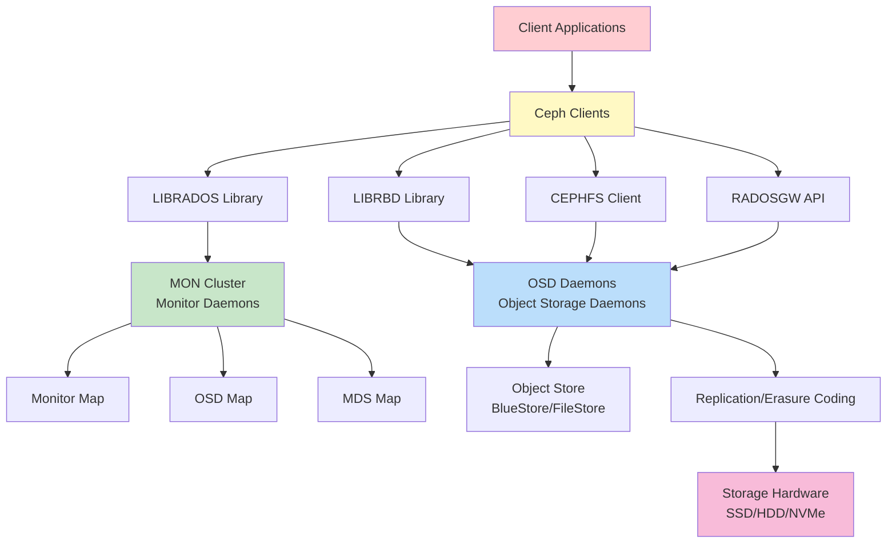
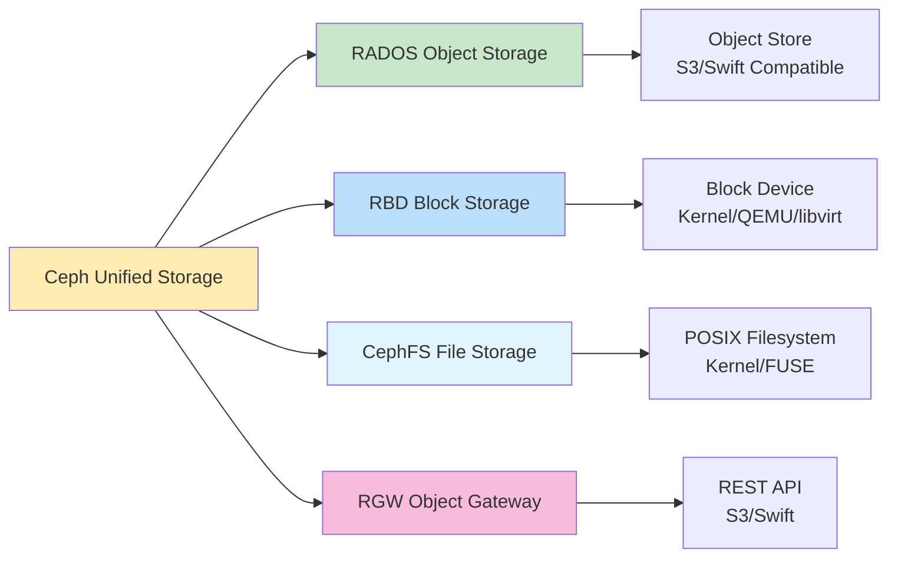
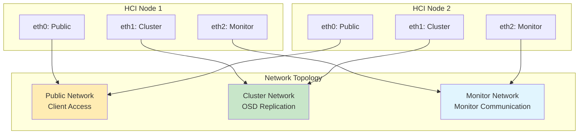
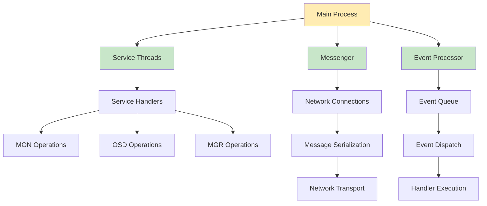
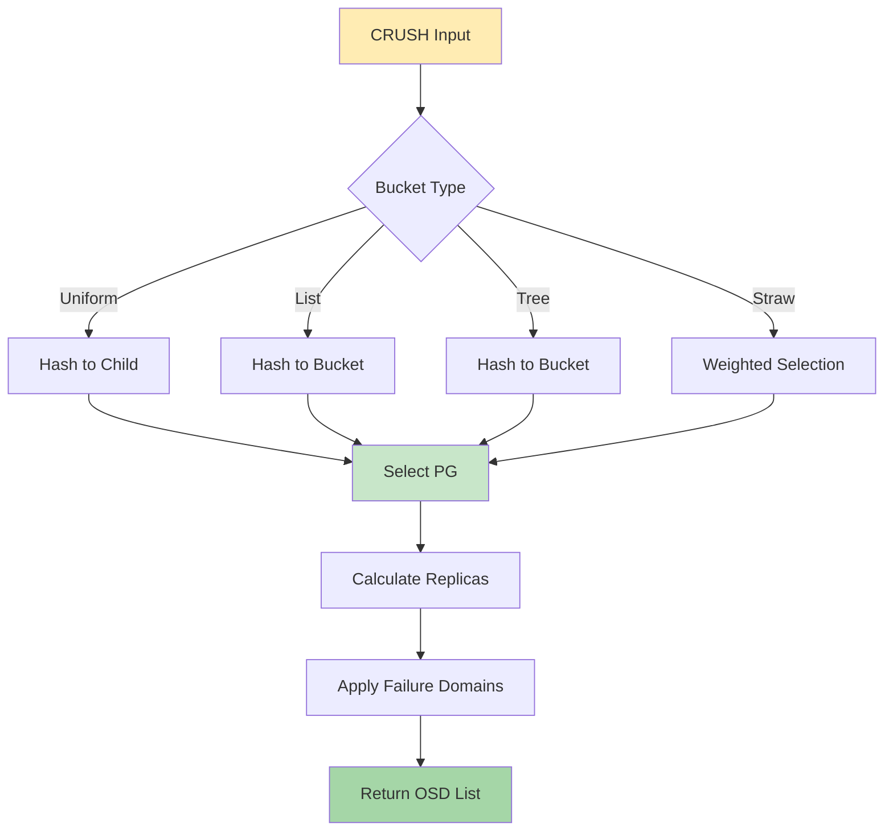
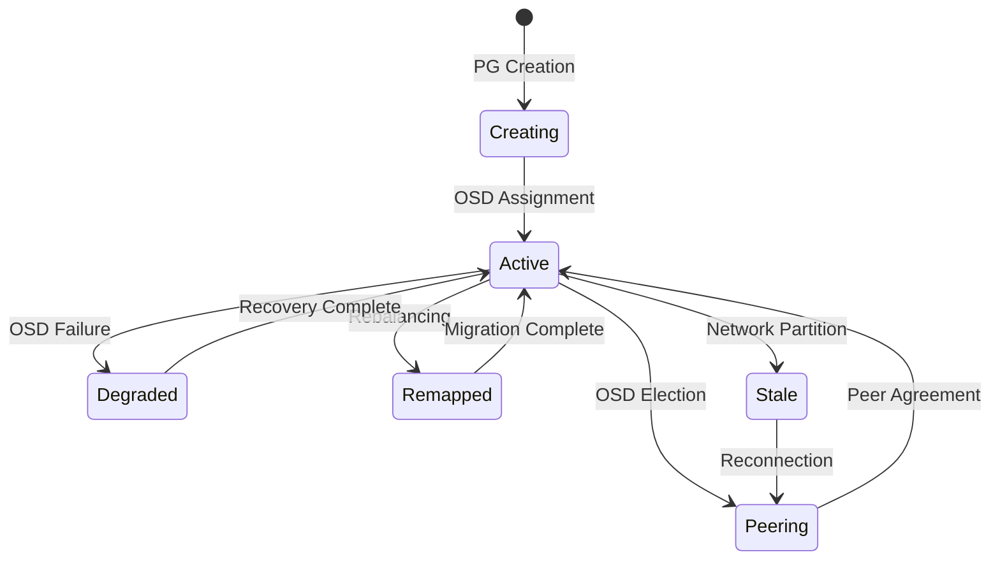
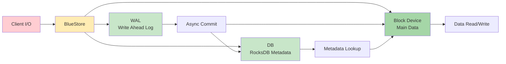

# CEPH Hyper-Converged Infrastructure (HCI): Comprehensive Course Material

## Table of Contents
1. [Introduction and Architecture](#1-introduction-and-architecture)
2. [Core Components](#2-core-components)
3. [Deployment Recommendations](#3-deployment-recommendations)
4. [Code Behavior Analysis](#4-code-behavior-analysis)
5. [Source Code Reference](#5-source-code-reference)
6. [Cephadm Deployment](#6-cephadm-deployment)
7. [Configuration and Management](#7-configuration-and-management)
8. [Troubleshooting and Monitoring](#8-troubleshooting-and-monitoring)
9. [Advanced Topics](#9-advanced-topics)

---

## 1. Introduction and Architecture

### 1.1 Overview
Ceph is a distributed storage system that provides object, block, and file storage in one unified platform. Hyper-Converged Infrastructure (HCI) with Ceph integrates storage and compute resources on the same physical servers, reducing complexity and cost while improving performance and scalability.

### 1.2 Ceph Architecture



### 1.3 HCI Architecture

```mermaid
graph TB
    subgraph "HCI Node 1"
        A1[Compute/KVM]
        B1[OSD Daemons]
        C1[MON Daemon]
        D1[MGR Daemon]
    end
    
    subgraph "HCI Node 2"
        A2[Compute/KVM]
        B2[OSD Daemons]
        C2[MON Daemon]
        D2[MGR Daemon]
    end
    
    subgraph "HCI Node N"
        A3[Compute/KVM]
        B3[OSD Daemons]
        C3[MON Daemon]
        D3[MGR Daemon]
    end
    
    A1 --> E[Ceph Cluster Network]
    A2 --> E
    A3 --> E
    
    B1 --> F[Public/Cluster Network]
    B2 --> F
    B3 --> F
    
    C1 --> G[Monitor Network]
    C2 --> G
    C3 --> G
    
    style A1 fill:#e1f5fe
    style A2 fill:#e1f5fe
    style A3 fill:#e1f5fe
    style B1 fill:#c8e6c9
    style B2 fill:#c8e6c9
    style B3 fill:#c8e6c9
    style C1 fill:#ffecb3
    style C2 fill:#ffecb3
    style C3 fill:#ffecb3
```



### 1.4 Ceph Storage Types



---

## 2. Core Components

### 2.1 Monitor Daemon (MON)
The Monitor daemon maintains cluster state and maps:
- Monitor Map: Cluster membership
- OSD Map: Storage daemon locations
- MDS Map: Metadata server locations
- CRUSH Map: Data placement rules

### 2.2 Object Storage Daemon (OSD)
The OSD stores data, handles replication, and reports health:
- BlueStore: High-performance storage engine
- FileStore: Legacy storage engine
- Data replication and recovery
- Automatic rebalancing

### 2.3 Manager Daemon (MGR)
The MGR provides monitoring and management interfaces:
- Ceph Dashboard
- Prometheus metrics
- RESTful API
- Module system

### 2.4 Metadata Server (MDS)
The MDS handles CephFS metadata:
- Metadata caching
- Directory operations
- POSIX semantics

### 2.5 RADOS Gateway (RGW)
RGW provides S3/Swift-compatible object storage:
- S3 API compatibility
- Multi-site replication
- User management

---

## 3. Deployment Recommendations

### 3.1 Hardware Requirements

#### Minimum HCI Node Configuration
- CPU: Quad-core 64-bit processor
- RAM: 16 GB minimum
- Storage: 1 TB SSD or HDD
- Network: 10 Gbps Ethernet
- Network Interfaces: 2 (public + cluster)

#### Recommended Production HCI Configuration
- CPU: 8+ cores per node
- RAM: 32 GB or more per node
- Storage: SSD for BlueStore, HDD for data
- Network: 25+ Gbps Ethernet
- Network Interfaces: 3+ (public + cluster + replication)
- NVMe for BlueStore WAL/DB

### 3.2 Network Architecture



### 3.3 Cephadm Deployment

#### Prerequisites
```bash
# Install dependencies
apt-get install -y podman lvm2

# Download cephadm
curl --silent --remote-name --location \
    https://download.ceph.com/rpm-18.2.1/el9/noarch/cephadm \
    -o cephadm

chmod +x cephadm
```

#### Bootstrap Process

```bash
# Bootstrap first monitor
./cephadm bootstrap --mon-ip <mon-ip> \
    --mon-addr-v2 [v2:port] \
    --cluster-network <cluster-cidr>

# Add additional hosts
ceph orch host add <host> <addr>

# Add storage
ceph orch apply osd --all-available-devices

# Verify cluster
ceph -s
```

---

## 4. Code Behavior Analysis

### 4.1 Ceph Daemon Architecture



### 4.2 CRUSH Algorithm



### 4.3 PG (Placement Group) Workflow



### 4.4 BlueStore Architecture



---

## 5. Source Code Reference

### 5.1 Repository Information
- **Repository**: https://github.com/ceph/ceph
- **Official Site**: https://docs.ceph.com/
- **License**: GPL-2.0, LGPL-2.1, LGPL-3.0
- **Primary Language**: C++ (62.6%), Python (16.1%)

### 5.2 Directory Structure

```
ceph/
├── src/                    # Source code
│   ├── mon/              # Monitor daemon
│   ├── osd/              # OSD daemon
│   ├── mgr/              # Manager daemon
│   ├── mds/              # Metadata server
│   ├── rados/             # RADOS library
│   ├── rbd/              # RBD library
│   ├── cephfs/           # CephFS client
│   ├── rgw/              # Rados Gateway
│   ├── common/            # Common utilities
│   └── os/               # OS abstraction
├── cephadm/               # Deployment tool
├── doc/                   # Documentation
└── tests/                 # Test suites
```

### 5.3 Key Source Files

#### Monitor
- `src/mon/Monitor.cc` - Main monitor daemon
- `src/mon/Paxos.cc` - Paxos consensus
- `src/mon/Elector.cc` - Leader election

#### OSD
- `src/osd/PrimaryLogPG.cc` - PG primary
- `src/osd/ReplicatedPG.cc` - Replicated PG
- `src/osd/OSD.cc` - Main OSD daemon
- `src/osd/BlueStore.cc` - BlueStore implementation

#### RBD
- `src/rbd/RBD.cc` - RBD client
- `src/librbd/librbd.cc` - RBD library

#### MGR
- `src/mgr/Mgr.cc` - Manager daemon
- `src/mgr/PyModules.cc` - Python modules

### 5.4 Building from Source

```bash
# Clone repository
git clone https://github.com/ceph/ceph.git
cd ceph
git submodule update --init --recursive

# Install dependencies
./install-deps.sh

# Configure
./do_cmake.sh

# Build
cd build
ninja

# Install
ninja install
```

---

## 6. Cephadm Deployment

### 6.1 Bootstrap Options

```bash
# Basic bootstrap
cephadm bootstrap --mon-ip <mon-ip>

# With custom network
cephadm bootstrap --mon-ip <mon-ip> \
    --cluster-network 10.90.90.0/24

# With custom SSH keys
cephadm bootstrap --mon-ip <mon-ip> \
    --ssh-private-key ~/.ssh/id_rsa \
    --ssh-public-key ~/.ssh/id_rsa.pub

# With custom config
cephadm bootstrap --mon-ip <mon-ip> \
    --config custom-ceph.conf
```

### 6.2 Adding Hosts

```bash
# Add host to cluster
ceph orch host add <hostname> <ip-addr>

# Label hosts
ceph orch host label add <hostname> _admin

# List hosts
ceph orch host ls

# Remove host
ceph orch host rm <hostname>
```

### 6.3 Deploying OSDs

```bash
# Deploy on all available devices
ceph orch apply osd --all-available-devices

# Deploy specific devices
ceph orch apply osd -i <host1> /dev/sdb /dev/sdc

# Deploy with specific config
ceph orch apply osd -i <host1> /dev/sdb \
    --osd-args --osd-memory-target=4G

# Remove OSD
ceph orch osd rm <osd-id>
```

### 6.4 Deploying Services

```bash
# Deploy additional monitors
ceph orch apply mon --placement 3

# Deploy MDS
ceph orch apply mds --placement 3

# Deploy RGW
ceph orch apply rgw --placement 3

# Deploy iSCSI gateway
ceph orch apply iscsi gateway.yml

# Deploy NVMe-oF gateway
ceph orch apply nvmeof gateway.yml
```

---

## 7. Configuration and Management

### 7.1 Cluster Configuration

```bash
# View configuration
ceph config dump

# Set configuration
ceph config set global osd_pool_default_size 3
ceph config set global osd_pool_default_min_size 2

# Set OSD configuration
ceph config set osd.osd_memory_target 4G

# Get configuration
ceph config get global osd_pool_default_size
```

### 7.2 Pool Management

```bash
# Create replicated pool
ceph osd pool create <pool-name> <pg-num> replicated

# Create erasure coded pool
ceph osd pool create <pool-name> <pg-num> erasure \
    <ec-profile>

# Set pool configuration
ceph osd pool set <pool-name> size 3
ceph osd pool set <pool-name> min_size 2
ceph osd pool set <pool-name> pg_num <pg-num>
ceph osd pool set <pool-name> pgp_num <pgp-num>

# List pools
ceph osd lspools

# Delete pool
ceph osd pool delete <pool-name>
```

### 7.3 RBD Management

```bash
# Create RBD image
rbd create <pool>/<image> --size <size> \
    --image-format 2

# List images
rbd ls -p <pool>

# Map RBD image
rbd map <pool>/<image>

# Unmap RBD image
rbd unmap <pool>/<image>

# Resize image
rbd resize <pool>/<image> --size <new-size>

# Create snapshot
rbd snap create <pool>/<image> --snap <snap-name>

# List snapshots
rbd snap ls <pool>/<image>

# Clone from snapshot
rbd clone <pool>/<image>@<snap> \
    <pool>/<clone-image>
```

### 7.4 CephFS Management

```bash
# Create filesystem
ceph fs new <fs-name> <metadata-pool> <data-pool>

# Set max MDS
ceph fs set <fs-name> max_mds 2

# List filesystems
ceph fs ls

# Mount CephFS
mount -t ceph <mon-ip>:6789:/ /mnt/cephfs

# Mount with kernel client
mount -t ceph <mon1>:6789,<mon2>:6789:/ /mnt/cephfs \
    -o name=<client-name>,secret=<client-key>
```

---

## 8. Troubleshooting and Monitoring

### 8.1 Health Checks

```bash
# Overall cluster health
ceph -s
ceph health

# Detailed status
ceph -w

# OSD status
ceph osd stat
ceph osd tree

# PG status
ceph pg stat
ceph pg dump

# Monitor status
ceph mon stat
ceph quorum_status
```

### 8.2 Common Issues

#### Issue 1: Cluster Health Warning

```
Symptoms: HEALTH_WARN
Causes: OSD down, PG misplacement, clock skew
Solutions:
1. Check OSD status: ceph osd tree
2. Restart OSDs: systemctl restart ceph-osd@<id>
3. Check NTP: chronyc tracking
4. Rebalance PGs: ceph osd pool set <pool> pg_num <new-pg>
```

#### Issue 2: Slow Requests

```
Symptoms: High latency, slow ops
Causes: Disk saturation, network issues, CPU contention
Solutions:
1. Check OSD performance: ceph tell osd.<id> ops
2. Monitor network: iftop, iperf
3. Check disk utilization: iotop, iostat
4. Tune BlueStore: ceph config set osd bluestore_max_blob_size 1M
```

#### Issue 3: Out of Space

```
Symptoms: OSD full, writes blocked
Causes: Insufficient storage, high replication factor
Solutions:
1. Add storage: ceph orch apply osd --all-available-devices
2. Delete unused data
3. Reduce replication factor
4. Enable backfill: ceph osd set noout false
```

### 8.3 Monitoring Tools

```bash
# Ceph dashboard (web interface)
# Access at http://<mgr-host>:7000

# Prometheus metrics
ceph mgr module enable prometheus

# Grafana dashboards
# Import from ceph-medic

# Ceph health checker
ceph-medic -v
```

---

## 9. Advanced Topics

### 9.1 Erasure Coding

```bash
# Create erasure coded profile
ceph osd erasure-code-profile set <profile-name> \
    k=<data-chunks> m=<coding-chunks> \
    plugin=jerasure crush-failure-domain=host

# Create EC pool
ceph osd pool create <pool-name> 32 erasure <profile-name>

# Set pool size
ceph osd pool set <pool-name> min_size 2
```

### 9.2 Cache Tiering

```bash
# Create cache pool
ceph osd pool create <cache-pool> 128

# Create base pool
ceph osd pool create <base-pool> 512

# Set cache tier
ceph osd tier add <base-pool> <cache-pool>

# Configure cache
ceph osd tier cache-mode <cache-pool> writeback
ceph osd pool set <cache-pool> cache_target_dirty_ratio 0.4
ceph osd pool set <cache-pool> cache_target_full_ratio 0.8
```

### 9.3 Multi-Site Replication

```bash
# Configure RGW zones
ceph orch apply rgw --placement 3 --zone <zone-name>

# Configure zonegroup
radosgw-admin zonegroup create --rgw-zonegroup=<zonegroup-name>

# Configure period sync
radosgw-admin period update --commit

# Enable multisite sync
radosgw-admin sync group create --group-id=<group-id>
```

### 9.4 CRUSH Map Customization

```bash
# View CRUSH map
ceph osd getcrushmap -o crush.map

# Analyze CRUSH rules
crushtool -i crush.map --test --num-rep 3 --rules <rule-id>

# Modify CRUSH rules
ceph osd crush set <rule-id>

# Compile CRUSH map
ceph osd setcrushmap -i crush.map
```

---

## Appendices

### Appendix A: Configuration Parameters

| Parameter | Default | Description |
|-----------|---------|-------------|
| osd_pool_default_size | 3 | Default replication factor |
| osd_pool_default_min_size | 0 | Minimum replica count for I/O |
| osd_pool_default_pg_num | 8 | Default PG count per pool |
| osd_memory_target | 4G | Target OSD memory |
| osd_max_backfills | 1 | Max concurrent backfills |
| osd_recovery_max_active | 3 | Max active recovery ops |
| mon_osd_min_down_reporters | 2 | Min OSDs to mark down |
| mon_osd_down_out_interval | 600 | Seconds to mark OSD down |
| mon_osd_report_timeout | 300 | Seconds to report OSD |

### Appendix B: CRUSH Rules

| Rule Type | Description |
|-----------|-------------|
| replicated | Standard replicated data |
| erasure | Erasure coded data |
| linear | Legacy rule type |
| list | List of OSDs |

### Appendix C: Recommended Reading

1. Ceph Architecture Documentation
2. CRUSH Algorithm Paper
3. BlueStore Architecture
4. CephFS Design
5. RADOSGW Administration

---

## Further Resources

- **Official Documentation**: https://docs.ceph.com/
- **Source Code**: https://github.com/ceph/ceph
- **Community**: https://ceph.io/community/
- **Bug Tracker**: https://tracker.ceph.com/
- **Mailing List**: ceph-users@ceph.io
