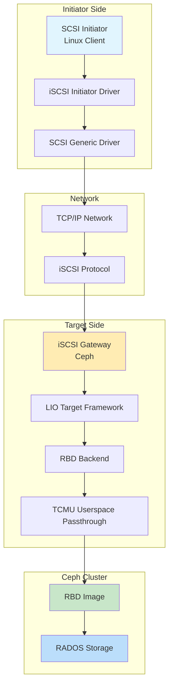
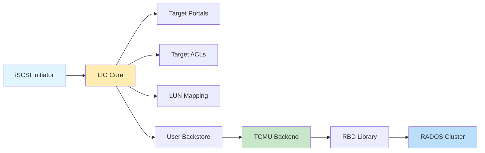
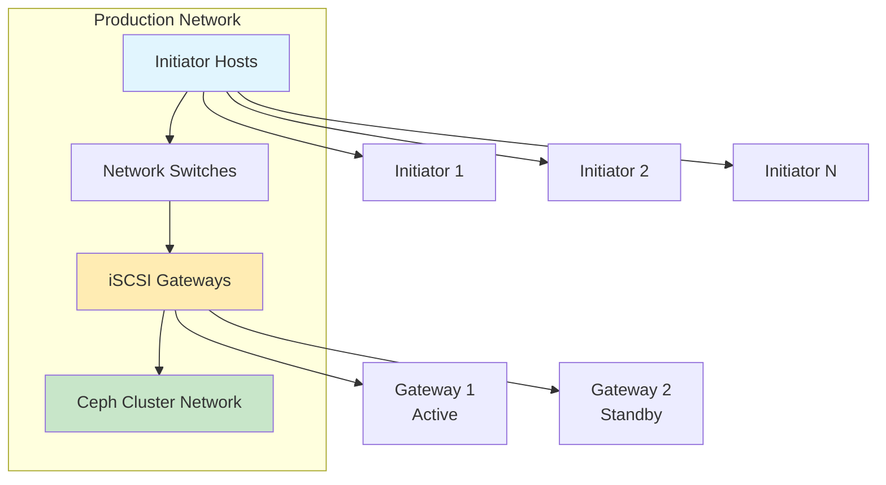
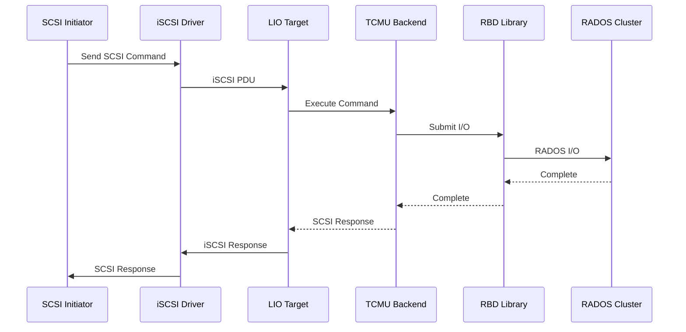
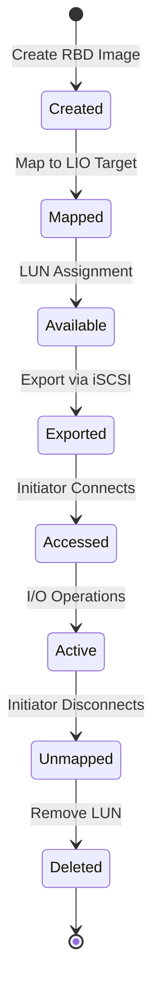
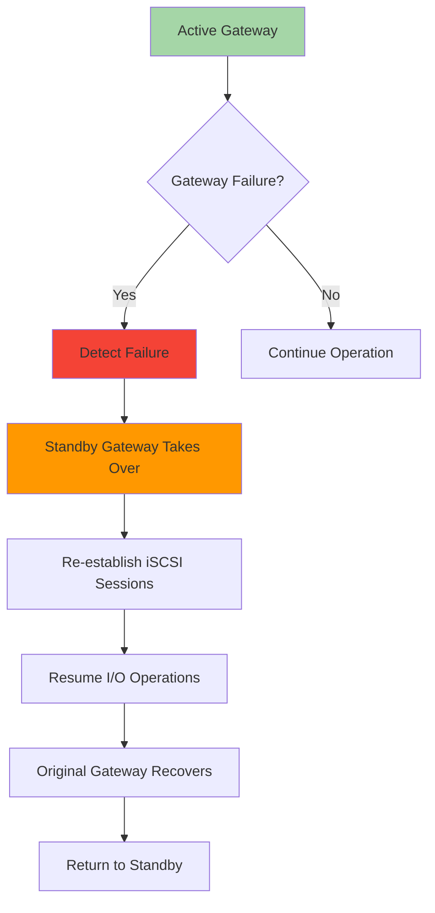

# iSCSI with CEPH: Comprehensive Course Material

## Table of Contents
1. [Introduction and Architecture](#1-introduction-and-architecture)
2. [Core Components](#2-core-components)
3. [Deployment Recommendations](#3-deployment-recommendations)
4. [Code Behavior Analysis](#4-code-behavior-analysis)
5. [Source Code Reference](#5-source-code-reference)
6. [Configuration and Management](#6-configuration-and-management)
7. [Troubleshooting and Monitoring](#7-troubleshooting-and-monitoring)
8. [Advanced Topics](#8-advanced-topics)

---

## 1. Introduction and Architecture

### 1.1 Overview
Ceph iSCSI Gateway presents RBD images as SCSI disks over TCP/IP network. The iSCSI protocol allows clients (initiators) to send SCSI commands to storage devices (targets), enabling clients without native Ceph client support to access Ceph block storage.

### 1.2 iSCSI Architecture



### 1.3 LIO Architecture



---

## 2. Core Components

### 2.1 LIO (Linux IO Target)
LIO is the kernel framework that implements SCSI target functionality:
- Target Portals: Network endpoints
- Target ACLs: Access control lists
- LUNs: Logical Unit Numbers
- Backstores: Storage backends

### 2.2 TCMU (Target Core Module Userspace)
TCMU enables userspace backstores for LIO:
- Userspace passthrough interface
- Efficient data transfer
- Reduced kernel modifications

### 2.3 RBD Backend
RBD backend connects to Ceph RBD images:
- librbd integration
- Image mapping to LUNs
- Snapshot support
- Clone support

---

## 3. Deployment Recommendations

### 3.1 Hardware Requirements

#### Minimum Configuration
- CPU: Quad-core processor
- RAM: 8 GB
- Network: 1 Gbps Ethernet
- Storage: Ceph cluster access

#### Recommended Production Configuration
- CPU: 8+ cores per gateway
- RAM: 16 GB or more
- Network: 10 Gbps Ethernet
- Network: Dedicated iSCSI network
- Redundant gateways for HA

### 3.2 Network Architecture



### 3.3 Installation

#### Using Cephadm

```bash
# Enable iSCSI module on gateways
ceph orch apply iscsi gateway.yml

# Sample gateway.yml
service_type: iscsi
service_id: iscsi
placement:
  count: 2
  hosts:
    - gateway1
    - gateway2
spec:
  pool: rbd
  api_user: admin
  api_key: <key>
  trusted_ip_list:
    - 192.168.1.0/24
```

#### Manual Installation

```bash
# Install iSCSI gateway
apt-get install ceph-iscsi

# Enable rbd target module
modprobe rbd_target
```

---

## 4. Code Behavior Analysis

### 4.1 I/O Flow



### 4.2 LUN Mapping



### 4.3 HA Failover



---

## 5. Source Code Reference

### 5.1 Repository Information
- **Ceph Repository**: https://github.com/ceph/ceph
- **LIO Repository**: https://github.com/open-iscsi/targetcli-fb
- **Kernel LIO**: Part of Linux kernel source

### 5.2 Key Source Files

#### Ceph iSCSI Gateway
- `src/rgw/radosgw-admin.py` - RGW admin CLI
- `src/pybind/ceph-volume` - Volume management
- `src/tools/rbd_target/` - iSCSI target tools

#### LIO Kernel Code
- `drivers/target/target_core_fabric_lib.c` - LIO core
- `drivers/target/iscsi/` - iSCSI fabric
- `drivers/target/target_core_user.c` - TCMU

### 5.3 Building from Source

```bash
# Clone Ceph
git clone https://github.com/ceph/ceph.git
cd ceph
git submodule update --init --recursive

# Install dependencies
./install-deps.sh

# Configure
./do_cmake.sh -DWITH_RADOSGW=ON

# Build
cd build
ninja
```

---

## 6. Configuration and Management

### 6.1 Target Configuration

```bash
# Create iSCSI target
gwcli.py target create <target-iqn>

# Add portal
gwcli.py target add_portal <target-iqn> <ip>:<port>

# Create LUN
gwcli.py lun create <target-iqn> <lun-id> \
    --pool <pool> --image <image>
```

### 6.2 Initiator Configuration

```bash
# Discover targets
iscsiadm -m discovery -t st -p <target-ip>

# Login to target
iscsiadm -m node -T <target-iqn> -p <target-ip> --login

# List sessions
iscsiadm -m session

# Logout
iscsiadm -m node -T <target-iqn> -p <target-ip> --logout
```

### 6.3 LUN Management

```bash
# Create RBD image
rbd create <pool>/<image> --size <size>

# Map to LUN
gwcli.py lun create <target-iqn> 0 \
    --pool <pool> --image <image>

# Resize LUN
rbd resize <pool>/<image> --size <new-size>

# Delete LUN
gwcli.py lun delete <target-iqn> <lun-id>
```

### 6.4 High Availability Configuration

```bash
# Configure multiple gateways
ceph orch apply iscsi gateway.yml

# gateway.yml content
service_type: iscsi
placement:
  count: 3
  hosts:
    - gw1
    - gw2
    - gw3
spec:
  pool: rbd
  api_user: admin
  api_key: <key>
  trusted_ip_list:
    - 192.168.1.0/24
```

---

## 7. Troubleshooting and Monitoring

### 7.1 Monitoring Commands

```bash
# Gateway status
ceph orch ls
ceph orch ps

# iSCSI sessions
iscsiadm -m session

# Target status
targetcli ls
targetcli /iscsi/ ls

# RBD status
rbd showmapped
rbd info <pool>/<image>
```

### 7.2 Common Issues

#### Issue 1: Cannot Discover Targets

```
Symptoms: iscsiadm discovery fails
Causes: Firewall, network, target not running
Solutions:
1. Check firewall: iptables -L
2. Check target service: systemctl status ceph-iscsi
3. Check network: ping <target-ip>
4. Check target configuration: targetcli /iscsi/ ls
```

#### Issue 2: Slow Performance

```
Symptoms: High latency, low throughput
Causes: Network congestion, gateway saturation
Solutions:
1. Check network: iperf
2. Monitor gateway: top, htop
3. Tune TCP parameters: net.core.rmem_max
4. Increase gateway resources: CPU, RAM
```

#### Issue 3: LUN Not Visible

```
Symptoms: Device not showing in /dev/
Causes: ACL misconfiguration, session issues
Solutions:
1. Check ACL: targetcli /acls/ ls
2. Check sessions: iscsiadm -m session
3. Rescan SCSI: echo "- - -" > /sys/class/scsi_host/host0/scan
4. Check kernel logs: dmesg | grep -i iscsi
```

---

## 8. Advanced Topics

### 8.1 CHAP Authentication

```bash
# Configure CHAP on gateway
gwcli.py target set_chap <target-iqn> \
    --user <username> --password <password>

# Configure CHAP on initiator
iscsiadm -m node -T <target-iqn> \
    --op=update -n node.session.auth.authmethod=CHAP
iscsiadm -m node -T <target-iqn> \
    --op=update -n node.session.auth.username=<username>
iscsiadm -m node -T <target-iqn> \
    --op=update -n node.session.auth.password=<password>
```

### 8.2 Multipath I/O

```bash
# Configure multipath
# /etc/multipath.conf
defaults {
  user_friendly_names yes
  find_multipaths yes
}

# Enable multipath
systemctl enable multipathd
systemctl start multipathd

# Rescan
multipath -r

# Show paths
multipath -ll
```

### 8.3 Snapshots and Clones

```bash
# Create snapshot of RBD image
rbd snap create <pool>/<image> --snap <snap-name>

# Create LUN from snapshot
gwcli.py lun create <target-iqn> 1 \
    --pool <pool> --image <image>@<snap-name>

# Clone from snapshot
rbd clone <pool>/<image>@<snap-name> <pool>/<clone>
gwcli.py lun create <target-iqn> 2 \
    --pool <pool> --image <clone>
```

---

## Appendices

### Appendix A: iSCSI Configuration Parameters

| Parameter | Default | Description |
|-----------|---------|-------------|
| DefaultTime2Wait | 2 | Seconds to wait before retry |
| DefaultTime2Retain | 60 | Seconds to retain session |
| InitialR2T | 1 | Initial R2T value |
| MaxSessions | 64 | Maximum sessions per target |
| MaxOutstandingR2T | 1 | Max outstanding R2T |

### Appendix B: LIO Target Types

| Target Type | Description |
|------------|-------------|
| iscsi | iSCSI fabric |
| loopback | Loopback fabric |
| tcm_loop | Loopback with TCMU |
| user | User-space passthrough |

### Appendix C: Troubleshooting Commands

| Command | Description |
|---------|-------------|
| `iscsiadm -m discovery` | Discover targets |
| `iscsiadm -m session` | List sessions |
| `iscsiadm -m node` | Manage nodes |
| `targetcli ls` | List targets |
| `multipath -ll` | Show multipaths |
| `rbd showmapped` | Show mapped RBDs |

---

## Further Resources

- **Ceph iSCSI Docs**: https://docs.ceph.com/en/latest/rbd/iscsi-overview/
- **LIO Documentation**: https://linux-iscsi.org/wiki/HomePage
- **iSCSI RFC**: https://tools.ietf.org/html/rfc7143
- **Source Code**: https://github.com/ceph/ceph
