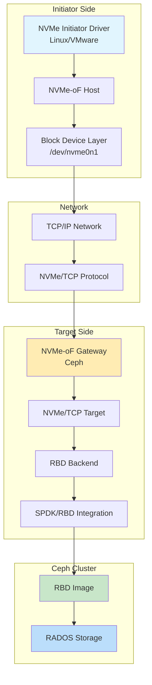
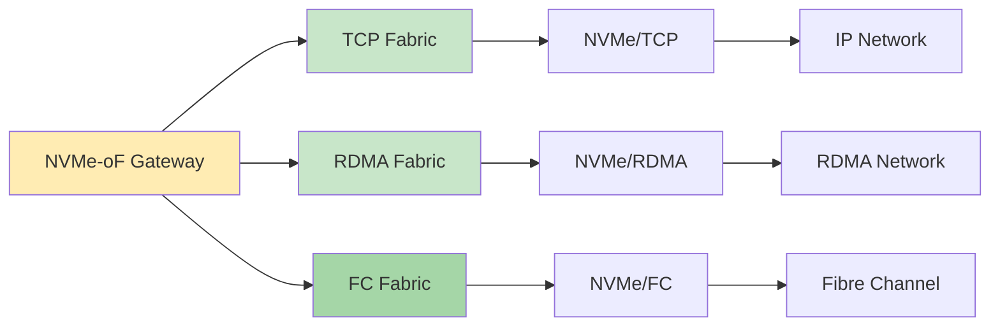
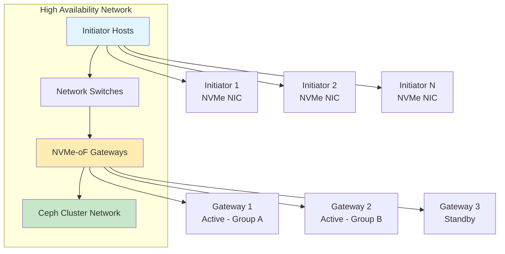
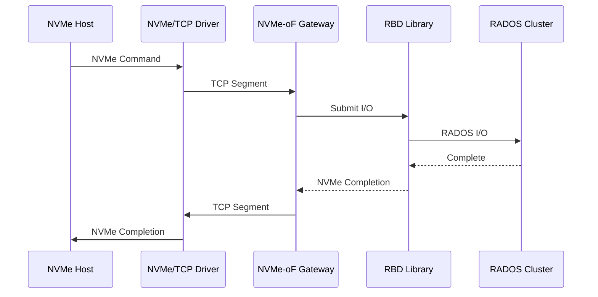
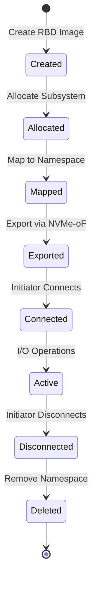
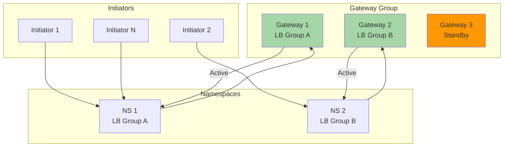

# FC (NVMe-oF) with CEPH: Comprehensive Course Material

## Table of Contents
1. [Introduction and Architecture](#1-introduction-and-architecture)
2. [Core Components](#2-core-components)
3. [Deployment Recommendations](#3-deployment-recommendations)
4. [Code Behavior Analysis](#4-code-behavior-analysis)
5. [Source Code Reference](#5-source-code-reference)
6. [Configuration and Management](#6-configuration-and-management)
7. [Troubleshooting and Monitoring](#7-troubleshooting-and-monitoring)
8. [Advanced Topics](#8-advanced-topics)

---

## 1. Introduction and Architecture

### 1.1 Overview
Ceph NVMe over Fabrics (NVMe-oF) gateway integrates Ceph with NVMe/TCP protocol to provide NVMe/TCP target that exports RBD images. The NVMe/TCP protocol allows initiators (clients) to send NVMe-oF commands to storage devices (targets) over IP network, enabling clients without native Ceph client support to access Ceph block storage with NVMe performance characteristics.

### 1.2 NVMe-oF Architecture



### 1.3 NVMe-oF with Fabric Types



---

## 2. Core Components

### 2.1 NVMe-oF Gateway
Gateway provides NVMe/TCP target functionality:
- Subsystem management
- Namespace creation
- Connection handling
- I/O request processing

### 2.2 NVMe Subsystem
Logical grouping of NVMe namespaces:
- NQN (NVMe Qualified Name)
- Subsystem ID
- Controller ID
- Namespace IDs

### 2.3 NVMe Namespace
Namespace represents exported RBD image:
- LBA to RBD offset mapping
- Capacity information
- Format information
- Protection information

---

## 3. Deployment Recommendations

### 3.1 Hardware Requirements

#### Minimum Configuration
- CPU: Quad-core processor
- RAM: 8 GB
- Network: 10 Gbps Ethernet
- Storage: Ceph cluster access
- NVMe initiator support

#### Recommended Production Configuration
- CPU: 8+ cores per gateway
- RAM: 16 GB or more
- Network: 25+ Gbps Ethernet
- Network: RDMA/RoCE support
- Redundant gateways for HA
- NVMe NIC on initiators

### 3.2 Network Architecture



### 3.3 Installation

#### Using Cephadm

```bash
# Enable NVMe-oF module
ceph orch apply nvmeof gateway.yml

# Sample gateway.yml
service_type: nvmeof
service_id: nvmeof
placement:
  count: 3
  hosts:
    - gw1
    - gw2
    - gw3
spec:
  pool: rbd
  api_user: admin
  api_key: <key>
  trusted_ip_list:
    - 192.168.1.0/24
```

#### Manual Installation

```bash
# Install NVMe-oF gateway
apt-get install ceph-nvmeof

# Enable SPDK driver
modprobe nvme_tcp
```

---

## 4. Code Behavior Analysis

### 4.1 I/O Flow



### 4.2 Namespace Mapping



### 4.3 HA and Load Balancing



---

## 5. Source Code Reference

### 5.1 Repository Information
- **Ceph Repository**: https://github.com/ceph/ceph
- **NVMe-oF Project**: Part of Ceph
- **SPDK**: https://github.com/spdk/spdk
- **Linux NVMe**: Part of Linux kernel source

### 5.2 Key Source Files

#### Ceph NVMe-oF Gateway
- `src/nvmeof/` - NVMe-oF gateway code
- `src/nvmeof/gateway.py` - Main gateway
- `src/nvmeof/spdk.py` - SPDK integration

#### SPDK NVMe-oF Target
- `lib/nvmf/` - NVMe-oF fabric library
- `examples/nvmf_tgt` - NVMe-oF target example
- `lib/nvme/` - NVMe driver library

#### Linux Kernel NVMe
- `drivers/nvme/host/` - NVMe host driver
- `drivers/nvme/target/` - NVMe target driver
- `include/linux/nvme.h` - NVMe headers

### 5.3 Building from Source

```bash
# Clone Ceph
git clone https://github.com/ceph/ceph.git
cd ceph
git submodule update --init --recursive

# Install dependencies
./install-deps.sh

# Configure
./do_cmake.sh -DWITH_NVMEOF=ON

# Build
cd build
ninja
```

---

## 6. Configuration and Management

### 6.1 Subsystem Configuration

```bash
# Create NVMe subsystem
gwcli.py subsystem create <subsystem-nqn>

# Add listener
gwcli.py subsystem add_listener <subsystem-nqn> \
    <ip>:<port>

# Create namespace
gwcli.py namespace create <subsystem-nqn> <nsid> \
    --pool <pool> --image <image>
```

### 6.2 Initiator Configuration

```bash
# Discover subsystems
nvme discover -t tcp -a <gateway-ip> -s <port>

# Connect to subsystem
nvme connect -t tcp -n <subsystem-nqn> -a <gateway-ip> -s <port>

# List connections
nvme list

# Disconnect
nvme disconnect -n <subsystem-nqn>
```

### 6.3 Namespace Management

```bash
# Create RBD image
rbd create <pool>/<image> --size <size>

# Map to namespace
gwcli.py namespace create <subsystem-nqn> 1 \
    --pool <pool> --image <image>

# Resize namespace
rbd resize <pool>/<image> --size <new-size>

# Delete namespace
gwcli.py namespace delete <subsystem-nqn> <nsid>
```

### 6.4 HA Gateway Group Configuration

```bash
# Create gateway group
gwcli.py group create <group-name>

# Add gateways to group
gwcli.py group add_gateway <group-name> <gateway-host>

# Configure load balancing
gwcli.py group set_lb_group <group-name> <lb-group-id>

# Show group status
gwcli.py group show <group-name>
```

---

## 7. Troubleshooting and Monitoring

### 7.1 Monitoring Commands

```bash
# Gateway status
ceph orch ls
ceph orch ps

# NVMe connections
nvme list
nvme list-subsys

# Subsystem status
nvme show-ctrl /dev/nvme0

# RBD status
rbd showmapped
rbd info <pool>/<image>
```

### 7.2 Common Issues

#### Issue 1: Cannot Connect to Subsystem

```
Symptoms: nvme connect fails
Causes: Firewall, network, subsystem not running
Solutions:
1. Check firewall: iptables -L
2. Check gateway service: systemctl status ceph-nvmeof
3. Check network: ping <gateway-ip>
4. Check subsystem: gwcli.py subsystem show
```

#### Issue 2: Poor Performance

```
Symptoms: High latency, low IOPS
Causes: Network congestion, gateway saturation
Solutions:
1. Check network: iperf
2. Monitor gateway: top, htop
3. Tune TCP parameters: net.core.rmem_max
4. Use RDMA/RoCE if available
```

#### Issue 3: Namespace Not Visible

```
Symptoms: Device not showing in /dev/nvme*
Causes: Connection issues, namespace not created
Solutions:
1. Check connections: nvme list
2. Check subsystem: nvme show-ctrl /dev/nvme0
3. Rescan NVMe: echo 1 > /sys/class/nvme/nvme0/rescan_controller
4. Check kernel logs: dmesg | grep -i nvme
```

---

## 8. Advanced Topics

### 8.1 Multipath I/O with NVMe

```bash
# Configure multipath
# /etc/multipath.conf
defaults {
  user_friendly_names yes
  find_multipaths yes
  path_selector "round-robin 0"
  path_grouping_policy multibus
}

# Enable multipath
systemctl enable multipathd
systemctl start multipathd

# Rescan
multipath -r

# Show paths
multipath -ll
```

### 8.2 SPDK Integration

```bash
# Use SPDK-based gateway
ceph orch apply nvmeof gateway.yml

# gateway.yml with SPDK
service_type: nvmeof
spec:
  enable_spdk: true
  spdk_core_mask: 0x1
  spdk_mem_mb: 4096
```

### 8.3 RDMA/RoCE Support

```bash
# Configure RDMA fabric
gwcli.py subsystem set_transport <subsystem-nqn> rdma

# Add RDMA listener
gwcli.py subsystem add_listener <subsystem-nqn> \
    rdma://<ip>:<port>

# Connect using RDMA
nvme connect -t rdma -n <subsystem-nqn> \
    -a <gateway-ip> -s <port>
```

---

## Appendices

### Appendix A: NVMe-oF Configuration Parameters

| Parameter | Default | Description |
|-----------|---------|-------------|
| MaxConnections | 1024 | Maximum connections per gateway |
| MaxQueues | 64 | Maximum I/O queues |
| QueueDepth | 128 | Queue depth per queue |
| InCapsuleDataSize | 4096 | Capsule data size |
| MaxSegments | 256 | Maximum segments |

### Appendix B: NVMe Namespace Attributes

| Attribute | Description |
|-----------|-------------|
| NSZE | Namespace size |
| NCAP | Capacity |
| NUSE | Namespace utilization |
| NDATAFLS | Data format |
| NMIC | Metadata in capabilities |

### Appendix C: Troubleshooting Commands

| Command | Description |
|---------|-------------|
| `nvme list` | List NVMe devices |
| `nvme discover` | Discover subsystems |
| `nvme connect` | Connect to subsystem |
| `nvme disconnect` | Disconnect from subsystem |
| `nvme show-ctrl` | Show controller details |
| `nvme list-subsys` | List subsystems |

---

## Further Resources

- **Ceph NVMe-oF Docs**: https://docs.ceph.com/en/latest/rbd/nvmeof-overview/
- **NVMe Express**: https://nvmexpress.org/
- **SPDK**: https://www.spdk.io/
- **Source Code**: https://github.com/ceph/ceph
