# Linux High Availability and Virtualization

Comprehensive course materials for Linux High Availability (HA) clustering and virtualization technologies including Corosync, Pacemaker, QEMU, KVM, CEPH, iSCSI, FC/NVMe-oF, GFS2, libvirt, virsh, and Open vSwitch.

## Table of Contents
- [Cluster Technologies](#cluster-technologies)
- [Virtualization](#virtualization)
- [Storage and File Systems](#storage-and-file-systems)
- [Network and Switching](#network-and-switching)
- [Quick Reference](#quick-reference)

---

## Cluster Technologies

### Corosync Cluster Engine
Cluster messaging and synchronization framework providing virtual synchrony guarantees and quorum management.

#### Architecture
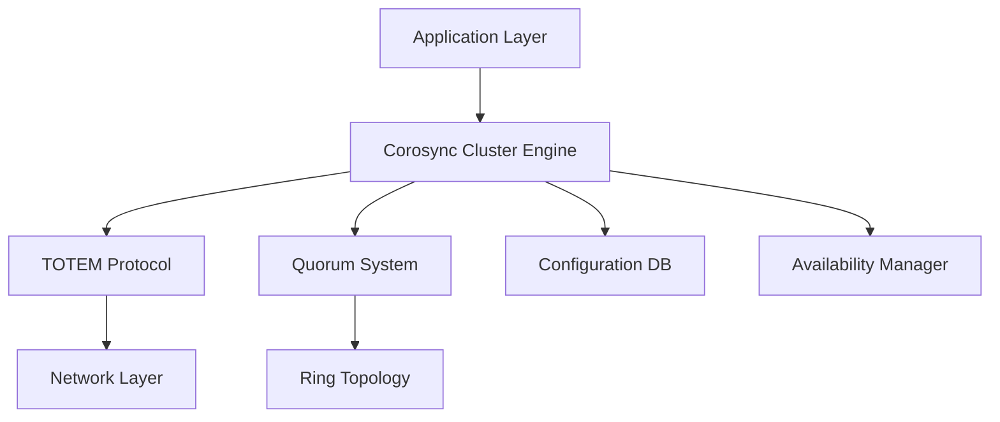

#### Key Features
- Virtual Synchrony model for consistent message ordering
- TOTEM protocol for reliable group communication
- Quorum system to prevent split-brain scenarios
- In-memory configuration database

#### Quick Commands
```bash
# Installation
apt-get install corosync
corosync-keygen

# Status
corosync-cfgtool -s
corosync-quorumtool -s

# Configuration
corosync-cmapctl
```

#### Source Code
- Repository: https://github.com/corosync/corosync
- Documentation: https://corosync.github.io/corosync/

---

### Pacemaker Cluster Resource Manager
Advanced cluster resource manager coordinating configuration, start-up, monitoring, and recovery of interrelated services.

#### Architecture
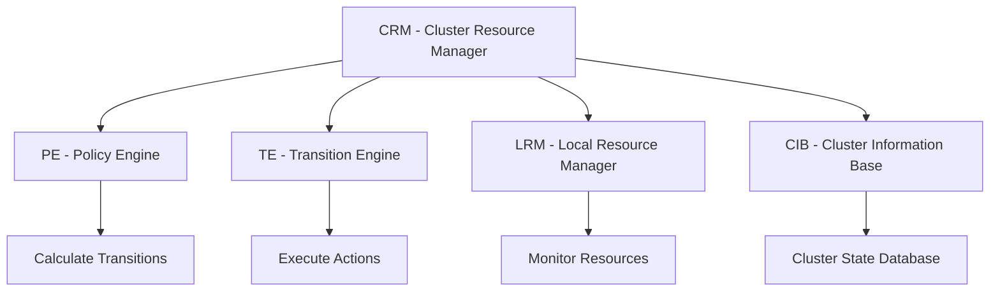

#### Key Features
- Detection and recovery of host- and application-level failures
- Support for multiple redundancy configurations
- Configurable quorum loss strategies
- Ordering of service starts and stops
- Colocation and location constraints

#### Quick Commands
```bash
# Cluster status
pcs status

# Resource management
pcs resource create vip ocf:heartbeat:IPaddr2 \
    ip=192.168.1.100 cidr_netmask=24
pcs resource start vip

# Constraints
pcs constraint order start vip then apache
pcs constraint colocation add apache with vip
```

#### Source Code
- Repository: https://github.com/ClusterLabs/pacemaker
- Documentation: https://www.clusterlabs.org/pacemaker/doc/

---

## Virtualization

### QEMU
Generic and open source machine emulator and virtualizer providing full-system and user-mode emulation.

#### Architecture
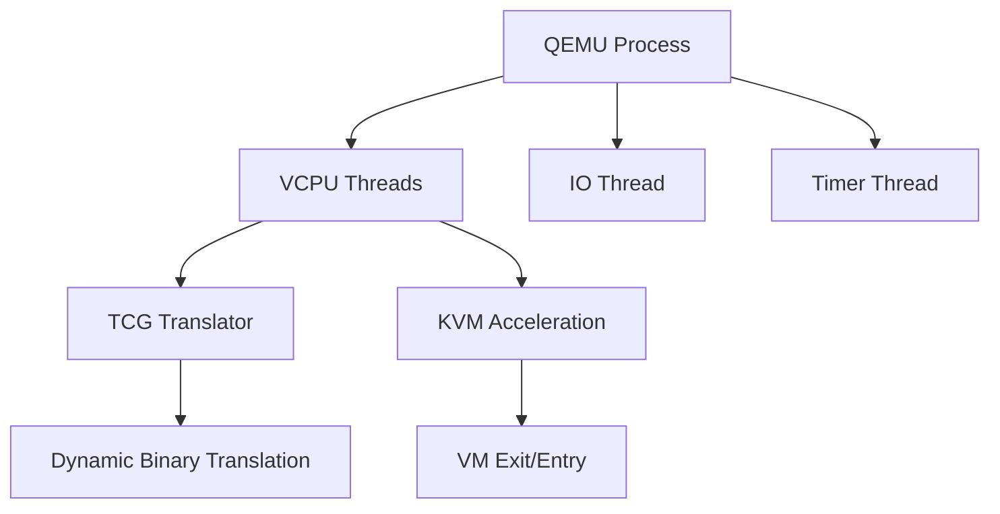

#### Key Features
- Full-system emulation of various architectures
- User-mode emulation for cross-platform binaries
- TCG dynamic translation for performance
- KVM integration for hardware acceleration
- Device emulation (network, storage, graphics)

#### Quick Commands
```bash
# Create VM
qemu-system-x86_64 -name vm1 -m 2048 -smp 2 \
    -drive file=disk.qcow2,format=qcow2 \
    -netdev user,id=net0,hostfwd=tcp::2222-:22

# Enable KVM
qemu-system-x86_64 -enable-kvm -name vm1 -m 4096 -smp 4
```

#### Source Code
- Repository: https://gitlab.com/qemu-project/qemu
- Documentation: https://www.qemu.org/documentation/

---

### KVM
Kernel-based virtual machine for Linux providing hardware-assisted virtualization.

#### Architecture
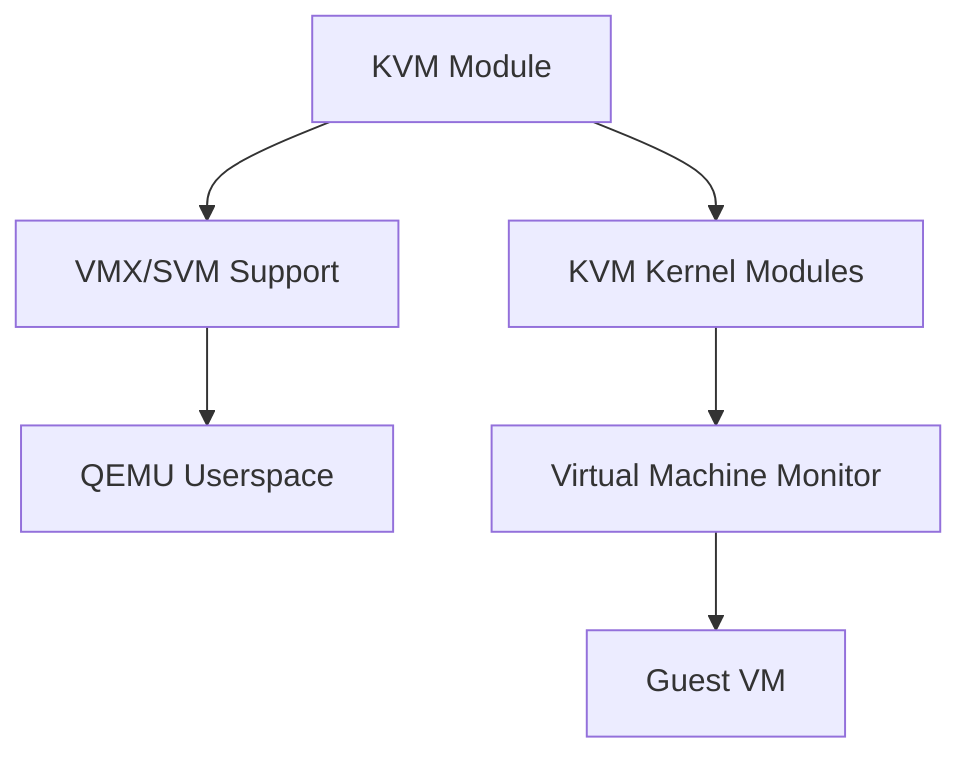

#### Key Features
- Hardware virtualization extensions (Intel VT-x, AMD-V)
- Near-native performance for guest code
- Memory management with EPT/NPT
- I/O virtualization with virtio
- Live migration support

#### Source Code
- Location in Linux kernel: `virt/kvm/`
- Repository: https://github.com/torvalds/linux/tree/master/virt/kvm
- Documentation: https://www.linux-kvm.org/

---

### libvirt
Virtualization API and daemon for managing virtualization capabilities.

#### Architecture
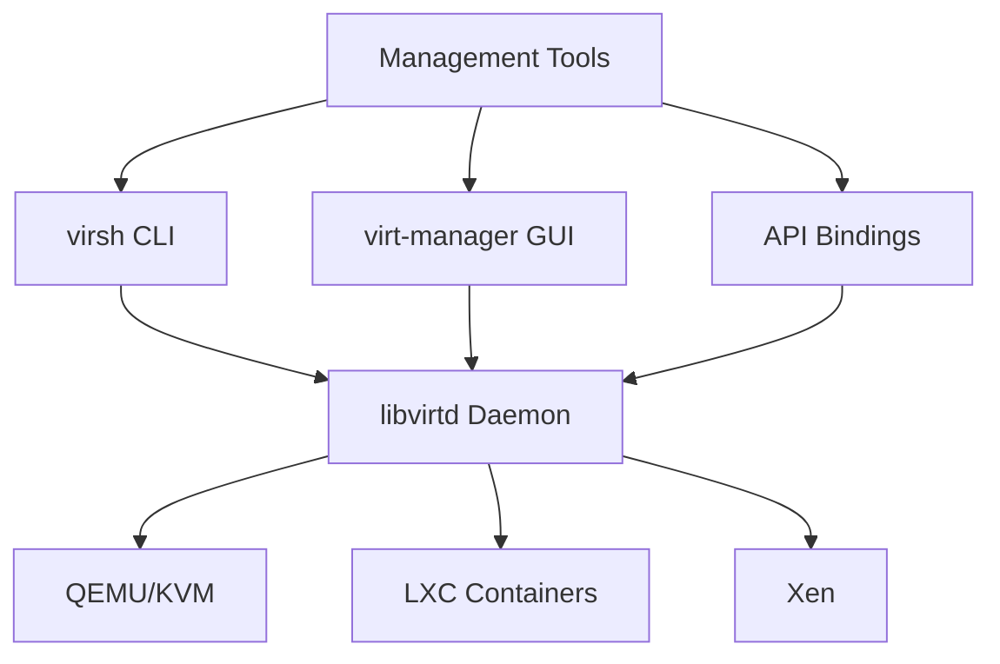

#### Key Features
- Unified API for multiple hypervisors
- XML-based VM configuration
- Network and storage management
- Secure API with authentication
- Live migration support

#### Quick Commands
```bash
# List VMs
virsh list --all

# VM operations
virsh start vm1
virsh shutdown vm1
virsh dumpxml vm1

# Network management
virsh net-list
virsh net-define network.xml
```

#### Source Code
- Repository: https://gitlab.com/libvirt/libvirt
- Documentation: https://libvirt.org/docs/

---

### virsh
Command-line interface for managing libvirt virtualization.

#### Quick Commands
```bash
# VM Management
virsh list                   # List running VMs
virsh list --all            # List all VMs
virsh start <vm-name>        # Start VM
virsh shutdown <vm-name>     # Shutdown VM
virsh destroy <vm-name>      # Force stop VM
virsh undefine <vm-name>    # Remove VM

# VM Information
virsh dominfo <vm-name>      # Domain information
virsh dumpxml <vm-name>      # XML configuration
virsh vcpuinfo <vm-name>     # VCPU information
virsh dommemstat <vm-name>   # Memory statistics

# Snapshot Management
virsh snapshot-create <vm-name> <snap-name>
virsh snapshot-list <vm-name>
virsh snapshot-revert <vm-name> <snap-name>

# Console Access
virsh console <vm-name>
virsh qemu-monitor-command <vm-name> "info status"
```

---

### Open vSwitch
Open source multilayer virtual switch for managing VM networking.

#### Architecture
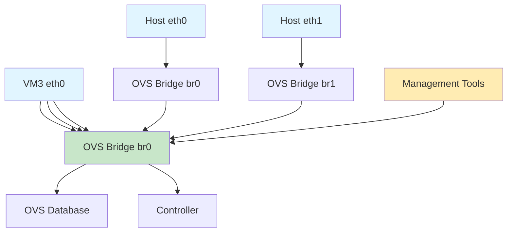

#### Key Features
- Standard Linux bridge compatibility
- Flow-based switching
- Network isolation with VLANs
- Bonding and trunking support
- Remote management protocol

#### Quick Commands
```bash
# Bridge Management
ovs-vsctl add-br br0
ovs-vsctl del-br br0
ovs-vsctl list-br

# Port Management
ovs-vsctl add-port br0 eth0
ovs-vsctl del-port br0 eth0
ovs-vsctl list-ports br0

# Show Configuration
ovs-vsctl show
ovs-ofctl show br0

# Database Management
ovs-vsctls show
```

#### Source Code
- Repository: https://github.com/openvswitch/ovs
- Documentation: https://docs.openvswitch.org/

---

## Storage and File Systems

### CEPH Hyper-Converged Infrastructure (HCI)
Distributed storage system providing object, block, and file storage in unified platform.

#### Architecture
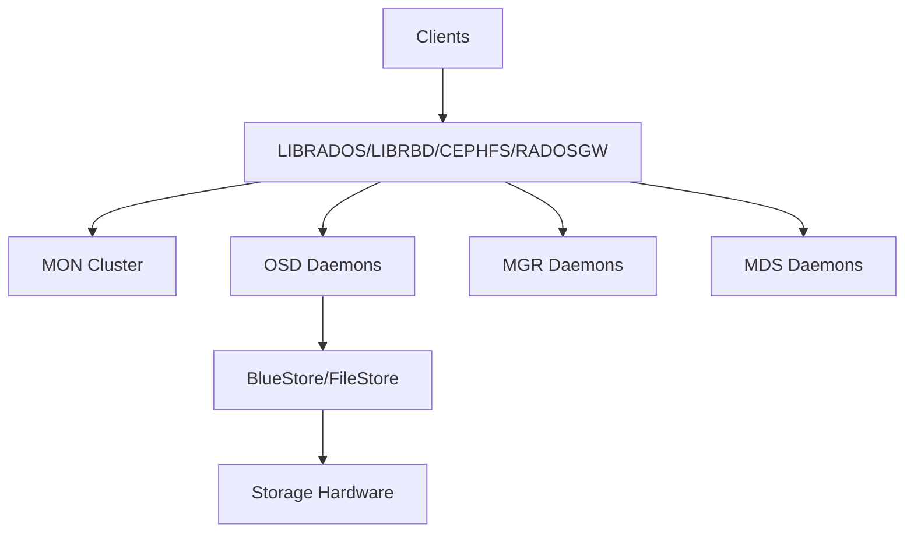

#### Key Features
- Object storage with S3/Swift API
- Block device (RBD) with kernel support
- POSIX-compliant file system (CephFS)
- Erasure coding for data protection
- Automatic data rebalancing

#### Quick Commands
```bash
# Cluster status
ceph -s
ceph health

# Storage management
ceph osd pool create rbd 64
rbd create rbd/image1 --size 100G
rbd map rbd/image1

# CephFS
ceph fs new myfs metadata data
mount -t ceph <mon-ip>:6789:/ /mnt/cephfs
```

#### Source Code
- Repository: https://github.com/ceph/ceph
- Documentation: https://docs.ceph.com/

---

### iSCSI with CEPH
iSCSI gateway presenting RBD images as SCSI disks over TCP/IP network.

#### Architecture
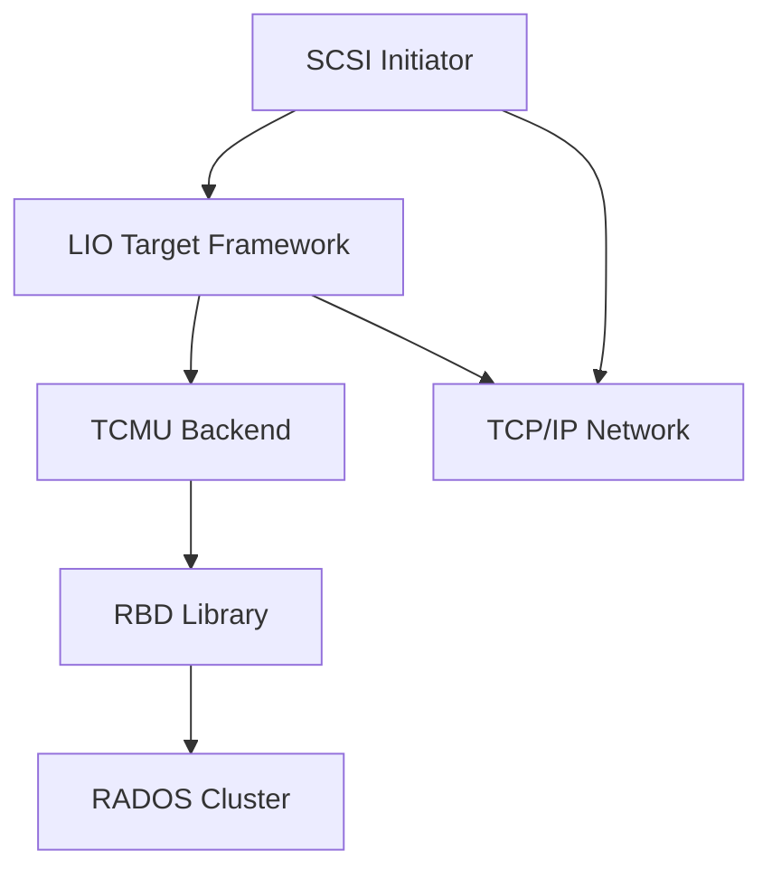

#### Key Features
- LIO target framework for SCSI protocol
- TCMU userspace passthrough
- RBD backend for Ceph integration
- CHAP authentication support
- Multipath I/O support

#### Quick Commands
```bash
# Create RBD image
rbd create rbd/disk1 --size 100G

# Configure iSCSI gateway
ceph orch apply iscsi gateway.yml

# Target management
gwcli.py target create <target-iqn>
gwcli.py lun create <target-iqn> 0 \
    --pool rbd --image disk1

# Initiator discovery
iscsiadm -m discovery -t st -p <target-ip>
iscsiadm -m node -T <target-iqn> -p <target-ip> --login
```

#### Source Code
- Repository: https://github.com/ceph/ceph
- Documentation: https://docs.ceph.com/en/latest/rbd/iscsi-overview/

---

### FC (NVMe-oF) with CEPH
NVMe over Fabrics gateway providing high-performance block access to Ceph.

#### Architecture
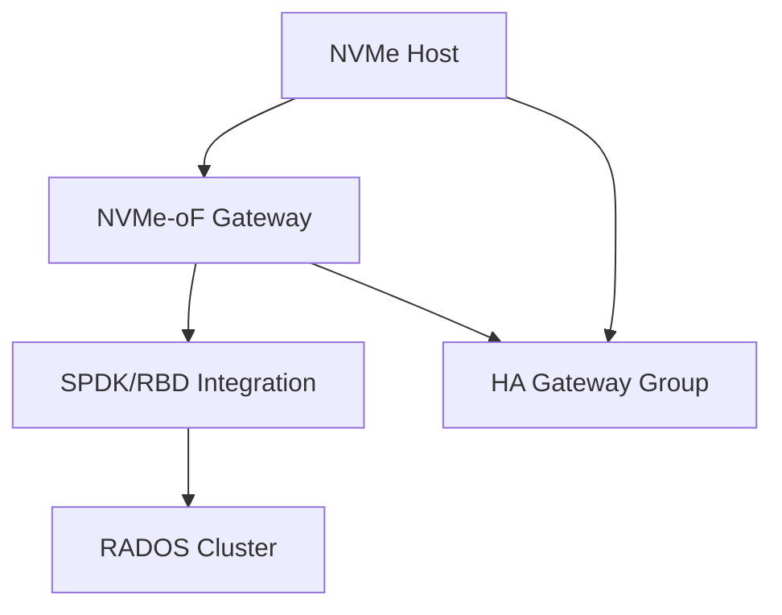

#### Key Features
- NVMe/TCP protocol for block access
- SPDK integration for high performance
- HA with gateway groups
- Load balancing across gateways
- RDMA/RoCE support

#### Quick Commands
```bash
# Create subsystem
gwcli.py subsystem create <subsystem-nqn>

# Create namespace
gwcli.py namespace create <subsystem-nqn> 1 \
    --pool rbd --image disk1

# Configure gateway
ceph orch apply nvmeof gateway.yml

# Connect initiator
nvme connect -t tcp -n <subsystem-nqn> \
    -a <gateway-ip> -s 4420
```

#### Source Code
- Repository: https://github.com/ceph/ceph
- Documentation: https://docs.ceph.com/en/latest/rbd/nvmeof-overview/

---

### GFS2
Global File System 2 for shared-disk file system in Linux clusters.

#### Architecture
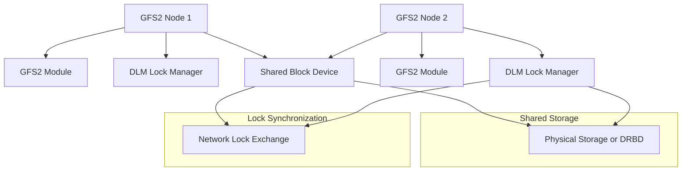

#### Key Features
- POSIX-compliant file system
- Distributed lock manager (DLM)
- Cluster-wide volume management (CLVM)
- Journaling for metadata integrity
- Quota support

#### Quick Commands
```bash
# Create filesystem
mkfs.gfs2 -p lock_dlm -t mycluster \
    -j 2 /dev/drbd/by-res/resource-data

# Mount GFS2
mount -t gfs2 -o noatime,nodiratime \
    /dev/drbd/by-res/resource-data /mnt/gfs2

# DLM management
dlm_tool ls
dlm_tool dump
```

#### Source Code
- Location in Linux kernel: `fs/gfs2/`
- Repository: https://github.com/torvalds/linux/tree/master/fs/gfs2
- Documentation: /usr/share/doc/gfs2-utils/

---

## Network and Switching

### libvirt Networking
Network management for virtualization environments.

#### Network Types

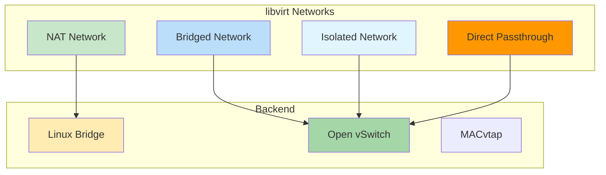

#### Quick Commands
```bash
# Network management
virsh net-list
virsh net-define network.xml
virsh net-start <network-name>

# Bridge commands
brctl show
brctl addbr br0
brctl delbr br0
```

---

## Quick Reference

### Corosync Cheatsheet

| Command | Description |
|---------|-------------|
| `corosync-cfgtool -s` | Show cluster status |
| `corosync-quorumtool -s` | Show quorum status |
| `corosync-cmapctl` | Query configuration |
| `corosync-keygen` | Generate auth key |

### Pacemaker Cheatsheet

| Command | Description |
|---------|-------------|
| `pcs status` | Display cluster status |
| `pcs resource create` | Create resource |
| `pcs constraint order` | Add ordering |
| `pcs constraint colocation` | Add colocation |
| `pcs stonith create` | Create STONITH |

### QEMU/KVM Cheatsheet

| Command | Description |
|---------|-------------|
| `qemu-system-x86_64` | Run QEMU VM |
| `virsh list` | List VMs |
| `virsh start` | Start VM |
| `virsh shutdown` | Shutdown VM |
| `kvm-ok` | Check KVM support |

### CEPH Cheatsheet

| Command | Description |
|---------|-------------|
| `ceph -s` | Cluster status |
| `ceph health` | Health check |
| `rbd create` | Create RBD image |
| `rbd map` | Map RBD image |
| `ceph orch apply` | Apply service |

### iSCSI Cheatsheet

| Command | Description |
|---------|-------------|
| `iscsiadm -m discovery` | Discover targets |
| `iscsiadm -m session` | List sessions |
| `gwcli.py target list` | List targets |
| `rbd showmapped` | Show mapped RBDs |

### NVMe-oF Cheatsheet

| Command | Description |
|---------|-------------|
| `nvme list` | List NVMe devices |
| `nvme discover` | Discover subsystems |
| `gwcli.py subsystem list` | List subsystems |
| `nvme show-ctrl` | Show controller |

### GFS2 Cheatsheet

| Command | Description |
|---------|-------------|
| `gfs2_tool sb` | Show superblock |
| `gfs2_tool df` | Show usage |
| `dlm_tool ls` | List DLM nodes |
| `dlm_tool dump` | Dump locks |

### Open vSwitch Cheatsheet

| Command | Description |
|---------|-------------|
| `ovs-vsctl add-br` | Add bridge |
| `ovs-vsctl del-br` | Delete bridge |
| `ovs-vsctl show` | Show config |
| `ovs-ofctl show` | Show OpenFlow rules |

---

## Reference Links

### Cluster Technologies

| Technology | Official Site | Source Code |
|-----------|---------------|-------------|
| Corosync | https://corosync.github.io/corosync/ | https://github.com/corosync/corosync |
| Pacemaker | https://www.clusterlabs.org/pacemaker/ | https://github.com/ClusterLabs/pacemaker |

### Virtualization

| Technology | Official Site | Source Code |
|-----------|---------------|-------------|
| QEMU | https://www.qemu.org/ | https://gitlab.com/qemu-project/qemu |
| KVM | https://www.linux-kvm.org/ | https://github.com/torvalds/linux/tree/master/virt/kvm |
| libvirt | https://libvirt.org/ | https://gitlab.com/libvirt/libvirt |
| Open vSwitch | https://www.openvswitch.org/ | https://github.com/openvswitch/ovs |

### Storage

| Technology | Official Site | Source Code |
|-----------|---------------|-------------|
| CEPH | https://docs.ceph.com/ | https://github.com/ceph/ceph |
| iSCSI | https://linux-iscsi.org/ | https://github.com/ceph/ceph |
| NVMe-oF | https://nvmexpress.org/ | https://github.com/ceph/ceph |
| GFS2 | /usr/share/doc/gfs2-utils/ | https://github.com/torvalds/linux/tree/master/fs/gfs2 |

---

## Deployment Workflows

### HA Cluster Setup

```bash
# 1. Install components
apt-get install corosync pacemaker pcs

# 2. Generate keys
corosync-keygen

# 3. Configure Corosync
vim /etc/corosync/corosync.conf

# 4. Start cluster
systemctl enable corosync pacemaker pcsd
systemctl start corosync pacemaker pcsd

# 5. Configure Pacemaker
pcs cluster setup --name mycluster node1 node2 node3
pcs cluster start --all
```

### Virtualization Setup

```bash
# 1. Install packages
apt-get install qemu-kvm libvirt-daemon-system \
    libvirt-clients virt-manager openvswitch-switch

# 2. Enable services
systemctl enable libvirtd
systemctl start libvirtd

# 3. Configure networking
systemctl enable openvswitch
systemctl start openvswitch

# 4. Create VM
virt-install --name vm1 --memory 2048 --vcpus 2 \
    --disk path=/var/lib/libvirt/images/vm1.qcow2,size=20 \
    --network network=default
```

### CEPH HCI Setup

```bash
# 1. Install cephadm
curl --silent --remote-name --location \
    https://download.ceph.com/rpm-18.2.1/el9/noarch/cephadm \
    -o cephadm
chmod +x cephadm

# 2. Bootstrap cluster
./cephadm bootstrap --mon-ip <mon-ip>

# 3. Add storage
ceph orch apply osd --all-available-devices

# 4. Verify cluster
ceph -s
ceph status
```

---

## Nifty Behaviors and Tips

### Corosync

#### Kronosnet Multi-Link Transport
```conf
totem {
    transport: knet
    interface {
        ringnumber: 0
        bindnetaddr: 192.168.1.10
    }
    interface {
        ringnumber: 1
        bindnetaddr: 192.168.2.10
    }
}
```
**Nifty**: Automatic failover between network links, better performance

#### Token Timeout Optimization
```conf
totem {
    token: 5000           # Reduce for faster failure detection
    token_retransmit: 250
}
```
**Nifty**: Faster cluster response to failures

### Pacemaker

#### Resource Stickiness
```xml
<meta_attributes>
    <nvpair name="resource-stickiness" value="100"/>
    <nvpair name="migration-threshold" value="3"/>
</meta_attributes>
```
**Nifty**: Resources prefer current location but move after failures

#### Batch Constraint Updates
```bash
pcs constraint order start vip then apache
pcs constraint colocation add apache with vip
pcs constraint location web-group prefers node1=100
```
**Nifty**: Constraints applied as a set, atomic configuration

### QEMU/KVM

#### QMP Programmatic Control
```bash
echo '{"execute":"query-status"}' | \
    socat UNIX-CONNECT:/var/run/libvirt/qemu/vm1.monitor
```
**Nifty**: Programmatic control of running VMs

#### Virtio Multiqueue
```xml
<interface type='network'>
    <model type='virtio'/>
    <driver name='vhost' queues='4'/>
</interface>
```
**Nifty**: Multi-queue network, better throughput

#### Memory Ballooning
```bash
# Attach balloon device
virsh attach-device vm1 balloon.xml

# Adjust memory
virsh setmem vm1 2G
```
**Nifty**: Dynamically adjust VM memory

### CEPH

#### BlueStore Configuration
```bash
# Enable BlueStore
ceph config set osd osd_objectstore bluestore

# Tune BlueStore
ceph config set osd bluestore_max_blob_size 1M
```
**Nifty**: Optimized storage engine for better performance

#### Cache Tiering
```bash
ceph osd tier add base-pool cache-pool
ceph osd tier cache-mode cache-pool writeback
ceph osd pool set cache-pool cache_target_dirty_ratio 0.4
```
**Nifty**: Improve read performance with caching

### iSCSI/NVMe-oF

#### CHAP Authentication
```bash
# Configure CHAP on gateway
gwcli.py target set_chap <target-iqn> \
    --user <username> --password <password>
```
**Nifty**: Secure iSCSI connections

#### HA Gateway Groups
```bash
# Create gateway group
gwcli.py group create <group-name>
gwcli.py group add_gateway <group-name> <gateway-host>
```
**Nifty**: Redundant iSCSI/NVMe-oF gateways

### GFS2

#### Quota Management
```bash
gfs2_quota enable /mnt/gfs2
gfs2_quota limit -u <uid> 100G /mnt/gfs2
```
**Nifty**: Enforce user quotas on shared filesystem

#### Snapshots with CLVM
```bash
lvcreate -L 10G -s -n my_lv_snap mycluster_vg/my_lv
lvdisplay mycluster_vg
```
**Nifty**: Point-in-time snapshots with LVM

### Open vSwitch

#### Remote Management
```bash
ovs-vsctl set-manager ptcp:127.0.0.1:6640
ovs-vsctl set-protocol ssl
```
**Nifty**: Secure remote OVS management

#### Bond Configuration
```bash
ovs-vsctl add-bond bond0 eth0 eth1
ovs-vsctl set bond bond0 mode=active-backup
```
**Nifty**: Network redundancy and load balancing

---

## Security Considerations

### Corosync Security
- Protect authentication key: `chmod 600 /etc/corosync/authkey`
- Use encrypted transport (knet)
- Isolate cluster network

### Pacemaker Security
- Always enable STONITH
- Secure cluster communication
- Limit cluster daemon permissions

### Virtualization Security
- Use AppArmor/SELinux profiles
- Use virtio drivers for better isolation
- Enable seccomp filters
- Use IOMMU for device passthrough

### Storage Security
- Enable CephX encryption
- Use CHAP authentication for iSCSI
- Use RDMA/RoCE for secure transport

---

## License

Course materials follow documentation licenses of their respective projects:
- Corosync: BSD License
- Pacemaker: GPL-2.0 and LGPL-2.1
- QEMU/KVM: GPL-2.0
- CEPH: GPL-2.0, LGPL-2.1, LGPL-3.0
- GFS2: GPL-2.0
- libvirt: LGPL-2.1
- Open vSwitch: Apache 2.0

---

## Further Resources

### Community and Support
- CEPH: https://ceph.io/community/
- ClusterLabs: https://clusterlabs.org/community/
- QEMU: qemu-devel@nongnu.org
- KVM: kvm@vger.kernel.org

### Bug Trackers
- Corosync: https://github.com/corosync/corosync/issues
- Pacemaker: https://bugs.clusterlabs.org/
- CEPH: https://tracker.ceph.com/projects/ceph
- QEMU: https://gitlab.com/qemu-project/qemu/-/issues
- libvirt: https://gitlab.com/libvirt/libvirt/-/issues
- Open vSwitch: https://bugs.openvswitch.org/

---

These course materials provide comprehensive coverage of Linux High Availability and virtualization technologies for educational purposes.
