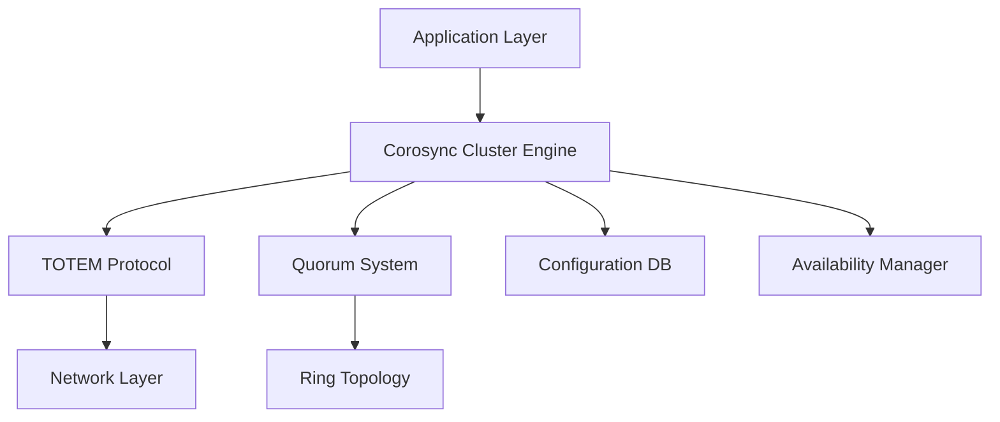

# Corosync Cluster Engine

Cluster messaging and synchronization framework providing virtual synchrony guarantees and quorum management.

## Architecture



## Key Features

- Virtual Synchrony model for consistent message ordering
- TOTEM protocol for reliable group communication
- Quorum system to prevent split-brain scenarios
- In-memory configuration database

## Quick Commands

```bash
# Installation
apt-get install corosync
corosync-keygen

# Status
corosync-cfgtool -s
corosync-quorumtool -s

# Configuration
corosync-cmapctl
```

## Nifty Behaviors

### Kronosnet Multi-Link Transport
```conf
totem {
    transport: knet
    interface {
        ringnumber: 0
        bindnetaddr: 192.168.1.10
    }
    interface {
        ringnumber: 1
        bindnetaddr: 192.168.2.10
    }
}
```
**Nifty**: Automatic failover between network links, better performance

### Token Timeout Optimization
```conf
totem {
    token: 5000           # Reduce for faster failure detection
    token_retransmit: 250
}
```
**Nifty**: Faster cluster response to failures

## Security

- Protect authentication key: `chmod 600 /etc/corosync/authkey`
- Use encrypted transport (knet)
- Isolate cluster network

## Source Code

- Repository: https://github.com/corosync/corosync
- Documentation: https://corosync.github.io/corosync/
