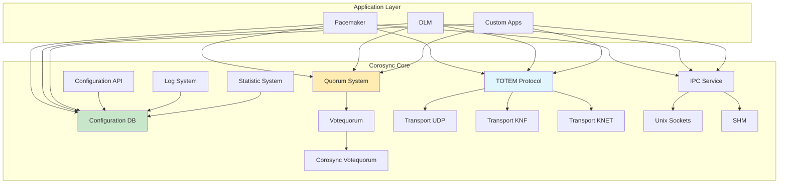
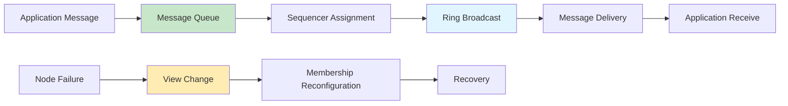
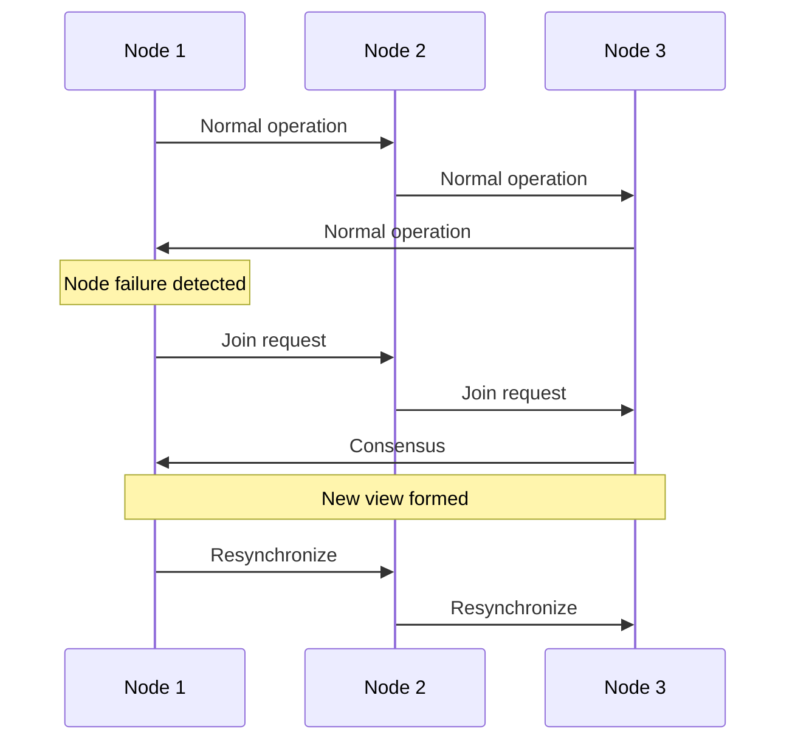

# Corosync Cluster Engine

Cluster messaging and synchronization framework providing virtual synchrony guarantees and quorum management for Linux HA clusters.

## Architecture



## Core Components

### TOTEM Protocol

The Totem Single Ring Ordering and Membership protocol provides virtual synchrony for cluster messaging.

**Virtual Synchrony Properties**:
- Total order: All messages delivered in same order to all nodes
- Agreement: Messages delivered to live nodes in same view
- Safety: No messages delivered after view change completes

**Protocol Operation**:



**TOTEM Parameters**:
- `token`: Time between token rotations (ms)
- `token_retransmit`: Retransmission timeout (ms)
- `hold`: Token hold time before release (ms)
- `token_retransmits_before_loss_const`: Token loss threshold
- `join`: Join timeout (ms)
- `consensus`: Consensus timeout (ms)
- `merge`: Merge timeout (ms)
- `downcheck`: Node down detection (ms)

### Quorum System

Corosync uses quorum to prevent split-brain scenarios where clusters form separate groups.

**Quorum Types**:

1. **Split-Brain Prevention**: Ensure cluster consistency
2. **Votequorum**: Simple voting mechanism
3. **QNet**: Network-based quorum device
4. **QDevice**: External quorum device

**Votequorum Operation**:

```bash
# Check quorum state
corosync-quorumtool -s

# Expected output example:
Quorum information
------------------
Date:             Mon Jan 26 2026
Quorum provider:  corosync_votequorum
Nodes:            3
Node ID:          1
Ring ID:          1/8168
Quorate:          Yes

Votequorum information
----------------------
Expected votes:   3
Highest expected: 3
Total votes:      3
Quorum:           2
Flags:            Quorate
```

**Quorum Calculation**:
- Minimum votes required: `floor(total_votes / 2) + 1`
- 3-node cluster: quorum = 2
- 5-node cluster: quorum = 3
- 2-node cluster: requires QDevice

### Configuration Database

In-memory key-value store for cluster configuration.

**Configuration API**:

```bash
# List all keys
corosync-cmapctl

# Read specific key
corosync-cmapctl -g runtime.totem.token

# Set key value
corosync-cmapctl -s nodelist.node.0.nodeid -t u32 -v 1

# Map keys to values
corosync-cmapctl -b runtime
```

**Configuration Keys**:

| Category | Example Keys | Description |
|----------|--------------|-------------|
| Runtime | `runtime.totem.token` | Current token timeout |
| Totem | `totem.token` | TOTEM configuration |
| Quorum | `quorum.expected_votes` | Expected vote count |
| Nodelist | `nodelist.node.*.ring0_addr` | Node addresses |
| Logging | `logging.to_logfile` | Logging configuration |

## Configuration

### Complete corosync.conf

```conf
totem {
    version: 2
    cluster_name: ha-cluster
    
    transport: knet
    
    # Ring 0 - Primary network
    interface {
        ringnumber: 0
        bindnetaddr: 192.168.1.0
        broadcast: yes
        mcastport: 5405
    }
    
    # Ring 1 - Secondary network (redundancy)
    interface {
        ringnumber: 1
        bindnetaddr: 10.0.1.0
        broadcast: yes
        mcastport: 5406
    }
    
    # TOTEM protocol tuning
    token: 5000
    token_retransmit: 250
    hold: 180
    token_retransmits_before_loss_const: 4
    
    join: 60
    consensus: 4800
    merge: 200
    downcheck: 1000
    fail_to_recv_const: 2500
    
    seqno_unchanged_const: 2000
    window_size: 50
    max_messages: 17
    
    # Security
    crypto_cipher: aes256
    crypto_hash: sha256
}

nodelist {
    node {
        ring0_addr: 192.168.1.10
        ring1_addr: 10.0.1.10
        nodeid: 1
        name: node1
    }
    node {
        ring0_addr: 192.168.1.11
        ring1_addr: 10.0.1.11
        nodeid: 2
        name: node2
    }
    node {
        ring0_addr: 192.168.1.12
        ring1_addr: 10.0.1.12
        nodeid: 3
        name: node3
    }
}

quorum {
    provider: corosync_votequorum
    expected_votes: 3
    two_node: 0
    wait_for_all: 0
    auto_tie_breaker: 1
    last_man_standing: 1
    last_man_standing_window: 10000
}

logging {
    to_logfile: yes
    logfile: /var/log/corosync/corosync.log
    to_syslog: yes
    timestamp: on
    debug: off
    logger_subsys {
        subsys: QUORUM
        debug: off
    }
}

# IPC service configuration
quorum {
    provider: corosync_votequorum
}

nodelist {
    # As defined above
}
```

### Kronosnet (knet) Transport

Kronosnet provides multi-link transport with automatic failover.

**Knet Configuration**:

```conf
totem {
    version: 2
    cluster_name: ha-cluster
    transport: knet
    
    # Link configuration
    knet_transport {
        link_mode: passive
        link_priority: [100, 50]
        
        link_0 {
            link_priority: 100
            mcastport: 5405
            ttl: 1
        }
        
        link_1 {
            link_priority: 50
            mcastport: 5406
            ttl: 1
        }
    }
    
    interface {
        ringnumber: 0
        bindnetaddr: 192.168.1.0
        mcastport: 5405
    }
    
    interface {
        ringnumber: 1
        bindnetaddr: 10.0.1.0
        mcastport: 5406
    }
    
    # Crypto configuration
    crypto_cipher: aes256
    crypto_hash: sha256
    crypto_model: nss
    
    # Compression
    compress_model: zlib
    compress_threshold: 1000
}
```

**Knet Benefits**:
- Automatic link failover
- Traffic prioritization
- Built-in encryption
- Compression support
- Multiple transports per link

### UDP Transport (Legacy)

```conf
totem {
    version: 2
    cluster_name: ha-cluster
    transport: udpu
    
    interface {
        ringnumber: 0
        bindnetaddr: 192.168.1.0
        mcastport: 5405
    }
}
```

## Key Features

### Virtual Synchrony

**Message Ordering**: All nodes receive messages in identical order across cluster views.

**Virtual Synchrony Properties**:
1. **Total Order**: Single global message order
2. **Atomic Broadcast**: All or nothing delivery
3. **View Synchrony**: View changes coordinate with messages
4. **Safety**: No message loss or duplication

**Use Cases**:
- Cluster state synchronization
- Distributed lock management
- Resource state coordination
- Configuration distribution

### Quorum Management

**Quorum States**:
- **Quorate**: Cluster has majority
- **Inquorate**: Cluster lacks majority
- **Recovering**: Quorum being restored

**Quorum Actions**:
- Quorate: Normal operation
- Inquorate: Resource fencing, graceful degradation

### Configuration Database

**In-Memory KV Store**:
- Fast access to cluster state
- Dynamic reconfiguration
- Key-value API for applications

**Key Patterns**:
- `config.*`: Configuration parameters
- `runtime.*`: Runtime statistics
- `statemachine.*`: State machine data

## Quick Commands

### Installation

```bash
# Debian/Ubuntu
apt-get install corosync

# RHEL/CentOS
yum install corosync

# Generate authentication key
corosync-keygen
# Default location: /etc/corosync/authkey
# Permissions: 600
```

### Status and Monitoring

```bash
# Check cluster membership
corosync-cfgtool -s

# Check quorum status
corosync-quorumtool -s

# View configuration database
corosync-cmapctl

# Monitor runtime statistics
corosync-cmapctl -b runtime

# View IPC statistics
corosync-cmapctl -b stats

# Check node status
corosync-cmapctl -g runtime.votequorum.node_id
```

### Configuration Management

```bash
# Validate configuration
corosync-cfgtool -v

# View loaded configuration
corosync-cmapctl -b config

# Reload configuration
systemctl reload corosync

# Backup configuration
cp /etc/corosync/corosync.conf /etc/corosync/corosync.conf.bak
```

### Debugging

```bash
# Enable debug logging
corosync-cmapctl -s logging.debug -t str on

# View message logs
journalctl -u corosync -f

# Check network connectivity
corosync-cfgtool -s -i <interface>

# View token statistics
corosync-cmapctl -b runtime.totem

# Check IPC service status
corosync-cmapctl -b runtime.services
```

## Nifty Behaviors

### Kronosnet Multi-Link Transport

```conf
totem {
    transport: knet
    
    interface {
        ringnumber: 0
        bindnetaddr: 192.168.1.0
        mcastport: 5405
    }
    
    interface {
        ringnumber: 1
        bindnetaddr: 10.0.1.0
        mcastport: 5406
    }
}
```

**Nifty**: Automatic failover between network links, better performance, built-in encryption

### Token Timeout Optimization

```conf
totem {
    token: 5000           # Faster failure detection
    token_retransmit: 250
    hold: 180
}
```

**Nifty**: Faster cluster response to failures

### Auto Tie-Breaker

```conf
quorum {
    provider: corosync_votequorum
    auto_tie_breaker: 1
    last_man_standing: 1
}
```

**Nifty**: 2-node cluster operation without QDevice

### Quorum Device Integration

```conf
quorum {
    provider: qdevice
    model: net
    net {
        host: qdevice.example.com
        algorithm: lms
        tie_breaker: lowest
    }
}
```

**Nifty**: External quorum for even-numbered clusters

## Protocol Internals

### TOTEM Protocol Details

**Message Types**:
1. **Regular Messages**: Application data
2. **Join Messages**: Node join requests
3. **Consensus Messages**: Membership agreement
4. **Merge Messages**: Cluster merge operations

**Ring Operation**:

```
Node A -> Token -> Node B -> Token -> Node C -> Token -> Node A
```

**Token Rotation**:
1. Sequencer holds token
2. Processes pending messages
3. Broadcasts new token with message IDs
4. Releases token to next node

**View Change**:



### IPC Service Communication

**Unix Domain Sockets**:
- `/var/run/corosync/corosync.sock`
- Used by local applications
- Fast IPC

**Shared Memory**:
- Used for high-performance communication
- Zero-copy message passing

**IPC Protocol**:
```c
// Simplified IPC flow
1. Application opens IPC connection
2. Application subscribes to notification type
3. Corosync sends messages to subscribers
4. Application acknowledges receipt
5. Corosync tracks delivery state
```

## Performance Tuning

### Network Optimization

```conf
totem {
    # Reduce token timeout for faster failover
    token: 3000
    token_retransmit: 200
    
    # Increase window for high latency
    window_size: 100
    
    # Tune for high throughput
    max_messages: 32
}
```

### Memory Optimization

```conf
totem {
    # Reduce memory usage
    max_messages: 10
    window_size: 30
}
```

### CPU Optimization

```conf
# Disable compression for CPU-bound clusters
totem {
    compress_model: none
}

# Use faster crypto
totem {
    crypto_cipher: aes128
    crypto_hash: sha1
}
```

## Security

### Authentication Key

**Key Generation**:
```bash
corosync-keygen
# Uses /dev/random
# Creates 128-byte key
# Stored in /etc/corosync/authkey
```

**Key Distribution**:
```bash
# Copy to all nodes
scp /etc/corosync/authkey node2:/etc/corosync/
scp /etc/corosync/authkey node3:/etc/corosync/
```

**Key Permissions**:
```bash
chmod 600 /etc/corosync/authkey
chown root:root /etc/corosync/authkey
```

### Transport Security

**Knet Encryption**:
```conf
totem {
    transport: knet
    crypto_cipher: aes256
    crypto_hash: sha256
    crypto_model: nss
}
```

**Network Isolation**:
- Use dedicated cluster network
- Separate management traffic
- VLAN segmentation

### Access Control

**IPC Permissions**:
```bash
# Default: root only
chmod 600 /var/run/corosync/corosync.sock

# Custom: Group access
chown root:corosync /var/run/corosync/corosync.sock
chmod 660 /var/run/corosync/corosync.sock
```

## Troubleshooting

### Common Issues

#### Token Timeout Errors

**Symptoms**:
- `corosync-cfgtool -s` shows timeouts
- Cluster instability

**Solution**:
```conf
totem {
    token: 10000
    token_retransmit: 1000
}
```

#### Quorum Loss

**Symptoms**:
- `corosync-quorumtool -s` shows "Inquorate"
- Cluster degraded

**Solutions**:
```bash
# Check network connectivity
ping node2
ping node3

# Verify node count
corosync-quorumtool -s

# Force quorum (emergency only)
corosync-quorumtool -f

# Add QDevice for 2-node clusters
```

#### Authentication Failures

**Symptoms**:
- `authkey` errors in logs
- Nodes cannot join cluster

**Solution**:
```bash
# Regenerate key on all nodes
rm /etc/corosync/authkey
corosync-keygen

# Distribute key
scp /etc/corosync/authkey node2:/etc/corosync/
scp /etc/corosync/authkey node3:/etc/corosync/

# Restart services
systemctl restart corosync
```

#### Node Cannot Join Cluster

**Symptoms**:
- Node not listed in membership
- Firewall blocking traffic

**Solution**:
```bash
# Check firewall
iptables -L -n | grep 5405

# Allow cluster traffic
iptables -A INPUT -p udp --dport 5405 -j ACCEPT
iptables -A INPUT -p udp --dport 5406 -j ACCEPT

# Check network connectivity
nc -zuv node1 5405
nc -zuv node1 5406

# Verify configuration
corosync-cfgtool -v
```

### Debug Commands

```bash
# Enable verbose logging
corosync-cmapctl -s logging.debug -t str on
systemctl restart corosync

# View detailed logs
journalctl -u corosync -f

# Check all interfaces
corosync-cfgtool -s -i all

# Dump configuration
corosync-cmapctl > corosync_config.txt

# Monitor runtime statistics
corosync-cmapctl -b runtime -b stats -w

# Check IPC connections
corosync-cmapctl -b runtime.services
```

### Log Analysis

**Common Log Messages**:

```
# Normal operation
[MAIN  ] Corosync Cluster Engine exiting normally
[TOTEM ] The token was lost 12 times

# Quorum loss
[QUORUM] Quorum lost, inquorate cluster

# Node failure
[MAIN  ] Node 1 left the cluster

# Configuration error
[CFG   ] Invalid configuration: unknown token
```

**Log Locations**:
- `/var/log/corosync/corosync.log` - Corosync logs
- `/var/log/syslog` - System logs (if enabled)
- `journalctl -u corosync` - Systemd logs

## Best Practices

### Production Deployment

1. **Redundant Networks**: Use at least 2 ring interfaces
2. **Proper Token Tuning**: Balance failover speed vs stability
3. **Quorum Device**: Use QDevice for even-numbered clusters
4. **Secure Keys**: Protect authkey with proper permissions
5. **Network Isolation**: Dedicate cluster network
6. **Monitoring**: Set up alerts for quorum and membership changes

### Configuration Checklist

- [ ] Generate and distribute authkey
- [ ] Configure at least 2 ring interfaces
- [ ] Set appropriate token timeouts
- [ ] Configure quorum for node count
- [ ] Enable logging to file
- [ ] Test failover scenarios
- [ ] Verify network connectivity
- [ ] Set up monitoring

### Network Design

**Physical Network**:
- Separate cluster network from production
- Use 10Gbps or faster
- Redundant switches

**Network Segments**:
- Cluster: 192.168.1.0/24
- Management: 10.0.1.0/24
- Storage: 10.0.2.0/24

## Source Code

- **Repository**: https://github.com/corosync/corosync
- **Documentation**: https://corosync.github.io/corosync/
- **Mailing List**: https://lists.corosync.org/mailman/listinfo/corosync

### Key Source Locations

| Component | Location | Description |
|-----------|----------|-------------|
| TOTEM | `exec/totem*` | TOTEM protocol implementation |
| Quorum | `exec/quorum.c` | Quorum system |
| Config DB | `exec/cmap.c` | Configuration database |
| IPC | `exec/ipc.c` | IPC service |
| Logging | `exec/logsys.c` | Logging system |