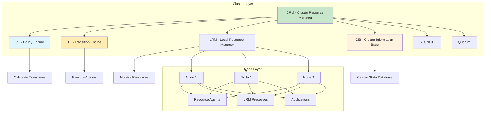
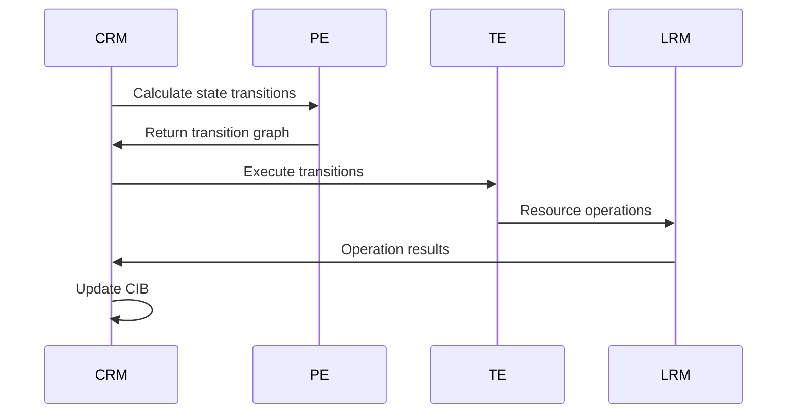

# Pacemaker Cluster Resource Manager

Advanced cluster resource manager coordinating configuration, start-up, monitoring, and recovery of interrelated services in Linux HA clusters.

## Architecture



## Core Components

### CRM - Cluster Resource Manager

Central coordinator for all cluster operations.

**Responsibilities**:
- Coordinate PE, TE, LRM components
- Handle quorum and cluster membership
- Process resource operations
- Manage STONITH operations
- Distribute cluster configuration

**Communication Flow**:


### PE - Policy Engine

Calculates optimal resource placement and transitions.

**Decision Process**:
1. Analyze current cluster state
2. Evaluate constraints and priorities
3. Calculate optimal transitions
4. Generate transition graph
5. Submit to TE for execution

**Algorithm**:
- Score-based optimization
- Constraint satisfaction
- Failover calculation
- Load balancing
- Resource stickiness consideration

**PE States**:
- Idle: No calculations in progress
- Pending: Waiting for quorum or data
- Active: Calculating transitions

### TE - Transition Engine

Executes state transitions calculated by PE.

**Transition Types**:
- Start: Start resource on node
- Stop: Stop resource on node
- Monitor: Check resource health
- Promote/Demote: State change for master/slave resources
- Migrate: Move resource between nodes
- Recover: Handle resource failure

**Execution Flow**:
```
1. Receive transition graph
2. Validate dependencies
3. Execute operations in order
4. Wait for completion
5. Report results
6. Update cluster state
```

### LRM - Local Resource Manager

Manages resources on individual nodes.

**LRM Process**:
- Resource agent execution
- Operation tracking
- Status reporting
- Timeout handling
- Error handling

**LRM States**:
- Idle: No active operations
- Busy: Executing operation
- Stopped: Process stopped

### CIB - Cluster Information Base

Distributed database storing cluster configuration and state.

**CIB Structure**:
```xml
<cib>
  <configuration>
    <crm_config>      <!-- Cluster properties -->
    <nodes>           <!-- Node definitions -->
    <resources>       <!-- Resource definitions -->
    <constraints>     <!-- Resource constraints -->
  </configuration>
  <status>
    <node_state>      <!-- Node status -->
    <lrm_resource>    <!-- Resource status -->
  </status>
</cib>
```

**CIB Distribution**:
- Replicated to all nodes
- Version-controlled
- Automatic synchronization
- Conflict resolution

**CIB Updates**:
```bash
# Show CIB
pcs config

# Export CIB
pcs cluster cib > cluster.xml

# Edit CIB
pcs cluster cib edit

# Push CIB
pcs cluster cib-push cluster.xml
```

## Resource Types

### Resource Classes

#### OCF - Open Cluster Framework

Standard resource agent interface.

**OCF Actions**:
```bash
# Start
<resource-agent> start

# Stop
<resource-agent> stop

# Monitor
<resource-agent> monitor

# Validate configuration
<resource-agent> validate-all

# Metadata
<resource-agent> meta-data
```

**OCF Exit Codes**:
| Code | Meaning |
|------|---------|
| 0 | Success |
| 7 | Not running |
| 1 | Generic error |
| 2 | Invalid parameters |
| 3 | Unimplemented feature |
| 4 | Insufficient privileges |
| 5 | Not installed |
| 6 | Not configured |

**OCF Metadata Example**:
```xml
<?xml version="1.0"?>
<resource-agent name="IPaddr2">
  <version>1.0</version>
  <longdesc lang="en">IP address management</longdesc>
  <shortdesc lang="en">IP address management</shortdesc>
  
  <parameters>
    <parameter name="ip" unique="1">
      <longdesc lang="en">IP address</longdesc>
      <shortdesc lang="en">IP address</shortdesc>
      <content type="string" default=""/>
    </parameter>
    <parameter name="cidr_netmask">
      <longdesc lang="en">CIDR netmask</longdesc>
      <shortdesc lang="en">CIDR netmask</shortdesc>
      <content type="integer" default="24"/>
    </parameter>
  </parameters>
  
  <actions>
    <action name="start" timeout="20s"/>
    <action name="stop" timeout="20s"/>
    <action name="monitor" timeout="20s" interval="10s"/>
    <action name="validate-all" timeout="20s"/>
  </actions>
</resource-agent>
```

#### LSB - Linux Standard Base

Standard SysV init scripts.

**LSB Compatibility**:
```bash
# Start
/etc/init.d/apache2 start

# Stop
/etc/init.d/apache2 stop

# Status
/etc/init.d/apache2 status

# Reload
/etc/init.d/apache2 reload
```

**LSB Resource Creation**:
```bash
pcs resource create apache lsb:apache2
```

#### systemd

Native systemd service support.

**systemd Resource Creation**:
```bash
pcs resource create myapp systemd:myapp
```

**systemd Actions**:
- start: `systemctl start`
- stop: `systemctl stop`
- monitor: `systemctl is-active`

### Resource Standards

| Standard | Prefix | Description |
|----------|--------|-------------|
| OCF | `ocf:` | Open Cluster Framework |
| LSB | `lsb:` | Linux Standard Base |
| systemd | `systemd:` | systemd service |
| stonith | `stonith:` | Fencing devices |

### Resource Providers

| Provider | Description | Example |
|----------|-------------|---------|
| heartbeat | Heartbeat project agents | `ocf:heartbeat:IPaddr2` |
| pacemaker | Pacemaker agents | `ocf:pacemaker:ping` |
| redhat | Red Hat agents | `ocf:redhat:apache` |

## Resource Management

### Creating Resources

#### VIP Resource

```bash
# Basic VIP
pcs resource create vip ocf:heartbeat:IPaddr2 \
    ip=192.168.1.100 cidr_netmask=24

# VIP with NIC specification
pcs resource create vip ocf:heartbeat:IPaddr2 \
    ip=192.168.1.100 cidr_netmask=24 \
    nic=eth0

# VIP with ARP ping
pcs resource create vip ocf:heartbeat:IPaddr2 \
    ip=192.168.1.100 cidr_netmask=24 \
    arp_ping=true
```

#### Apache Resource

```bash
# Apache service
pcs resource create apache ocf:heartbeat:apache \
    configfile=/etc/apache2/apache2.conf \
    statusurl=http://localhost/server-status \
    client=1
```

#### Filesystem Resource

```bash
# Mount filesystem
pcs resource create fs ocf:heartbeat:Filesystem \
    device=/dev/drbd/by-res/data \
    directory=/mnt/data \
    fstype=ext4
```

#### NFS Resource

```bash
# NFS export
pcs resource create nfs_export ocf:heartbeat:nfsserver \
    directory=/mnt/data \
    options=rw,no_root_squash
```

### Resource Cloning

#### Anonymous Clone

```bash
# Clone to all nodes
pcs resource clone vip

# Clone with specific settings
pcs resource clone vip clone-max=3 clone-node-max=1
```

#### Named Clone

```bash
# Create named clone
pcs resource create vip ocf:heartbeat:IPaddr2 ip=192.168.1.100
pcs resource clone vip \
    clone-max=3 \
    clone-node-max=1 \
    interleave=true
```

**Clone Parameters**:
- `clone-max`: Maximum number of copies
- `clone-node-max`: Copies per node
- `interleave`: Clone ordering with multi-state resources
- `globally-unique`: Unique instance per node

### Master/Slave Resources

```bash
# Create master/slave resource
pcs resource create db ocf:heartbeat:mysql \
    config=/etc/mysql/my.cnf

pcs resource master master-db db \
    master-max=1 \
    master-node-max=1 \
    clone-max=3 \
    clone-node-max=1
```

**Master Parameters**:
- `master-max`: Maximum master instances
- `master-node-max`: Masters per node
- `clone-max`: Total instances
- `clone-node-max`: Instances per node

### Resource Groups

```bash
# Create group
pcs resource group add web-group vip apache

# Add to existing group
pcs resource group add web-group nfs_export

# Remove from group
pcs resource group remove web-group apache
```

**Group Properties**:
- Resources start/stop together
- Ordered start sequence
- Colocated on same node
- Group-level stickiness

## Constraints

### Ordering Constraints

Define start/stop order for resources.

#### Basic Ordering

```bash
# Start vip before apache
pcs constraint order start vip then apache

# Stop apache before vip
pcs constraint order stop apache then vip
```

#### Ordering with Kind

```bash
# Mandatory (default)
pcs constraint order start vip then apache kind=Mandatory

# Optional
pcs constraint order start vip then apache kind=Optional

# Serialize
pcs constraint order start vip then apache kind=Serialize

# Symmetrical ordering
pcs constraint order start vip then apache symmetrical=true
```

#### Resource Sets

```bash
# Order multiple resources
pcs constraint order start vip then start apache \
    then start nfs_export

# Order with resource sets
pcs constraint order \
    start vip then apache \
    kind=Mandatory \
    symmetrical=true
```

### Colocation Constraints

Define resource placement relationships.

#### Basic Colocation

```bash
# Apache must run with vip
pcs constraint colocation add apache with vip

# Apache must run with vip, score 100
pcs constraint colocation add apache with vip score=100
```

#### Negative Colocation

```bash
# Apache must NOT run with vip
pcs constraint colocation add apache with vip score=-INFINITY
```

#### Colocation Score

| Score | Meaning |
|-------|---------|
| INFINITY | Must colocate |
| High | Prefer colocate |
| 0 | No preference |
| -High | Avoid colocate |
| -INFINITY | Must NOT colocate |

### Location Constraints

Define preferred nodes for resources.

#### Basic Location

```bash
# Prefer node1 for apache
pcs constraint location apache prefers node1=100

# Avoid node2 for apache
pcs constraint location apache avoids node2

# Rule-based location
pcs constraint location apache rule score=100 node#node1
```

#### Rule-Based Location

```bash
# Rule based on node attributes
pcs constraint location apache rule score=100 \
    #uname eq node1

# Rule with multiple conditions
pcs constraint location apache rule \
    score=100 #uname eq node1 \
    and #uname eq node2

# Rule with expressions
pcs constraint location apache rule \
    score=100 defined #master
```

**Rule Operators**:
| Operator | Meaning |
|----------|---------|
| `eq` | Equal |
| `ne` | Not equal |
| `lt` | Less than |
| `lte` | Less than or equal |
| `gt` | Greater than |
| `gte` | Greater than or equal |

### Constraint Examples

#### Three-Tier Application

```bash
# Resources
pcs resource create vip ocf:heartbeat:IPaddr2 ip=192.168.1.100
pcs resource create app ocf:heartbeat:apache
pcs resource create db ocf:heartbeat:mysql config=/etc/mysql/my.cnf
pcs resource master master-db db

# Order: DB -> App -> VIP
pcs constraint order start master-db then app
pcs constraint order start app then vip

# Colocation: All on same node
pcs constraint colocation add app with master-db
pcs constraint colocation add vip with app

# Location: Prefer node1 for DB master
pcs constraint location master-db rule score=100 \
    #uname eq node1
```

#### Active/Active Web Cluster

```bash
# Clone VIP to all nodes
pcs resource create vip ocf:heartbeat:IPaddr2 ip=192.168.1.100
pcs resource clone vip

# Clone Apache to all nodes
pcs resource create app ocf:heartbeat:apache
pcs resource clone app

# Load balancer resource
pcs resource create lb ocf:heartbeat:IPaddr2 ip=192.168.1.200
pcs resource clone lb
```

## Resource Operations

### Operation Attributes

```bash
# Custom monitor interval
pcs resource update vip op \
    monitor interval=5s timeout=30s

# Start timeout
pcs resource update vip op \
    start timeout=20s

# Multiple operations
pcs resource update vip op \
    start timeout=20s \
    stop timeout=20s \
    monitor interval=10s timeout=20s \
    monitor interval=30s on-fail=restart role=Started
```

### Operation Types

| Operation | Purpose |
|-----------|---------|
| start | Start resource |
| stop | Stop resource |
| monitor | Check resource health |
| validate-all | Validate configuration |
| reload | Reload configuration |
| restart | Restart resource |
| promote | Promote to master |
| demote | Demote to slave |
| notify | Notification |

### On-Fail Actions

```bash
# Restart on failure
pcs resource update vip op \
    monitor on-fail=restart

# Block on failure
pcs resource update vip op \
    monitor on-fail=block

# Fence on failure
pcs resource update vip op \
    monitor on-fail=fence

# Ignore on failure
pcs resource update vip op \
    monitor on-fail=ignore
```

## STONITH - Fencing

### STONITH Overview

STONITH (Shoot The Other Node In The Head) prevents split-brain by fencing failed nodes.

### STONITH Devices

#### IPMI Fencing

```bash
# Create IPMI fence device
pcs stonith create fence-ipmi \
    fence_ipmilan \
    ipaddr=192.168.1.200 \
    login=admin \
    passwd=password

# Create per-node IPMI fencing
pcs stonith create fence-node1 \
    fence_ipmilan \
    ipaddr=192.168.1.201 \
    login=admin \
    passwd=password \
    pcmk_host_list=node1

pcs stonith create fence-node2 \
    fence_ipmilan \
    ipaddr=192.168.1.202 \
    login=admin \
    passwd=password \
    pcmk_host_list=node2
```

#### iLO/DRAC Fencing

```bash
# iLO fencing
pcs stonith create fence-ilo \
    fence_ilo \
    ipaddr=192.168.1.203 \
    login=admin \
    passwd=password \
    pcmk_host_list=node1

# DRAC fencing
pcs stonith create fence-drac \
    fence_drac5 \
    ipaddr=192.168.1.204 \
    login=admin \
    passwd=password \
    pcmk_host_list=node2
```

#### Virtual Fencing

```bash
# VMware fencing
pcs stonith create fence-vmware \
    fence_vmware_soap \
    ipaddr=192.168.1.210 \
    login=admin \
    passwd=password \
    pcmk_host_list="node1 node2 node3"

# Libvirt fencing
pcs stonith create fence-libvirt \
    fence_virsh \
    ipaddr=192.168.1.211 \
    login=root \
    passwd=password \
    pcmk_host_list="node1 node2 node3"
```

### STONITH Configuration

```bash
# Enable STONITH
pcs property set stonith-enabled=true

# Set STONITH timeout
pcs property set stonith-timeout=60s

# Set STONITH action
pcs property set stonith-action=reboot

# Set stonith-level for redundancy
pcs stonith level add 1 node1 fence-ipmi,fence-vmware
pcs stonith level add 2 node1 fence-drac

# Test fencing
pcs stonith fence node1
```

### STONITH Levels

```bash
# Primary and secondary fencing
pcs stonith level add 1 node1 fence-ipmi
pcs stonith level add 2 node1 fence-drac

# Multiple fencing methods
pcs stonith level add 1 node1 fence-ipmi
pcs stonith level add 2 node1 fence-ilo
pcs stonith level add 3 node1 fence-vmware

# View levels
pcs stonith level
```

## Resource Agents

### Writing OCF Agents

```bash
#!/bin/bash
# Description: My custom resource agent

# OCF functions
. ${OCF_ROOT}/resource.d/heartbeat/.ocf-shellfuncs

# Resource metadata
meta_data() {
    cat <<EOF
<?xml version="1.0"?>
<resource-agent name="myresource">
  <version>1.0</version>
  <longdesc>My custom resource</longdesc>
  <shortdesc>My custom resource</shortdesc>
  <parameters>
    <parameter name="config">
      <longdesc>Configuration file</longdesc>
      <shortdesc>Config file</shortdesc>
      <content type="string" default=""/>
    </parameter>
  </parameters>
  <actions>
    <action name="start" timeout="20s"/>
    <action name="stop" timeout="20s"/>
    <action name="monitor" timeout="20s"/>
    <action name="validate-all" timeout="20s"/>
  </actions>
</resource-agent>
EOF
}

# Start resource
myresource_start() {
    # Start logic here
    return $OCF_SUCCESS
}

# Stop resource
myresource_stop() {
    # Stop logic here
    return $OCF_SUCCESS
}

# Monitor resource
myresource_monitor() {
    # Monitor logic here
    return $OCF_SUCCESS
}

# Validate configuration
myresource_validate() {
    # Validate logic here
    return $OCF_SUCCESS
}

# Main
case "$1" in
    start) myresource_start ;;
    stop) myresource_stop ;;
    monitor) myresource_monitor ;;
    validate-all) myresource_validate ;;
    meta-data) meta_data ;;
    *) echo "Usage: $0 {start|stop|monitor|validate-all|meta-data}" 
       exit $OCF_ERR_UNIMPLEMENTED ;;
esac

exit $?
```

## Quick Commands

### Cluster Status

```bash
# Full status
pcs status

# Cluster status
pcs status cluster

# Resource status
pcs status resources

# Node status
pcs status nodes

# STONITH status
pcs status stonith
```

### Resource Management

```bash
# Create resource
pcs resource create vip ocf:heartbeat:IPaddr2 ip=192.168.1.100

# Start resource
pcs resource start vip

# Stop resource
pcs resource stop vip

# Delete resource
pcs resource delete vip

# Show resource
pcs resource show vip

# Show all resources
pcs resource show

# Move resource
pcs resource move vip node2

# Unmove resource
pcs resource clear vip
```

### Constraint Management

```bash
# Show constraints
pcs constraint show

# Show ordering constraints
pcs constraint show --full

# Add ordering
pcs constraint order start vip then apache

# Add colocation
pcs constraint colocation add apache with vip

# Add location
pcs constraint location apache prefers node1

# Remove constraint
pcs constraint remove order-vip-apache
```

### STONITH Management

```bash
# Show STONITH devices
pcs stonith show

# Create STONITH device
pcs stonith create fence-ipmi fence_ipmilan ipaddr=192.168.1.200

# Test fencing
pcs stonith fence node1

# Enable STONITH
pcs property set stonith-enabled=true
```

## Nifty Behaviors

### Resource Stickiness

```xml
<primitive id="apache" class="ocf" provider="heartbeat" type="apache">
    <meta_attributes id="apache-meta">
        <nvpair name="resource-stickiness" value="100"/>
        <nvpair name="migration-threshold" value="3"/>
    </meta_attributes>
</primitive>
```

**Nifty**: Resources prefer current location but move after multiple failures

### Batch Constraint Updates

```bash
# Apply multiple constraints at once
pcs constraint order start vip then apache
pcs constraint colocation add apache with vip
pcs constraint location apache prefers node1
```

**Nifty**: Constraints applied atomically, ensure consistency

### Resource Templates

```bash
# Create template
pcs resource create vip-template ocf:heartbeat:IPaddr2 \
    ip=192.168.1.100 cidr_netmask=24 \
    clone clone-max=3

# Use template
pcs resource create vip2 ocf:heartbeat:IPaddr2 \
    ip=192.168.1.101 cidr_netmask=24
```

**Nifty**: Reusable resource configurations

### Symmetric Clustering

```bash
# Clone resource to all nodes
pcs resource create haproxy ocf:heartbeat:haproxy
pcs resource clone haproxy

# Interleave with multi-state resource
pcs resource create db ocf:heartbeat:mysql
pcs resource master master-db db clone-max=3

pcs resource clone haproxy interleave=true
```

**Nifty**: Active/active configuration with load balancing

### Resource Operations with Failback

```bash
# Monitor with restart on failure
pcs resource update vip op \
    monitor interval=10s timeout=20s on-fail=restart

# Monitor with migration
pcs resource update vip op \
    monitor interval=10s timeout=20s on-fail=migrate
```

**Nifty**: Automatic recovery strategies

## Performance Tuning

### Cluster Properties

```bash
# Transition timeout
pcs property set transition-timeout=60s

# Start failure is fatal
pcs property set start-failure-is-fatal=false

# Stop all resources
pcs property set stop-orphan-resources=true

# Shutdown timeout
pcs property set shutdown-timeout=60s

# Resource stickiness
pcs resource update vip \
    meta resource-stickiness=100
```

### Resource Optimization

```bash
# Reduce monitor interval
pcs resource update vip op \
    monitor interval=5s

# Increase timeout for slow resources
pcs resource update db op \
    start timeout=60s \
    stop timeout=60s

# Enable resource caching
pcs resource update vip \
    meta target-role=Started
```

### Load Balancing

```bash
# Distribute resources evenly
pcs constraint location apache prefers node1=50
pcs constraint location apache prefers node2=50

# Use placement strategy
pcs property set placement-strategy=default
```

## Security

### STONITH Security

```bash
# Secure IPMI credentials
pcs stonith create fence-ipmi fence_ipmilan \
    ipaddr=192.168.1.200 \
    login=admin \
    passwd=secure_password

# Use encrypted STONITH
pcs property set stonith-enabled=true
pcs property set stonith-timeout=60s
```

### Access Control

```bash
# Limit cluster daemon permissions
chown root:haclient /etc/corosync/authkey
chmod 640 /etc/corosync/authkey

# Secure CIB
chmod 644 /var/lib/pacemaker/cib
```

## Troubleshooting

### Resource Stuck Starting

```bash
# Check resource agent
pcs resource debug-resource vip

# Check logs
journalctl -u pacemaker -f

# Test resource agent manually
ocf_tester -n vip ocf:heartbeat:IPaddr2 \
    ip=192.168.1.100
```

### Constraint Violations

```bash
# Show constraints
pcs constraint show --full

# Show transition history
pcs resource history

# Check current state
crm_simulate -Ls
```

### STONITH Failures

```bash
# Test fencing manually
fence_ipmilan -a 192.168.1.200 -l admin -p password \
    -o status -m node1

# Check fencing logs
journalctl -u stonithd -f

# Verify fencing device
pcs stonith show --full
```

## Best Practices

1. **Always enable STONITH** in production
2. **Use resource stickiness** to prevent unnecessary failover
3. **Set appropriate timeouts** for resources
4. **Test failover scenarios** regularly
5. **Monitor resource health** with proper intervals
6. **Use constraints wisely** - avoid over-constraining
7. **Document cluster configuration**
8. **Implement alerting** for cluster events

## Source Code

- **Repository**: https://github.com/ClusterLabs/pacemaker
- **Documentation**: https://www.clusterlabs.org/pacemaker/doc/

### Key Source Locations

| Component | Location | Description |
|-----------|----------|-------------|
| CRM | `lib/crm` | Cluster Resource Manager |
| PE | `lib/pengine` | Policy Engine |
| TE | `lib/transitioner` | Transition Engine |
| LRM | `lib/lrmd` | Local Resource Manager |
| CIB | `lib/cib` | Cluster Information Base |