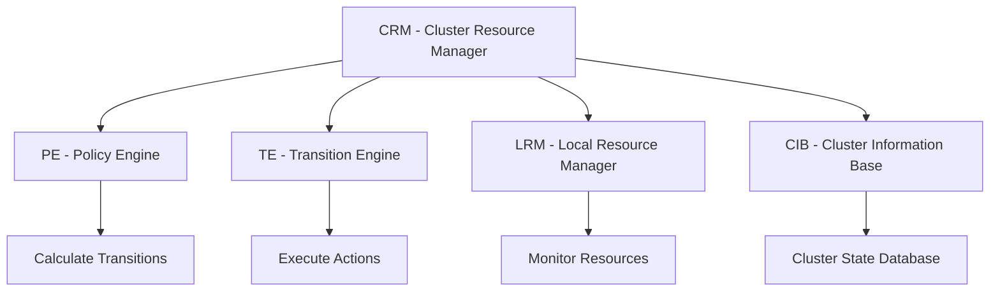

# Pacemaker Cluster Resource Manager

Advanced cluster resource manager coordinating configuration, start-up, monitoring, and recovery of interrelated services.

## Architecture



## Key Features

- Detection and recovery of host- and application-level failures
- Support for multiple redundancy configurations
- Configurable quorum loss strategies
- Ordering of service starts and stops
- Colocation and location constraints

## Quick Commands

```bash
# Cluster status
pcs status

# Resource management
pcs resource create vip ocf:heartbeat:IPaddr2 \
    ip=192.168.1.100 cidr_netmask=24
pcs resource start vip

# Constraints
pcs constraint order start vip then apache
pcs constraint colocation add apache with vip
```

## Nifty Behaviors

### Resource Stickiness
```xml
<meta_attributes>
    <nvpair name="resource-stickiness" value="100"/>
    <nvpair name="migration-threshold" value="3"/>
</meta_attributes>
```
**Nifty**: Resources prefer current location but move after failures

### Batch Constraint Updates
```bash
pcs constraint order start vip then apache
pcs constraint colocation add apache with vip
pcs constraint location web-group prefers node1=100
```
**Nifty**: Constraints applied as a set, atomic configuration

## Security

- Always enable STONITH
- Secure cluster communication
- Limit cluster daemon permissions

## Source Code

- Repository: https://github.com/ClusterLabs/pacemaker
- Documentation: https://www.clusterlabs.org/pacemaker/doc/
