# Corosync Cluster Engine

## Table of Contents
1. [Introduction and Architecture](#1-introduction-and-architecture)
2. [Core Components](#2-core-components)
3. [Communication Protocols](#3-communication-protocols)
4. [Deployment Recommendations](#4-deployment-recommendations)
5. [Code Behavior Analysis](#5-code-behavior-analysis)
6. [Source Code Reference](#6-source-code-reference)
7. [Synchronization Algorithms](#7-synchronization-algorithms)
8. [Configuration and Management](#8-configuration-and-management)
9. [Troubleshooting and Monitoring](#9-troubleshooting-and-monitoring)
10. [Advanced Topics](#10-advanced-topics)

---

## 1. Introduction and Architecture

### 1.1 Overview
Corosync is a Group Communication System (GCS) that provides the infrastructure for high availability clustering. It implements the Virtual Synchrony model, ensuring consistent message ordering and delivery across cluster nodes.

### 1.2 Architecture Overview

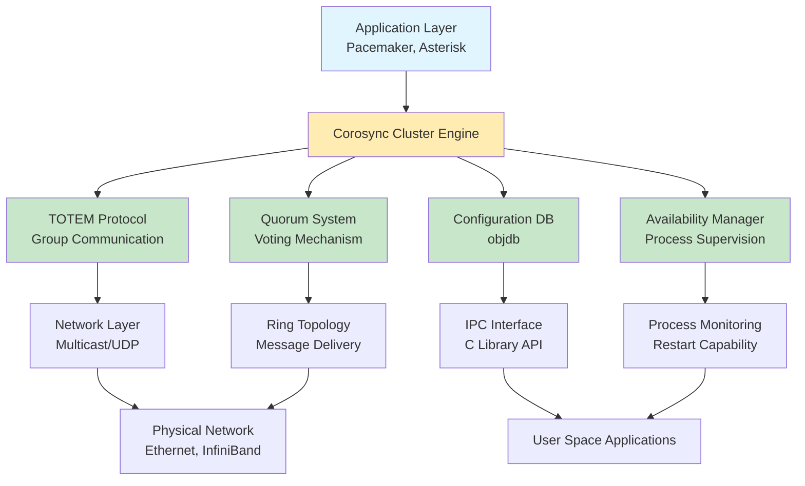

### 1.3 Virtual Synchrony Model

The Virtual Synchrony model provides the following guarantees:

- **Atomic Broadcast**: All messages delivered to all nodes in the same order
- **FIFO Channel**: Messages from the same sender are delivered in order
- **Causal Order**: Causally related messages are delivered in causal order
- **View Synchrony**: Process joins and leaves are handled consistently across all nodes

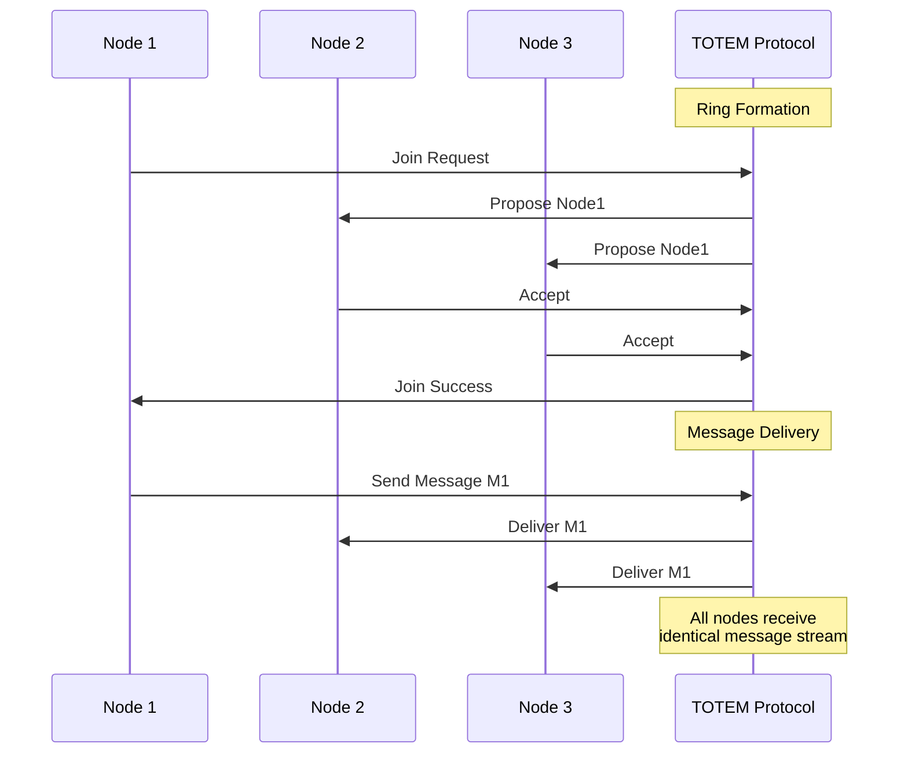

---

## 2. Core Components

### 2.1 TOTEM Protocol
The TOTEM protocol is a reliable group communication protocol that provides:

- **Total ordering** of messages
- **Membership management** (node joins/leaves)
- **Failure detection**
- **Ring topology** for message delivery

### 2.2 Quorum System
Corosync implements a voting quorum system:

- Calculates quorum based on configured node count
- Notifies applications when quorum is achieved or lost
- Prevents split-brain scenarios

### 2.3 Configuration Database (objdb)
- In-memory key-value store
- Configuration management
- Runtime statistics
- Change notification API

### 2.4 Availability Manager
- Process supervision and monitoring
- Automatic restart of failed processes
- Health checking mechanisms

---

## 3. Communication Protocols

### 3.1 Ring Topology

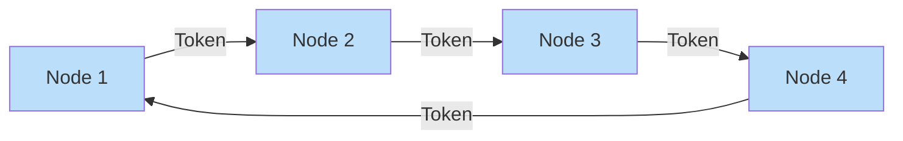

The TOTEM protocol uses a ring topology where a token circulates among nodes. The token holder has the exclusive right to send messages, ensuring total order.

### 3.2 Message Flow

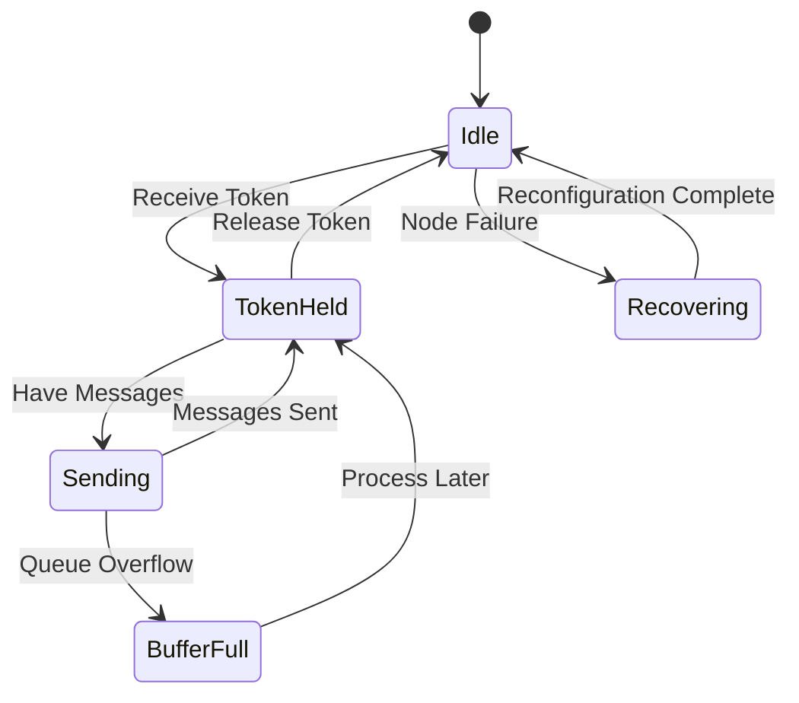

### 3.3 Transport Layer Options

| Transport | Description | Use Case |
|-----------|-------------|----------|
| Multicast UDP | Standard IP multicast | Small to medium clusters |
| Unicast UDP | Point-to-point communication | Networks without multicast support |
| InfiniBand (RDMA) | High-performance transport | Low-latency requirements |
| Kronosnet | Modern multi-link transport | Redundant network paths |

---

## 4. Deployment Recommendations

### 4.1 Hardware Requirements

#### Minimum System Requirements
- CPU: Dual-core 64-bit processor
- RAM: 2 GB minimum
- Network: 1 Gbps Ethernet
- Storage: 20 GB for system and logs

#### Recommended Production Configuration
- CPU: Quad-core or higher
- RAM: 4 GB or more
- Network: 10 Gbps Ethernet or faster
- Dedicated network interfaces for cluster traffic
- Redundant power supplies

### 4.2 Network Configuration

#### Network Topology Design

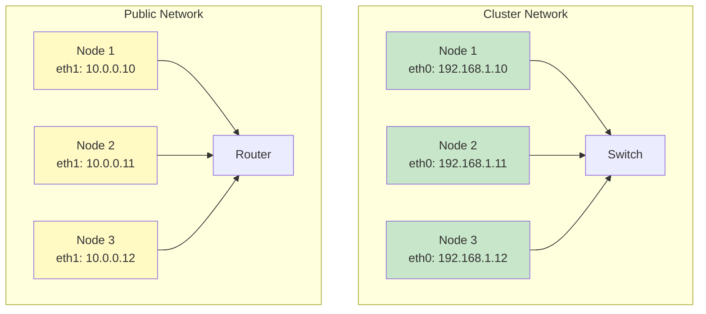

#### Best Practices
1. **Dedicated Network**: Use separate network for cluster traffic
2. **Redundancy**: Implement redundant network paths
3. **Latency**: Keep network latency below 10ms
4. **Jitter**: Minimize network jitter to below 2ms
5. **MTU**: Use consistent MTU across all nodes (typically 1500 or 9000)

### 4.3 Installation Process

#### Step-by-Step Installation

```bash
# 1. Install Corosync package
# Debian/Ubuntu
apt-get install corosync

# RHEL/CentOS
yum install corosync

# 2. Generate authentication key
corosync-keygen

# 3. Distribute key to all nodes
scp /etc/corosync/authkey node2:/etc/corosync/
scp /etc/corosync/authkey node3:/etc/corosync/

# 4. Configure corosync.conf
vim /etc/corosync/corosync.conf

# 5. Start Corosync service
systemctl enable corosync
systemctl start corosync

# 6. Verify cluster membership
corosync-cfgtool -s
corosync-quorumtool -s
```

### 4.4 Configuration Parameters

#### Essential Configuration Options

```conf
totem {
    version: 2
    cluster_name: mycluster
    transport: udpu
    interface {
        ringnumber: 0
        bindnetaddr: 192.168.1.0
        broadcast: yes
        mcastport: 5405
    }
    interface {
        ringnumber: 1
        bindnetaddr: 192.168.2.0
        broadcast: yes
        mcastport: 5405
    }
}

nodelist {
    node {
        ring0_addr: 192.168.1.10
        ring1_addr: 192.168.2.10
        nodeid: 1
    }
    node {
        ring0_addr: 192.168.1.11
        ring1_addr: 192.168.2.11
        nodeid: 2
    }
}

quorum {
    provider: corosync_votequorum
    expected_votes: 3
    two_node: 0
}

logging {
    to_logfile: yes
    logfile: /var/log/corosync/corosync.log
    to_syslog: yes
    debug: off
}
```

---

## 5. Code Behavior Analysis

### 5.1 Process Architecture

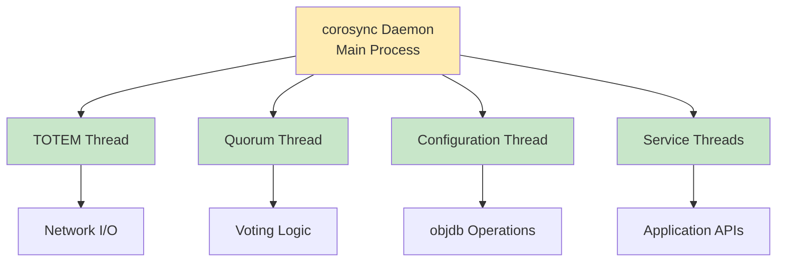

### 5.2 Synchronization Algorithm Events

The synchronization algorithm implements four event types:

#### 1. INIT Event
```c
// Initialize synchronization state
// Record temporary state variables
int sync_init(void *sync_handle, const struct sync_context *context);
```

#### 2. PROCESS Event
```c
// Execute synchronization
// Return completion status
// Can be interrupted and resumed
int sync_process(void *sync_handle, int *continue_processing);
```

#### 3. ABORT Event
```c
// Handle synchronization failure
// Clean up temporary state
int sync_abort(void *sync_handle);
```

#### 4. ACTIVATE Event
```c
// Commit synchronized state
// Make temporary state permanent
int sync_activate(void *sync_handle);
```

### 5.3 Message Processing Flow

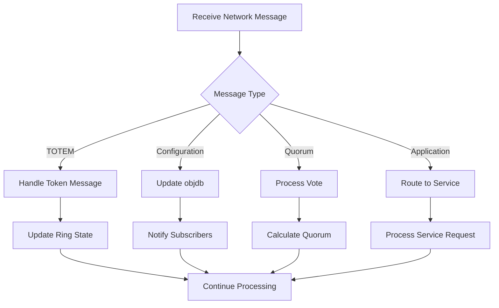

### 5.4 Checkpoint Synchronization Algorithm

#### Algorithm Overview

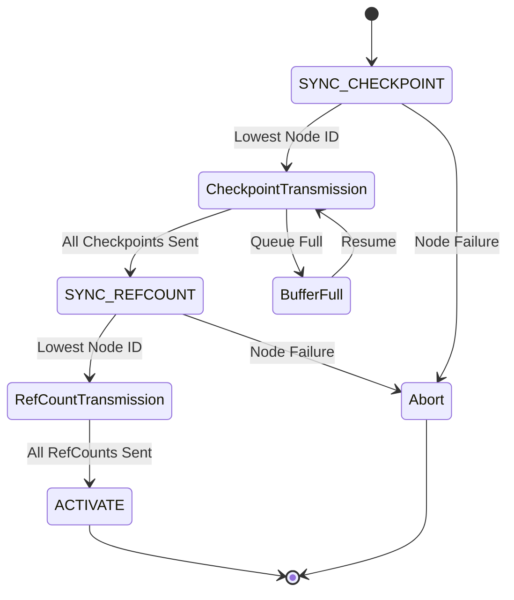

#### Pseudocode Implementation

```
function sync_checkpoints_enter():
    my_sync_state = SYNC_CHECKPOINT
    my_current_iteration_state = start of checkpoint list

function sync_refcounts_enter():
    my_sync_state = SYNC_REFCOUNT

function process_checkpoint_sync():
    if lowest_processor_id of old_ring in new_ring:
        transmit checkpoints starting from my_current_iteration_state
    
    if all checkpoints could be queued:
        call sync_refcounts_enter()
    else:
        record my_current_iteration_state
        require process to continue

function process_refcount_sync():
    if lowest_processor_id of old_ring in new_ring:
        transmit checkpoint reference counts
    
    if all checkpoint reference counts could be queued:
        require process to not continue
    else:
        record my_current_iteration_state
```

---

## 6. Source Code Reference

### 6.1 Repository Information

- **Repository**: https://github.com/corosync/corosync
- **Official Site**: https://corosync.github.io/corosync/
- **License**: BSD License
- **Primary Language**: C (89.2%), Rust (5.9%)

### 6.2 Directory Structure

```
corosync/
├── bindings/           # Language bindings
├── build-aux/         # Build system files
├── common_lib/        # Common library functions
├── conf/              # Configuration files
├── exec/              # Executive daemon components
├── include/           # Public headers
├── init/              # Initialization scripts
├── lib/               # Core libraries
├── man/               # Manual pages
├── pkgconfig/         # pkg-config files
├── test/              # Test suites
├── tools/             # Utility tools
└── vqsim/             # Virtual quorum simulator
```

### 6.3 Key Source Files

#### Core TOTEM Implementation
- `exec/totem.*` - TOTEM protocol implementation
- `exec/totemip.c` - IP address handling
- `exec/totemnet.c` - Network layer abstraction

#### Quorum System
- `exec/quorum.c` - Quorum calculation logic
- `exec/votequorum.c` - Voting quorum implementation

#### Configuration Database
- `exec/object_handler.c` - Object database operations
- `exec/config.c` - Configuration parsing

#### Synchronization
- `exec/sync.c` - Synchronization framework
- `exec/syncv2.c` - Synchronization version 2

### 6.4 Building from Source

```bash
# Clone repository
git clone https://github.com/corosync/corosync.git
cd corosync

# Generate build system
./autogen.sh

# Configure
./configure --prefix=/usr \
            --sysconfdir=/etc \
            --localstatedir=/var

# Build
make

# Install
make install

# Run tests
make check
```

---

## 7. Synchronization Algorithms

### 7.1 Virtual Synchrony Properties

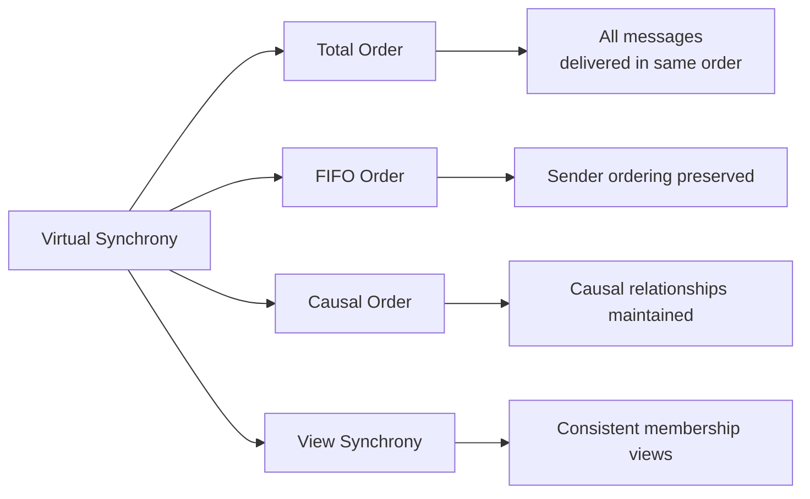

### 7.2 Ring Formation Algorithm

```
Ring Formation Algorithm:
1. Initiator sends JOIN message with proposed ring configuration
2. Each node receiving JOIN validates configuration
3. Nodes accept/reject based on current state
4. Once quorum accepts, ring is established
5. Token is assigned to highest node ID
```

### 7.3 Token-Based Ordering

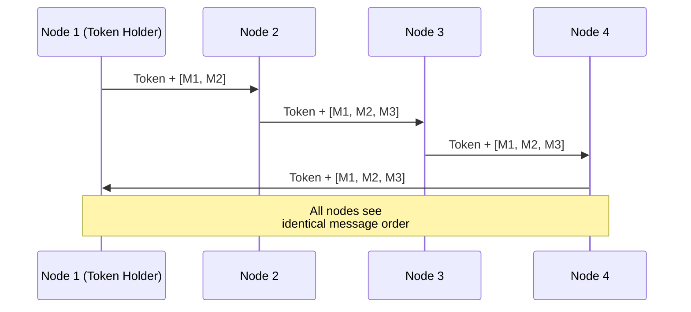

---

## 8. Configuration and Management

### 8.1 Configuration File Structure

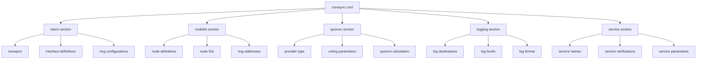

### 8.2 Common Configuration Scenarios

#### Two-Node Cluster
```conf
quorum {
    provider: corosync_votequorum
    expected_votes: 1
    two_node: 1
}
```

#### Three-Node Cluster
```conf
quorum {
    provider: corosync_votequorum
    expected_votes: 3
    two_node: 0
}
```

#### Multi-Ring Configuration
```conf
totem {
    version: 2
    rrp_mode: passive
    interface {
        ringnumber: 0
        bindnetaddr: 192.168.1.0
        mcastport: 5405
    }
    interface {
        ringnumber: 1
        bindnetaddr: 192.168.2.0
        mcastport: 5405
    }
}
```

### 8.3 Runtime Configuration

```bash
# Check cluster status
corosync-cfgtool -s

# View quorum status
corosync-quorumtool -s

# Reload configuration
corosync-cmapctl -b

# Query configuration database
corosync-cmapctl

# View loaded modules
corosync-cmapctl | grep service
```

---

## 9. Troubleshooting and Monitoring

### 9.1 Common Issues and Solutions

#### Issue 1: Split-Brain Scenario
```
Symptoms: Multiple nodes act independently
Causes: Network partition, quorum loss
Solutions:
- Configure proper quorum settings
- Implement STONITH (Shoot The Other Node In The Head)
- Use redundant network connections
```

#### Issue 2: High Network Latency
```
Symptoms: Slow cluster operations, timeouts
Causes: Network congestion, improper MTU
Solutions:
- Optimize network configuration
- Adjust token timeout values
- Use dedicated cluster network
```

#### Issue 3: Authentication Failures
```
Symptoms: Nodes cannot join cluster
Causes: Mismatched authkey, permission issues
Solutions:
- Regenerate and distribute authkey
- Check file permissions (600)
- Verify key locations
```

### 9.2 Monitoring Commands

```bash
# Real-time cluster status
watch -n 1 'corosync-cfgtool -s'

# Monitor log file
tail -f /var/log/corosync/corosync.log

# Check quorum status
corosync-quorumtool -s

# View membership
corosync-cmapctl -t nodelist

# Monitor token behavior
corosync-cmapctl | grep totem
```

### 9.3 Performance Tuning

#### Token Timeout Configuration
```conf
totem {
    token: 10000           # Token timeout in ms
    token_retransmit: 500  # Token retransmit interval
    hold: 180              # Hold timeout
    join: 60               # Join timeout
}
```

#### Network Buffer Sizes
```conf
totem {
    netmtu: 1500           # Network MTU
    window_size: 50        # Send window size
    max_messages: 17       # Max pending messages
}
```

---

## 10. Advanced Topics

### 10.1 Integration with Pacemaker

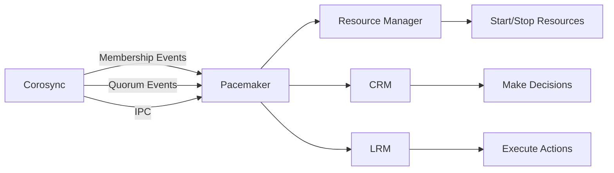

### 10.2 Kronosnet Integration

Kronosnet is a modern multi-link transport layer for Corosync:

#### Advantages
- Redundant network paths
- Automatic failover
- Link aggregation
- Better performance

#### Configuration
```conf
totem {
    version: 2
    transport: knet
    interface {
        ringnumber: 0
        bindnetaddr: 192.168.1.10
    }
    interface {
        ringnumber: 1
        bindnetaddr: 192.168.2.10
    }
}

knet {
    transport: udp
    link_mode: active
    compress_level: 1
}
```

### 10.3 Custom Resource Agents

Corosync can be extended with custom resource agents:

```c
#include <corosync/corodefs.h>

int resource_start(const char *resource_id) {
    // Start resource implementation
    return 0;
}

int resource_stop(const char *resource_id) {
    // Stop resource implementation
    return 0;
}

int resource_monitor(const char *resource_id) {
    // Monitor resource health
    return 0;
}
```

### 10.4 Security Considerations

#### Network Security
- Use encrypted communication where possible
- Implement network segmentation
- Use dedicated VLANs for cluster traffic

#### Access Control
- Secure authkey file (permissions 600)
- Limit IPC access to authorized users
- Implement SELinux/AppArmor profiles

#### Key Management
```bash
# Generate new key
corosync-keygen -l

# Key rotation procedure
1. Stop Corosync on all nodes
2. Generate new key on one node
3. Distribute key to all nodes
4. Start Corosync on all nodes
```

---

## Appendices

### Appendix A: Command Reference

| Command | Description |
|---------|-------------|
| `corosync-cfgtool` | Cluster configuration tool |
| `corosync-quorumtool` | Quorum status tool |
| `corosync-cmapctl` | Configuration map control |
| `corosync-keygen` | Generate authentication key |
| `corosync-notifyd` | Corosync notification daemon |

### Appendix B: Configuration Parameters Reference

#### TOTEM Parameters
- `version`: TOTEM protocol version
- `cluster_name`: Cluster identifier
- `transport`: Transport type (udp, udpu, knet)
- `token`: Token timeout in milliseconds
- `token_retransmit`: Token retransmit interval
- `hold`: Hold timeout
- `join`: Join timeout

#### Quorum Parameters
- `provider`: Quorum provider type
- `expected_votes`: Expected number of votes
- `two_node`: Enable two-node mode
- `wait_for_all`: Wait for all nodes

### Appendix C: Performance Metrics

Key performance indicators to monitor:

- Token circulation time
- Message delivery latency
- Network throughput
- CPU utilization
- Memory usage
- Disk I/O (for logging)

### Appendix D: Recommended Reading

1. Corosync Source Code Documentation
2. TOTEM Protocol Specification
3. Virtual Synchrony Research Papers
4. Pacemaker Integration Guide
5. Linux HA Clustering Best Practices

---

## Further Resources

- **Official Documentation**: https://corosync.github.io/corosync/
- **Source Code**: https://github.com/corosync/corosync
- **Mailing List**: corosync@oss.redhat.com
- **Issue Tracker**: https://github.com/corosync/corosync/issues
- **Community Wiki**: https://github.com/corosync/corosync/wiki
