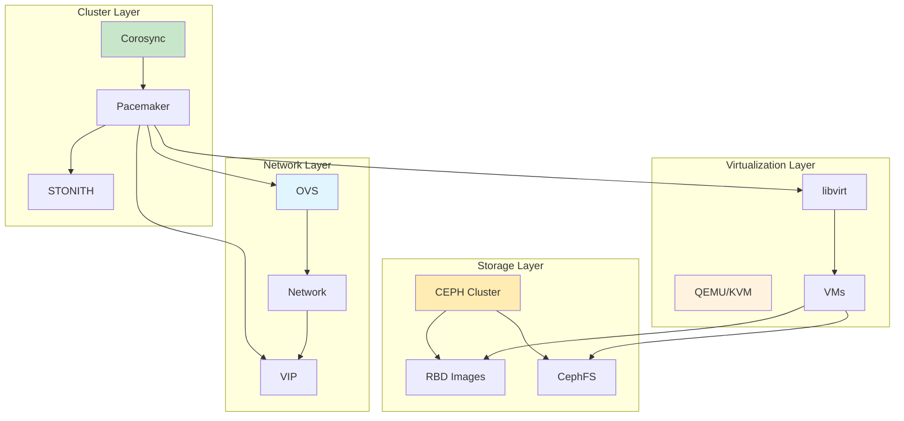

# Deployment Workflows

Comprehensive production deployment guides for Linux HA clusters, virtualization, and storage infrastructure.

## HA Cluster Deployment

### Prerequisites

**Hardware Requirements**:
- Minimum 3 nodes for production
- 2x CPU cores per node minimum
- 4GB RAM per node minimum
- 2x network interfaces per node (public/cluster)
- Dedicated storage for cluster data

**Network Requirements**:
- Public network: 192.168.1.0/24
- Cluster network: 10.0.1.0/24
- DNS resolution configured
- NTP synchronized
- Firewall rules configured

### 1. Base System Setup

```bash
# Update system
apt-get update && apt-get upgrade -y

# Install required packages
apt-get install -y corosync pacemaker pcs \
    openvswitch-switch ceph-common

# Configure timezone
timedatectl set-timezone UTC

# Configure NTP
apt-get install -y chrony
systemctl enable chrony
systemctl start chrony

# Configure hostname
hostnamectl set-hostname node1
echo "192.168.1.10 node1" >> /etc/hosts
echo "192.168.1.11 node2" >> /etc/hosts
echo "192.168.1.12 node3" >> /etc/hosts
```

### 2. Corosync Configuration

```bash
# Generate authentication key
corosync-keygen

# Configure Corosync
cat > /etc/corosync/corosync.conf <<EOF
totem {
    version: 2
    cluster_name: ha-cluster
    transport: knet
    
    interface {
        ringnumber: 0
        bindnetaddr: 192.168.1.0
        mcastport: 5405
    }
    
    interface {
        ringnumber: 1
        bindnetaddr: 10.0.1.0
        mcastport: 5406
    }
    
    token: 5000
    token_retransmit: 250
    hold: 180
}

nodelist {
    node {
        ring0_addr: 192.168.1.10
        ring1_addr: 10.0.1.10
        nodeid: 1
        name: node1
    }
    node {
        ring0_addr: 192.168.1.11
        ring1_addr: 10.0.1.11
        nodeid: 2
        name: node2
    }
    node {
        ring0_addr: 192.168.1.12
        ring1_addr: 10.0.1.12
        nodeid: 3
        name: node3
    }
}

quorum {
    provider: corosync_votequorum
    expected_votes: 3
    auto_tie_breaker: 1
    last_man_standing: 1
}

logging {
    to_logfile: yes
    logfile: /var/log/corosync/corosync.log
    to_syslog: yes
    debug: off
}
EOF

# Distribute configuration and key
scp /etc/corosync/corosync.conf node2:/etc/corosync/
scp /etc/corosync/corosync.conf node3:/etc/corosync/
scp /etc/corosync/authkey node2:/etc/corosync/
scp /etc/corosync/authkey node3:/etc/corosync/
```

### 3. Start Corosync

```bash
# Enable and start Corosync on all nodes
systemctl enable corosync
systemctl start corosync

# Verify cluster membership
corosync-cfgtool -s

# Verify quorum
corosync-quorumtool -s
```

### 4. Pacemaker Configuration

```bash
# Start Pacemaker
systemctl enable pacemaker
systemctl start pacemaker

# Start pcsd
systemctl enable pcsd
systemctl start pcsd

# Set hacluster password
echo "hacluster:ClusterPass123!" | chpasswd

# Configure cluster
pcs cluster setup --name ha-cluster node1 node2 node3
pcs cluster start --all
pcs cluster enable --all

# Verify cluster
pcs status
```

### 5. STONITH Configuration

```bash
# Create IPMI fencing device
pcs stonith create fence-ipmi-node1 \
    fence_ipmilan \
    ipaddr=192.168.1.201 \
    login=admin \
    passwd=AdminPass123

pcs stonith create fence-ipmi-node2 \
    fence_ipmilan \
    ipaddr=192.168.1.202 \
    login=admin \
    passwd=AdminPass123

pcs stonith create fence-ipmi-node3 \
    fence_ipmilan \
    ipaddr=192.168.1.203 \
    login=admin \
    passwd=AdminPass123

# Enable STONITH
pcs property set stonith-enabled=true

# Set STONITH timeout
pcs property set stonith-timeout=60s

# Verify STONITH
pcs stonith show
```

### 6. Resource Configuration

```bash
# Create OVS bridge resource
pcs resource create ovs-bridge \
    ocf:heartbeat:ovs-bridge \
    bridge_name=br0

# Create VIP resource
pcs resource create vip \
    ocf:heartbeat:IPaddr2 \
    ip=192.168.1.100 \
    cidr_netmask=24

# Create Apache resource
pcs resource create apache \
    ocf:heartbeat:apache \
    configfile=/etc/apache2/apache2.conf

# Add constraints
pcs constraint order start ovs-bridge then vip
pcs constraint order start vip then apache

pcs constraint colocation add vip with ovs-bridge
pcs constraint colocation add apache with vip

# Start resources
pcs resource start ovs-bridge
```

## Virtualization Deployment

### Prerequisites

**Hardware Requirements**:
- Intel VT-x or AMD-V CPU
- 8GB RAM minimum
- 100GB storage minimum
- 2x network interfaces

**Software Requirements**:
- Linux kernel 4.15+
- KVM support
- libvirt installed

### 1. KVM/QEMU Installation

```bash
# Install virtualization packages
apt-get install -y qemu-kvm libvirt-daemon-system \
    libvirt-clients virt-manager openvswitch-switch

# Verify KVM support
lscpu | grep -i virtualization

# Start libvirt
systemctl enable libvirtd
systemctl start libvirtd

# Start OVS
systemctl enable openvswitch-switch
systemctl start openvswitch-switch
```

### 2. Network Configuration

```bash
# Create OVS bridge
ovs-vsctl add-br br0

# Add physical interface to bridge
ovs-vsctl add-port br0 eth0

# Configure IP on bridge
ip addr add 192.168.1.10/24 dev br0
ip link set br0 up

# Create virtual network
virsh net-define <(cat <<EOF
<network>
  <name>default</name>
  <forward mode='nat'/>
  <bridge name='virbr0' stp='on' delay='0'/>
  <ip address='192.168.122.1' netmask='255.255.255.0'>
    <dhcp>
      <range start='192.168.122.2' end='192.168.122.254'/>
    </dhcp>
  </ip>
</network>
EOF
)

# Start network
virsh net-start default
virsh net-autostart default
```

### 3. VM Deployment

```bash
# Create VM storage pool
virsh pool-define <(cat <<EOF
<pool type='dir'>
  <name>vm-images</name>
  <target>
    <path>/var/lib/libvirt/images</path>
  </target>
</pool>
EOF
)

# Build and start pool
virsh pool-build vm-images
virsh pool-start vm-images
virsh pool-autostart vm-images

# Create VM disk
qemu-img create -f qcow2 /var/lib/libvirt/images/vm1.qcow2 20G

# Define VM
virt-install --name vm1 \
    --memory 2048 \
    --vcpus 2 \
    --disk path=/var/lib/libvirt/images/vm1.qcow2,format=qcow2 \
    --network network=default \
    --graphics vnc \
    --os-variant ubuntu20.04 \
    --cdrom /path/to/ubuntu.iso

# Start VM
virsh start vm1
```

## CEPH HCI Deployment

### Prerequisites

**Hardware Requirements**:
- Minimum 3 OSD nodes
- Dedicated storage drives per OSD
- 1GB RAM per OSD
- Network: 10Gbps recommended

**Network Requirements**:
- Public network: 192.168.1.0/24
- Cluster network: 10.0.1.0/24
- DNS resolution configured

### 1. CEPH Installation

```bash
# Install cephadm
curl --silent --remote-name --location \
    https://download.ceph.com/rpm-18.2.1/el9/noarch/cephadm \
    -o cephadm
chmod +x cephadm
mv cephadm /usr/local/bin/

# Install podman or docker
apt-get install -y podman

# Bootstrap cluster
cephadm bootstrap --mon-ip 192.168.1.10

# Copy SSH keys
ssh-copy-id -f -i /etc/ceph/ceph.pub root@192.168.1.11
ssh-copy-id -f -i /etc/ceph/ceph.pub root@192.168.1.12

# Add hosts to cluster
ceph orch host add node1 192.168.1.10
ceph orch host add node2 192.168.1.11
ceph orch host add node3 192.168.1.12
```

### 2. OSD Configuration

```bash
# Create OSD specification
cat > osd.yml <<EOF
service_type: osd
service_id: osd
placement:
  hosts:
    - node1
    - node2
    - node3
spec:
  data_devices:
    all: true
EOF

# Apply OSD specification
ceph orch apply -i osd.yml

# Monitor OSD status
ceph osd status
ceph -s
```

### 3. Pool Creation

```bash
# Create RBD pool
ceph osd pool create rbd 64 64
ceph osd pool application enable rbd rbd

# Create RBD image
rbd create rbd/vm1 --size 50G --image-format 2

# Create CephFS
ceph osd pool create cephfs_metadata 64 64
ceph osd pool create cephfs_data 128 128
ceph fs new myfs cephfs_metadata cephfs_data
```

## Full Stack Deployment

### Architecture



### Deployment Steps

#### Phase 1: Infrastructure

```bash
# 1. Configure network
# Public network
ip addr add 192.168.1.10/24 dev eth0
ip link set eth0 up

# Cluster network
ip addr add 10.0.1.10/24 dev eth1
ip link set eth1 up

# 2. Configure DNS
echo "nameserver 192.168.1.1" > /etc/resolv.conf

# 3. Configure NTP
systemctl enable chrony
systemctl start chrony

# 4. Configure firewall
firewall-cmd --permanent --add-port=6789/tcp
firewall-cmd --permanent --add-port=6800-7300/tcp
firewall-cmd --permanent --add-port=5405-5406/udp
firewall-cmd --reload
```

#### Phase 2: CEPH Setup

```bash
# Bootstrap Ceph
cephadm bootstrap --mon-ip 192.168.1.10

# Add OSDs
ceph orch host add node1 192.168.1.10
ceph orch host add node2 192.168.1.11
ceph orch host add node3 192.168.1.12

ceph orch apply osd --all-available-devices

# Create pools
ceph osd pool create rbd 64 64
ceph osd pool application enable rbd rbd

rbd create rbd/vm1 --size 50G
```

#### Phase 3: Cluster Setup

```bash
# Generate Corosync key
corosync-keygen

# Configure Corosync
cat > /etc/corosync/corosync.conf <<EOF
totem {
    version: 2
    cluster_name: fullstack
    transport: knet
    
    interface {
        ringnumber: 0
        bindnetaddr: 192.168.1.0
        mcastport: 5405
    }
}

nodelist {
    node {
        ring0_addr: 192.168.1.10
        nodeid: 1
        name: node1
    }
    node {
        ring0_addr: 192.168.1.11
        nodeid: 2
        name: node2
    }
    node {
        ring0_addr: 192.168.1.12
        nodeid: 3
        name: node3
    }
}

quorum {
    provider: corosync_votequorum
    expected_votes: 3
}

logging {
    to_logfile: yes
    logfile: /var/log/corosync/corosync.log
}
EOF

# Start cluster
systemctl enable corosync pacemaker pcsd
systemctl start corosync pacemaker pcsd

# Configure Pacemaker
pcs cluster setup --name fullstack node1 node2 node3
pcs cluster start --all
```

#### Phase 4: Virtualization Setup

```bash
# Install virtualization
apt-get install -y qemu-kvm libvirt-daemon-system \
    libvirt-clients openvswitch-switch

# Start services
systemctl enable libvirtd
systemctl start libvirtd

# Configure OVS
ovs-vsctl add-br br0
ovs-vsctl add-port br0 eth0

# Create VM from RBD
rbd create rbd/vm1 --size 50G

virt-install --name vm1 \
    --memory 4096 \
    --vcpus 2 \
    --disk path=rbd:rbd/vm1,format=raw \
    --network bridge=br0 \
    --graphics vnc
```

#### Phase 5: Resource Configuration

```bash
# Create OVS resources
pcs resource create ovs-bridge ocf:heartbeat:ovs-bridge bridge_name=br0

# Create VIP resource
pcs resource create vip ocf:heartbeat:IPaddr2 ip=192.168.1.100 cidr_netmask=24

# Create VM resource
pcs resource create vm1 systemd:libvirtd

# Add constraints
pcs constraint order start ovs-bridge then vip
pcs constraint order start vip then vm1

pcs constraint colocation add vip with ovs-bridge
pcs constraint colocation add vm1 with vip

# Start resources
pcs resource start ovs-bridge
```

## Verification and Testing

### Cluster Verification

```bash
# Check Corosync
corosync-cfgtool -s
corosync-quorumtool -s

# Check Pacemaker
pcs status

# Check OVS
ovs-vsctl show

# Check Ceph
ceph -s
ceph osd status
```

### Failover Testing

```bash
# Test resource failover
pcs resource move vm1 node2

# Verify failover
pcs status

# Test node failover
systemctl stop pacemaker

# Check cluster status
pcs status
```

### Performance Testing

```bash
# Test I/O performance
fio --name=randread --ioengine=libaio \
    --iodepth=16 --rw=randread --bs=4k \
    --direct=1 --size=1G --numjobs=4 \
    --filename=/mnt/cephfs/test

# Test network performance
iperf3 -c 192.168.1.100 -t 60

# Test VM performance
virt-top
```

## Production Checklist

### Pre-Deployment

- [ ] Hardware meets minimum requirements
- [ ] Network configured and tested
- [ ] DNS resolution working
- [ ] NTP synchronized
- [ ] Firewall rules configured
- [ ] Storage devices identified
- [ ] Backup strategy planned
- [ ] Monitoring system ready

### Deployment

- [ ] All nodes have consistent configuration
- [ ] Corosync quorum established
- [ ] Pacemaker cluster operational
- [ ] STONITH devices configured
- [ ] CEPH cluster healthy
- [ ] Virtualization configured
- [ ] Resources defined and started
- [ ] Constraints configured

### Post-Deployment

- [ ] Cluster status verified
- [ ] Failover tested
- [ ] Performance tested
- [ ] Monitoring configured
- [ ] Alerting configured
- [ ] Documentation updated
- [ ] Backup procedures tested
- [ ] Team trained

## Troubleshooting

### Cluster Issues

```bash
# Check Corosync logs
journalctl -u corosync -f

# Check Pacemaker logs
journalctl -u pacemaker -f

# Check cluster status
pcs status
crm_mon

# Check quorum
corosync-quorumtool -s
```

### Storage Issues

```bash
# Check Ceph status
ceph -s

# Check OSD status
ceph osd status

# Check pool status
ceph osd lspools

# Check logs
ceph -w
```

### Network Issues

```bash
# Check OVS
ovs-vsctl show

# Check network
ip addr show
ip route show

# Check connectivity
ping node1
ping node2
ping node3
```

## Best Practices

1. **Plan thoroughly** before deployment
2. **Test in staging** first
3. **Document everything**
4. **Monitor continuously**
5. **Test failover regularly**
6. **Keep backups current**
7. **Review logs frequently**
8. **Update regularly**
9. **Train team members**
10. **Have recovery plan ready**