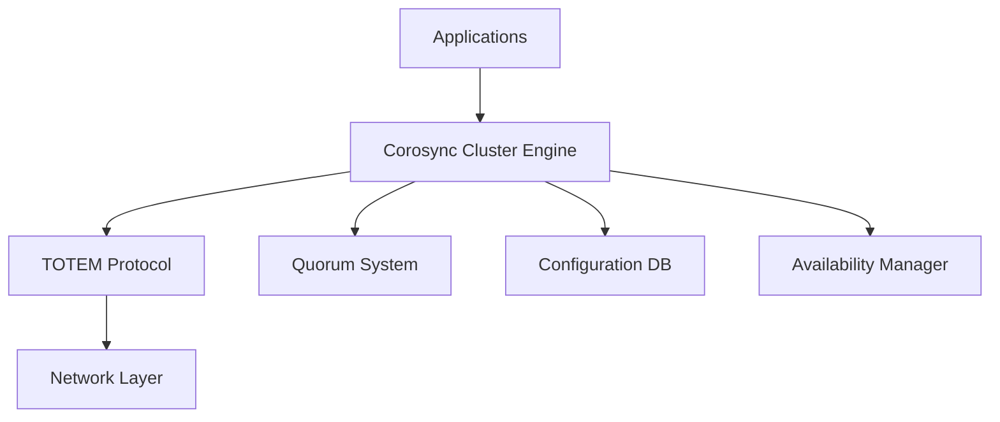
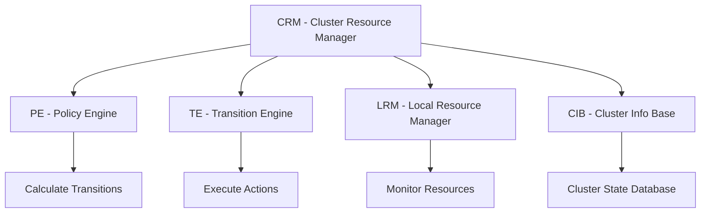

# Cluster Technologies

Complete reference guide for Corosync and Pacemaker cluster management technologies.

## Corosync

Corosync is a Group Communication System providing virtual synchrony guarantees and quorum management for Linux HA clusters.

### Architecture Overview



### Key Features

- **Virtual Synchrony**: Consistent message ordering across all nodes
- **TOTEM Protocol**: Reliable group communication
- **Quorum Management**: Split-brain prevention
- **Configuration Database**: In-memory key-value store
- **Ring Topology**: Efficient message delivery

### Quick Commands

```bash
# Installation
apt-get install corosync

# Generate authentication key
corosync-keygen

# Status
corosync-cfgtool -s
corosync-quorumtool -s

# Configuration
corosync-cmapctl
```

### Deployment

```bash
# 1. Install and configure
apt-get install corosync
corosync-keygen
vim /etc/corosync/corosync.conf

# 2. Start on all nodes
systemctl enable corosync
systemctl start corosync

# 3. Verify cluster
corosync-cfgtool -s
```

### Source Code

- **Repository**: [corosync/corosync](https://github.com/corosync/corosync)
- **Documentation**: [corosync.github.io](https://corosync.github.io/corosync/)

### Common Issues

| Issue | Solution |
|-------|----------|
| Token timeout errors | Increase `token: 10000` in corosync.conf |
| Quorum loss | Check network connectivity and node count |
| Authentication failures | Verify authkey permissions (600) |

---

## Pacemaker

Pacemaker is an advanced cluster resource manager for Linux high availability.

### Architecture Overview



### Key Features

- **Resource Classes**: OCF, LSB, systemd, Upstart
- **Constraints**: Ordering, colocation, location
- **STONITH**: Fencing integration
- **Cloning**: Resource and node templates
- **Batches**: Group operations

### Quick Commands

```bash
# Cluster status
pcs status

# Resource management
pcs resource create vip ocf:heartbeat:IPaddr2 ip=192.168.1.100
pcs resource start vip

# Constraints
pcs constraint order start vip then apache
pcs constraint colocation add apache with vip

# STONITH
pcs stonith create fence-device fence_ipmilan
```

### Deployment

```bash
# 1. Install components
apt-get install pacemaker pcs

# 2. Configure cluster
pcs cluster setup --name mycluster node1 node2 node3

# 3. Start cluster
pcs cluster start --all

# 4. Enable STONITH
pcs property set stonith-enabled=true
```

### Source Code

- **Repository**: [ClusterLabs/pacemaker](https://github.com/ClusterLabs/pacemaker)
- **Documentation**: [clusterlabs.org/pacemaker/doc/](https://www.clusterlabs.org/pacemaker/doc/)

### Common Issues

| Issue | Solution |
|-------|----------|
| Resource stuck starting | Check agent with `pcs resource debug-resource` |
| Constraint violations | Verify constraints with `pcs constraint show --full` |
| STONITH failures | Configure fencing devices properly |
| Quorum issues | Check network and node connectivity |

---

## Deployment Workflow

Complete Corosync and Pacemaker HA cluster setup.

### 1. Initial Setup

```bash
# Install all packages
apt-get install corosync pacemaker pcs

# Generate Corosync key
corosync-keygen

# Distribute key
scp /etc/corosync/authkey node2:/etc/corosync/
scp /etc/corosync/authkey node3:/etc/corosync/

# Configure Corosync
# Edit /etc/corosync/corosync.conf on first node

# Copy configuration to all nodes
scp /etc/corosync/corosync.conf node2:/etc/corosync/
scp /etc/corosync/corosync.conf node3:/etc/corosync/

# Start services
systemctl enable corosync pacemaker pcsd
systemctl start corosync pacemaker pcsd
```

### 2. Verify Cluster

```bash
# Check Corosync
corosync-cfgtool -s
corosync-quorumtool -s

# Check Pacemaker
pcs status
```

### 3. Configure STONITH

```bash
# Create fencing device
pcs stonith create fence-device fence_ipmilan \
    ipaddr=192.168.1.200 login=admin passwd=password

# Verify fencing
pcs stonith list
```

### 4. Add Resources

```bash
# Create VIP resource
pcs resource create vip ocf:heartbeat:IPaddr2 \
    ip=192.168.1.100 cidr_netmask=24

# Create Apache resource
pcs resource create apache ocf:heartbeat:apache \
    configfile=/etc/apache2/apache2.conf

# Add ordering constraint
pcs constraint order start vip then apache

# Add colocation constraint
pcs constraint colocation add apache with vip

# Start resources
pcs resource start vip
```

### 5. Testing

```bash
# Test resource failover
pcs resource move apache node2

# Verify cluster health
pcs status
crm_mon
```

---

## Source Code References

| Component | Repository | Documentation |
|-----------|-----------|-------------|
| Corosync | [corosync/corosync](https://github.com/corosync/corosync) | [corosync.github.io](https://corosync.github.io/corosync/) |
| Pacemaker | [ClusterLabs/pacemaker](https://github.com/ClusterLabs/pacemaker) | [clusterlabs.org/pacemaker/doc/](https://www.clusterlabs.org/pacemaker/doc/) |

---

## Nifty Behaviors

### Corosync Optimizations

- **Kronosnet**: Multi-link transport with automatic failover
- **Token tuning**: `token: 5000` for faster failure detection
- **Network buffers**: `window_size: 50` for better throughput

### Pacemaker Tips

- **Resource stickiness**: Keep resources on current node
- **Batch operations**: Apply multiple constraints together
- **Symmetric monitoring**: Enable `pacemaker` alerts

---

## Security Considerations

### Corosync
- Protect authentication key: `chmod 600 /etc/corosync/authkey`
- Use encrypted transport (knet)
- Isolate cluster network

### Pacemaker
- Always enable STONITH for production
- Limit cluster daemon permissions
- Secure cluster communication

---

## Troubleshooting

For in-depth troubleshooting focused on code behavior and diagnostics, see [Deployment](../deployment.md) section.
