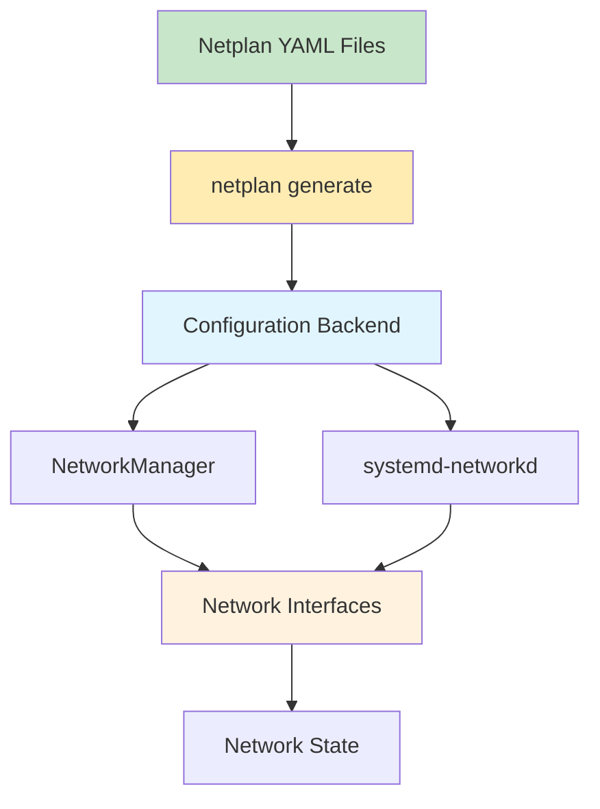

# Netplan

Network configuration abstraction layer for modern Linux distributions, replacing traditional networking tools.

## Overview

Netplan reads YAML configuration files and generates configuration for network renderers (NetworkManager or systemd-networkd).



## Configuration Files

### File Locations

| Location | Purpose |
|----------|---------|
| `/etc/netplan/*.yaml` | Main configuration files |
| `/run/netplan/*.yaml` | Runtime configuration |
| `/lib/netplan/*.yaml` | Fallback configuration |

### File Priority

Files are processed in alphanumeric order:
1. `/run/netplan/*.yaml` (highest priority)
2. `/etc/netplan/*.yaml`
3. `/lib/netplan/*.yaml` (lowest priority)

## YAML Structure

### Basic Syntax

```yaml
network:
  version: 2
  renderer: NetworkManager
  ethernets:
    eth0:
      dhcp4: true
```

### Version 2 Schema

```yaml
network:
  version: 2                    # Required: schema version
  renderer: NetworkManager       # Optional: NetworkManager or networkd
  renderer: systemd-networkd    # Optional: NetworkManager or networkd
  
  ethernets:                    # Ethernet interfaces
  wifis:                        # Wireless interfaces
  bridges:                      # Bridge interfaces
  bonds:                        # Bond interfaces
  vlans:                        # VLAN interfaces
  tunnels:                      # Tunnel interfaces
  vrf:                          # VRF interfaces
```

## Ethernet Configuration

### Static IP Configuration

```yaml
network:
  version: 2
  renderer: NetworkManager
  ethernets:
    eth0:
      dhcp4: false
      dhcp6: false
      addresses:
        - 192.168.1.10/24
        - 192.168.2.10/24
      gateway4: 192.168.1.1
      gateway6: fe80::1
      nameservers:
        addresses:
          - 8.8.8.8
          - 8.8.4.4
        search:
          - example.com
          - localdomain
      routes:
        - to: 10.0.0.0/8
          via: 192.168.1.1
          metric: 100
        - to: 172.16.0.0/12
          via: 192.168.2.1
          metric: 200
```

### DHCP Configuration

```yaml
network:
  version: 2
  renderer: NetworkManager
  ethernets:
    eth0:
      dhcp4: true
      dhcp4-overrides:
        use-dns: true
        use-hostname: false
        use-mtu: true
        send-hostname: true
        hostname: myhost
      dhcp6: true
      dhcp6-overrides:
        use-dns: true
        use-hostname: false
```

### Link Local Addresses

```yaml
network:
  version: 2
  renderer: NetworkManager
  ethernets:
    eth0:
      dhcp4: false
      dhcp6: false
      link-local:
        - ipv4
        - ipv6
```

### MTU Configuration

```yaml
network:
  version: 2
  renderer: NetworkManager
  ethernets:
    eth0:
      dhcp4: true
      mtu: 9000
```

### MAC Address Spoofing

```yaml
network:
  version: 2
  renderer: NetworkManager
  ethernets:
    eth0:
      dhcp4: true
      macaddress: 00:11:22:33:44:55
```

## Bridge Configuration

### Basic Bridge

```yaml
network:
  version: 2
  renderer: NetworkManager
  bridges:
    br0:
      dhcp4: true
      interfaces:
        - eth0
        - eth1
```

### Bridge with Static IP

```yaml
network:
  version: 2
  renderer: NetworkManager
  bridges:
    br0:
      dhcp4: false
      addresses:
        - 192.168.1.100/24
      gateway4: 192.168.1.1
      nameservers:
        addresses:
          - 8.8.8.8
      interfaces:
        - eth0
        - eth1
      parameters:
        stp: true
        priority: 32768
        forward-delay: 4
        hello-time: 2
        max-age: 20
        ageing-time: 300
```

### Bridge Parameters

| Parameter | Description | Default |
|-----------|-------------|---------|
| stp | Spanning Tree Protocol | false |
| priority | Bridge priority | 32768 |
| forward-delay | Forward delay in seconds | 4 |
| hello-time | Hello time in seconds | 2 |
| max-age | Max age in seconds | 20 |
| ageing-time | Ageing time in seconds | 300 |

## Bond Configuration

### Active-Backup Bond

```yaml
network:
  version: 2
  renderer: NetworkManager
  bonds:
    bond0:
      dhcp4: true
      interfaces:
        - eth0
        - eth1
      parameters:
        mode: active-backup
        mii-monitor-interval: 100
        up-delay: 200
        down-delay: 200
```

### LACP Bond

```yaml
network:
  version: 2
  renderer: NetworkManager
  bonds:
    bond0:
      dhcp4: true
      interfaces:
        - eth0
        - eth1
      parameters:
        mode: 802.3ad
        lacp-rate: fast
        mii-monitor-interval: 100
        xmit-hash-policy: layer3+4
```

### Bond Modes

| Mode | Description | Requires Switch |
|------|-------------|------------------|
| balance-rr | Round-robin load balancing | No |
| active-backup | Active/backup failover | No |
| balance-xor | XOR load balancing | Yes |
| broadcast | Broadcast to all slaves | No |
| 802.3ad | LACP aggregation | Yes |
| balance-tlb | Adaptive transmit load balancing | No |
| balance-alb | Adaptive load balancing | No |

### Bond Parameters

| Parameter | Description | Default |
|-----------|-------------|---------|
| mode | Bond mode | active-backup |
| lacp-rate | LACP rate (slow/fast) | slow |
| mii-monitor-interval | MII monitoring interval (ms) | 100 |
| up-delay | Up delay (ms) | 0 |
| down-delay | Down delay (ms) | 0 |
| xmit-hash-policy | Hash policy | layer2 |
| arp-interval | ARP interval (ms) | 0 |
| arp-ip-targets | ARP target IPs | - |
| primary | Primary slave | - |
| miimon | MII monitoring interval (ms) | 100 |

## VLAN Configuration

### Basic VLAN

```yaml
network:
  version: 2
  renderer: NetworkManager
  ethernets:
    eth0:
      dhcp4: false
  vlans:
    eth0.10:
      id: 10
      link: eth0
      dhcp4: true
    eth0.20:
      id: 20
      link: eth0
      dhcp4: true
```

### VLAN with Static IP

```yaml
network:
  version: 2
  renderer: NetworkManager
  ethernets:
    eth0:
      dhcp4: false
  vlans:
    vlan10:
      id: 10
      link: eth0
      dhcp4: false
      addresses:
        - 192.168.10.10/24
```

## Tunnel Configuration

### GRE Tunnel

```yaml
network:
  version: 2
  renderer: NetworkManager
  tunnels:
    gre0:
      mode: gre
      local: 192.168.1.10
      remote: 192.168.1.20
      ttl: 255
      key: 1234
      dhcp4: false
      addresses:
        - 10.0.0.1/30
```

### VXLAN Tunnel

```yaml
network:
  version: 2
  renderer: NetworkManager
  tunnels:
    vxlan0:
      mode: vxlan
      id: 100
      local: 192.168.1.10
      remote: 192.168.1.20
      ttl: 255
      dhcp4: false
      addresses:
        - 10.0.0.1/24
```

### IPIP Tunnel

```yaml
network:
  version: 2
  renderer: NetworkManager
  tunnels:
    ipip0:
      mode: ipip
      local: 192.168.1.10
      remote: 192.168.1.20
      ttl: 255
      dhcp4: false
      addresses:
        - 10.0.0.1/30
```

### SIT Tunnel

```yaml
network:
  version: 2
  renderer: NetworkManager
  tunnels:
    sit0:
      mode: sit
      local: 192.168.1.10
      remote: 192.168.1.20
      ttl: 255
      dhcp4: false
      addresses:
        - 2001:db8::1/64
```

## Wireless Configuration

### Basic Wireless

```yaml
network:
  version: 2
  renderer: NetworkManager
  wifis:
    wlan0:
      dhcp4: true
      access-points:
        "MyNetwork":
          password: "mypassword"
```

### Multiple Networks

```yaml
network:
  version: 2
  renderer: NetworkManager
  wifis:
    wlan0:
      dhcp4: true
      access-points:
        "Network1":
          password: "password1"
        "Network2":
          password: "password2"
```

### Wireless with Static IP

```yaml
network:
  version: 2
  renderer: NetworkManager
  wifis:
    wlan0:
      dhcp4: false
      addresses:
        - 192.168.1.100/24
      gateway4: 192.168.1.1
      access-points:
        "MyNetwork":
          password: "mypassword"
```

### Hidden Network

```yaml
network:
  version: 2
  renderer: NetworkManager
  wifis:
    wlan0:
      dhcp4: true
      access-points:
        "HiddenNetwork":
          hidden: true
          password: "mypassword"
```

## Advanced Configuration

### Multi-Homing

```yaml
network:
  version: 2
  renderer: NetworkManager
  ethernets:
    eth0:
      dhcp4: true
      dhcp4-overrides:
        use-routes: false
    eth1:
      dhcp4: true
      dhcp4-overrides:
        use-routes: false
      addresses:
        - 192.168.2.10/24
      routes:
        - to: 0.0.0.0/0
          via: 192.168.2.1
          table: 101
      routing-policy:
        - from: 192.168.2.10/24
          table: 101
```

### Policy-Based Routing

```yaml
network:
  version: 2
  renderer: NetworkManager
  ethernets:
    eth0:
      dhcp4: true
      routes:
        - to: 10.0.0.0/8
          via: 192.168.1.1
          table: 100
        - to: 172.16.0.0/12
          via: 192.168.1.1
          table: 101
      routing-policy:
        - from: 10.0.0.0/8
          table: 100
        - from: 172.16.0.0/12
          table: 101
```

### IPv6 Configuration

```yaml
network:
  version: 2
  renderer: NetworkManager
  ethernets:
    eth0:
      dhcp6: true
      dhcp6-overrides:
        use-dns: true
      accept-ra: true
      addresses:
        - 2001:db8::1/64
      gateway6: fe80::1
      nameservers:
        addresses:
          - 2001:4860:4860::8888
          - 2001:4860:4860::8844
```

### Link Aggregation with LACP

```yaml
network:
  version: 2
  renderer: NetworkManager
  bonds:
    bond0:
      interfaces:
        - eth0
        - eth1
      parameters:
        mode: 802.3ad
        lacp-rate: fast
        xmit-hash-policy: layer3+4
      addresses:
        - 192.168.1.100/24
      routes:
        - to: 0.0.0.0/0
          via: 192.168.1.1
```

## Commands

### Generate Configuration

```bash
# Generate configuration
sudo netplan generate

# Generate with debug output
sudo netplan generate --debug

# Generate for specific renderer
sudo netplan generate --renderer NetworkManager
sudo netplan generate --renderer networkd
```

### Apply Configuration

```bash
# Apply configuration
sudo netplan apply

# Apply with debug output
sudo netplan apply --debug

# Apply configuration without stopping interfaces
sudo netplan apply --no-flush
```

### Test Configuration

```bash
# Try configuration (temporary)
sudo netplan try

# Try with timeout (default 120 seconds)
sudo netplan try --timeout 180
```

### Debug Configuration

```bash
# Enable debug mode
sudo netplan --debug generate

# Check generated files
cat /run/systemd/network/10-netplan-*.network

# Check NetworkManager connections
nmcli connection show
```

## Netplan Commands Reference

| Command | Description |
|---------|-------------|
| `netplan generate` | Generate configuration files |
| `netplan apply` | Apply configuration |
| `netplan try` | Test configuration |
| `netplan info` | Show netplan version |
| `netplan help` | Show help |

## Configuration Validation

### Syntax Check

```bash
# Validate YAML syntax
python3 -c "import yaml; yaml.safe_load(open('/etc/netplan/01-netcfg.yaml'))"

# Or use yamllint
yamllint /etc/netplan/01-netcfg.yaml
```

### Dry Run

```bash
# Generate without applying
sudo netplan generate

# Check generated configuration
cat /run/systemd/network/10-netplan-*.network
```

## Troubleshooting

### Common Issues

**Network not starting**:
```bash
# Check configuration
sudo netplan --debug generate

# Check systemd-networkd status
sudo systemctl status systemd-networkd

# Check NetworkManager status
sudo systemctl status NetworkManager

# Check network configuration
ip addr show
ip route show
```

**Invalid YAML**:
```bash
# Validate YAML
python3 -c "import yaml; yaml.safe_load(open('/etc/netplan/01-netcfg.yaml'))"

# Check for tabs (YAML doesn't support tabs)
cat -A /etc/netplan/01-netcfg.yaml

# Fix indentation (use 2 spaces)
```

**Configuration not applying**:
```bash
# Stop interfaces
sudo ip link set eth0 down

# Generate configuration
sudo netplan generate

# Apply configuration
sudo netplan apply

# Check status
systemctl status systemd-networkd
systemctl status NetworkManager
```

### Debug Logging

```bash
# Enable debug logging
sudo journalctl -u systemd-networkd -f

# Enable NetworkManager debug
sudo journalctl -u NetworkManager -f

# Check netplan debug
sudo netplan --debug generate
```

## Best Practices

1. **Always use 2 spaces** for indentation (no tabs)
2. **Test configuration** with `netplan try` before applying
3. **Back up configuration** before making changes
4. **Use version 2** schema
5. **Specify renderer** explicitly
6. **Test network connectivity** after applying
7. **Use `netplan try`** for production changes
8. **Monitor logs** for errors
9. **Document custom configurations**
10. **Use appropriate MTU** for network type

## Example Configurations

### Cluster Node Configuration

```yaml
network:
  version: 2
  renderer: NetworkManager
  ethernets:
    # Public network
    eth0:
      dhcp4: false
      addresses:
        - 192.168.1.10/24
      gateway4: 192.168.1.1
      nameservers:
        addresses:
          - 8.8.8.8
          - 8.8.4.4
        search:
          - cluster.local
          - example.com
    
    # Cluster network
    eth1:
      dhcp4: false
      addresses:
        - 10.0.1.10/24
      mtu: 9000
      
    # Storage network
    eth2:
      dhcp4: false
      addresses:
        - 10.0.2.10/24
      mtu: 9000
```

### HA Configuration with Bonding

```yaml
network:
  version: 2
  renderer: NetworkManager
  ethernets:
    eth0:
      dhcp4: false
    eth1:
      dhcp4: false
  
  bonds:
    bond0:
      dhcp4: false
      interfaces:
        - eth0
        - eth1
      parameters:
        mode: active-backup
        mii-monitor-interval: 100
        up-delay: 200
        down-delay: 200
      addresses:
        - 192.168.1.10/24
      gateway4: 192.168.1.1
      nameservers:
        addresses:
          - 8.8.8.8
```

### VM Host Configuration

```yaml
network:
  version: 2
  renderer: NetworkManager
  ethernets:
    eth0:
      dhcp4: false
      addresses:
        - 192.168.1.10/24
      gateway4: 192.168.1.1
  
  bridges:
    br0:
      dhcp4: false
      addresses:
        - 192.168.100.1/24
      interfaces:
        - eth1
      parameters:
        stp: true
        priority: 32768
        
  vlans:
    vlan10:
      id: 10
      link: br0
      dhcp4: false
      addresses:
        - 192.168.10.1/24
```

## NetworkManager vs systemd-networkd

### NetworkManager

**Advantages**:
- GUI support
- Dynamic configuration
- VPN integration
- Wi-Fi support
- Connection profiles

**Best for**:
- Desktop systems
- Laptops
- Systems with Wi-Fi
- Complex networking

### systemd-networkd

**Advantages**:
- Lightweight
- Fast startup
- Simple configuration
- Systemd integration

**Best for**:
- Servers
- Containers
- Simple networking
- Fast boot times

## Source Code

- **Repository**: https://github.com/canonical/netplan
- **Documentation**: https://netplan.readthedocs.io/
- **YAML Schema**: https://netplan.readthedocs.io/en/stable/netplan-yaml/