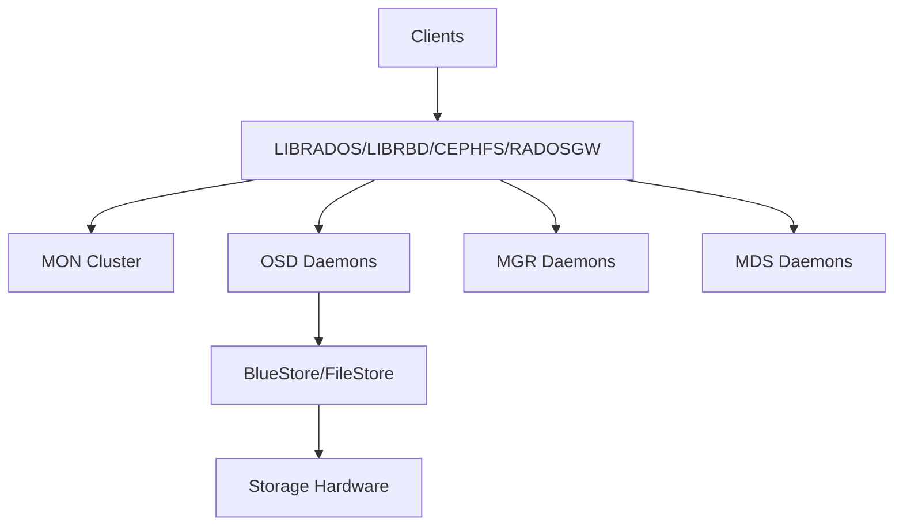

# CEPH Hyper-Converged Infrastructure (HCI)

Distributed storage system providing object, block, and file storage in unified platform.

## Architecture



## Key Features

- Object storage with S3/Swift API
- Block device (RBD) with kernel support
- POSIX-compliant file system (CephFS)
- Erasure coding for data protection
- Automatic data rebalancing

## Quick Commands

```bash
# Cluster status
ceph -s
ceph health

# Storage management
ceph osd pool create rbd 64
rbd create rbd/image1 --size 100G
rbd map rbd/image1

# CephFS
ceph fs new myfs metadata data
mount -t ceph <mon-ip>:6789:/ /mnt/cephfs
```

## Nifty Behaviors

### BlueStore Configuration
```bash
# Enable BlueStore
ceph config set osd osd_objectstore bluestore

# Tune BlueStore
ceph config set osd bluestore_max_blob_size 1M
```
**Nifty**: Optimized storage engine for better performance

### Cache Tiering
```bash
ceph osd tier add base-pool cache-pool
ceph osd tier cache-mode cache-pool writeback
ceph osd pool set cache-pool cache_target_dirty_ratio 0.4
```
**Nifty**: Improve read performance with caching

## Source Code

- Repository: https://github.com/ceph/ceph
- Documentation: https://docs.ceph.com/
