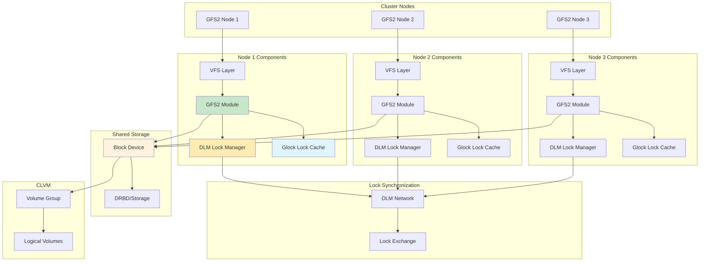
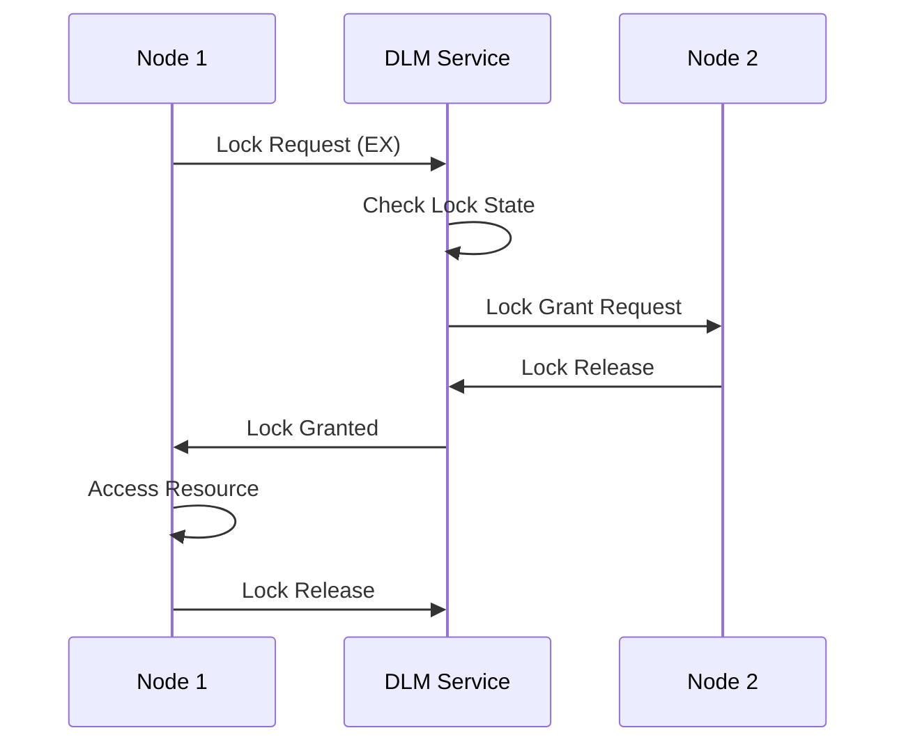
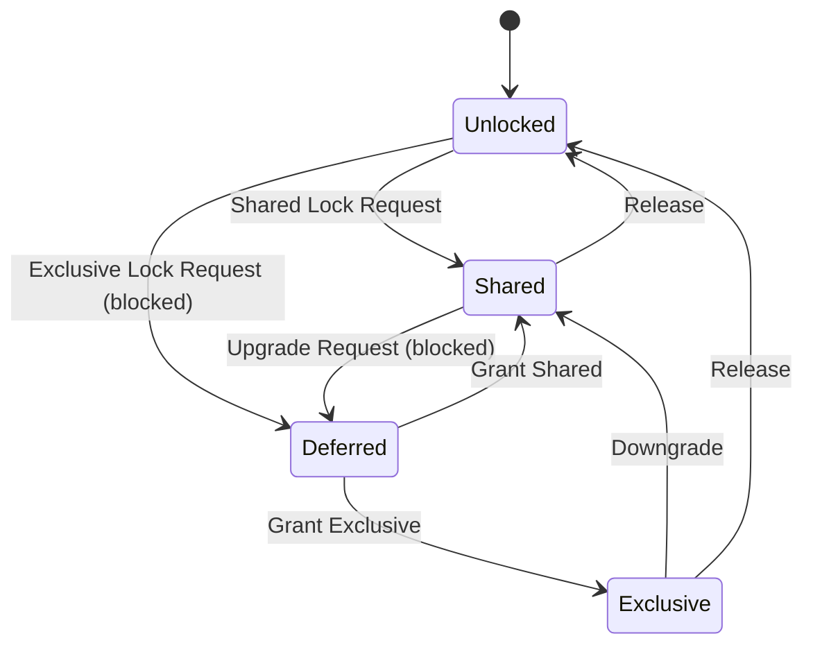

# GFS2

Global File System 2 for shared-disk file system in Linux clusters with distributed lock management and POSIX compliance.

## Architecture



## Core Components

### GFS2 Module

Kernel module implementing shared filesystem.

**GFS2 Responsibilities**:
- File system operations (create, read, write, delete)
- Metadata management (inodes, directories)
- Journaling
- Block allocation
- Lock coordination with DLM

**GFS2 Structures**:
- **Superblock**: File system metadata
- **Resource Groups (RGs)**: Block allocation units
- **Inodes**: File metadata
- **Directories**: File/directory entries
- **Journals**: Write-ahead logs

### DLM (Distributed Lock Manager)

Cluster-wide lock management service.

**DLM Responsibilities**:
- Coordinate file locks across nodes
- Manage lock state
- Handle lock conflicts
- Support lock modes
- Lock recovery

**Lock Modes**:
| Mode | Name | Description |
|------|------|-------------|
| NL | Null Lock | No lock |
| CR | Concurrent Read | Shared read, no intent |
| PR | Protected Read | Shared read with write intent |
| PW | Protected Write | Exclusive read/write intent |
| EX | Exclusive | Exclusive access |

**Lock Conversion**:
```
CR -> PR (upgrade)
PR -> PW (upgrade)
PW -> EX (upgrade)
EX -> PW -> PR -> CR (downgrade)
```

**DLM Operation Flow**:



### Glock (GFS2 Lock)

GFS2-specific lock structure for file system operations.

**Glock Types**:
| Type | Name | Description |
|------|------|-------------|
| 1 | Inode | Inode lock |
| 2 | Rgrp | Resource group lock |
| 3 | Meta | Metadata lock |
| 4 | iopen | Inode open lock |
| 5 | flock | File lock |
| 6 | plock | Posix lock |
| 8 | Quota | Quota lock |
| 9 | Journal | Journal lock |

**Glock State Machine**:



**Glock Cache**:
- Per-node lock cache
- Improves performance
- Reduces network traffic
- Automatic cache invalidation

### Journaling

GFS2 uses per-node journals for crash recovery.

**Journal Operation**:
1. Transaction start
2. Write to journal
3. Commit to filesystem
4. Clean journal

**Journal Size Calculation**:
```
Journal size = (Max file size / Block size) * Journal entries

Example: 1TB filesystem, 4KB blocks, 1000 entries
Journal size = (1TB / 4KB) * 1000 = 256GB
```

**Journal Configuration**:
```bash
# Create journal during mkfs
mkfs.gfs2 -p lock_dlm -t mycluster:myfs -j 3 \
    -J size=1024 /dev/drbd/by-res/data

# Add journal to existing filesystem
gfs2_jadd -j 1 /mnt/gfs2
```

## Key Features

### POSIX Compliance

GFS2 provides full POSIX file system semantics.

**Supported Operations**:
- Standard file I/O (open, read, write, close)
- Directory operations (mkdir, rmdir, readdir)
- File permissions and ownership
- Symbolic and hard links
- File locking (fcntl, flock)
- Extended attributes
- ACLs

### Distributed Lock Management

Cluster-wide coordination for concurrent access.

**Lock Granularity**:
- **Glocks**: High-level locks for resources
- **DLM locks**: Low-level network locks
- **POSIX locks**: Application-level file locks

**Lock Acquisition**:
```bash
# File lock with flock
flock file.txt exclusive

# POSIX lock with fcntl
fcntl(fd, F_SETLK, &lock)
```

### Cluster-Wide Volume Management (CLVM)

LVM extensions for cluster operations.

**CLVM Features**:
- Distributed volume management
- Shared volume groups
- Cluster-wide snapshots
- Online resizing

**CLVM Components**:
- **clvmd**: Cluster LVM daemon
- **lvmlockd**: LVM lock daemon
- **libvlock**: Lock management library

## Quick Commands

### File System Creation

```bash
# Create GFS2 filesystem
mkfs.gfs2 -p lock_dlm -t mycluster:myfs -j 3 \
    /dev/drbd/by-res/data

# Create with specific journal size
mkfs.gfs2 -p lock_dlm -t mycluster:myfs -j 3 \
    -J size=1024 /dev/drbd/by-res/data

# Create with block size
mkfs.gfs2 -p lock_dlm -t mycluster:myfs -j 3 \
    -b 4096 /dev/drbd/by-res/data
```

### Mounting

```bash
# Mount GFS2
mount -t gfs2 /dev/drbd/by-res/data /mnt/gfs2

# Mount with options
mount -t gfs2 -o noatime,nodiratime,data=ordered \
    /dev/drbd/by-res/data /mnt/gfs2

# Add to /etc/fstab
/dev/drbd/by-res/data /mnt/gfs2 gfs2 \
    noatime,nodiratime 0 0
```

### DLM Management

```bash
# List locks
dlm_tool ls

# Dump locks
dlm_tool dump

# View lock statistics
dlm_tool ls -v

# Clear stale locks
dlm_tool dump | grep -i stale
```

### File System Management

```bash
# Show file system info
gfs2_tool sb /dev/drbd/by-res/data all

# Check file system
gfs2_fsck -y /dev/drbd/by-res/data

# View quota
gfs2_quota list /mnt/gfs2

# Enable quotas
gfs2_quota enable /mnt/gfs2
```

## Nifty Behaviors

### Quota Management

```bash
# Enable quotas
gfs2_quota enable /mnt/gfs2

# Set user quota
gfs2_quota limit -u 1000 100G /mnt/gfs2

# Set group quota
gfs2_quota limit -g 1000 50G /mnt/gfs2

# Check quota
gfs2_quota list /mnt/gfs2
gfs2_quota get -u 1000 /mnt/gfs2
```

**Nifty**: Enforce user quotas on shared filesystem

### Snapshots with CLVM

```bash
# Create logical volume in cluster
lvcreate -L 100G -n my_lv mycluster_vg

# Create snapshot
lvcreate -L 10G -s -n my_lv_snap mycluster_vg/my_lv

# Display volumes
lvdisplay mycluster_vg

# Remove snapshot
lvremove mycluster_vg/my_lv_snap
```

**Nifty**: Point-in-time snapshots with LVM

### Journal Tuning

```bash
# Check journal info
gfs2_tool jindex /mnt/gfs2

# Add journal for new node
gfs2_jadd -j 1 /mnt/gfs2

# Tune commit interval
mount -t gfs2 -o commit=30 /dev/drbd/by-res/data /mnt/gfs2
```

**Nifty**: Dynamic journal expansion for node scaling

### Lock Contention Monitoring

```bash
# Monitor glock stats
cat /proc/fs/gfs2/cluster_name/glocks

# Monitor lock dumps
gfs2_tool lockdump /mnt/gfs2

# Monitor DLM activity
dwatch -v glock /proc/fs/gfs2
```

**Nifty**: Real-time lock performance analysis

## CLVM Integration

### CLVM Setup

```bash
# Install CLVM
apt-get install lvm2-cluster

# Configure cluster
pvcreate /dev/sdb
vgcreate -Ay -cy mycluster_vg /dev/sdb
lvcreate -L 100G -n data_lv mycluster_vg

# Start clvmd
systemctl enable clvmd
systemctl start clvmd

# Create GFS2 on CLVM volume
mkfs.gfs2 -p lock_dlm -t mycluster:myfs -j 3 \
    /dev/mycluster_vg/data_lv
```

### CLVM Operations

```bash
# Create volume
lvcreate -L 50G -n my_lv mycluster_vg

# Extend volume
lvextend -L +20G mycluster_vg/my_lv
resize_gfs2 /dev/mycluster_vg/my_lv

# Reduce volume
lvreduce -L -10G mycluster_vg/my_lv
resize_gfs2 /dev/mycluster_vg/my_lv

# Create snapshot
lvcreate -L 5G -s -n snap_lv mycluster_vg/my_lv

# Merge snapshot
lvconvert --merge mycluster_vg/snap_lv
```

## Performance Tuning

### Mount Options

```bash
# Optimized for performance
mount -t gfs2 -o noatime,nodiratime,data=writeback \
    /dev/drbd/by-res/data /mnt/gfs2

# Optimized for safety
mount -t gfs2 -o data=ordered,barrier=1 \
    /dev/drbd/by-res/data /mnt/gfs2

# Reduce lock contention
mount -t gfs2 -o localflocks \
    /dev/drbd/by-res/data /mnt/gfs2
```

| Option | Description |
|--------|-------------|
| noatime | Don't update access time |
| nodiratime | Don't update directory access time |
| data=ordered | Metadata before data (safe) |
| data=writeback | Data before metadata (fast) |
| barrier | Enable write barriers (safe) |
| localflocks | Use local lockd instead of DLM |
| quota | Enable quotas |

### System Tuning

```bash
# Increase journal commit interval
sysctl -w fs.gfs2.logd_secs=30

# Increase lock cache size
sysctl -w fs.gfs2.quota_scale=100

# Tune DLM
sysctl -w fs.dlm.tcp_port_size=4096
```

### File System Tuning

```bash
# Tune GFS2 parameters
gfs2_tool settune /mnt/gfs2 logd_secs 30
gfs2_tool settune /mnt/gfs2 quota_scale 100
gfs2_tool settune /mnt/gfs2 new_files_directio 1

# Tune inode cache
gfs2_tool settune /mnt/gfs2 greedy_max 2000
```

## Troubleshooting

### Stale Locks

```bash
# Check for stale locks
dlm_tool dump | grep -i stale

# Clear stale locks
dlm_tool unlock <resource>

# Restart DLM if needed
systemctl restart dlm
systemctl restart clvmd
```

### Mount Issues

```bash
# Check DLM status
systemctl status dlm

# Check cluster quorum
corosync-quorumtool -s

# Check fence status
pcs status stonith

# Remount filesystem
umount /mnt/gfs2
mount -t gfs2 /dev/drbd/by-res/data /mnt/gfs2
```

### Performance Issues

```bash
# Monitor lock contention
cat /proc/fs/gfs2/cluster_name/glocks

# Monitor DLM stats
dwatch -v dlm /proc/fs/dlm

# Check journal size
gfs2_tool jindex /mnt/gfs2

# Tune mount options
mount -o remount,noatime,nodiratime /mnt/gfs2
```

### File System Corruption

```bash
# Unmount filesystem
umount /mnt/gfs2

# Run fsck
gfs2_fsck -y /dev/drbd/by-res/data

# Check superblock
gfs2_tool sb /dev/drbd/by-res/data all

# Rebuild journals if needed
gfs2_jadd -j 3 /dev/drbd/by-res/data
```

## Best Practices

1. **Use separate journals** for each node
2. **Monitor lock contention** regularly
3. **Use CLVM** for volume management
4. **Set appropriate mount options** for workload
5. **Enable quotas** for user management
6. **Test failover scenarios**
7. **Monitor DLM performance**
8. **Use snapshots** for backups
9. **Keep journal sizes adequate**
10. **Document cluster configuration**

## Use Cases

### Shared Web Content

```bash
# Mount shared web root
mount -t gfs2 /dev/drbd/by-res/webroot /var/www

# Configure web servers on all nodes
# All nodes can read/write same files
# Automatic lock management
```

### Shared Application Data

```bash
# Mount application data
mount -t gfs2 /dev/drbd/by-res/appdata /opt/app/data

# Application runs on multiple nodes
# Concurrent access to shared data
# POSIX semantics guaranteed
```

### Database Clustering

```bash
# Mount database data
mount -t gfs2 -o data=writeback /dev/drbd/by-res/dbdata /var/lib/mysql

# MySQL cluster with shared storage
# Note: Use with caution, consider Galera for MySQL
```

## Comparison with Other File Systems

| Feature | GFS2 | OCFS2 | NFS | CephFS |
|---------|------|-------|-----|--------|
| POSIX | Yes | Yes | Yes | Yes |
| Block Device | Yes | Yes | No | No |
| Direct Access | Yes | Yes | No | No |
| Cluster Size | Medium | Medium | Large | Large |
| Scalability | Medium | Medium | High | High |
| Complexity | High | Medium | Low | High |

## Source Code

- **Location in Linux kernel**: `fs/gfs2/`
- **Repository**: https://github.com/torvalds/linux/tree/master/fs/gfs2
- **Documentation**: `/usr/share/doc/gfs2-utils/`

### Key Source Locations

| Component | Location | Description |
|-----------|----------|-------------|
| Main module | `fs/gfs2/main.c` | GFS2 initialization |
| Superblock | `fs/gfs2/super.c` | Superblock operations |
| Inode | `fs/gfs2/inode.c` | Inode operations |
| Dirthy | `fs/gfs2/dir.c` | Directory operations |
| Glock | `fs/gfs2/glock.c` | Lock management |
| Rgrp | `fs/gfs2/rgrp.c` | Resource group |
| Log | `fs/gfs2/log.c` | Journaling |