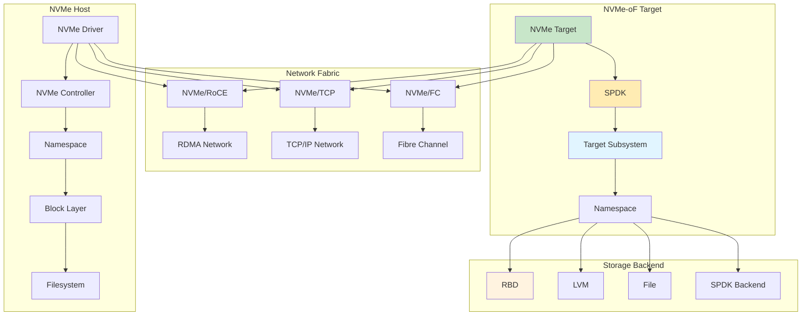

# NVMe-oF (NVMe over Fabrics)

High-performance block storage protocol extending NVMe over network fabrics like TCP, RDMA, and FC.

## Architecture



## Core Components

### NVMe Host

NVMe host driver for connecting to NVMe-oF targets.

**NVMe Host Components**:
| Component | Description |
|-----------|-------------|
| NVMe Core | NVMe protocol driver |
| NVMe TCP | NVMe over TCP transport |
| NVMe RDMA | NVMe over RDMA transport |
| NVMe FC | NVMe over Fibre Channel |
| Namespace | NVMe namespace (block device) |
| Controller | NVMe controller instance |

**NVMe Operation Flow**:

```mermaid
sequenceDiagram
    participant H as Host
    participant T as Transport
    participant S as Storage
    
    H->>T: NVMe Command
    T->>S: I/O Request
    S->>S: Process I/O
    S->>T: I/O Response
    T->>H: NVMe Completion
    
    H->>H: Handle Completion
    
    style S fill:#c8e6c9
    style T fill:#e1f5ff
```

### NVMe-oF Target

Target implementing NVMe-oF protocol for block storage.

**NVMe-oF Target Components**:
| Component | Description |
|-----------|-------------|
| Target | NVMe-oF target daemon |
| Subsystem | NVMe subsystem (collection of namespaces) |
| Namespace | Block storage unit |
| Listener | Network listener for connections |
| Host | Allowed NVMe host connections |

**NVMe-oF Target Types**:
| Type | Description | Performance |
|------|-------------|------------|
| NVMe/TCP | NVMe over TCP | Good |
| NVMe/RoCE | NVMe over RDMA | Excellent |
| NVMe/FC | NVMe over Fibre Channel | Excellent |

## Transport Types

### NVMe/TCP

NVMe over standard TCP/IP network.

**NVMe/TCP Characteristics**:
| Feature | Description |
|---------|-------------|
| Standard TCP | Works over any IP network |
| MTU Support | Up to 9000 bytes (Jumbo frames) |
| No RDMA required | Works without RDMA hardware |
| Lower performance | Compared to RDMA transports |

**NVMe/TCP Setup**:

```bash
# Install NVMe/TCP target
apt-get install nvme-stas
apt-get install nvmetcli

# Create TCP listener
nvme subsystem create --subsystem=nqn.2026-01.com.example:storage.target1
nvme namespace create --subsystem=nqn.2026-01.com.example:storage.target1 \
    --device=/dev/vg0/vm1
nvme listener create --subsystem=nqn.2026-01.com.example:storage.target1 \
    --transport=tcp --traddr=192.168.1.100 --trsvcid=4420
```

**NVMe/TCP Host Connection**:

```bash
# Connect to target
nvme connect -t tcp -n nqn.2026-01.com.example:storage.target1 \
    -a 192.168.1.100 -s 4420

# View connections
nvme list

# Disconnect
nvme disconnect -n nqn.2026-01.com.example:storage.target1
```

### NVMe/RoCE

NVMe over RDMA Converged Ethernet.

**NVMe/RoCE Characteristics**:
| Feature | Description |
|---------|-------------|
| RDMA | Remote Direct Memory Access |
| High Performance | Low latency, high throughput |
| Requires RDMA | Mellanox, Intel NICs |
| MTU Support | Up to 9000 bytes |

**NVMe/RoCE Setup**:

```bash
# Install RDMA packages
apt-get install rdma-core
apt-get install ibutils
apt-get install infiniband-diags

# Configure RDMA
modprobe rdma_cm
modprobe ib_core
modprobe ib_uverbs

# Create RDMA listener
nvme listener create --subsystem=nqn.2026-01.com.example:storage.target1 \
    --transport=rdma --traddr=192.168.1.100 --trsvcid=4420
```

**NVMe/RoCE Host Connection**:

```bash
# Connect with RDMA
nvme connect -t rdma -n nqn.2026-01.com.example:storage.target1 \
    -a 192.168.1.100 -s 4420

# View RDMA connections
nvme list
ibv_devinfo -v
```

### NVMe/FC

NVMe over Fibre Channel.

**NVMe/FC Characteristics**:
| Feature | Description |
|---------|-------------|
| Fibre Channel | Enterprise storage networking |
| High Availability | Redundant paths |
| Zoning | Fibre Channel zoning |
| WWN Identification | World Wide Name |

**NVMe/FC Setup**:

```bash
# Install NVMe/FC packages
apt-get install nvme-fc
apt-get install lsscsi
apt-get install sg3-utils

# Configure Fibre Channel
modprobe lpfc
modprobe qla2xxx

# Create FC listener
nvme listener create --subsystem=nqn.2026-01.com.example:storage.target1 \
    --transport=fc --traddr=10:00:00:00:00:00:01
```

**NVMe/FC Host Connection**:

```bash
# Discover FC targets
nvme discover -t fc -w 10:00:00:00:00:00:01

# Connect to FC target
nvme connect -t fc -n nqn.2026-01.com.example:storage.target1 \
    -w 10:00:00:00:00:00:01

# View FC connections
nvme list
lsscsi
```

## Target Configuration

### Creating Subsystem

```bash
# Create subsystem
nvme subsystem create --subsystem=nqn.2026-01.com.example:storage.target1

# Create subsystem with allow-all hosts
nvme subsystem create --subsystem=nqn.2026-01.com.example:storage.target1 \
    --allow-all-hosts
```

### Creating Namespace

```bash
# Create namespace with block device
nvme namespace create --subsystem=nqn.2026-01.com.example:storage.target1 \
    --device=/dev/vg0/vm1 --nsid=1

# Create namespace with file backend
nvme namespace create --subsystem=nqn.2026-01.com.example:storage.target1 \
    --path=/var/lib/nvme/disk.img --size=10G --nsid=1
```

### Creating Listener

```bash
# Create TCP listener
nvme listener create --subsystem=nqn.2026-01.com.example:storage.target1 \
    --transport=tcp --traddr=192.168.1.100 --trsvcid=4420

# Create RDMA listener
nvme listener create --subsystem=nqn.2026-01.com.example:storage.target1 \
    --transport=rdma --traddr=192.168.1.100 --trsvcid=4420

# Create FC listener
nvme listener create --subsystem=nqn.2026-01.com.example:storage.target1 \
    --transport=fc --traddr=10:00:00:00:00:00:01
```

### Host Configuration

```bash
# Allow specific host
nvme host add --subsystem=nqn.2026-01.com.example:storage.target1 \
    --host=nqn.2026-01.com.example:initiator1

# Delete host
nvme host delete --subsystem=nqn.2026-01.com.example:storage.target1 \
    --host=nqn.2026-01.com.example:initiator1
```

## Discovery

### Discovery Methods

```bash
# Discovery via transport
nvme discover -t tcp -a 192.168.1.100 -s 4420

# Discovery via NQN
nvme discover -n nqn.2026-01.com.example:storage.target1

# Discovery with all hosts
nvme discover -t tcp -a 192.168.1.100 -s 4420 --hostid
```

### Discovery Details

```bash
# View discovery log
cat /etc/nvme/discovery.conf

# Manual discovery entry
# Discovery Entry for nqn.2026-01.com.example:storage.target1
-transport=tcp -traddr=192.168.1.100 -trsvcid=4420
-n nqn.2026-01.com.example:storage.target1
```

## Connection Management

### Connection Operations

```bash
# Connect to target
nvme connect -t tcp -n nqn.2026-01.com.example:storage.target1 \
    -a 192.168.1.100 -s 4420

# Connect with specific host NQN
nvme connect -t tcp -n nqn.2026-01.com.example:storage.target1 \
    -a 192.168.1.100 -s 4420 -q nqn.2026-01.com.example:initiator1

# Connect with multiple queues
nvme connect -t tcp -n nqn.2026-01.com.example:storage.target1 \
    -a 192.168.1.100 -s 4420 -c 32

# Disconnect from target
nvme disconnect -n nqn.2026-01.com.example:storage.target1

# Disconnect all
nvme disconnect-all
```

### Persistent Connections

```bash
# Add to discovery.conf
echo "-transport=tcp -traddr=192.168.1.100 -trsvcid=4420 \
    -n nqn.2026-01.com.example:storage.target1" >> /etc/nvme/discovery.conf

# Enable auto-connect
systemctl enable nvme-autoconnect
systemctl start nvme-autoconnect
```

## Performance Tuning

### Host Tuning

```bash
# Increase queue depth
nvme connect -t tcp -n nqn.2026-01.com.example:storage.target1 \
    -a 192.168.1.100 -s 4420 -c 32 -i 32

# Enable write buffering
echo 1 > /sys/block/nvme0n1/queue/write_cache

# Set scheduler
echo none > /sys/block/nvme0n1/queue/scheduler

# Set I/O scheduler
echo mq-deadline > /sys/block/nvme0n1/queue/scheduler

# Enable jumbo frames
ip link set eth0 mtu 9000
```

### Target Tuning

```bash
# Set I/O queues
nvme subsystem modify --subsystem=nqn.2026-01.com.example:storage.target1 \
    --queue-size=128

# Set number of queues
nvme subsystem modify --subsystem=nqn.2026-01.com.example:storage.target1 \
    --nr-io-queues=32

# Set keep-alive interval
nvme subsystem modify --subsystem=nqn.2026-01.com.example:storage.target1 \
    --kato=10
```

### Network Tuning

```bash
# Enable jumbo frames
ip link set eth0 mtu 9000

# Enable TCP offload
ethtool -K eth0 tso on
ethtool -K eth0 gso on
ethtool -K eth0 lro on

# Increase TCP buffer
sysctl -w net.ipv4.tcp_window_scaling=1
sysctl -w net.ipv4.tcp_timestamps=1
sysctl -w net.ipv4.tcp_rmem='4096 65536 16777216'
sysctl -w net.ipv4.tcp_wmem='4096 65536 16777216'
```

## High Availability

### HA Gateway Configuration

```bash
# Create multiple listeners
nvme listener create --subsystem=nqn.2026-01.com.example:storage.target1 \
    --transport=tcp --traddr=192.168.1.100 --trsvcid=4420

nvme listener create --subsystem=nqn.2026-01.com.example:storage.target1 \
    --transport=tcp --traddr=192.168.1.101 --trsvcid=4420

# Configure multipath
vim /etc/multipath.conf

defaults {
    user_friendly_names yes
    find_multipaths yes
}

devices {
    device {
        vendor "Linux"
        product "NVMe"
    }
}
```

### Load Balancing

```bash
# Round-robin path selection
path_selector "round-robin 0"

# Load balancing
nvme connect -t tcp -n nqn.2026-01.com.example:storage.target1 \
    -a 192.168.1.100 -s 4420

nvme connect -t tcp -n nqn.2026-01.com.example:storage.target1 \
    -a 192.168.1.101 -s 4420
```

## Ceph NVMe-oF Gateway

### Ceph NVMe-oF Setup

```bash
# Install Ceph NVMe-oF gateway
apt-get install ceph-nvmeof
apt-get install rbd-nvmeof
apt-get install spdk

# Create RBD image
rbd create rbd/disk1 --size 100G

# Create NVMe-oF gateway configuration
cat > gateway.yml <<EOF
service_type: nvmeof
service_id: nvmeof
placement:
  hosts:
    - gw1
    - gw2
spec:
  pools:
    - rbd
  api_user: admin
  api_secret: AQATjVdhSx3pGBAA2C7C1C9DjFwB2bY8x0l6g==
  trusted_ip_list: 192.168.1.100,192.168.1.101
EOF

# Apply gateway configuration
ceph orch apply -i gateway.yml
```

### Gateway Management

```bash
# Create subsystem
gwcli.py subsystem create nqn.2026-01.com.example:ceph.target1

# Create namespace
gwcli.py namespace create nqn.2026-01.com.example:ceph.target1 1 \
    --pool rbd --image disk1

# Create listener
gwcli.py listener create nqn.2026-01.com.example:ceph.target1 \
    --transport=tcp --traddr=192.168.1.100 --trsvcid=4420

# Add host
gwcli.py host add nqn.2026-01.com.example:ceph.target1 \
    nqn.2026-01.com.example:initiator1
```

## SPDK Integration

### SPDK Target

```bash
# Install SPDK
apt-get install spdk
apt-get install dpdk
apt-get install rdma-core

# Configure SPDK
modprobe vfio-pci
modprobe uio_pci_generic

# Create SPDK target
nvmf_tgt

# Create subsystem
rpc.py nvmf_create_subsystem nqn.2026-01.com.example:spdk.target1

# Create namespace
rpc.py bdev_rbd_create rbd=rbd/disk1
rpc.py nvmf_subsystem_add_ns nqn.2026-01.com.example:spdk.target1 \
    bdev_name=Rbd0

# Create listener
rpc.py nvmf_subsystem_add_listener nqn.2026-01.com.example:spdk.target1 \
    -t TCP -a 192.168.1.100 -s 4420
```

## Troubleshooting

### Discovery Issues

```bash
# Check target status
nvme list-subsys

# Check network
ping 192.168.1.100
telnet 192.168.1.100 4420

# Check NVMe driver
lsmod | grep nvme
dmesg | grep nvme

# Check discovery
nvme discover -t tcp -a 192.168.1.100 -s 4420 -d
```

### Connection Issues

```bash
# Check connections
nvme list
nvme list-subsys

# Check logs
journalctl -u nvme -f
dmesg | grep nvme

# Check subsystems
nvme list-subsys

# Check namespaces
nvme list
```

### Performance Issues

```bash
# Check I/O
iostat -x 1

# Check network
sar -n DEV 1

# Check NVMe stats
nvme list -v
cat /sys/class/nvme/nvme0/device/statistics

# Check RDMA
ibv_devinfo -v
```

## Best Practices

1. **Use RDMA** for high performance
2. **Enable jumbo frames** for better throughput
3. **Configure multipath** for HA
4. **Use dedicated network** for NVMe-oF
5. **Monitor connections** regularly
6. **Test failover** scenarios
7. **Tune queue depth** for workload
8. **Use proper authentication**
9. **Document configuration** thoroughly
10. **Regular backups** of setup

## Quick Commands

### Target Commands

```bash
# Create subsystem
nvme subsystem create --subsystem=nqn.2026-01.com.example:storage.target1

# Create namespace
nvme namespace create --subsystem=nqn.2026-01.com.example:storage.target1 \
    --device=/dev/vg0/vm1

# Create listener
nvme listener create --subsystem=nqn.2026-01.com.example:storage.target1 \
    --transport=tcp --traddr=192.168.1.100 --trsvcid=4420

# Delete subsystem
nvme subsystem delete --subsystem=nqn.2026-01.com.example:storage.target1
```

### Host Commands

```bash
# Discover targets
nvme discover -t tcp -a 192.168.1.100 -s 4420

# Connect to target
nvme connect -t tcp -n nqn.2026-01.com.example:storage.target1 \
    -a 192.168.1.100 -s 4420

# Disconnect
nvme disconnect -n nqn.2026-01.com.example:storage.target1

# List subsystems
nvme list-subsys

# List namespaces
nvme list
```

### Multipath Commands

```bash
# Configure multipath
multipath -F
multipath -v2

# List multipath devices
multipath -ll
```

## Source Code

- **Repository**: https://github.com/linux-nvme/nvme-cli
- **Ceph NVMe-oF**: https://github.com/ceph/ceph/tree/master/src/monitoring
- **SPDK**: https://github.com/spdk/spdk
- **Documentation**: https://nvmexpress.org/

### Key Components

| Component | Location | Description |
|-----------|----------|-------------|
| NVMe Core | `drivers/nvme/` | NVMe driver |
| NVMe TCP | `drivers/nvme/host/tcp.c` | NVMe/TCP transport |
| NVMe RDMA | `drivers/nvme/host/rdma.c` | NVMe/RDMA transport |
| NVMe FC | `drivers/nvme/host/fc.c` | NVMe/FC transport |
| SPDK | `spdk/` | Userspace NVMe |