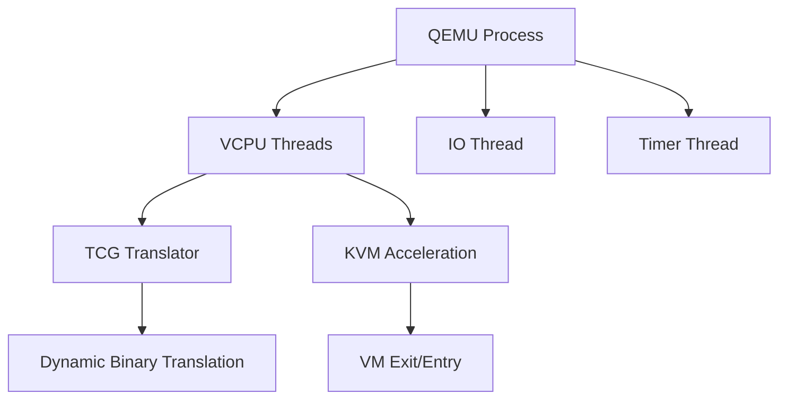
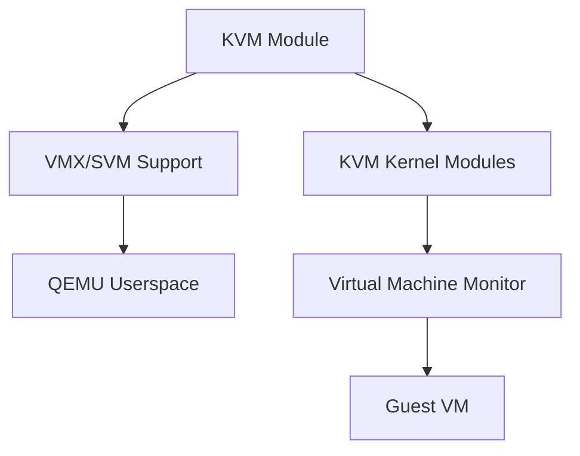
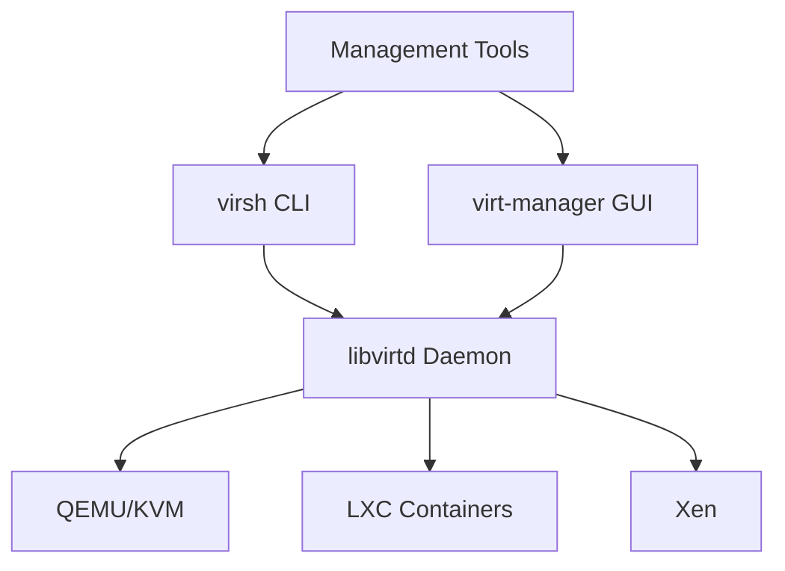
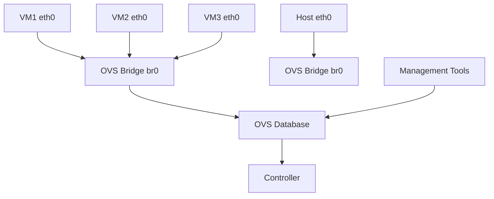

# Virtualization Technologies

Complete reference guide for QEMU, KVM, libvirt, virsh, and Open vSwitch virtualization technologies.

## QEMU

Generic and open source machine emulator providing full-system and user-mode emulation.

### Architecture



### Key Features

- Full-system emulation (x86, ARM, PowerPC, etc.)
- User-mode emulation
- TCG dynamic translation
- KVM integration for hardware acceleration
- Device emulation (network, storage, graphics)

### Quick Commands

```bash
# Create VM
qemu-system-x86_64 -name vm1 -m 2048 -smp 2 \
    -drive file=disk.qcow2,format=qcow2 \
    -netdev user,id=net0,hostfwd=tcp::2222-:22

# Enable KVM
qemu-system-x86_64 -enable-kvm -name vm1 -m 4096 -smp 4

# Disk management
qemu-img create -f qcow2 disk.qcow2 20G
qemu-img info disk.qcow2
qemu-img resize disk.qcow2 +10G
```

### Source Code

- **Repository**: [qemu-project/qemu](https://gitlab.com/qemu-project/qemu)
- **Documentation**: [qemu.org](https://www.qemu.org/documentation/)

---

## KVM

Kernel-based virtual machine providing hardware-assisted virtualization.

### Architecture



### Key Features

- Hardware virtualization (Intel VT-x, AMD-V)
- Near-native performance
- EPT/NPT memory management
- Virtio I/O virtualization
- Live migration support

### Quick Commands

```bash
# Check support
lscpu | grep Virtualization
egrep -c '(vmx|svm)' /proc/cpuinfo

# Load modules
modprobe kvm-intel  # Intel
modprobe kvm-amd    # AMD

# Verify
kvm-ok
```

### Source Code

- **Location**: `virt/kvm/` in Linux kernel
- **Repository**: [torvalds/linux](https://github.com/torvalds/linux/tree/master/virt/kvm)
- **Documentation**: [linux-kvm.org](https://www.linux-kvm.org/)

---

## libvirt

Virtualization API and daemon for managing virtualization capabilities.

### Architecture



### Key Features

- Unified API for multiple hypervisors
- XML-based VM configuration
- Network and storage management
- Live migration support
- Secure API with authentication

### Quick Commands

```bash
# List VMs
virsh list --all

# VM operations
virsh start vm1
virsh shutdown vm1
virsh destroy vm1
virsh dumpxml vm1

# Network management
virsh net-list
virsh net-define network.xml
virsh net-start default
```

### Source Code

- **Repository**: [libvirt/libvirt](https://gitlab.com/libvirt/libvirt)
- **Documentation**: [libvirt.org](https://libvirt.org/docs/)

---

## virsh

Command-line interface for managing libvirt virtualization.

### Quick Commands

```bash
# VM Management
virsh list                   # List running VMs
virsh list --all            # List all VMs
virsh start <vm-name>        # Start VM
virsh shutdown <vm-name>     # Shutdown VM
virsh destroy <vm-name>      # Force stop VM
virsh undefine <vm-name>    # Remove VM

# VM Information
virsh dominfo <vm-name>      # Domain info
virsh dumpxml <vm-name>      # XML config
virsh vcpuinfo <vm-name>     # VCPU info
virsh dommemstat <vm-name>   # Memory stats

# Snapshot Management
virsh snapshot-create <vm-name> <snap-name>
virsh snapshot-list <vm-name>
virsh snapshot-revert <vm-name> <snap-name>

# Console Access
virsh console <vm-name>
virsh qemu-monitor-command <vm-name> "info status"
```

---

## Open vSwitch

Open source multilayer virtual switch for managing VM networking.

### Architecture



### Key Features

- Standard Linux bridge compatibility
- Flow-based switching
- VLAN isolation
- Bonding and trunking support
- Remote management protocol

### Quick Commands

```bash
# Bridge Management
ovs-vsctl add-br br0
ovs-vsctl del-br br0
ovs-vsctl list-br

# Port Management
ovs-vsctl add-port br0 eth0
ovs-vsctl del-port br0 eth0
ovs-vsctl list-ports br0

# Configuration
ovs-vsctl show
ovs-ofctl show br0
ovs-vsctls show
```

### Source Code

- **Repository**: [openvswitch/ovs](https://github.com/openvswitch/ovs)
- **Documentation**: [openvswitch.org](https://docs.openvswitch.org/)

---

## Deployment Workflow

### 1. Hardware Verification

```bash
# Check virtualization support
lscpu | grep Virtualization
egrep -c '(vmx|svm)' /proc/cpuinfo
```

### 2. Software Installation

```bash
# Install packages
apt-get install qemu-kvm libvirt-daemon-system \
    libvirt-clients virt-manager openvswitch

# Enable services
systemctl enable libvirtd
systemctl start libvirtd
systemctl enable openvswitch
systemctl start openvswitch

# Verify
virsh version
ovs-vsctl show
```

### 3. Network Setup

```bash
# Create OVS bridge
ovs-vsctl add-br br0
ovs-vsctl add-port br0 eth0
ovs-vsctl add-port br0 eth1
```

### 4. Create VM

```bash
# Using virt-install
virt-install --name vm1 --memory 2048 --vcpus 2 \
    --disk path=/var/lib/libvirt/images/vm1.qcow2,size=20 \
    --network bridge=br0

# Or using virsh
virsh define vm1.xml
virsh start vm1
```

---

## Troubleshooting

For in-depth troubleshooting focused on code behavior and diagnostics, see [Deployment](deployment.md).

### Common Issues

| Issue | Solution |
|-------|----------|
| VM slow performance | Enable KVM with `-enable-kvm` |
| Network issues | Check OVS bridges with `ovs-vsctl show` |
| Storage issues | Use virtio drivers for better I/O |
| Resource constraints | Adjust memory/CPU allocation |

---

## Security Considerations

- Use AppArmor/SELinux profiles
- Use virtio drivers for better isolation
- Enable seccomp filters
- Use IOMMU for device passthrough

---

## Source Code References

| Technology | Repository | Documentation |
|-----------|---------------|-------------|
| QEMU | [qemu-project/qemu](https://gitlab.com/qemu-project/qemu) | [qemu.org](https://www.qemu.org/documentation/) |
| KVM | [torvalds/linux](https://github.com/torvalds/linux/tree/master/virt/kvm) | [linux-kvm.org](https://www.linux-kvm.org/) |
| libvirt | [libvirt/libvirt](https://gitlab.com/libvirt/libvirt) | [libvirt.org](https://libvirt.org/docs/) |
| Open vSwitch | [openvswitch/ovs](https://github.com/openvswitch/ovs) | [openvswitch.org](https://docs.openvswitch.org/) |
