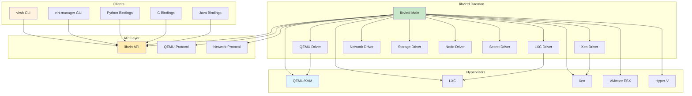
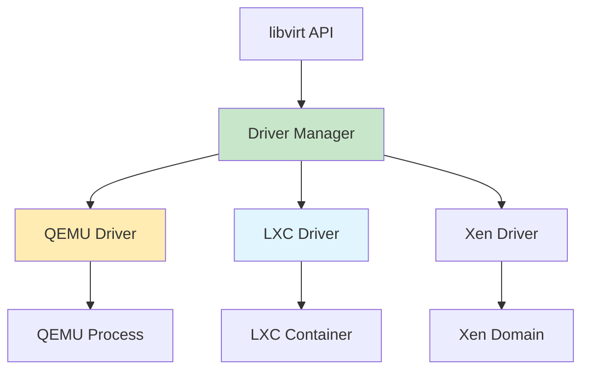

# libvirt

Virtualization API and daemon for managing virtualization capabilities with unified hypervisor support.

## Architecture



## Core Components

### libvirtd Daemon

Main daemon managing virtualization resources.

**libvirtd Responsibilities**:
- Manage VM lifecycle
- Handle client connections
- Execute VM operations
- Manage network and storage
- Provide security and authentication

**libvirtd Configuration**:
```xml
<!-- /etc/libvirt/libvirtd.conf -->
listen_tls = 1
listen_tcp = 0
auth_unix_ro = "none"
auth_unix_rw = "none"
auth_tls = "none"
log_level = 3
log_outputs = "3:file:/var/log/libvirt/libvirtd.log"
```

**libvirtd Services**:
| Service | Description |
|---------|-------------|
| libvirtd | Main daemon |
| virtlogd | Log manager |
| virtlockd | Lock manager |
| virtqemud | QEMU driver daemon |

### Drivers

libvirt supports multiple hypervisor drivers.

**Driver Types**:
| Driver | Hypervisor | Status |
|--------|------------|--------|
| qemu | QEMU/KVM | Stable |
| lxc | Linux Containers | Stable |
| xen | Xen | Stable |
| vmware | VMware ESX | Stable |
| vbox | VirtualBox | Experimental |
| bhyve | BSD Hypervisor | Experimental |
| vz | Virtuozzo | Stable |

**Driver Architecture**:



## Domain Configuration

### XML Domain Structure

Complete VM configuration in XML format.

**Basic Domain XML**:
```xml
<domain type='kvm'>
  <name>vm1</name>
  <memory unit='KiB'>2097152</memory>
  <vcpu placement='static'>2</vcpu>
  
  <os>
    <type arch='x86_64' machine='pc-i440fx-2.9'>hvm</type>
    <boot dev='hd'/>
  </os>
  
  <devices>
    <emulator>/usr/bin/qemu-system-x86_64</emulator>
    <disk type='file' device='disk'>
      <driver name='qemu' type='qcow2'/>
      <source file='/var/lib/libvirt/images/vm1.qcow2'/>
      <target dev='vda' bus='virtio'/>
    </disk>
    <interface type='network'>
      <mac address='52:54:00:71:b1:b6'/>
      <source network='default'/>
      <model type='virtio'/>
    </interface>
  </devices>
</domain>
```

### CPU Configuration

**CPU Features**:
```xml
<cpu mode='host-passthrough'>
  <feature policy='require' name='vmx'/>
  <topology sockets='2' cores='2' threads='1'/>
</cpu>
```

**CPU Modes**:
| Mode | Description |
|------|-------------|
| host-passthrough | Pass all CPU features |
| host-model | Emulate host CPU model |
| custom | Custom CPU configuration |

**CPU Features**:
| Feature | Description |
|---------|-------------|
| vmx | Intel VT-x |
| svm | AMD-V |
| pdpe1gb | 1GB pages |
| avx | Advanced Vector Extensions |
| avx2 | Advanced Vector Extensions 2 |

### Memory Configuration

**Basic Memory**:
```xml
<memory unit='KiB'>2097152</memory>
<currentMemory unit='KiB'>2097152</currentMemory>
```

**NUMA Memory**:
```xml
<cpu mode='host-passthrough' numa='1'>
  <numa>
    <cell id='0' cpus='0-1' memory='2097152' unit='KiB'/>
  </numa>
</cpu>

<memoryBacking>
  <hugepages>
    <page size='2048' unit='KiB' nodeset='0'/>
  </hugepages>
</memoryBacking>
```

**Memory Locking**:
```xml
<memoryBacking>
  <locked/>
  <hugepages/>
</memoryBacking>
```

### Storage Configuration

**Disk Configuration**:
```xml
<disk type='file' device='disk'>
  <driver name='qemu' type='qcow2' cache='writeback'/>
  <source file='/var/lib/libvirt/images/vm1.qcow2'/>
  <target dev='vda' bus='virtio'/>
  <address type='pci' domain='0x0000' bus='0x00' slot='0x04' function='0x0'/>
</disk>
```

**Disk Types**:
| Type | Description | Performance |
|------|-------------|------------|
| qcow2 | QEMU copy-on-write | Good |
| raw | Raw image | Excellent |
| qed | QED format | Good |
| vmdk | VMware format | Good |
| vdi | VirtualBox format | Good |

**Disk Formats**:
```xml
<!-- Qcow2 -->
<disk type='file' device='disk'>
  <driver name='qemu' type='qcow2'/>
  <source file='/var/lib/libvirt/images/vm1.qcow2'/>
</disk>

<!-- Raw -->
<disk type='block' device='disk'>
  <driver name='qemu' type='raw' cache='none'/>
  <source dev='/dev/vg0/vm1'/>
</disk>

<!-- iSCSI -->
<disk type='block' device='disk'>
  <driver name='qemu' type='raw'/>
  <source dev='/dev/disk/by-path/ip-192.168.1.100:3260-iscsi-iqn.2026-01.com.example:storage.target1-lun-1'/>
</disk>

<!-- RBD -->
<disk type='network' device='disk'>
  <driver name='qemu' type='raw'/>
  <source protocol='rbd' name='pool/image'>
    <host name='ceph-mon.example.com' port='6789'/>
  </source>
</disk>
```

### Network Configuration

**Bridge Network**:
```xml
<interface type='bridge'>
  <mac address='52:54:00:71:b1:b6'/>
  <source bridge='br0'/>
  <model type='virtio'/>
  <driver name='vhost'/>
</interface>
```

**Virtual Network**:
```xml
<interface type='network'>
  <mac address='52:54:00:71:b1:b6'/>
  <source network='default'/>
  <model type='virtio'/>
  <driver name='vhost'/>
</interface>
```

**Network Types**:
| Type | Description | Use Case |
|------|-------------|----------|
| bridge | Physical bridge | Production networking |
| network | Virtual network | Isolated VMs |
| direct | SR-IOV | High performance |
| macvtap | MAC VLAN | Direct access |
| tap | TAP device | Custom networking |

**Network Features**:
```xml
<interface type='bridge'>
  <mac address='52:54:00:71:b1:b6'/>
  <source bridge='br0'/>
  <model type='virtio'/>
  <driver name='vhost' queues='4'/>
  <mtu size='9000'/>
  <bandwidth>
    <inbound average='1000' peak='5000' burst='1024'/>
    <outbound average='1000' peak='5000' burst='1024'/>
  </bandwidth>
  <link state='up'/>
</interface>
```

## Quick Commands

### Domain Management

```bash
# List VMs
virsh list
virsh list --all
virsh list --state-running
virsh list --state-shutoff

# Define VM
virsh define vm1.xml

# Undefine VM
virsh undefine vm1

# Start VM
virsh start vm1

# Stop VM
virsh shutdown vm1

# Force stop VM
virsh destroy vm1

# Restart VM
virsh reboot vm1
```

### Domain Configuration

```bash
# Dump XML
virsh dumpxml vm1

# Edit XML
virsh edit vm1

# Get/set XML elements
virsh dumpxml vm1 | grep memory
virsh dumpxml vm1 | xpath //memory

# Autostart VM
virsh autostart vm1
virsh autostart --disable vm1
```

### Domain Monitoring

```bash
# VM status
virsh dominfo vm1

# VCPU status
virsh vcpuinfo vm1

# Memory statistics
virsh dommemstat vm1

# Block statistics
virsh domblklist vm1
virsh domblkinfo vm1 vda

# Network statistics
virsh domiflist vm1
virsh domifstat vm1 vnet0
```

### Migration

```bash
# Live migration
virsh migrate --live vm1 qemu+ssh://dest/system

# Migration with compression
virsh migrate --live --compress vm1 qemu+ssh://dest/system

# Migration with tunnel
virsh migrate --live --tunnelled vm1 qemu+ssh://dest/system

# Cold migration
virsh migrate vm1 qemu+ssh://dest/system
```

## Network Configuration

### Virtual Networks

**Define Network**:
```xml
<network>
  <name>default</name>
  <forward mode='nat'/>
  <bridge name='virbr0' stp='on' delay='0'/>
  <ip address='192.168.122.1' netmask='255.255.255.0'>
    <dhcp>
      <range start='192.168.122.2' end='192.168.122.254'/>
    </dhcp>
  </ip>
</network>
```

**Create Network**:
```bash
# Define network
virsh net-define network.xml

# Start network
virsh net-start default

# Autostart network
virsh net-autostart default

# List networks
virsh net-list --all

# Delete network
virsh net-destroy default
virsh net-undefine default
```

**Network Forward Modes**:
| Mode | Description |
|------|-------------|
| nat | Network address translation |
| route | Simple routing |
| bridge | Direct bridge |
| open | No forwarding |
| hostdev | PCI passthrough |
| macvtap | MAC VLAN |

## Storage Configuration

### Storage Pools

**Define Storage Pool**:
```xml
<pool type='dir'>
  <name>default</name>
  <target>
    <path>/var/lib/libvirt/images</path>
  </target>
</pool>
```

**Create Storage Pool**:
```bash
# Define pool
virsh pool-define pool.xml

# Build pool
virsh pool-build default

# Start pool
virsh pool-start default

# Autostart pool
virsh pool-autostart default

# List pools
virsh pool-list --all
```

**Storage Pool Types**:
| Type | Description | Use Case |
|------|-------------|----------|
| dir | Directory | Simple storage |
| fs | Filesystem | Local filesystem |
| logical | LVM | Volume management |
| iscsi | iSCSI | SAN storage |
| netfs | NFS | Network file system |
| rbd | Ceph RBD | Distributed storage |
| disk | Physical disk | Disk partition |
| zfs | ZFS | ZFS storage |

### Storage Volumes

**Create Volume**:
```bash
# Create volume
virsh vol-create-as default vm1.qcow2 20G --format qcow2

# Upload image
virsh vol-upload default vm1.qcow2 disk.qcow2

# Download image
virsh vol-download default vm1.qcow2 disk.qcow2

# Clone volume
virsh vol-clone default vm1.qcow2 vm2.qcow2

# Delete volume
virsh vol-delete default vm1.qcow2
```

## API Bindings

### Python API

```python
#!/usr/bin/env python3

import libvirt

# Connect to libvirt
conn = libvirt.open('qemu:///system')

# Get domain
dom = conn.lookupByName('vm1')

# Start domain
dom.create()

# Get domain info
info = dom.info()
print(f"State: {info[0]}")
print(f"Memory: {info[1]}")
print(f"CPUs: {info[3]}")

# Close connection
conn.close()
```

### C API

```c
#include <libvirt/libvirt.h>

int main() {
    virConnectPtr conn;
    virDomainPtr dom;
    
    // Connect to libvirt
    conn = virConnectOpen("qemu:///system");
    if (conn == NULL) {
        fprintf(stderr, "Failed to open connection to qemu:///system\n");
        return 1;
    }
    
    // Get domain
    dom = virDomainLookupByName(conn, "vm1");
    if (dom == NULL) {
        fprintf(stderr, "Failed to find domain vm1\n");
        virConnectClose(conn);
        return 1;
    }
    
    // Start domain
    virDomainCreate(dom);
    
    // Cleanup
    virDomainFree(dom);
    virConnectClose(conn);
    
    return 0;
}
```

## Security

### Authentication

**SASL Authentication**:
```xml
<!-- /etc/libvirt/libvirtd.conf -->
auth_unix_ro = "sasl"
auth_unix_rw = "sasl"
```

**TLS/SSL**:
```xml
<!-- /etc/libvirt/libvirtd.conf -->
listen_tls = 1
listen_tcp = 0

<!-- Certificate locations -->
cert_file = "/etc/pki/libvirt/servercert.pem"
key_file = "/etc/pki/libvirt/private/serverkey.pem"
ca_file = "/etc/pki/CA/cacert.pem"
```

### AppArmor/SELinux

**AppArmor Profile**:
```bash
# Check AppArmor status
aa-status

# View AppArmor profile
cat /etc/apparmor.d/usr.sbin.libvirtd
```

**SELinux Context**:
```bash
# Check SELinux status
sestatus

# Set SELinux context
chcon -R --reference=/var/lib/libvirt/images /path/to/new/images
```

## Troubleshooting

### Connection Issues

```bash
# Check libvirtd status
systemctl status libvirtd

# Check logs
journalctl -u libvirtd -f

# Check configuration
virsh version
virsh uri
```

### VM Issues

```bash
# Check VM logs
tail -f /var/log/libvirt/qemu/vm1.log

# Check libvirt logs
tail -f /var/log/libvirt/libvirtd.log

# Check VM configuration
virsh dumpxml vm1
virsh dominfo vm1
```

### Performance Issues

```bash
# Check CPU usage
top -H -p $(pidof qemu-kvm)

# Check memory usage
free -h

# Check I/O
iostat -x 1

# Check network
sar -n DEV 1
```

## Best Practices

1. **Use libvirt XML** for VM configuration
2. **Enable virtio** devices for performance
3. **Use storage pools** for volume management
4. **Configure networks** properly
5. **Enable live migration** for high availability
6. **Set up monitoring** and alerting
7. **Use proper security** (TLS, SELinux)
8. **Test backup/restore** procedures
9. **Document VM configurations**
10. **Regular updates** of libvirt and QEMU

## Source Code

- **Repository**: https://gitlab.com/libvirt/libvirt
- **Documentation**: https://libvirt.org/docs/

### Key Source Locations

| Component | Location | Description |
|-----------|----------|-------------|
| libvirtd | `src/libvirtd.c` | Main daemon |
| QEMU Driver | `src/qemu/` | QEMU/KVM driver |
| LXC Driver | `src/lxc/` | LXC driver |
| Xen Driver | `src/xen/` | Xen driver |
| Network | `src/network/` | Network management |
| Storage | `src/storage/` | Storage management |
| API | `src/libvirt.c` | Public API |
| XML | `src/conf/` | XML parsing |

### Documentation Links

- [libvirt API Reference](https://libvirt.org/html/index.html)
- [libvirt XML Format](https://libvirt.org/format.html)
- [libvirt Drivers](https://libvirt.org/drivers.html)
- [libvirt Security](https://libvirt.org/security.html)