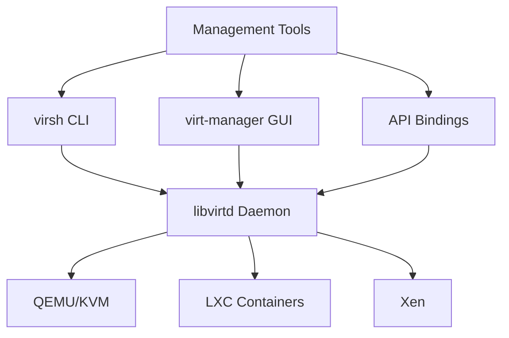

# libvirt

Virtualization API and daemon for managing virtualization capabilities.

## Architecture



## Key Features

- Unified API for multiple hypervisors
- XML-based VM configuration
- Network and storage management
- Secure API with authentication
- Live migration support

## Quick Commands

```bash
# List VMs
virsh list --all

# VM operations
virsh start vm1
virsh shutdown vm1
virsh dumpxml vm1

# Network management
virsh net-list
virsh net-define network.xml
```

## Source Code

- Repository: https://gitlab.com/libvirt/libvirt
- Documentation: https://libvirt.org/docs/
