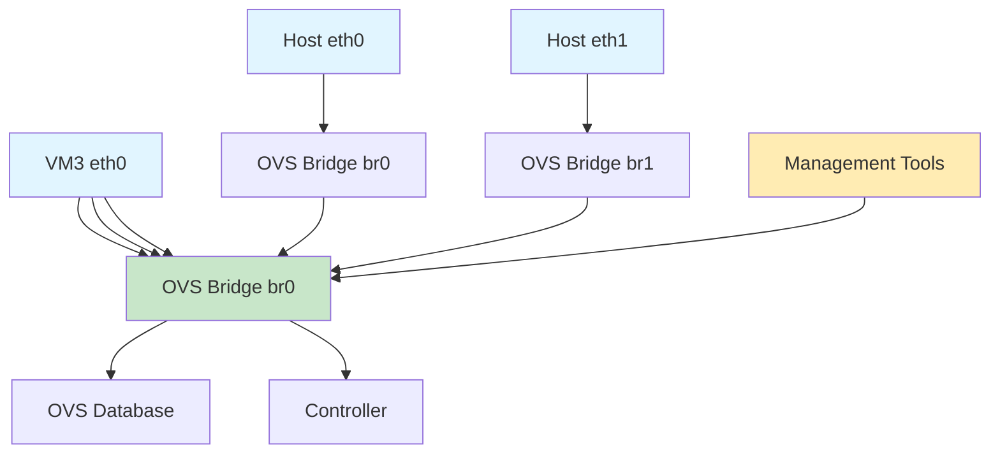

# Open vSwitch

Open source multilayer virtual switch for managing VM networking.

## Architecture



## Key Features

- Standard Linux bridge compatibility
- Flow-based switching
- Network isolation with VLANs
- Bonding and trunking support
- Remote management protocol

## Quick Commands

```bash
# Bridge Management
ovs-vsctl add-br br0
ovs-vsctl del-br br0
ovs-vsctl list-br

# Port Management
ovs-vsctl add-port br0 eth0
ovs-vsctl del-port br0 eth0
ovs-vsctl list-ports br0

# Show Configuration
ovs-vsctl show
ovs-ofctl show br0

# Database Management
ovs-vsctls show
```

## Nifty Behaviors

### Remote Management
```bash
ovs-vsctl set-manager ptcp:127.0.0.1:6640
ovs-vsctl set-protocol ssl
```
**Nifty**: Secure remote OVS management

### Bond Configuration
```bash
ovs-vsctl add-bond bond0 eth0 eth1
ovs-vsctl set bond bond0 mode=active-backup
```
**Nifty**: Network redundancy and load balancing

## Source Code

- Repository: https://github.com/openvswitch/ovs
- Documentation: https://docs.openvswitch.org/
