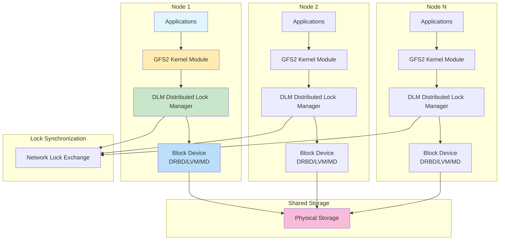
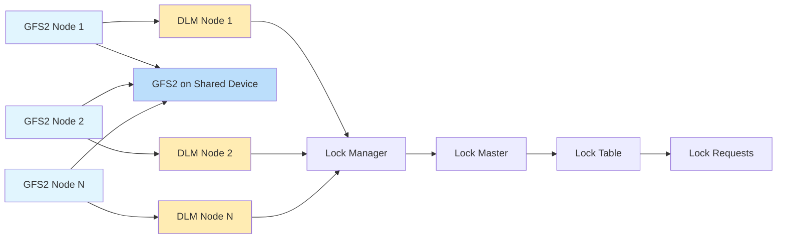
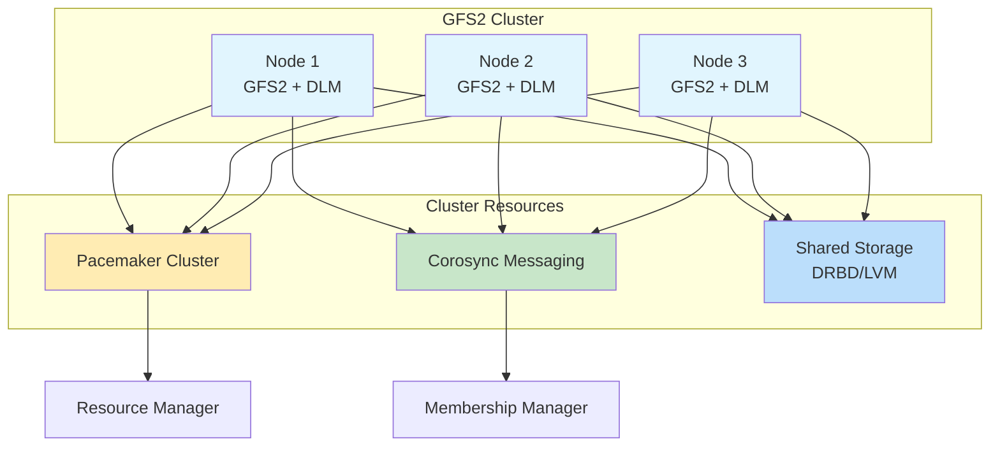
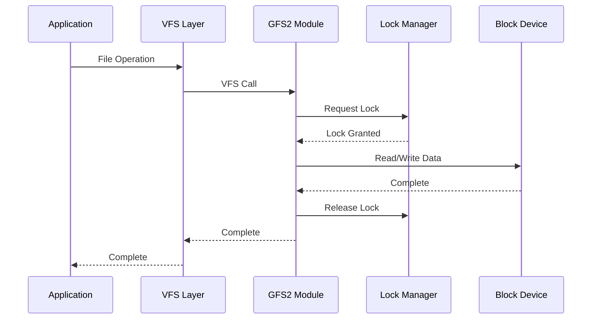
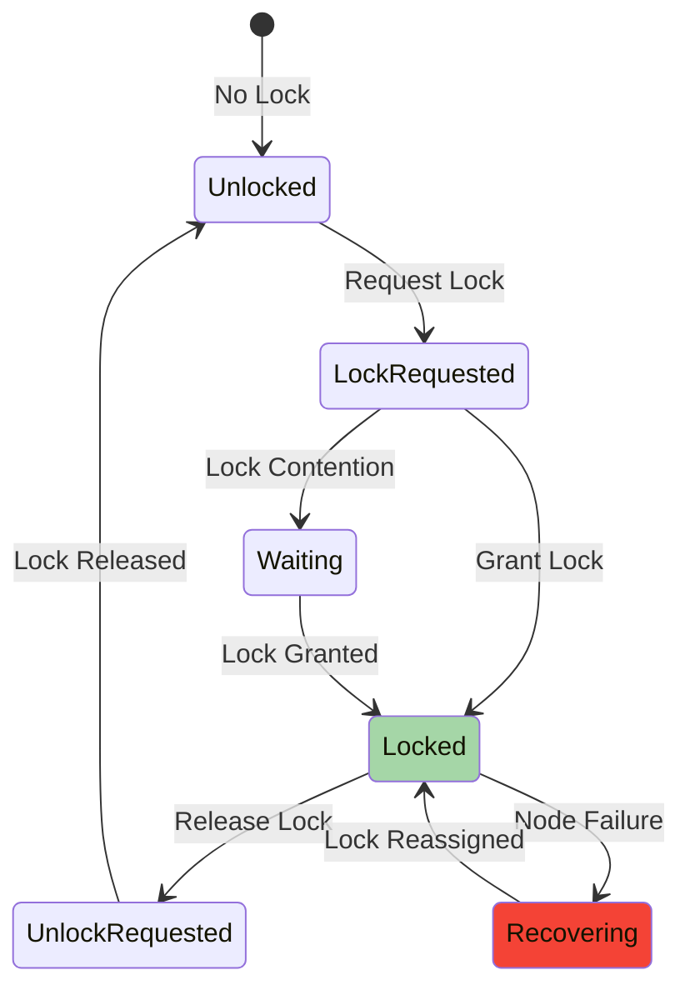
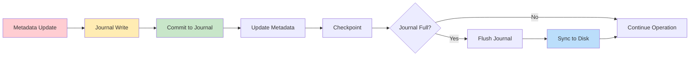

# Corosync Cluster Engine

## Table of Contents
1. [Introduction and Architecture](#1-introduction-and-architecture)
2. [Core Components](#2-core-components)
3. [Deployment Recommendations](#3-deployment-recommendations)
4. [Code Behavior Analysis](#4-code-behavior-analysis)
5. [Source Code Reference](#5-source-code-reference)
6. [Configuration and Management](#6-configuration-and-management)
7. [Troubleshooting and Monitoring](#7-troubleshooting-and-monitoring)
8. [Advanced Topics](#8-advanced-topics)

---

## 1. Introduction and Architecture

### 1.1 Overview
GFS2 (Global File System 2) is a shared-disk file system for Linux computer clusters. GFS2 allows multiple nodes to access the same block device simultaneously, providing a consistent file system view across all nodes. GFS2 is typically used in High Availability (HA) clusters with Pacemaker/Corosync.

### 1.2 GFS2 Architecture



### 1.3 DLM Architecture



---

## 2. Core Components

### 2.1 GFS2 Kernel Module
The GFS2 module provides file system functionality:
- POSIX-compliant file system
- Distributed lock manager integration
- Journaling for metadata integrity
- Quota support

### 2.2 DLM (Distributed Lock Manager)
DLM manages locks across cluster nodes:
- Lock acquisition and release
- Lock state synchronization
- Node failure handling
- Lock recovery

### 2.3 CLVM (Cluster LVM)
CLVM extends LVM for cluster use:
- Cluster-wide volume management
- Locking for LVM operations
- Volume activation coordination

### 2.4 Shared Storage Layer
Storage layer provides shared block access:
- DRBD (Distributed Replicated Block Device)
- Multi-path devices
- Shared SAN storage
- LVM logical volumes

---

## 3. Deployment Recommendations

### 3.1 Hardware Requirements

#### Minimum Configuration
- Nodes: 2 (with quorum)
- CPU: Dual-core processor
- RAM: 2 GB per node
- Network: 1 Gbps Ethernet
- Storage: Shared block device or DRBD

#### Recommended Production Configuration
- Nodes: 3+ (odd number preferred)
- CPU: Quad-core or more
- RAM: 4 GB or more per node
- Network: 10 Gbps Ethernet
- Network: Dedicated cluster network
- Storage: High-performance SSD or SAN

### 3.2 Cluster Architecture



### 3.3 Installation

```bash
# Install GFS2 packages
apt-get install gfs2-utils gfs2-cluster dlm

# Enable DLM and GFS2
modprobe dlm
modprobe gfs2

# Configure Pacemaker
# Add GFS2 resource
pcs resource create gfs2-resource Filesystem \
    device="/dev/drbd/by-res/resource-data" \
    directory="/mnt/gfs2" \
    fstype="gfs2" \
    options="noatime,nodiratime"

# Configure fencing
pcs stonith create fence-device fence_...
```

---

## 4. Code Behavior Analysis

### 4.1 GFS2 I/O Flow



### 4.2 Lock Manager Operations



### 4.3 Journaling Mechanism



---

## 5. Source Code Reference

### 5.1 Repository Information
- **GFS2 Repository**: Part of Linux kernel
- **Location**: https://github.com/torvalds/linux/tree/master/fs/gfs2
- **License**: GPL-2.0
- **Language**: C

### 5.2 Key Source Files

#### GFS2 Core
- `fs/gfs2/acl.c` - Access control lists
- `fs/gfs2/bmap.c` - Block mapping
- `fs/gfs2/dir.c` - Directory operations
- `fs/gfs2/file.c` - File operations
- `fs/gfs2/glock.c` - GFS2 locks
- `fs/gfs2/inode.c` - Inode management
- `fs/gfs2/log.c` - Journaling
- `fs/gfs2/ops.c` - Filesystem operations
- `fs/gfs2/quota.c` - Quota management
- `fs/gfs2/recovery.c` - Recovery
- `fs/gfs2/super.c` - Superblock
- `fs/gfs2/trans.c` - Transactions

#### DLM Core
- `fs/dlm/` - Distributed lock manager
- `fs/dlm/lock.c` - Lock operations
- `fs/dlm/memory.c` - Memory management
- `fs/dlm/recover.c` - Recovery
- `fs/dlm/request.c` - Request handling
- `fs/dlm/user.c` - User interface

#### CLVM Core
- `cluster/dlm-kernel/` - Kernel DLM
- `cluster/lvm/` - CLVM tools
- `cluster/lvm/lvchange.c` - LV operations
- `cluster/lvm/lvcreate.c` - LV creation
- `cluster/lvm/lvmlockd.c` - LVM locking daemon

### 5.3 Building from Source

```bash
# Clone Linux kernel
git clone https://github.com/torvalds/linux.git
cd linux

# Configure kernel
make menuconfig
# Enable: File systems -> GFS2 file system
# Enable: File systems -> Distributed Lock Manager (DLM)
# Enable: Device Drivers -> Multi-device support (DM/MD)

# Build kernel
make -j$(nproc)

# Install modules
make modules_install
make install
```

---

## 6. Configuration and Management

### 6.1 GFS2 Configuration

```bash
# Create GFS2 filesystem
mkfs.gfs2 -p lock_dlm -t mycluster \
    -j 2 /dev/drbd/by-res/resource-data

# Mount GFS2 filesystem
mount -t gfs2 -o noatime,nodiratime \
    /dev/drbd/by-res/resource-data /mnt/gfs2

# Unmount GFS2 filesystem
umount /mnt/gfs2

# Expand GFS2 filesystem
gfs2_grow -j 2 /dev/drbd/by-res/resource-data
```

### 6.2 DLM Configuration

```bash
# View DLM status
dlm_tool ls

# Lock statistics
dlm_tool dump

# View lock information
dlm_tool lockdump

# Clear DLM locks
dlm_tool clear
```

### 6.3 CLVM Configuration

```bash
# Enable LVM cluster locking
lvmconf --enable-cluster

# Create physical volume
pvcreate /dev/sdb

# Create volume group
vgcreate -Ay -c n mycluster_vg /dev/sdb

# Create logical volume
lvcreate -L 10G -n my_lv mycluster_vg

# Activate logical volume
lvchange -ay -K n /dev/mycluster_vg/my_lv

# Deactivate logical volume
lvchange -an /dev/mycluster_vg/my_lv
```

### 6.4 Pacemaker Integration

```bash
# Add GFS2 resource
pcs resource create gfs2-resource Filesystem \
    device="/dev/drbd/by-res/resource-data" \
    directory="/mnt/gfs2" \
    fstype="gfs2" \
    options="noatime,nodiratime" \
    op monitor interval=30s

# Add CLVM resource
pcs resource create clvm-resource LVM \
    volgrpname=mycluster_vg \
    exclusive=true \
    op monitor interval=30s

# Create ordering constraints
pcs constraint order start clvm-resource then gfs2-resource

# Create colocation constraints
pcs constraint colocation add gfs2-resource with clvm-resource
```

---

## 7. Troubleshooting and Monitoring

### 7.1 Monitoring Commands

```bash
# GFS2 status
gfs2_tool sb /dev/drbd/by-res/resource-data
gfs2_tool df /mnt/gfs2

# DLM status
dlm_tool ls
dlm_tool dump

# Mount status
mount -t gfs2
df -h /mnt/gfs2

# Cluster status
pcs status
crm_mon
```

### 7.2 Common Issues

#### Issue 1: Cannot Mount GFS2

```
Symptoms: mount: wrong fs type, bad option
Causes: GFS2 module not loaded, lock manager issues
Solutions:
1. Check modules: lsmod | grep gfs2
2. Load modules: modprobe gfs2 dlm
3. Check DLM: dlm_tool ls
4. Check cluster: pcs status
```

#### Issue 2: Stale Locks

```
Symptoms: System hangs, operations blocked
Causes: Node failure without fencing, DLM issues
Solutions:
1. Check DLM status: dlm_tool dump
2. Clear locks: dlm_tool clear
3. Restart DLM: systemctl restart dlm
4. Ensure fencing: pcs stonith show
```

#### Issue 3: Performance Issues

```
Symptoms: Slow operations, high latency
Causes: Network latency, lock contention, disk I/O
Solutions:
1. Check network: iperf
2. Monitor locks: dlm_tool lockdump
3. Check disk I/O: iotop, iostat
4. Tune mount options: noatime,nodiratime
```

---

## 8. Advanced Topics

### 8.1 Quota Management

```bash
# Enable quota on GFS2
gfs2_quota enable /mnt/gfs2

# Set quota limit
gfs2_quota limit -u <uid> 100G /mnt/gfs2

# Check quota
gfs2_quota check /mnt/gfs2

# Sync quota
gfs2_quota sync /mnt/gfs2

# Disable quota
gfs2_quota disable /mnt/gfs2
```

### 8.2 Snapshots with LVM

```bash
# Create snapshot
lvcreate -L 10G -s -n my_lv_snap mycluster_vg/my_lv

# List snapshots
lvdisplay mycluster_vg

# Mount snapshot
mount -o ro /dev/mycluster_vg/my_lv_snap /mnt/snapshot

# Remove snapshot
lvremove /dev/mycluster_vg/my_lv_snap
```

### 8.3 Disaster Recovery

```bash
# Check filesystem consistency
gfs2_tool sb /dev/drbd/by-res/resource-data

# Repair filesystem
gfs2_repair -y /dev/drbd/by-res/resource-data

# Recover journal
gfs2_tool jstate /dev/drbd/by-res/resource-data
```

---

## Appendices

### Appendix A: GFS2 Mount Options

| Option | Description |
|---------|-------------|
| noatime | Do not update access time |
| nodiratime | Do not update directory access time |
| data=ordered | Data journaling mode |
| data=writeback | Writeback journaling mode |
| logd | Enable data logging |
| lockproto=lock_dlm | Use DLM for locking |

### Appendix B: DLM Lock Types

| Lock Type | Description |
|-----------|-------------|
| NL | Non-blocking lock |
| CR | Concurrent read |
| CW | Concurrent write |
| PR | Protected read |
| PW | Protected write |
| EX | Exclusive |

### Appendix C: Troubleshooting Commands

| Command | Description |
|---------|-------------|
| `gfs2_tool sb` | Show superblock |
| `gfs2_tool df` | Show filesystem usage |
| `gfs2_tool jstate` | Show journal state |
| `dlm_tool ls` | List DLM nodes |
| `dlm_tool dump` | Dump lock table |
| `dlm_tool lockdump` | Show locks |

---

## Further Resources

- **GFS2 Documentation**: /usr/share/doc/gfs2-utils/
- **Pacemaker Docs**: https://www.clusterlabs.org/pacemaker/doc/
- **DLM Documentation**: /usr/share/doc/dlm/
- **Source Code**: https://github.com/torvalds/linux/tree/master/fs/gfs2
