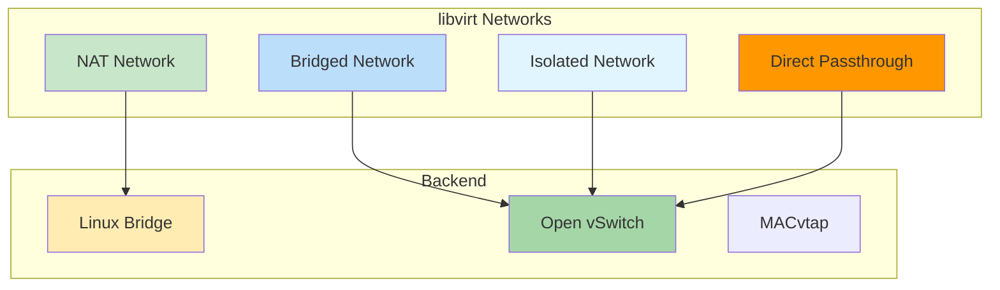

# libvirt Networking

Network management for virtualization environments.

## Network Types



## Quick Commands

```bash
# Network management
virsh net-list
virsh net-define network.xml
virsh net-start <network-name>

# Bridge commands
brctl show
brctl addbr br0
brctl delbr br0
```
