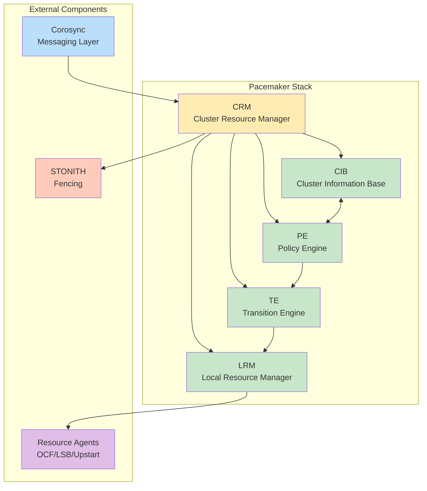
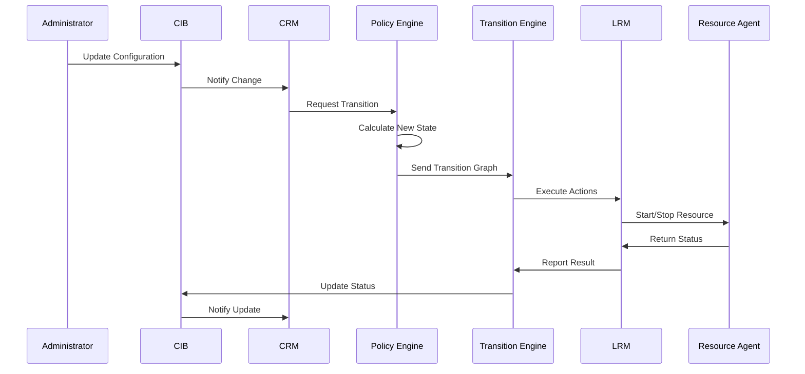
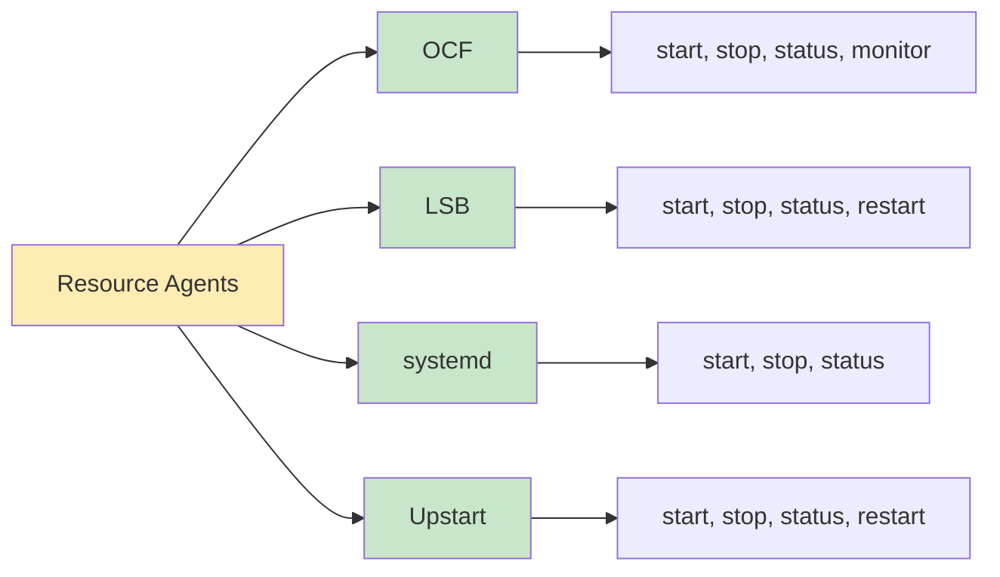
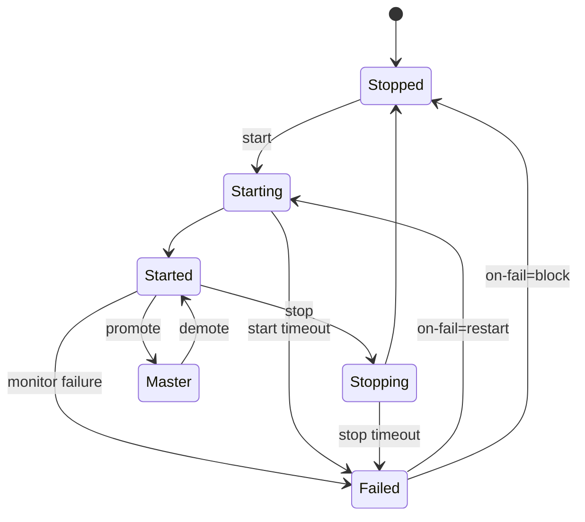
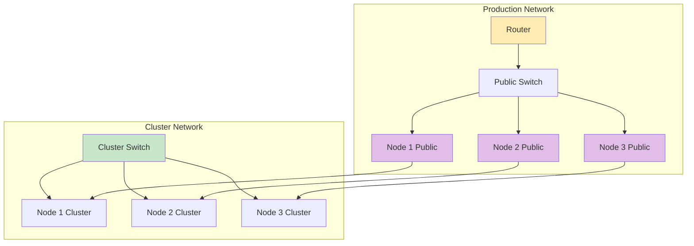
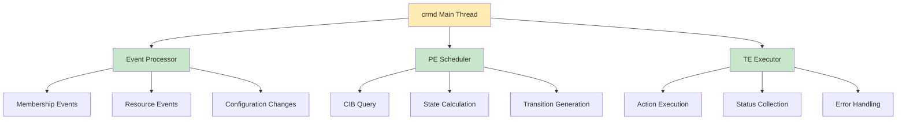
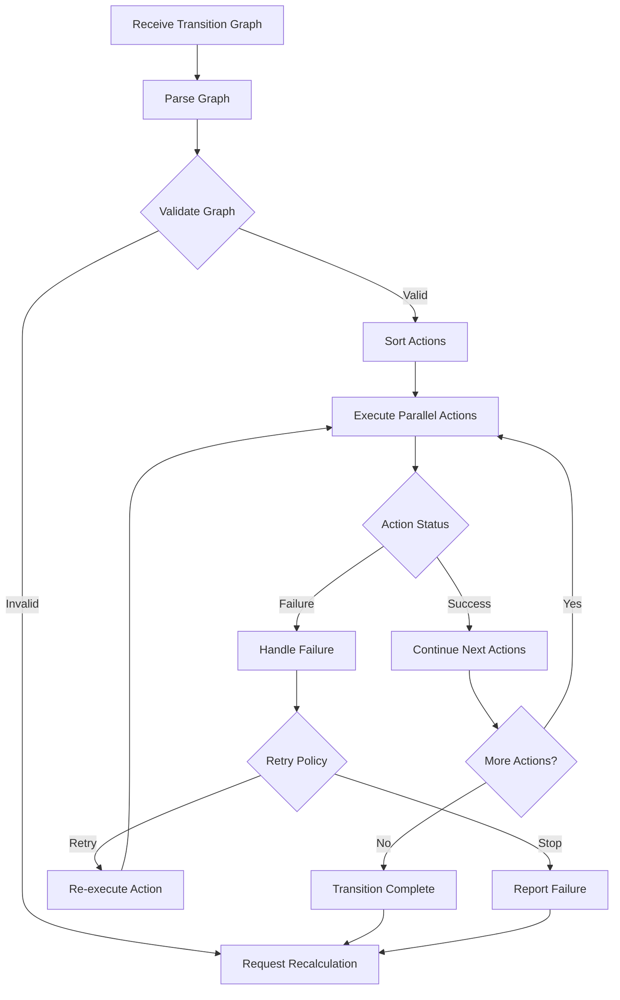
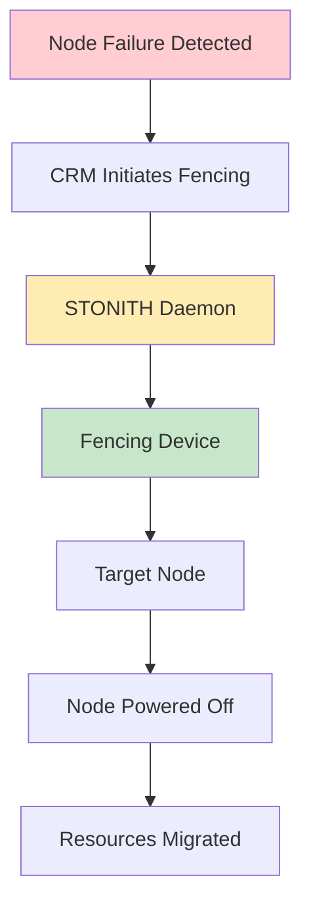
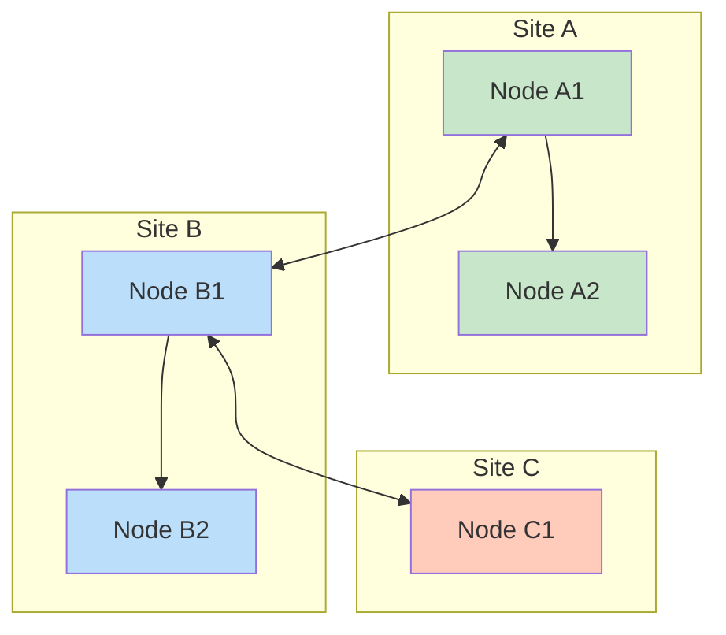

# Corosync Cluster Engine

## Table of Contents
1. [Introduction and Architecture](#1-introduction-and-architecture)
2. [Core Components](#2-core-components)
3. [Resource Management](#3-resource-management)
4. [Deployment Recommendations](#4-deployment-recommendations)
5. [Code Behavior Analysis](#5-code-behavior-analysis)
6. [Source Code Reference](#6-source-code-reference)
7. [Cluster Resource Management](#7-cluster-resource-management)
8. [Configuration and Management](#8-configuration-and-management)
9. [Troubleshooting and Monitoring](#9-troubleshooting-and-monitoring)
10. [Advanced Topics](#10-advanced-topics)

---

## 1. Introduction and Architecture

### 1.1 Overview
Pacemaker is an advanced, scalable High-Availability (HA) cluster resource manager. It coordinates the configuration, start-up, monitoring, and recovery of interrelated services across all cluster nodes. Pacemaker provides cluster-level services to manage resources in a distributed environment.

### 1.2 Architecture Overview



### 1.3 Data Flow Architecture



---

## 2. Core Components

### 2.1 Cluster Resource Manager (CRM)
The CRM is the central daemon that coordinates all cluster operations:

- **crmd**: The main CRM daemon
- Manages the cluster lifecycle
- Coordinates with Corosync for messaging
- Handles node membership events

### 2.2 Policy Engine (PE)
The PE determines the optimal state for the cluster:

- Calculates resource placement
- Applies scheduling rules
- Generates transition graphs
- Ensures constraints are met

### 2.3 Transition Engine (TE)
The TE executes the calculated transitions:

- Converts PE graphs into executable actions
- Maintains order of operations
- Handles action dependencies
- Reports execution status

### 2.4 Local Resource Manager (LRM)
The LRM executes resource actions locally:

- Starts and stops resources
- Monitors resource health
- Reports resource status
- Manages resource lifecycle

### 2.5 Cluster Information Base (CIB)
The CIB is the cluster state database:

- XML-based configuration
- Current cluster state
- Resource definitions
- Constraint definitions

---

## 3. Resource Management

### 3.1 Resource Classes

Pacemaker supports multiple resource agent standards:

| Class | Description | Location | Example |
|-------|-------------|----------|---------|
| OCF | Open Cluster Framework | `/usr/lib/ocf/resource.d/` | IPaddr2, Apache |
| LSB | Linux Standard Base | `/etc/init.d/` | nginx, mysql |
| systemd | Systemd service | `/usr/lib/systemd/` | NetworkManager |
| Upstart | Upstart job | `/etc/init/` | (legacy) |
| Nagios | Monitoring plugins | `/usr/lib/nagios/plugins/` | check_ping |

### 3.2 Resource Standards



### 3.3 Resource Operations

#### OCF Resource Agent Operations

```
start:    Initialize and start the resource
stop:     Terminate the resource
status:   Check current resource status
monitor:  Perform detailed health check
meta-data: Provide resource metadata
validate-all: Verify configuration parameters
```

#### Operation Parameters

```xml
<op name="monitor" interval="30s" timeout="20s" on-fail="restart" />
<op name="start" timeout="40s" on-fail="block" />
<op name="stop" timeout="30s" on-fail="block" />
```

### 3.4 Resource States



---

## 4. Deployment Recommendations

### 4.1 System Requirements

#### Minimum Configuration
- Nodes: 2 (with STONITH)
- RAM: 2 GB per node
- CPU: Dual-core
- Network: 1 Gbps

#### Recommended Production Configuration
- Nodes: 3+ (odd number preferred)
- RAM: 4 GB+ per node
- CPU: Quad-core+
- Network: 10 Gbps
- Redundant power
- Separate cluster and public networks

### 4.2 Network Architecture



### 4.3 Installation Procedure

#### Step-by-Step Installation

```bash
# 1. Install required packages
# Debian/Ubuntu
apt-get install pacemaker corosync pcs

# RHEL/CentOS
yum install pacemaker corosync pcs

# 2. Configure Corosync (see Corosync course material)
# 3. Enable Pacemaker service
systemctl enable pacemaker
systemctl start pacemaker

# 4. Verify cluster status
pcs status

# 5. Set cluster properties
pcs property set stonith-enabled=true
pcs property set no-quorum-policy=stop

# 6. Configure STONITH (required for production)
pcs stonith create my-fencer fence_xvm
```

### 4.4 Best Practices

#### Cluster Design Principles

1. **Always use STONITH**: Essential for preventing split-brain
2. **Odd number of nodes**: Provides majority voting
3. **Separate networks**: Cluster and public traffic
4. **Monitor everything**: Use comprehensive monitoring
5. **Test regularly**: Perform cluster maintenance drills

#### Resource Placement Strategy

```xml
<!-- Location constraints for optimal placement -->
<rsc_location id="web-pref-node1" rsc="webserver" node="node1" score="100" />
<rsc_location id="web-pref-node2" rsc="webserver" node="node2" score="50" />
<rsc_location id="db-avoid-node1" rsc="database" node="node1" score="-INFINITY" />
```

---

## 5. Code Behavior Analysis

### 5.1 CRM Daemon Architecture



### 5.2 Policy Engine Algorithm

#### State Calculation Process

```
PE State Calculation Algorithm:
1. Retrieve current CIB state
2. Parse all resources and constraints
3. Calculate current resource scores
4. Apply constraint rules
5. Determine optimal placement
6. Generate transition graph
7. Validate transition correctness
8. Send to TE for execution
```

### 5.3 Transition Engine Operation



### 5.4 Resource Agent Execution

#### OCF Resource Agent Structure

```bash
#!/bin/bash
# OCF Resource Agent Template

# Initialization
. ${OCF_ROOT}/resource.d/heartbeat/.ocf-shellfuncs

# Metadata
metadata() {
    cat <<EOF
<?xml version="1.0"?>
<!DOCTYPE resource-agent SYSTEM "ra-api-1.dtd">
<resource-agent name="myresource" version="1.0">
  <version>1.0</version>
  <longdesc lang="en">
    Custom resource agent description
  </longdesc>
  <shortdesc lang="en">Custom resource agent</shortdesc>
  <parameters>
    <parameter name="config_file" unique="1" required="1">
      <longdesc lang="en">Configuration file path</longdesc>
      <shortdesc lang="en">Config file</shortdesc>
      <content type="string"/>
    </parameter>
  </parameters>
  <actions>
    <action name="start" timeout="40s"/>
    <action name="stop" timeout="40s"/>
    <action name="status" timeout="20s"/>
    <action name="monitor" timeout="20s" interval="30s"/>
    <action name="meta-data" timeout="5s"/>
  </actions>
</resource-agent>
EOF
}

# Start operation
start() {
    ocf_log info "Starting ${OCF_RESOURCE_INSTANCE}"
    # Implementation here
    return $OCF_SUCCESS
}

# Stop operation
stop() {
    ocf_log info "Stopping ${OCF_RESOURCE_INSTANCE}"
    # Implementation here
    return $OCF_SUCCESS
}

# Status operation
status() {
    # Implementation here
    return $OCF_SUCCESS
}

# Monitor operation
monitor() {
    status
    return $?
}

# Main dispatch
case ${OCF_RESOURCE_INSTANCE} in
    start)   start;;
    stop)    stop;;
    status)  status;;
    monitor) monitor;;
    meta-data) metadata;;
    *)       ocf_log err "Invalid command"; exit $OCF_ERR_UNIMPLEMENTED;;
esac
```

---

## 6. Source Code Reference

### 6.1 Repository Information

- **Repository**: https://github.com/ClusterLabs/pacemaker
- **Official Site**: https://www.clusterlabs.org/pacemaker/
- **License**: GPL-2.0 and LGPL-2.1
- **Primary Language**: C (84.4%), Python (7.5%)

### 6.2 Directory Structure

```
pacemaker/
├── agents/            # Resource agents
├── cts/               # Cluster test suite
├── daemons/           # Pacemaker daemons
│   ├── attrd/        # Attribute daemon
│   ├── cib/          # CIB manager
│   ├── controld/     # Controller (CRM)
│   ├── pengine/      # Policy engine
│   └── stonithd/     # STONITH daemon
├── doc/              # Documentation
├── include/          # Public headers
├── lib/              # Core libraries
├── python/           # Python bindings
├── tests/            # Test suites
├── tools/            # CLI tools
│   ├── crm_mon      # Cluster monitor
│   ├── crm_resource # Resource management
│   └── crm_simulate  # Simulation tool
└── xml/              # XML schemas
```

### 6.3 Key Source Files

#### Controller (CRM)
- `daemons/controld/crmd.c` - Main CRM daemon
- `daemons/controld/controld_messages.c` - Message handling
- `daemons/controld/cib.c` - CIB operations

#### Policy Engine
- `daemons/pengine/pengine.c` - Main PE daemon
- `daemons/pengine/native.c` - Native resource handling
- `daemons/pengine/unpack.c` - Configuration unpacking

#### CIB Manager
- `daemons/cib/cib.c` - CIB daemon
- `daemons/cib/callbacks.c` - CIB callbacks
- `daemons/cib/io.c` - CIB I/O operations

#### LRM
- `lib/lrmd/lrmd.c` - LRM daemon
- `lib/lrmd/lrmd_client.c` - LRM client library

### 6.4 Building from Source

```bash
# Clone repository
git clone https://github.com/ClusterLabs/pacemaker.git
cd pacemaker

# Install build dependencies
# Debian/Ubuntu
apt-get install build-essential automake autoconf libtool \
    libxml2-dev libglib2.0-dev libbz2-dev libxslt1-dev

# RHEL/CentOS
yum groupinstall "Development Tools"
yum install automake autoconf libtool libxml2-devel \
    glib2-devel bzip2-devel libxslt-devel

# Generate build system
./autogen.sh

# Configure
./configure --prefix=/usr \
            --sysconfdir=/etc \
            --localstatedir=/var

# Build
make

# Install
make install

# Run tests
make check
```

---

## 7. Cluster Resource Management

### 7.1 Resource Definition

#### Primitive Resources

```xml
<primitive class="ocf" provider="heartbeat" type="IPaddr2" id="vip">
    <instance_attributes name="vip-params">
        <nvpair name="ip" value="192.168.1.100"/>
        <nvpair name="cidr_netmask" value="24"/>
        <nvpair name="nic" value="eth0"/>
    </instance_attributes>
    <operations>
        <op name="monitor" interval="30s" timeout="20s"/>
    </operations>
    <meta_attributes>
        <nvpair name="migration-threshold" value="3"/>
        <nvpair name="failure-timeout" value="120s"/>
    </meta_attributes>
</primitive>
```

#### Group Resources

```xml
<group id="web-group">
    <primitive class="ocf" provider="heartbeat" type="IPaddr2" id="vip">
        <instance_attributes name="vip-params">
            <nvpair name="ip" value="192.168.1.100"/>
        </instance_attributes>
    </primitive>
    <primitive class="ocf" provider="heartbeat" type="apache" id="apache">
        <instance_attributes name="apache-params">
            <nvpair name="configfile" value="/etc/apache2/apache2.conf"/>
        </instance_attributes>
    </primitive>
</group>
```

#### Clone Resources

```xml
<clone id="haproxy-clone">
    <primitive class="ocf" provider="heartbeat" type="haproxy" id="haproxy">
        <instance_attributes name="haproxy-params">
            <nvpair name="conf" value="/etc/haproxy/haproxy.cfg"/>
        </instance_attributes>
    </primitive>
    <meta_attributes id="haproxy-clone-meta">
        <nvpair name="clone-max" value="3"/>
        <nvpair name="clone-node-max" value="1"/>
        <nvpair name="globally-unique" value="false"/>
    </meta_attributes>
</clone>
```

#### Master/Slave Resources

```xml
<master id="mysql-master">
    <primitive class="ocf" provider="heartbeat" type="mysql" id="mysql">
        <instance_attributes name="mysql-params">
            <nvpair name="binary" value="/usr/bin/mysqld_safe"/>
            <nvpair name="config" value="/etc/mysql/my.cnf"/>
            <nvpair name="datadir" value="/var/lib/mysql"/>
        </instance_attributes>
    </primitive>
    <meta_attributes id="mysql-master-meta">
        <nvpair name="clone-max" value="3"/>
        <nvpair name="clone-node-max" value="1"/>
        <nvpair name="master-max" value="1"/>
        <nvpair name="master-node-max" value="1"/>
        <nvpair name="notify" value="true"/>
    </meta_attributes>
</master>
```

### 7.2 Constraints

#### Ordering Constraints

```xml
<!-- Start apache after IP address -->
<ordering id="order-ip-apache" first="vip" then="apache"/>
<ordering id="order-apache-db" first="apache" then="database"/>

<!-- Stop resources in reverse order -->
<ordering id="order-stop" first="apache" then="vip" kind="Optional"/>
```

#### Colocation Constraints

```xml
<!-- Run apache on same node as VIP -->
<colocation id="coloc-apache-vip" rsc="apache" with-rsc="vip" score="INFINITY"/>

<!-- Prefer database on node1 -->
<colocation id="coloc-db-node1" rsc="database" with-rsc="node1" score="100"/>

<!-- Never run web on node1 -->
<colocation id="coloc-web-not-node1" rsc="web" with-rsc="node1" score="-INFINITY"/>
```

#### Location Constraints

```xml
<!-- Prefer node1 for webserver -->
<rsc_location id="web-pref-node1" rsc="webserver" node="node1" score="100"/>

<!-- Never run database on node3 -->
<rsc_location id="db-avoid-node3" rsc="database" node="node3" score="-INFINITY"/>

<!-- Use rule-based placement -->
<rsc_location id="rule-location" rsc="webserver">
    <rule id="rule1" score="100">
        <expression attribute="#uname" operation="eq" value="node1"/>
    </rule>
</rsc_location>
```

### 7.3 Resource Stickiness

```xml
<meta_attributes>
    <!-- Resource prefers current location -->
    <nvpair name="resource-stickiness" value="100"/>

    <!-- Movement threshold -->
    <nvpair name="migration-threshold" value="3"/>

    <!-- Failure recovery timeout -->
    <nvpair name="failure-timeout" value="120s"/>
</meta_attributes>
```

---

## 8. Configuration and Management

### 8.1 Configuration Methods

#### Using pcs (Pacemaker/Corosync Configuration System)

```bash
# Display cluster status
pcs status

# Add a resource
pcs resource create vip ocf:heartbeat:IPaddr2 ip=192.168.1.100 \
    cidr_netmask=24 op monitor interval=30s

# Add a group
pcs resource create web-group VIP apache

# Create ordering constraint
pcs constraint order start VIP then apache

# Create colocation constraint
pcs constraint colocation add apache with VIP

# Display configuration
pcs config show

# Display constraints
pcs constraint show

# Resource operations
pcs resource start web-group
pcs resource stop web-group
pcs resource move web-group node2
```

#### Using crm_shell

```bash
# Interactive mode
crm configure

# Add resource
crm configure primitive vip ocf:heartbeat:IPaddr2 \
    params ip=192.168.1.100 cidr_netmask=24 \
    op monitor interval=30s

# Add ordering
crm configure colocation apache-with-vip INFINITY apache vip
crm configure order vip-before-apache Mandatory vip:start apache:start

# Verify configuration
crm configure verify

# Commit changes
crm configure commit
```

### 8.2 Cluster Properties

```bash
# Display current properties
pcs property list

# Set essential properties
pcs property set stonith-enabled=true
pcs property set no-quorum-policy=stop
pcs property set default-resource-stickiness=100
pcs property set symmetric-cluster=true
pcs property set maintenance-mode=false

# Quorum policies
pcs property set no-quorum-policy=stop    # Stop resources
pcs property set no-quorum-policy=freeze   # Freeze resources
pcs property set no-quorum-policy=ignore  # Continue (dangerous)

# Resource defaults
pcs resource defaults resource-stickiness=100
pcs resource defaults migration-threshold=3
pcs resource defaults failure-timeout=120s
```

### 8.3 Resource Templates

```xml
<template id="vip-template">
    <primitive class="ocf" provider="heartbeat" type="IPaddr2">
        <instance_attributes>
            <nvpair name="cidr_netmask" value="24"/>
            <nvpair name="nic" value="eth0"/>
        </instance_attributes>
        <operations>
            <op name="monitor" interval="30s"/>
        </operations>
    </primitive>
</template>

<!-- Use template -->
<primitive id="vip-1" template="vip-template">
    <instance_attributes>
        <nvpair name="ip" value="192.168.1.100"/>
    </instance_attributes>
</primitive>
```

---

## 9. Troubleshooting and Monitoring

### 9.1 Monitoring Tools

#### crm_mon - Cluster Monitor

```bash
# Real-time monitoring
crm_mon

# One-time display
crm_mon -1

# XML output
crm_mon --as-xml

# Watch mode
crm_mon --watch

# Filter by resource
crm_mon --resource-name vip

# Filter by node
crm_mon --node-name node1
```

#### pcs status

```bash
# Full cluster status
pcs status

# Resources only
pcs status resources

# Nodes only
pcs status nodes

# Corosync status
pcs status corosync
```

### 9.2 Common Issues and Solutions

#### Issue 1: Resources Not Starting

```
Symptoms: Resources show as "Failed" or "Stopped"
Causes: Configuration errors, missing dependencies, resource agent failures
Solutions:
1. Check resource agent logs
2. Verify resource configuration
3. Test resource agent manually
4. Check for resource conflicts
```

#### Issue 2: Split-Brain Scenario

```
Symptoms: Multiple nodes claim resources independently
Causes: Network partition, quorum loss, STONITH failure
Solutions:
1. Ensure STONITH is configured
2. Verify network redundancy
3. Check quorum configuration
4. Use cluster-aware applications
```

#### Issue 3: Resource Flapping

```
Symptoms: Resources repeatedly start and stop
Causes: Resource failures, monitoring issues, constraints
Solutions:
1. Increase failure thresholds
2. Adjust monitoring intervals
3. Review resource dependencies
4. Check resource health
```

### 9.3 Log Analysis

```bash
# View cluster logs
journalctl -u pacemaker -f

# View resource agent logs
grep -r "resource-agent" /var/log/pacemaker/

# Analyze failures
crm_mon --failcounts

# Trace resource operations
crm_trace --log-file=trace.log
```

### 9.4 Simulation and Testing

#### crm_simulate

```bash
# Test configuration changes
crm_simulate --simulate --xml-file=changes.xml

# Visualize cluster state
crm_simulate --live-check

# Predict resource placement
crm_simulate --show-score

# Generate transition graph
crm_simulate --dot-file=graph.dot
```

---

## 10. Advanced Topics

### 10.1 STONITH Configuration

#### STONITH Fundamentals



#### STONITH Device Configuration

```bash
# IPMI STONITH
pcs stonith create ipmi-fence fence_ipmilan \
    ipaddr=192.168.1.200 \
    login=admin \
    passwd=password \
    pcmk_host_list="node1 node2 node3"

# VM STONITH
pcs stonith create vm-fence fence_xvm \
    pcmk_host_map="node1:vm1;node2:vm2;node3:vm3"

# Power Switch STONITH
pcs stonith create power-fence fence_apc_snmp \
    ipaddr=192.168.1.201 \
    community=public \
    pcmk_host_list="node1 node2 node3"
```

### 10.2 Multi-Site Clusters



#### Booth Configuration

```bash
# Install booth
apt-get install booth

# Configure booth
vim /etc/booth/booth.conf

# Start booth service
systemctl enable booth
systemctl start booth

# Configure ticket management
pcs booth ticket grant ticket1
pcs booth ticket revoke ticket1
```

### 10.3 Custom Resource Agents

#### Developing Custom OCF Agents

```bash
#!/bin/bash
# Custom OCF Resource Agent Template

: ${OCF_FUNCTIONS_DIR=${OCF_ROOT}/resource.d/heartbeat}
. ${OCF_FUNCTIONS_DIR}/.ocf-shellfuncs

# Resource parameters
OCF_RESKEY_config_file_default="/etc/myapp/config.conf"

# Metadata function
metadata() {
    cat <<EOF
<?xml version="1.0"?>
<!DOCTYPE resource-agent SYSTEM "ra-api-1.dtd">
<resource-agent name="myapp" version="1.0">
  <version>1.0</version>
  <longdesc lang="en">Custom application resource agent</longdesc>
  <shortdesc lang="en">Custom app agent</shortdesc>
  <parameters>
    <parameter name="config_file" required="1">
      <longdesc lang="en">Configuration file path</longdesc>
      <shortdesc lang="en">Config file</shortdesc>
      <content type="string"/>
    </parameter>
  </parameters>
  <actions>
    <action name="start" timeout="40s"/>
    <action name="stop" timeout="40s"/>
    <action name="status" timeout="20s"/>
    <action name="monitor" timeout="20s" interval="30s"/>
    <action name="meta-data" timeout="5s"/>
  </actions>
</resource-agent>
EOF
}

# Validate all parameters
validate_all() {
    check_binary $OCF_RESKEY_binary
    if [ ! -f "$OCF_RESKEY_config_file" ]; then
        ocf_log err "Config file $OCF_RESKEY_config_file not found"
        return $OCF_ERR_CONFIGURED
    fi
    return $OCF_SUCCESS
}

# Start the resource
start() {
    ocf_log info "Starting ${OCF_RESOURCE_INSTANCE}"
    validate_all || exit $?
    
    # Check if already running
    status
    if [ $? -eq $OCF_SUCCESS ]; then
        ocf_log info "${OCF_RESOURCE_INSTANCE} already running"
        return $OCF_SUCCESS
    fi
    
    # Start command
    $OCF_RESKEY_binary --config $OCF_RESKEY_config_file
    if [ $? -eq 0 ]; then
        ocf_log info "${OCF_RESOURCE_INSTANCE} started successfully"
        return $OCF_SUCCESS
    else
        ocf_log err "${OCF_RESOURCE_INSTANCE} failed to start"
        return $OCF_ERR_GENERIC
    fi
}

# Stop the resource
stop() {
    ocf_log info "Stopping ${OCF_RESOURCE_INSTANCE}"
    status
    if [ $? -ne $OCF_SUCCESS ]; then
        ocf_log info "${OCF_RESOURCE_INSTANCE} not running"
        return $OCF_SUCCESS
    fi
    
    # Stop command
    killproc -TERM $OCF_RESKEY_binary
    if [ $? -eq 0 ]; then
        ocf_log info "${OCF_RESOURCE_INSTANCE} stopped successfully"
        return $OCF_SUCCESS
    else
        ocf_log err "${OCF_RESOURCE_INSTANCE} failed to stop"
        return $OCF_ERR_GENERIC
    fi
}

# Status check
status() {
    if pidof $OCF_RESKEY_binary > /dev/null 2>&1; then
        return $OCF_SUCCESS
    else
        return $OCF_NOT_RUNNING
    fi
}

# Monitor function
monitor() {
    status
}

# Main dispatch
case $__OCF_ACTION in
    meta-data) metadata; exit $OCF_SUCCESS;;
    start) start; exit $?;;
    stop) stop; exit $?;;
    status) status; exit $?;;
    monitor) monitor; exit $?;;
    validate-all) validate_all; exit $?;;
    *) ocf_log err "Invalid action: $__OCF_ACTION"; exit $OCF_ERR_UNIMPLEMENTED;;
esac
```

### 10.4 Cluster Maintenance

#### Maintenance Mode

```bash
# Enable maintenance mode
pcs property set maintenance-mode=true

# Perform maintenance tasks
# Upgrade, patch, etc.

# Disable maintenance mode
pcs property set maintenance-mode=false
```

#### Resource Migration

```bash
# Move resource to specific node
pcs resource move web-group node2

# Clear location constraint
pcs resource clear web-group

# Ban resource from node
pcs resource ban web-group node1

# Allow resource on node
pcs resource clear web-group node1
```

#### Rolling Upgrades

```bash
# Update one node at a time
for node in node1 node2 node3; do
    pcs cluster standby $node
    # Perform upgrade
    pcs cluster unstandby $node
    sleep 60
done
```

---

## Appendices

### Appendix A: Command Reference

| Command | Description |
|---------|-------------|
| `pcs status` | Display cluster status |
| `pcs resource` | Manage resources |
| `pcs constraint` | Manage constraints |
| `pcs stonith` | Manage STONITH devices |
| `pcs property` | Manage cluster properties |
| `crm_mon` | Monitor cluster |
| `crm_simulate` | Simulate cluster changes |
| `crm_resource` | Resource operations |

### Appendix B: OCF Return Codes

| Code | Constant | Description |
|------|----------|-------------|
| 0 | OCF_SUCCESS | Operation successful |
| 1 | OCF_ERR_GENERIC | Generic error |
| 2 | OCF_ERR_ARGS | Invalid arguments |
| 3 | OCF_ERR_UNIMPLEMENTED | Not implemented |
| 4 | OCF_ERR_PERM | Permission denied |
| 5 | OCF_ERR_INSTALLED | Not installed |
| 6 | OCF_ERR_CONFIGURED | Misconfigured |
| 7 | OCF_NOT_RUNNING | Resource not running |
| 8 | OCF_RUNNING_MASTER | Running as master |
| 9 | OCF_FAILED_MASTER | Failed as master |

### Appendix C: Configuration Parameters Reference

#### Cluster Properties
- `stonith-enabled`: Enable STONITH (default: true)
- `no-quorum-policy`: Quorum loss policy (stop, freeze, ignore)
- `default-resource-stickiness`: Resource stickiness value
- `symmetric-cluster`: Can resources run anywhere
- `maintenance-mode`: Cluster in maintenance mode

#### Resource Parameters
- `resource-stickiness`: Preference for current location
- `migration-threshold`: Failures before moving
- `failure-timeout`: Time before failure count resets
- `multiple-active`: Multiple instances policy (block, stop_only, stop_start)

### Appendix D: Recommended Reading

1. Pacemaker Documentation
2. Corosync Integration Guide
3. OCF Resource Agent Specification
4. Cluster Labs Best Practices
5. Linux High Availability Clustering

---

## Further Resources

- **Official Documentation**: https://www.clusterlabs.org/pacemaker/doc/
- **Source Code**: https://github.com/ClusterLabs/pacemaker
- **Mailing List**: users@clusterlabs.org
- **Bug Tracker**: https://bugs.clusterlabs.org/
- **Community**: https://clusterlabs.org/community/
