# Corosync Cluster Engine

## Table of Contents
1. [Introduction and Architecture](#1-introduction-and-architecture)
2. [QEMU Architecture](#2-qemu-architecture)
3. [KVM Architecture](#3-kvm-architecture)
4. [Integration of QEMU and KVM](#4-integration-of-qemu-and-kvm)
5. [Deployment Recommendations](#5-deployment-recommendations)
6. [Code Behavior Analysis](#6-code-behavior-analysis)
7. [Source Code Reference](#7-source-code-reference)
8. [Virtualization Modes](#8-virtualization-modes)
9. [Configuration and Management](#9-configuration-and-management)
10. [Troubleshooting and Monitoring](#10-troubleshooting-and-monitoring)
11. [Advanced Topics](#11-advanced-topics)

---

## 1. Introduction and Architecture

### 1.1 Overview

#### QEMU (Quick Emulator)
QEMU is a generic and open source machine emulator and virtualizer. It provides full-system and user-mode emulation capabilities, supporting multiple CPU architectures and operating systems.

#### KVM (Kernel-based Virtual Machine)
KVM is a full virtualization solution for Linux on x86 hardware containing virtualization extensions (Intel VT-x or AMD-V). It consists of a loadable kernel module that provides core virtualization infrastructure.

### 1.2 Combined Architecture

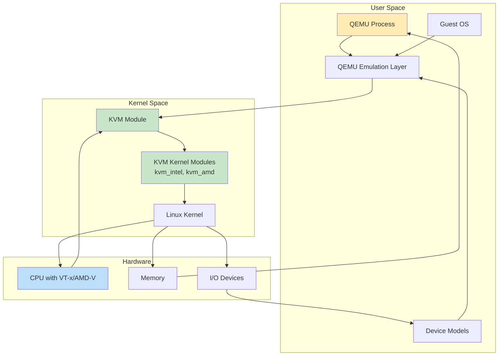
```mermaid
graph TB
    subgraph "User Space"
        A[QEMU Process]
        B[Guest OS]
        C[QEMU Emulation Layer]
        D[Device Models]
    end
    
    subgraph "Kernel Space"
        E[KVM Module]
        F[KVM Kernel Modules<br/>kvm_intel, kvm_amd]
        G[Linux Kernel]
    end
    
    subgraph "Hardware"
        H[CPU with VT-x/AMD-V]
        I[Memory]
        J[I/O Devices]
    end
    
    A --> C
    B --> C
    C --> E
    D --> C
    
    E --> F
    F --> G
    G --> H
    G --> I
    G --> J
    
    H --> E
    I --> A
    J --> D
    
    style A fill:#ffecb3
    style E fill:#c8e6c9
    style F fill:#c8e6c9
    style H fill:#bbdefb
```

### 1.3 Virtualization Types

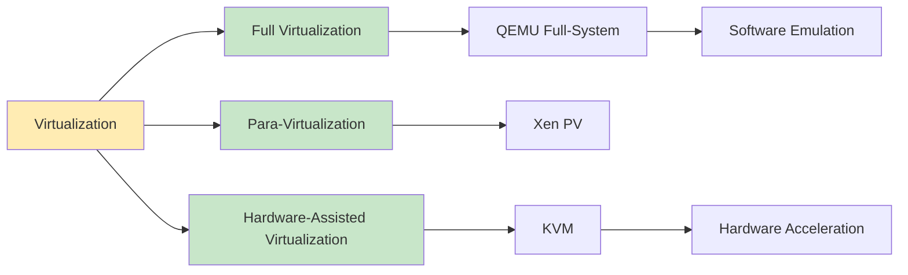
```mermaid
graph LR
    A[Virtualization] --> B[Full Virtualization]
    A --> C[Para-Virtualization]
    A --> D[Hardware-Assisted Virtualization]
    
    B --> B1[QEMU Full-System]
    C --> C1[Xen PV]
    D --> D1[KVM]
    
    B1 --> B2[Software Emulation]
    D1 --> D2[Hardware Acceleration]
    
    style A fill:#ffecb3
    style B fill:#c8e6c9
    style C fill:#c8e6c9
    style D fill:#c8e6c9
```

---

## 2. QEMU Architecture

### 2.1 Core Components

#### QEMU Process Structure

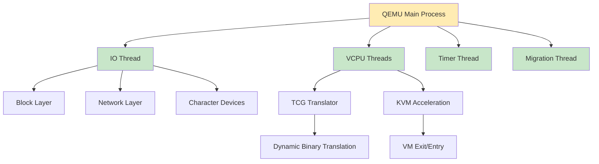
```mermaid
graph TB
    A[QEMU Main Process] --> B[IO Thread]
    A --> C[VCPU Threads]
    A --> D[Timer Thread]
    A --> E[Migration Thread]
    
    B --> F[Block Layer]
    B --> G[Network Layer]
    B --> H[Character Devices]
    
    C --> I[TCG Translator]
    C --> J[KVM Acceleration]
    
    I --> K[Dynamic Binary Translation]
    J --> L[VM Exit/Entry]
    
    style A fill:#ffecb3
    style B fill:#c8e6c9
    style C fill:#c8e6c9
    style D fill:#c8e6c9
    style E fill:#c8e6c9
```

### 2.2 QEMU Operation Modes

#### Full-System Emulation
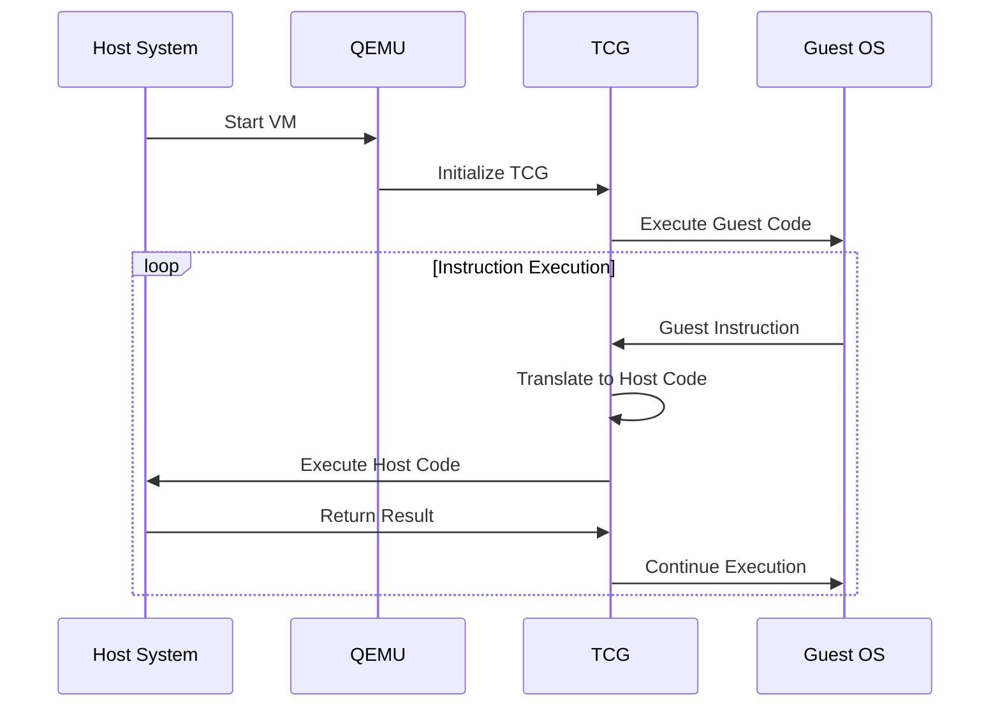
```mermaid
sequenceDiagram
    participant Host as Host System
    participant QEMU as QEMU
    participant TCG as TCG
    participant Guest as Guest OS
    
    Host->>QEMU: Start VM
    QEMU->>TCG: Initialize TCG
    TCG->>Guest: Execute Guest Code
    
    loop Instruction Execution
        Guest->>TCG: Guest Instruction
        TCG->>TCG: Translate to Host Code
        TCG->>Host: Execute Host Code
        Host->>TCG: Return Result
        TCG->>Guest: Continue Execution
    end
```

#### User-Mode Emulation
```
Purpose: Run binaries for different architectures on host system
Use Cases: Cross-platform binary execution, emulation layer
Performance: Near-native for simple syscalls
Limitations: Only userspace, no kernel emulation
```

### 2.3 TCG (Tiny Code Generator)

#### TCG Architecture

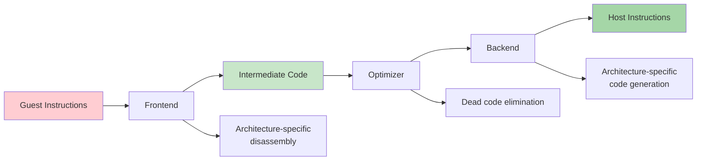
```mermaid
graph LR
    A[Guest Instructions] --> B[Frontend]
    B --> C[Intermediate Code]
    C --> D[Optimizer]
    D --> E[Backend]
    E --> F[Host Instructions]
    
    B --> B1[Architecture-specific<br/>disassembly]
    D --> D1[Dead code elimination]
    E --> E1[Architecture-specific<br/>code generation]
    
    style A fill:#ffcdd2
    style C fill:#c8e6c9
    style F fill:#a5d6a7
```

#### TCG Translation Process

```
TCG Translation Pipeline:
1. Frontend disassembles guest instructions
2. Converts to TCG intermediate representation
3. Optimization passes applied
4. Backend generates host machine code
5. Code cached for reuse
6. Cached code executed on host CPU
```

### 2.4 Device Emulation

#### Emulated Devices

| Device Type | Examples | Description |
|-------------|----------|-------------|
| Network | e1000, virtio-net, rtl8139 | Network adapters |
| Storage | virtio-blk, IDE, SCSI, NVMe | Storage controllers |
| Graphics | VGA, virtio-gpu, qxl | Display adapters |
| Input | virtio-keyboard, virtio-mouse | Input devices |
| Audio | AC97, HDA, virtio-snd | Sound devices |

#### Virtio Architecture

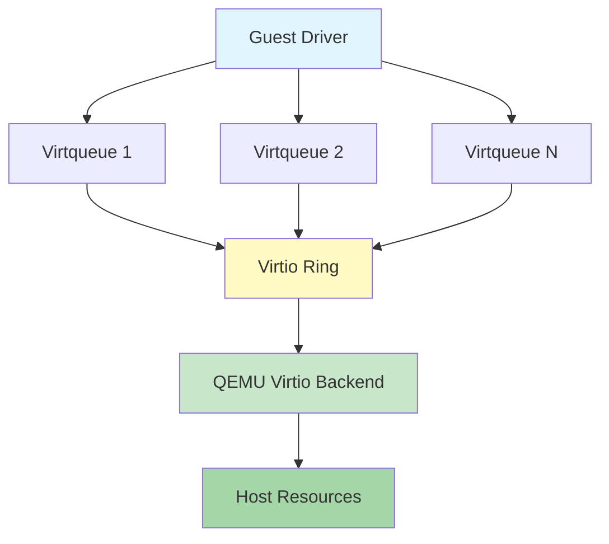
```mermaid
graph TB
    A[Guest Driver] --> B[Virtqueue 1]
    A --> C[Virtqueue 2]
    A --> D[Virtqueue N]
    
    B --> E[Virtio Ring]
    C --> E
    D --> E
    
    E --> F[QEMU Virtio Backend]
    
    F --> G[Host Resources]
    
    style A fill:#e1f5fe
    style E fill:#fff9c4
    style F fill:#c8e6c9
    style G fill:#a5d6a7
```

---

## 3. KVM Architecture

### 3.1 KVM Kernel Modules

#### Module Structure

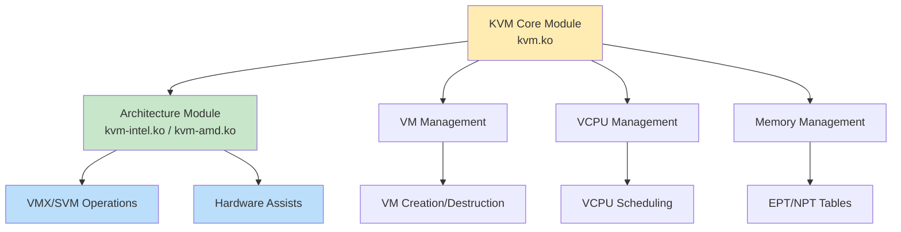
```mermaid
graph TB
    A[KVM Core Module<br/>kvm.ko] --> B[Architecture Module<br/>kvm-intel.ko / kvm-amd.ko]
    
    A --> C[VM Management]
    A --> D[VCPU Management]
    A --> E[Memory Management]
    
    B --> F[VMX/SVM Operations]
    B --> G[Hardware Assists]
    
    C --> H[VM Creation/Destruction]
    D --> I[VCPU Scheduling]
    E --> J[EPT/NPT Tables]
    
    style A fill:#ffecb3
    style B fill:#c8e6c9
    style F fill:#bbdefb
    style G fill:#bbdefb
```

### 3.2 Hardware Virtualization

#### Intel VT-x Extensions

| Extension | Description |
|-----------|-------------|
| VMX | Virtual Machine Extensions |
| EPT | Extended Page Tables |
| VPID | Virtual Processor Identifier |
| APICV | Virtual APIC |

#### AMD-V Extensions

| Extension | Description |
|-----------|-------------|
| SVM | Secure Virtual Machine |
| NPT | Nested Page Tables |
| AVIC | Advanced Virtual Interrupt Controller |
| AMD IOMMU | I/O Memory Management Unit |

### 3.3 VM Exit/Entry Cycle

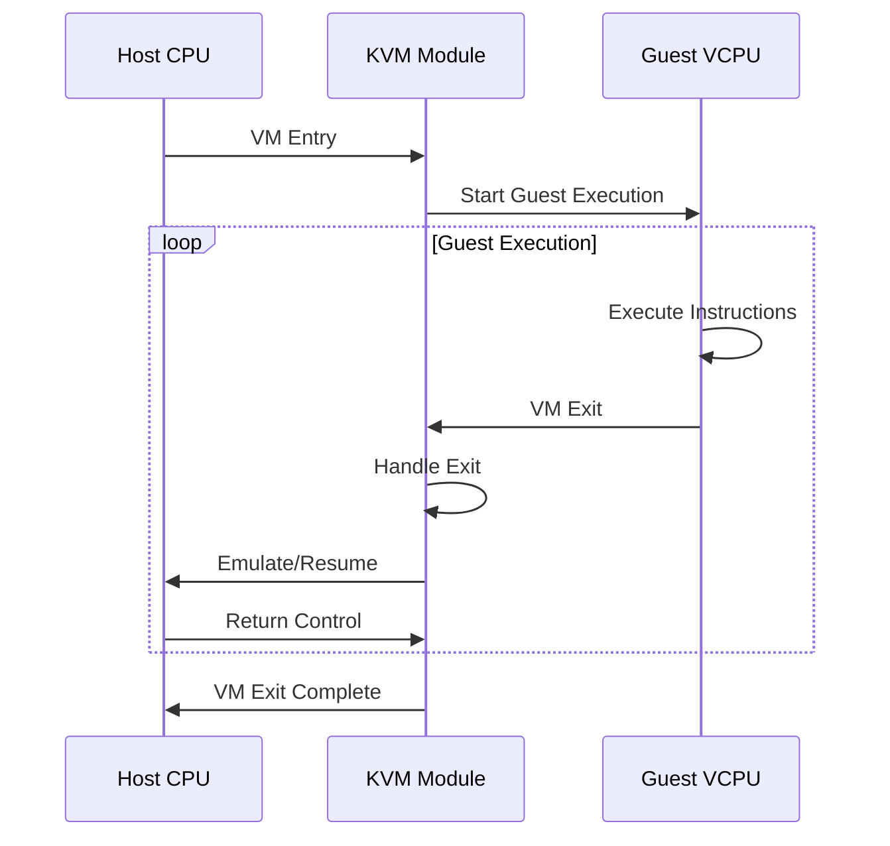
```mermaid
sequenceDiagram
    participant Host as Host CPU
    participant KVM as KVM Module
    participant Guest as Guest VCPU
    
    Host->>KVM: VM Entry
    KVM->>Guest: Start Guest Execution
    
    loop Guest Execution
        Guest->>Guest: Execute Instructions
        Guest->>KVM: VM Exit
        KVM->>KVM: Handle Exit
        KVM->>Host: Emulate/Resume
        Host->>KVM: Return Control
    end
    
    KVM->>Host: VM Exit Complete
```

### 3.4 KVM Exit Reasons

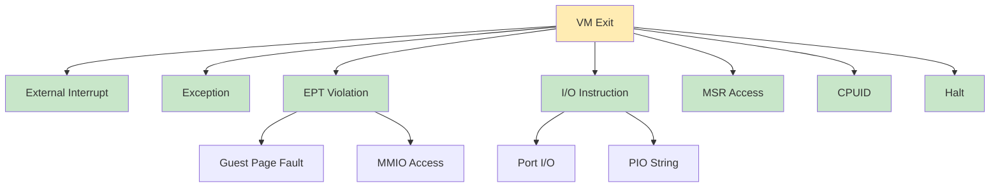
```mermaid
graph TD
    A[VM Exit] --> B[External Interrupt]
    A --> C[Exception]
    A --> D[EPT Violation]
    A --> E[I/O Instruction]
    A --> F[MSR Access]
    A --> G[CPUID]
    A --> H[Halt]
    
    D --> D1[Guest Page Fault]
    D --> D2[MMIO Access]
    
    E --> E1[Port I/O]
    E --> E2[PIO String]
    
    style A fill:#ffecb3
    style B fill:#c8e6c9
    style C fill:#c8e6c9
    style D fill:#c8e6c9
    style E fill:#c8e6c9
    style F fill:#c8e6c9
    style G fill:#c8e6c9
    style H fill:#c8e6c9
```

---

## 4. Integration of QEMU and KVM

### 4.1 Combined Architecture

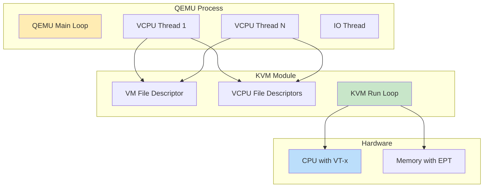
```mermaid
graph TB
    subgraph "QEMU Process"
        A[QEMU Main Loop]
        B[VCPU Thread 1]
        C[VCPU Thread N]
        D[IO Thread]
    end
    
    subgraph "KVM Module"
        E[VM File Descriptor]
        F[VCPU File Descriptors]
        G[KVM Run Loop]
    end
    
    subgraph "Hardware"
        H[CPU with VT-x]
        I[Memory with EPT]
    end
    
    B --> E
    C --> E
    B --> F
    C --> F
    
    G --> H
    G --> I
    
    style A fill:#ffecb3
    style G fill:#c8e6c9
    style H fill:#bbdefb
```

### 4.2 KVM Acceleration Flow

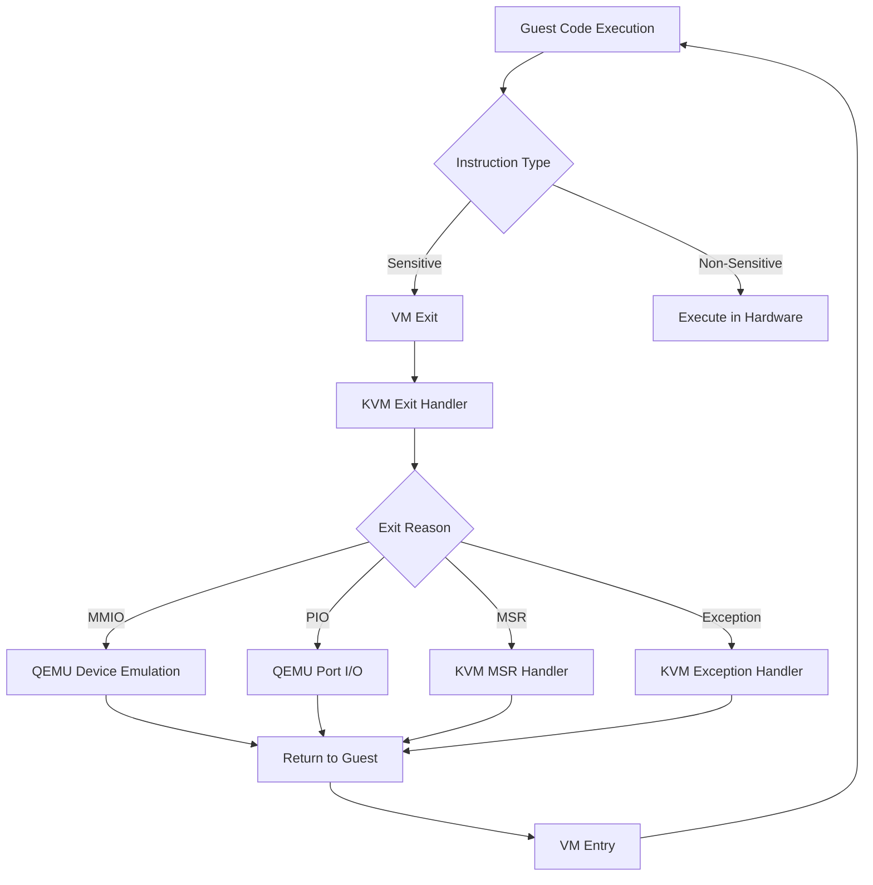
```mermaid
flowchart TD
    A[Guest Code Execution] --> B{Instruction Type}
    
    B -->|Sensitive| C[VM Exit]
    B -->|Non-Sensitive| D[Execute in Hardware]
    
    C --> E[KVM Exit Handler]
    E --> F{Exit Reason}
    
    F -->|MMIO| G[QEMU Device Emulation]
    F -->|PIO| H[QEMU Port I/O]
    F -->|MSR| I[KVM MSR Handler]
    F -->|Exception| J[KVM Exception Handler]
    
    G --> K[Return to Guest]
    H --> K
    I --> K
    J --> K
    
    K --> L[VM Entry]
    L --> A
```

### 4.3 Memory Management

#### EPT/NPT Translation

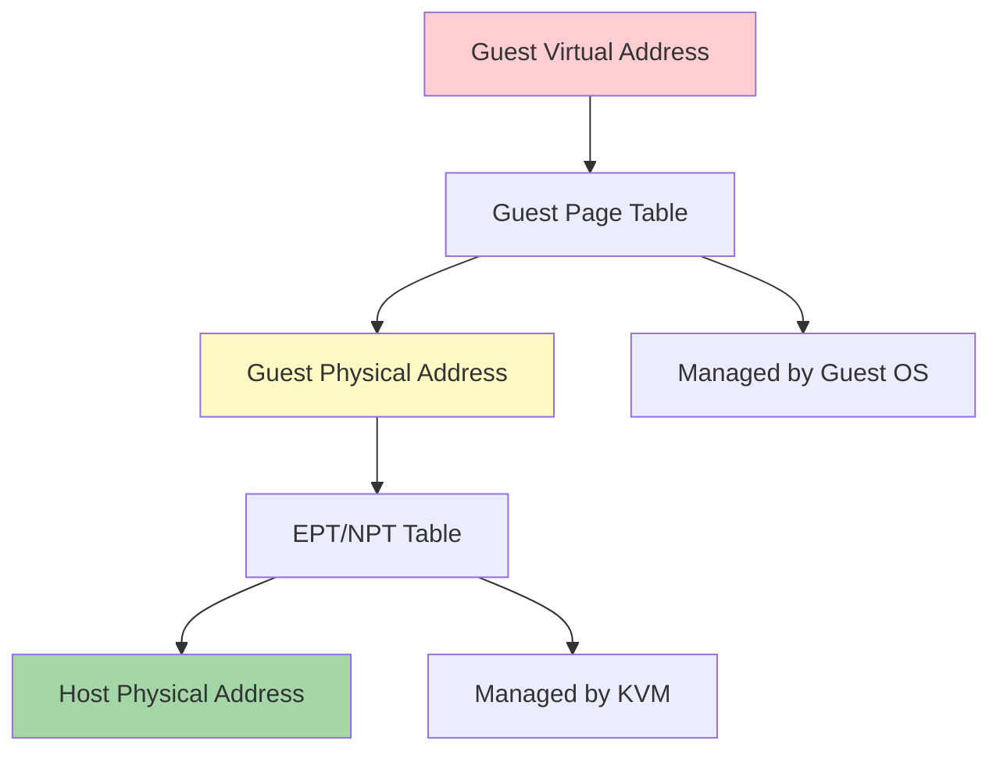
```mermaid
graph TB
    A[Guest Virtual Address] --> B[Guest Page Table]
    B --> C[Guest Physical Address]
    C --> D[EPT/NPT Table]
    D --> E[Host Physical Address]
    
    B --> B1[Managed by Guest OS]
    D --> D1[Managed by KVM]
    
    style A fill:#ffcdd2
    style C fill:#fff9c4
    style E fill:#a5d6a7
```

---

## 5. Deployment Recommendations

### 5.1 Hardware Requirements

#### Minimum System Requirements
- CPU: Supports Intel VT-x or AMD-V
- RAM: 4 GB minimum
- Storage: 20 GB for host, 10 GB per VM minimum
- Network: 1 Gbps Ethernet

#### Recommended Production Configuration
- CPU: Multi-core with hardware virtualization support
- RAM: 16 GB or more
- Storage: SSD with sufficient IOPS
- Network: 10 Gbps or faster
- NUMA-aware architecture for large systems

### 5.2 Installation

#### Installing KVM and QEMU

```bash
# Check CPU support
lscpu | grep Virtualization
# Or
egrep -c '(vmx|svm)' /proc/cpuinfo

# Install packages
# Debian/Ubuntu
apt-get install qemu-kvm libvirt-daemon-system libvirt-clients virt-manager

# RHEL/CentOS
yum install qemu-kvm libvirt virt-install virt-manager

# Enable and start libvirt
systemctl enable libvirtd
systemctl start libvirtd

# Add user to libvirt group
usermod -aG libvirt $(whoami)

# Verify installation
virsh version
qemu-system-x86_64 --version
```

### 5.3 Network Configuration

#### Default Network Setup

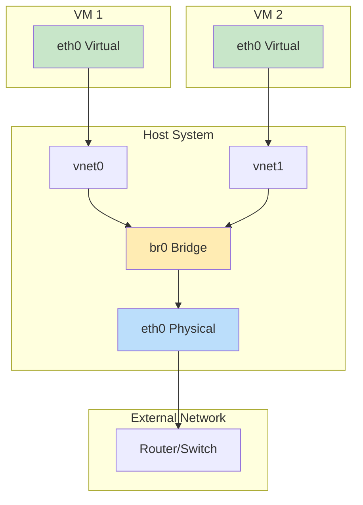
```mermaid
graph TB
    subgraph "Host System"
        A[br0 Bridge]
        B[vnet0]
        C[vnet1]
        D[eth0 Physical]
    end
    
    subgraph "VM 1"
        E[eth0 Virtual]
    end
    
    subgraph "VM 2"
        F[eth0 Virtual]
    end
    
    subgraph "External Network"
        G[Router/Switch]
    end
    
    E --> B
    F --> C
    B --> A
    C --> A
    A --> D
    D --> G
    
    style A fill:#ffecb3
    style D fill:#bbdefb
    style E fill:#c8e6c9
    style F fill:#c8e6c9
```

#### Network Configuration Example

```bash
# Create bridge network
virsh net-define <(cat <<EOF
<network>
  <name>br0</name>
  <forward mode='bridge'/>
  <bridge name='br0' stp='on' delay='0'/>
</network>
EOF
)

# Start network
virsh net-start br0
virsh net-autostart br0

# Create isolated network
virsh net-define <(cat <<EOF
<network>
  <name>isolated</name>
  <forward mode='none'/>
</network>
EOF
)
```

### 5.4 Virtual Machine Creation

#### Creating a VM with virt-install

```bash
# Create VM from ISO
virt-install \
  --name vm1 \
  --memory 2048 \
  --vcpus 2 \
  --disk path=/var/lib/libvirt/images/vm1.qcow2,size=20 \
  --cdrom /path/to/iso.iso \
  --network network=default \
  --graphics spice \
  --os-variant ubuntu20.04

# Create VM from disk image
virt-install \
  --name vm2 \
  --memory 4096 \
  --vcpus 4 \
  --disk path=/var/lib/libvirt/images/vm2.qcow2 \
  --import \
  --os-variant rhel8

# Create VM with direct QEMU command
qemu-system-x86_64 \
  -name vm3 \
  -m 2048 \
  -smp 2 \
  -drive file=/var/lib/libvirt/images/vm3.qcow2,format=qcow2 \
  -netdev user,id=net0,hostfwd=tcp::2222-:22 \
  -device virtio-net-pci,netdev=net0 \
  -nographic
```

---

## 6. Code Behavior Analysis

### 6.1 QEMU Main Loop

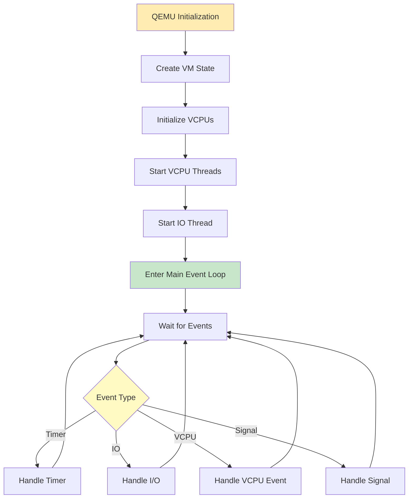
```mermaid
flowchart TD
    A[QEMU Initialization] --> B[Create VM State]
    B --> C[Initialize VCPUs]
    C --> D[Start VCPU Threads]
    D --> E[Start IO Thread]
    E --> F[Enter Main Event Loop]
    
    F --> G[Wait for Events]
    G --> H{Event Type}
    
    H -->|Timer| I[Handle Timer]
    H -->|IO| J[Handle I/O]
    H -->|VCPU| K[Handle VCPU Event]
    H -->|Signal| L[Handle Signal]
    
    I --> G
    J --> G
    K --> G
    L --> G
    
    style A fill:#ffecb3
    style F fill:#c8e6c9
    style H fill:#fff9c4
```

### 6.2 VCPU Thread Behavior

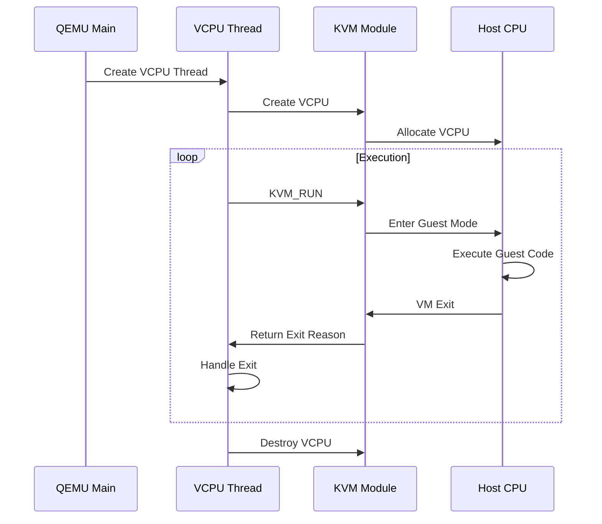
```mermaid
sequenceDiagram
    participant Main as QEMU Main
    participant VCPU as VCPU Thread
    participant KVM as KVM Module
    participant CPU as Host CPU
    
    Main->>VCPU: Create VCPU Thread
    VCPU->>KVM: Create VCPU
    KVM->>CPU: Allocate VCPU
    
    loop Execution
        VCPU->>KVM: KVM_RUN
        KVM->>CPU: Enter Guest Mode
        CPU->>CPU: Execute Guest Code
        CPU->>KVM: VM Exit
        KVM->>VCPU: Return Exit Reason
        VCPU->>VCPU: Handle Exit
    end
    
    VCPU->>KVM: Destroy VCPU
```

### 6.3 Memory Access Patterns

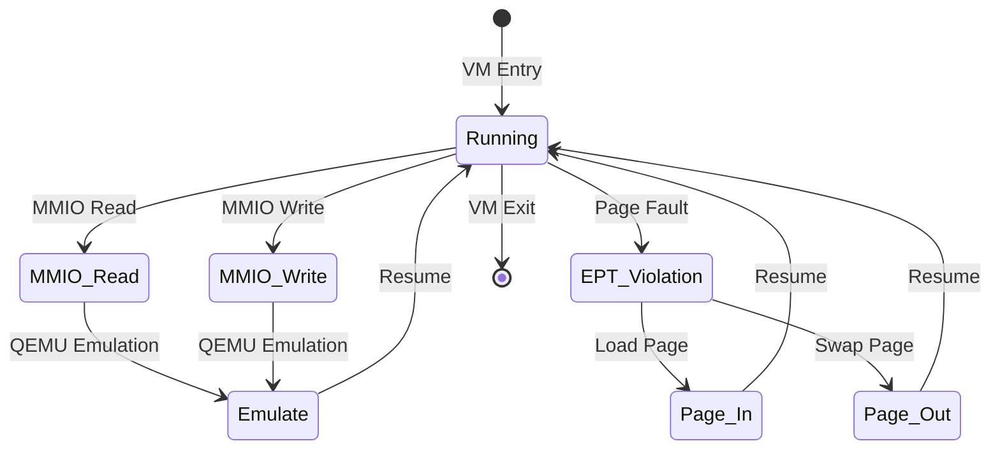
```mermaid
stateDiagram-v2
    [*] --> Running: VM Entry
    Running --> MMIO_Read: MMIO Read
    Running --> MMIO_Write: MMIO Write
    Running --> EPT_Violation: Page Fault
    
    MMIO_Read --> Emulate: QEMU Emulation
    MMIO_Write --> Emulate: QEMU Emulation
    
    EPT_Violation --> Page_In: Load Page
    EPT_Violation --> Page_Out: Swap Page
    
    Emulate --> Running: Resume
    Page_In --> Running: Resume
    Page_Out --> Running: Resume
    
    Running --> [*]: VM Exit
```

### 6.4 Device Emulation Flow

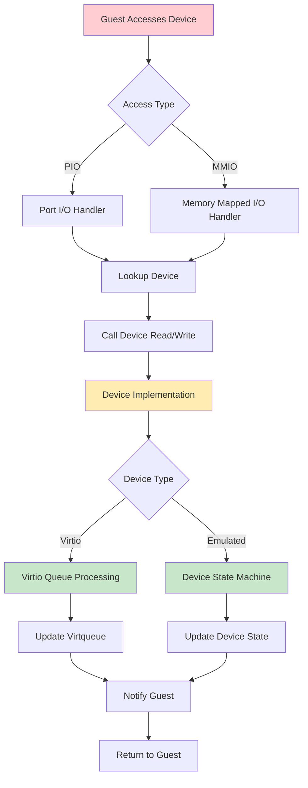
```mermaid
flowchart TD
    A[Guest Accesses Device] --> B{Access Type}
    
    B -->|PIO| C[Port I/O Handler]
    B -->|MMIO| D[Memory Mapped I/O Handler]
    
    C --> E[Lookup Device]
    D --> E
    
    E --> F[Call Device Read/Write]
    F --> G[Device Implementation]
    
    G --> H{Device Type}
    
    H -->|Virtio| I[Virtio Queue Processing]
    H -->|Emulated| J[Device State Machine]
    
    I --> K[Update Virtqueue]
    J --> L[Update Device State]
    
    K --> M[Notify Guest]
    L --> M
    
    M --> N[Return to Guest]
    
    style A fill:#ffcdd2
    style G fill:#ffecb3
    style I fill:#c8e6c9
    style J fill:#c8e6c9
```

---

## 7. Source Code Reference

### 7.1 Repository Information

#### QEMU
- **Repository**: https://github.com/qemu/qemu
- **Official Site**: https://www.qemu.org/
- **License**: GPL-2.0 and LGPL-2.1
- **Primary Language**: C (79.9%), C++ (11.5%)

#### KVM
- **Repository**: https://github.com/torvalds/linux/tree/master/virt/kvm
- **Location in Linux Kernel**: `virt/kvm/`
- **License**: GPL-2.0
- **Language**: C

### 7.2 QEMU Directory Structure

```
qemu/
├── accel/              # Acceleration frameworks (KVM, TCG, Xen)
├── audio/              # Audio subsystem
├── backends/           # Backend implementations
├── block/              # Block device layer
├── chardev/            # Character devices
├── crypto/             # Cryptographic primitives
├── disas/             # Disassemblers
├── docs/               # Documentation
├── fpu/                # Floating point emulation
├── gdbstub/            # GDB stub
├── hw/                 # Hardware device models
│   ├── arm/           # ARM-specific devices
│   ├── i386/          # x86-specific devices
│   ├── net/           # Network devices
│   ├── scsi/          # SCSI devices
│   └── virtio/        # Virtio devices
├── include/            # Header files
├── io/                 # I/O channels
├── linux-user/         # Linux user-mode emulation
├── migration/          # Live migration
├── monitor/            # Monitor protocol
├── net/                # Network subsystem
├── qapi/               # QMP/QGA API
├── qga/                # QEMU Guest Agent
├── qom/                # QEMU Object Model
├── replay/             # Execution replay
├── target/             # Target architectures
│   ├── i386/          # x86 target
│   ├── arm/           # ARM target
│   └── ...
├── tcg/                # Tiny Code Generator
├── tests/              # Test suites
├── ui/                 # User interface
└── util/               # Utilities
```

### 7.3 KVM Directory Structure

```
linux/virt/kvm/
├── kvm_main.c          # Main KVM module
├── irqchip.c           # IRQ chip emulation
├── mmu.c               # Memory management unit
├── coalesced_mmio.c    # Coalesced MMIO
├── eventfd.c           # Eventfd support
├── irq_comm.c          # IRQ communication
├── vfio.c              # VFIO support
├── async_pf.c          # Async page fault
├── binary_stats.c      # Binary statistics
└── ...

linux/arch/x86/kvm/
├── vmx.c              # Intel VMX support
├── svm.c              # AMD SVM support
├── x86.c              # Common x86 code
├── mmu.c              # x86 MMU
├── lapic.c            # Local APIC
├── ioapic.c           # I/O APIC
├── irq.h              # IRQ definitions
└── ...
```

### 7.4 Key Source Files

#### QEMU Core
- `vl.c` - QEMU main entry point
- `cpus.c` - CPU and VCPU management
- `migration.c` - Live migration
- `block.c` - Block device layer
- `qdev.c` - Device model

#### QEMU KVM Acceleration
- `accel/kvm/kvm-all.c` - KVM acceleration
- `accel/kvm/kvm-cpu.c` - KVM CPU operations

#### KVM Core
- `virt/kvm/kvm_main.c` - Main KVM module
- `virt/kvm/irqchip.c` - IRQ chip emulation
- `virt/kvm/mmu.c` - Memory management

#### KVM x86
- `arch/x86/kvm/vmx.c` - Intel VT-x implementation
- `arch/x86/kvm/svm.c` - AMD-V implementation
- `arch/x86/kvm/x86.c` - Common x86 code

### 7.5 Building from Source

#### Building QEMU

```bash
# Clone repository
git clone https://gitlab.com/qemu-project/qemu.git
cd qemu

# Install build dependencies
# Debian/Ubuntu
apt-get install build-essential ninja-build pkg-config \
    libglib2.0-dev libpixman-1-dev libslirp-dev

# RHEL/CentOS
yum groupinstall "Development Tools"
yum install ninja-build pkg-config glib2-devel \
    pixman-devel slirp-devel

# Configure
./configure --prefix=/usr/local \
            --target-list=x86_64-softmmu \
            --enable-kvm

# Build
make -j$(nproc)

# Install
make install

# Run tests
make check
```

#### Building KVM

```bash
# KVM is part of Linux kernel
git clone https://github.com/torvalds/linux.git
cd linux

# Configure kernel
make menuconfig
# Enable: Virtualization -> KVM
# Enable: Device Drivers -> VFIO

# Build kernel
make -j$(nproc)

# Install modules
make modules_install
make install

# Reboot into new kernel
```

---

## 8. Virtualization Modes

### 8.1 Full System Emulation

#### Characteristics
- Complete computer system emulation
- CPU, memory, devices all emulated
- Runs unmodified guest OS
- Slower but most compatible

#### Use Cases
- Cross-architecture emulation
- Testing/debugging
- Legacy system support

```bash
# Emulate ARM on x86
qemu-system-aarch64 \
  -M virt \
  -cpu cortex-a57 \
  -m 1G \
  -drive file=arm-image.qcow2,if=virtio \
  -net nic -net user
```

### 8.2 KVM Acceleration

#### Characteristics
- Hardware-assisted virtualization
- Near-native performance
- Guest code runs directly on CPU
- Requires compatible hardware

#### Use Cases
- Production workloads
- High-performance requirements
- Native architecture only

```bash
# Use KVM acceleration
qemu-system-x86_64 \
  -enable-kvm \
  -name vm1 \
  -m 2048 \
  -smp 2 \
  -drive file=vm1.qcow2,if=virtio
```

### 8.3 User-Mode Emulation

#### Characteristics
- Emulates only userspace
- Uses host kernel
- Very fast for simple workloads
- Limited compatibility

#### Use Cases
- Cross-platform binaries
- Development and testing
- Software development

```bash
# Run ARM binary on x86
qemu-arm /path/to/arm-binary

# Run with debug
qemu-arm -d in_asm,cpu,out_asm /path/to/arm-binary
```

---

## 9. Configuration and Management

### 9.1 libvirt Integration

#### libvirt Architecture

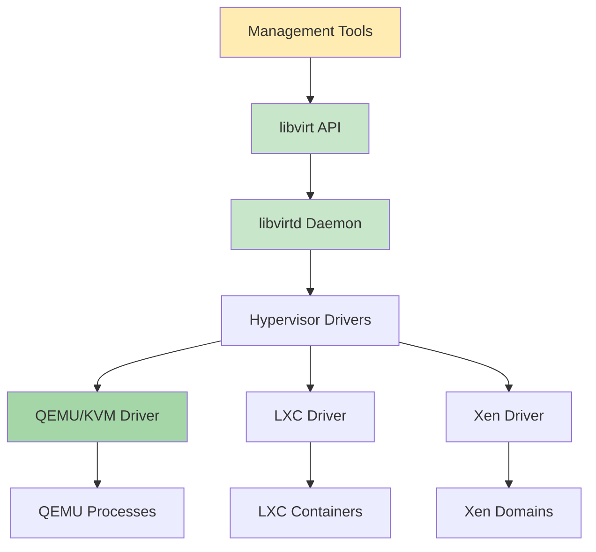
```mermaid
graph TB
    A[Management Tools] --> B[libvirt API]
    B --> C[libvirtd Daemon]
    C --> D[Hypervisor Drivers]
    
    D --> E[QEMU/KVM Driver]
    D --> F[LXC Driver]
    D --> G[Xen Driver]
    
    E --> H[QEMU Processes]
    F --> I[LXC Containers]
    G --> J[Xen Domains]
    
    style A fill:#ffecb3
    style B fill:#c8e6c9
    style C fill:#c8e6c9
    style E fill:#a5d6a7
```

#### Basic libvirt Commands

```bash
# List VMs
virsh list --all

# VM information
virsh dominfo vm1
virsh dumpxml vm1

# VM lifecycle
virsh start vm1
virsh shutdown vm1
virsh destroy vm1

# VM management
virsh define vm1.xml
virsh undefine vm1
virsh autostart vm1

# Resource management
virsh setvcpus vm1 4 --live
virsh setmem vm1 4G --live
```

### 9.2 XML Configuration

#### VM XML Template

```xml
<domain type='kvm'>
  <name>vm1</name>
  <memory unit='KiB'>2097152</memory>
  <vcpu placement='static'>2</vcpu>
  
  <os>
    <type arch='x86_64' machine='pc'>hvm</type>
    <boot dev='hd'/>
  </os>
  
  <features>
    <acpi/>
    <apic/>
    <vmport state='off'/>
  </features>
  
  <cpu mode='host-passthrough'/>
  
  <clock offset='utc'>
    <timer name='rtc' tickpolicy='catchup'/>
    <timer name='pit' tickpolicy='delay'/>
    <timer name='hpet' present='no'/>
  </clock>
  
  <on_poweroff>destroy</on_poweroff>
  <on_reboot>restart</on_reboot>
  <on_crash>restart</on_crash>
  
  <devices>
    <emulator>/usr/bin/qemu-system-x86_64</emulator>
    
    <disk type='file' device='disk'>
      <driver name='qemu' type='qcow2'/>
      <source file='/var/lib/libvirt/images/vm1.qcow2'/>
      <target dev='vda' bus='virtio'/>
    </disk>
    
    <interface type='network'>
      <mac address='52:54:00:71:b1:b6'/>
      <source network='default'/>
      <model type='virtio'/>
    </interface>
    
    <graphics type='spice' autoport='yes'/>
    <video>
      <model type='qxl'/>
    </video>
  </devices>
</domain>
```

### 9.3 QMP (QEMU Monitor Protocol)

#### QMP Commands

```bash
# Connect to QMP
socat UNIX-CONNECT:/var/run/libvirt/qemu/vm1.monitor -
# Or using virsh
virsh qemu-monitor-command vm1 --hmp

# QMP examples
{"execute":"qmp_capabilities"}
{"execute":"query-status"}
{"execute":"query-cpus"}
{"execute":"query-block"}
{"execute":"system_powerdown"}
```

### 9.4 Performance Tuning

#### CPU Configuration

```xml
<!-- CPU pinning -->
<vcpu placement='static'>4</vcpu>
<cputune>
  <vcpupin vcpu='0' cpuset='0'/>
  <vcpupin vcpu='1' cpuset='1'/>
  <vcpupin vcpu='2' cpuset='2'/>
  <vcpupin vcpu='3' cpuset='3'/>
</cputune>

<!-- NUMA configuration -->
<numa>
  <cell cpus='0-1' memory='1048576' unit='KiB'/>
  <cell cpus='2-3' memory='1048576' unit='KiB'/>
</numa>
```

#### Memory Configuration

```xml
<!-- Hugepages -->
<memoryBacking>
  <hugepages>
    <page size='2048' unit='KiB'/>
  </hugepages>
</memoryBacking>

<!-- Memory ballooning -->
<memory model='dimm'>
  <target>
    <size unit='KiB'>1048576</size>
    <node>0</node>
  </target>
</memory>
```

---

## 10. Troubleshooting and Monitoring

### 10.1 Monitoring Tools

#### Performance Monitoring

```bash
# VM performance
virsh dommemstat vm1
virsh vcpuinfo vm1

# QEMU statistics
virsh domstats --cpu --block --interface vm1

# System monitoring
top -H
iotop
iftop
```

#### Debugging Tools

```bash
# Enable QEMU debug
qemu-system-x86_64 -d in_asm,op,cpu

# Enable KVM debug
echo 1 > /sys/module/kvm/parameters/debug
echo 1 > /sys/module/kvm_intel/parameters/debug

# Trace events
trace-cmd record -e kvm:* -e qemu:*
trace-cmd report
```

### 10.2 Common Issues

#### Issue 1: Slow Performance

```
Symptoms: VM performance is sluggish
Causes: Missing virtualization, improper configuration
Solutions:
1. Verify hardware virtualization support
2. Enable KVM acceleration
3. Use virtio drivers
4. Tune CPU and memory allocation
5. Use SSD storage
```

#### Issue 2: Network Issues

```
Symptoms: VM cannot access network
Causes: Network misconfiguration, firewall rules
Solutions:
1. Verify bridge configuration
2. Check firewall rules
3. Use correct network model (virtio)
4. Verify IP configuration
```

#### Issue 3: Memory Issues

```
Symptoms: Out of memory errors
Causes: Overcommitment, insufficient host memory
Solutions:
1. Allocate sufficient host memory
2. Use memory ballooning
3. Enable swap on host
4. Monitor memory usage
```

---

## 11. Advanced Topics

### 11.1 Live Migration

#### Migration Process

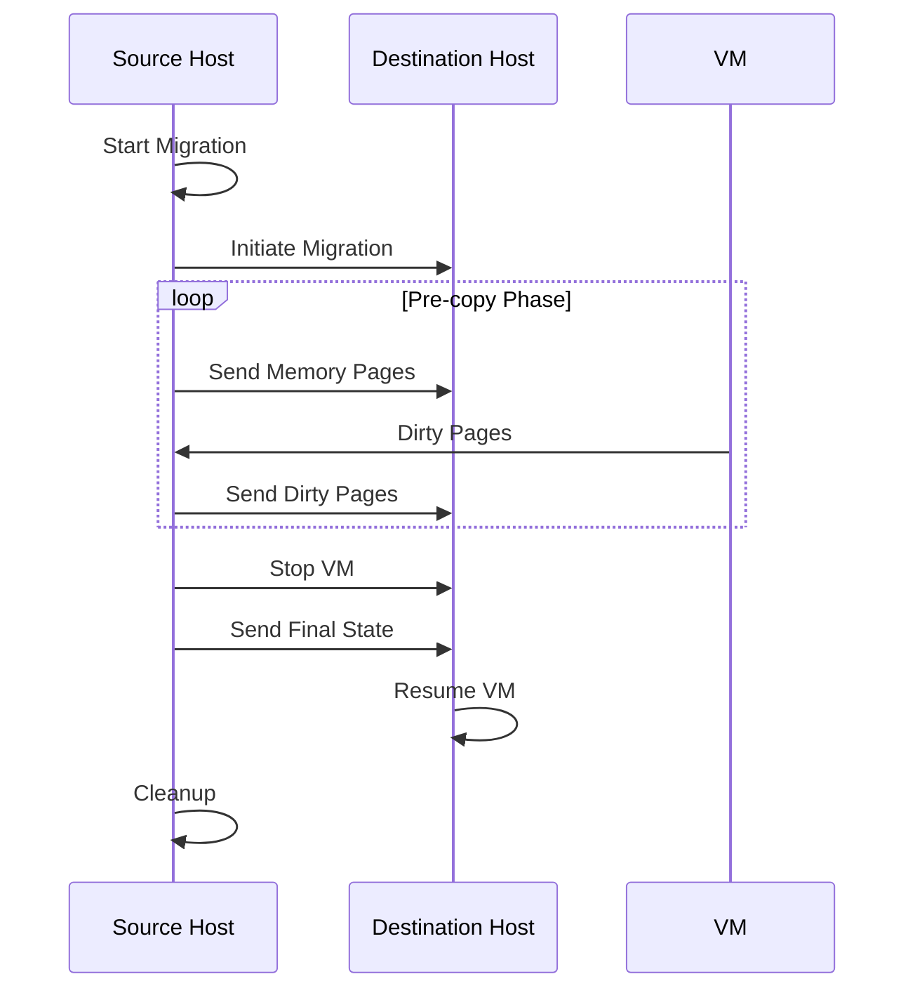
```mermaid
sequenceDiagram
    participant Src as Source Host
    participant Dst as Destination Host
    participant VM as VM
    
    Src->>Src: Start Migration
    Src->>Dst: Initiate Migration
    
    loop Pre-copy Phase
        Src->>Dst: Send Memory Pages
        VM->>Src: Dirty Pages
        Src->>Dst: Send Dirty Pages
    end
    
    Src->>Dst: Stop VM
    Src->>Dst: Send Final State
    Dst->>Dst: Resume VM
    Src->>Src: Cleanup
```

#### Migration Commands

```bash
# Live migration
virsh migrate --live --persistent vm1 qemu+tcp://dest/system

# Migration with storage
virsh migrate --live --copy-storage-all vm1 \
    qemu+tcp://dest/system

# Check migration progress
watch virsh domjobinfo vm1
```

### 11.2 Device Passthrough

#### VFIO (Virtual Function I/O)

```bash
# Enable IOMMU
# GRUB: intel_iommu=on amd_iommu=on

# Load VFIO modules
modprobe vfio
modprobe vfio_pci
modprobe vfio_iommu_type1

# Bind device to VFIO
echo 0000:01:00.0 > /sys/bus/pci/drivers/vfio-pci/bind

# VM XML configuration
<hostdev mode='subsystem' type='pci' managed='yes'>
  <driver name='vfio'/>
  <source>
    <address domain='0x0000' bus='0x01' slot='0x00' function='0x0'/>
  </source>
</hostdev>
```

### 11.3 Nested Virtualization

```bash
# Enable nested virtualization on Intel
modprobe -r kvm_intel
modprobe kvm_intel nested=1

# Verify
cat /sys/module/kvm_intel/parameters/nested

# VM configuration
<cpu mode='host-passthrough'/>
```

### 11.4 Security

#### Seccomp Filters

```xml
<seccomp>
  <filter action='drop'>
    <rule action='errno'>
      <syscall name='getuid'/>
    </rule>
  </filter>
</seccomp>
```

#### AppArmor/SELinux Profiles

```bash
# AppArmor profile
aa-complain /etc/apparmor.d/usr.sbin.libvirtd

# SELinux context
semanage fcontext -a -t virt_image_t "/path/to/vm-images(/.*)?"
restorecon -R /path/to/vm-images
```

---

## Appendices

### Appendix A: Command Reference

| Command | Description |
|---------|-------------|
| `qemu-system-x86_64` | Run QEMU VM |
| `virt-install` | Create new VM |
| `virsh` | libvirt management tool |
| `virt-manager` | GUI management tool |
| `virt-top` VM | performance monitoring |
| `virt-df` | VM disk usage |

### Appendix B: Configuration Options

#### QEMU Options
- `-m`: Memory size
- `-smp`: CPU count
- `-drive`: Disk configuration
- `-netdev`: Network configuration
- `-device`: Device configuration
- `-enable-kvm`: Enable KVM acceleration

#### CPU Modes
- `host-passthrough`: Pass all CPU features
- `host-model`: Emulate host CPU model
- `custom`: Specify CPU features
- `host-passthrough`: Best performance

### Appendix C: Performance Metrics

Key performance indicators:
- CPU utilization
- Memory usage
- Disk I/O throughput
- Network throughput
- VM exit rate
- Page fault rate

### Appendix D: Recommended Reading

1. QEMU Documentation
2. KVM Documentation
3. libvirt Documentation
4. Virtualization Best Practices
5. Hardware Virtualization Specifications

---

## Further Resources

- **QEMU Official**: https://www.qemu.org/
- **QEMU Source**: https://gitlab.com/qemu-project/qemu
- **KVM Official**: https://www.linux-kvm.org/
- **libvirt Official**: https://libvirt.org/
- **Mailing Lists**: qemu-devel@nongnu.org
- **Bug Trackers**: https://gitlab.com/qemu-project/qemu/-/issues
