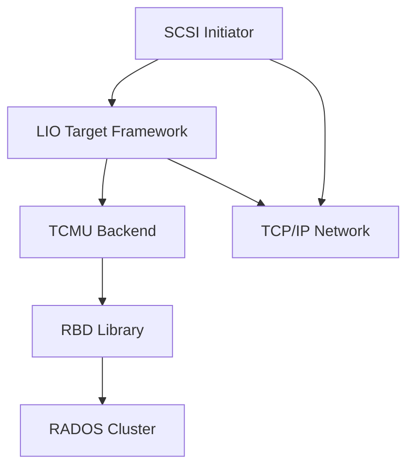

# iSCSI with CEPH

iSCSI gateway presenting RBD images as SCSI disks over TCP/IP network.

## Architecture



## Key Features

- LIO target framework for SCSI protocol
- TCMU userspace passthrough
- RBD backend for Ceph integration
- CHAP authentication support
- Multipath I/O support

## Quick Commands

```bash
# Create RBD image
rbd create rbd/disk1 --size 100G

# Configure iSCSI gateway
ceph orch apply iscsi gateway.yml

# Target management
gwcli.py target create <target-iqn>
gwcli.py lun create <target-iqn> 0 \
    --pool rbd --image disk1

# Initiator discovery
iscsiadm -m discovery -t st -p <target-ip>
iscsiadm -m node -T <target-iqn> -p <target-ip> --login
```

## Nifty Behaviors

### CHAP Authentication
```bash
# Configure CHAP on gateway
gwcli.py target set_chap <target-iqn> \
    --user <username> --password <password>
```
**Nifty**: Secure iSCSI connections

### HA Gateway Groups
```bash
# Create gateway group
gwcli.py group create <group-name>
gwcli.py group add_gateway <group-name> <gateway-host>
```
**Nifty**: Redundant iSCSI gateways

## Source Code

- Repository: https://github.com/ceph/ceph
- Documentation: https://docs.ceph.com/en/latest/rbd/iscsi-overview/
