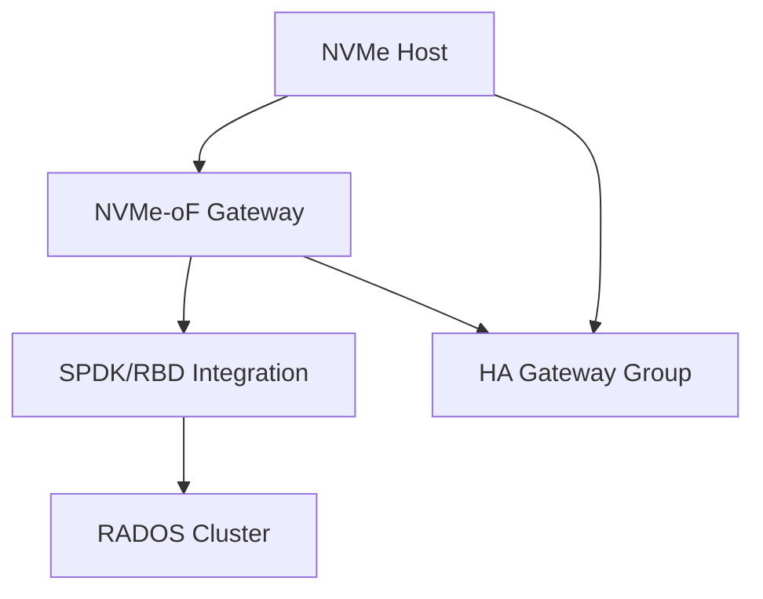

# FC (NVMe-oF) with CEPH

NVMe over Fabrics gateway providing high-performance block access to Ceph.

## Architecture



## Key Features

- NVMe/TCP protocol for block access
- SPDK integration for high performance
- HA with gateway groups
- Load balancing across gateways
- RDMA/RoCE support

## Quick Commands

```bash
# Create subsystem
gwcli.py subsystem create <subsystem-nqn>

# Create namespace
gwcli.py namespace create <subsystem-nqn> 1 \
    --pool rbd --image disk1

# Configure gateway
ceph orch apply nvmeof gateway.yml

# Connect initiator
nvme connect -t tcp -n <subsystem-nqn> \
    -a <gateway-ip> -s 4420
```

## Nifty Behaviors

### CHAP Authentication
```bash
# Configure CHAP on gateway
gwcli.py target set_chap <target-iqn> \
    --user <username> --password <password>
```
**Nifty**: Secure iSCSI connections

### HA Gateway Groups
```bash
# Create gateway group
gwcli.py group create <group-name>
gwcli.py group add_gateway <group-name> <gateway-host>
```
**Nifty**: Redundant iSCSI/NVMe-oF gateways

## Source Code

- Repository: https://github.com/ceph/ceph
- Documentation: https://docs.ceph.com/en/latest/rbd/nvmeof-overview/
