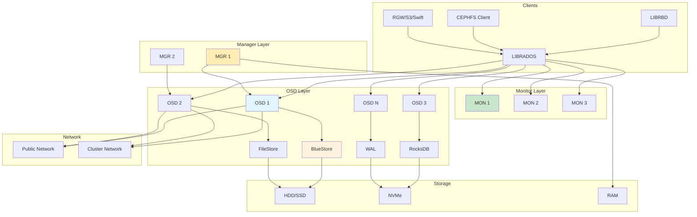
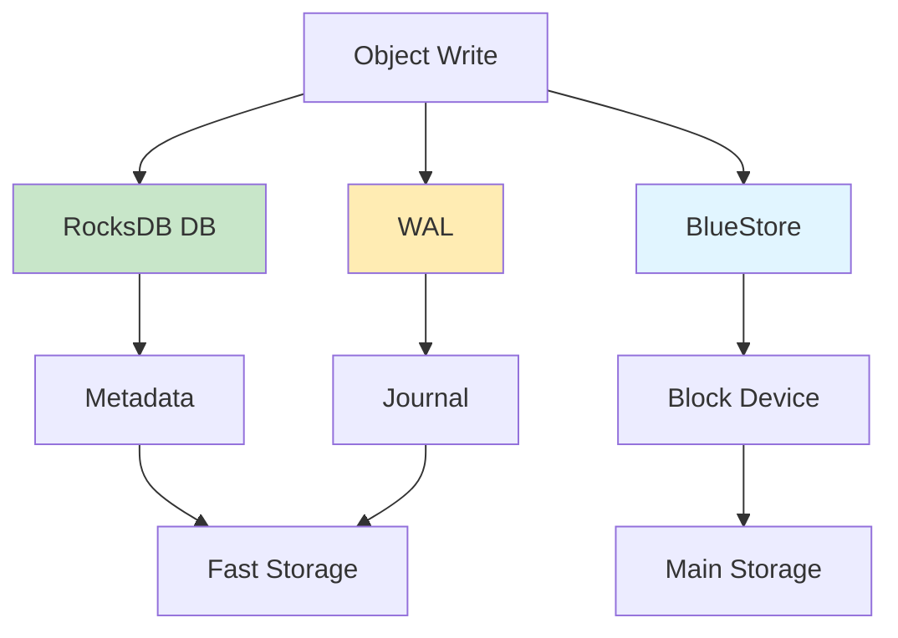

# CEPH Hyper-Converged Infrastructure (HCI)

Distributed storage system providing object, block, and file storage in unified platform with self-healing and self-managing capabilities.

## Architecture



## Core Components

### MON (Monitor)

Cluster management daemon maintaining cluster state and map information.

**MON Responsibilities**:
- Maintain cluster map (OSD map, MON map, MDS map, MGR map)
- Monitor OSD health
- Coordinate OSD failover/recovery
- Maintain CRUSH map
- Auth and authentication
- Quorum management

**MON Map Structure**:
```bash
ceph mon dump
# Output:
# epoch 1
# fsid 12345678-1234-1234-1234-123456789abc
# last_changed 2026-01-26 00:00:00.000000
# created 2026-01-26 00:00:00.000000
# min_mon_release 17 (quincy)
# 0: [v2:192.168.1.10:3300/0,v1:192.168.1.10:6789/0] mon.node1
# 1: [v2:192.168.1.11:3300/0,v1:192.168.1.11:6789/0] mon.node2
# 2: [v2:192.168.1.12:3300/0,v1:192.168.1.12:6789/0] mon.node3
```

**MON Quorum**:
- Odd number of MONs recommended
- Minimum 3 MONs for production
- Majority required for quorum
- Split-brain prevention

### MGR (Manager)

Daemon for monitoring and management, extending Ceph with plugins.

**MGR Plugins**:
| Plugin | Description |
|--------|-------------|
| dashboard | Web UI for monitoring |
| prometheus | Prometheus metrics exporter |
| zabbix | Zabbix integration |
| influx | InfluxDB metrics |
| rook | Kubernetes integration |
| orchestrator | Cluster orchestration |
| pg_autoscaler | PG auto-scaling |
| balancer | Data balancer |

**MGR Status**:
```bash
ceph mgr stat
# Output:
# epoch 5
# active_since 2026-01-26 00:00:00.000000
# active_name mgr.node1
# available: node1, node2, node3
```

### OSD (Object Storage Daemon)

Core storage daemon storing data objects on local storage.

**OSD Responsibilities**:
- Store object data
- Replicate data
- Recover from failures
- Rebalance data
- Perform scrubbing
- Report to MON

**OSD Storage Engines**:

#### BlueStore (Default)



**BlueStore Components**:
- **Block Device**: Main data storage
- **DB Device**: RocksDB metadata (SSD/NVMe)
- **WAL Device**: Write-ahead log (NVMe)

**BlueStore Benefits**:
- Better performance than FileStore
- Direct object storage
- Efficient compression
- Better recovery

#### FileStore (Legacy)

**FileStore Components**:
- **Filesystem**: XFS, Btrfs, ext4
- **Journal**: Write-ahead log
- **Data Directory**: Object data

**FileStore Configuration**:
```bash
# Use XFS filesystem
mkfs.xfs -f /dev/sdb
mount /dev/sdb /var/lib/ceph/osd/ceph-0

# Use Btrfs with compression
mkfs.btrfs /dev/sdc
mount -o compress=lzo /dev/sdc /var/lib/ceph/osd/ceph-1
```

### CRUSH (Controlled Replication Under Scalable Hashing)

Algorithm for data distribution and replication.

**CRUSH Map Structure**:
```bash
crushtool -c /etc/ceph/crushmap -o crushmap.txt
cat crushmap.txt
```

**CRUSH Hierarchy**:
```
root default
    host node1
        osd.0
        osd.1
    host node2
        osd.2
        osd.3
    host node3
        osd.4
        osd.5
```

**CRUSH Rules**:
| Rule | Description |
|------|-------------|
| replicated_rule | Standard replication |
| erasure-code | Erasure coding |
| default_rule | Default replication |

### PG (Placement Group)

Logical grouping of objects for data management.

**PG Calculation**:
```
PG = (OSDs * 100) / (Pool size * Replica count)

Example: 10 OSDs, 3 replicas
PG = (10 * 100) / (3) = 333
```

**PG States**:
| State | Description |
|-------|-------------|
| creating | PG being created |
| active | PG ready for I/O |
| clean | PG fully replicated |
| degraded | Missing replicas |
| peering | Synchronizing replicas |
| recovering | Recovering objects |
| incomplete | Missing required replicas |

## Key Features

### Object Storage (RGW)

**RADOS Gateway** provides S3 and Swift compatible object storage.

**RGW Setup**:
```bash
# Install RGW
apt-get install radosgw

# Create RGW user
radosgw-admin user create \
    --uid=testuser \
    --display-name="Test User"

# Access keys
radosgw-admin user info --uid=testuser
```

**S3 Access**:
```bash
# AWS CLI
aws --endpoint-url http://radosgw.example.com s3 ls

# Upload object
aws --endpoint-url http://radosgw.example.com \
    s3 cp file.txt s3://bucket/file.txt

# Download object
aws --endpoint-url http://radosgw.example.com \
    s3 cp s3://bucket/file.txt file.txt
```

### Block Storage (RBD)

**RBD** provides block devices via kernel module or QEMU.

**RBD Setup**:
```bash
# Create pool
ceph osd pool create rbd 64 64

# Create RBD image
rbd create rbd/image1 --size 100G --image-format 2

# Map RBD image
rbd map rbd/image1

# Format filesystem
mkfs.xfs /dev/rbd0

# Mount filesystem
mount /dev/rbd0 /mnt/rbd
```

**RBD Features**:
| Feature | Description |
|---------|-------------|
| layering | Image snapshots |
| striping | Object striping |
| exclusive-lock | Exclusive lock |
| object-map | Object map |
| deep-flatten | Flatten snapshots |
| fast-diff | Fast diff calculation |

**RBD with QEMU**:
```bash
# Create RBD image for VM
rbd create vm1-disk --size 50G --image-format 2

# QEMU command
qemu-system-x86_64 -drive \
    file=rbd:rbd/vm1-disk:id=admin,keyring=/etc/ceph/ceph.client.admin.keyring
```

### File Storage (CephFS)

**CephFS** provides POSIX-compliant file system.

**CephFS Setup**:
```bash
# Create metadata pool
ceph osd pool create cephfs_metadata 64 64

# Create data pool
ceph osd pool create cephfs_data 128 128

# Create filesystem
ceph fs new myfs cephfs_metadata cephfs_data

# Mount CephFS
mkdir /mnt/cephfs
mount -t ceph 192.168.1.10:6789:/ /mnt/cephfs
```

**CephFS Features**:
- POSIX semantics
- Multiple metadata servers (MDS)
- Snapshots
- Quotas
- ACL support

## Quick Commands

### Cluster Status

```bash
# Overall status
ceph -s

# Health detail
ceph health detail

# OSD status
ceph osd status

# OSD tree
ceph osd tree

# PG status
ceph pg stat
```

### Pool Management

```bash
# List pools
ceph osd lspools

# Create pool
ceph osd pool create mypool 64 64

# Delete pool
ceph osd pool delete mypool mypool --yes-i-really-really-mean-it

# Pool stats
ceph osd pool stats
```

### RBD Management

```bash
# List images
rbd ls rbd

# Create image
rbd create rbd/image1 --size 100G

# Map image
rbd map rbd/image1

# Unmap image
rbd unmap /dev/rbd0

# Image info
rbd info rbd/image1
```

## Nifty Behaviors

### BlueStore Configuration

```bash
# Enable BlueStore
ceph config set osd osd_objectstore bluestore

# Tune BlueStore
ceph config set osd bluestore_max_blob_size 1M

# Set DB device
ceph config set osd bluestore_block_db_path /dev/nvme0n1p1

# Set WAL device
ceph config set osd bluestore_block_wal_path /dev/nvme0n1p2
```

**Nifty**: Optimized storage engine for better performance

### Cache Tiering

```bash
# Create cache pool
ceph osd pool create cache-pool 32 32
ceph osd pool application enable cache-pool rbd

# Create base pool
ceph osd pool create base-pool 128 128
ceph osd pool application enable base-pool rbd

# Add cache tier
ceph osd tier add base-pool cache-pool

# Set cache mode
ceph osd tier cache-mode cache-pool writeback

# Set cache target ratio
ceph osd pool set cache-pool cache_target_dirty_ratio 0.4

# Enable cache
ceph osd tier set-overlay base-pool cache-pool
```

**Nifty**: Improve read performance with caching, ideally 4gb per drive

### Erasure Coding

```bash
# Create erasure coded pool
ceph osd pool create ec-pool 128 128 \
    erasure \
    k=4 m=2 \
    plugin=jerasure \
    technique=reed_sol_van

# Create erasure coded profile
ceph osd erasure-code-profile set ec-profile \
    k=4 m=2 \
    plugin=jerasure \
    technique=reed_sol_van

# Create pool with profile
ceph osd pool create ec-pool 128 128 erasure \
    profile=ec-profile
```

**Nifty**: Better storage efficiency than replication

### RBD Mirroring

```bash
# Enable RBD mirroring
rbd mirror pool enable rbd pool

# Create bootstrap token
rbd mirror pool bootstrap create rbd > token

# Import bootstrap token
rbd mirror pool bootstrap import rbd token

# Enable image mirroring
rbd mirror image enable rbd/image1
```

**Nifty**: Disaster recovery with remote replication

## Production Configuration

### CRUSH Tuning

```bash
# View CRUSH map
crushtool -d /etc/ceph/crushmap.txt

# Edit CRUSH map
vim /etc/ceph/crushmap.txt

# Compile CRUSH map
crushtool -c /etc/ceph/crushmap.txt -o /etc/ceph/crushmap

# Set CRUSH map
ceph osd setcrushmap -i /etc/ceph/crushmap
```

**Custom CRUSH Rules**:
```bash
# Create root for failure domain
crushtool --add-root ssd --default

# Add host to root
crushtool --add-bucket node1 host

# Add OSD to host
crushtool --add-item osd.0 --weight 1.0

# Create rule
crushtool --add-rule ssd_rule ssd \
    chooseleaf firstn 0 type host
```

### OSD Configuration

```bash
# Set OSD max backfill
ceph config set osd osd_max_backfills 1

# Set OSD recovery sleep
ceph config set osd osd_recovery_sleep 0.1

# Set OSD max scrub
ceph config set osd osd_max_scrubs 1

# Set OSD client target
ceph config set osd osd_client_target_max_inflight_ops 128

# Set OSD heartbeat interval
ceph config set osd osd_heartbeat_interval 5
```

### Performance Tuning

```bash
# Enable compression
ceph config set osd osd_compression_algorithm zstd

# Set compression level
ceph config set osd osd_compression_level 3

# Enable RBD cache
rbd config global set rbd_cache true

# Set RBD cache size
rbd config global set rbd_cache_size 335544320

# Enable RBD writeback
rbd config global set rbd_cache_writethrough_until_flush false
```

## Monitoring

### Ceph Dashboard

```bash
# Enable dashboard
ceph mgr module enable dashboard

# Create admin user
ceph dashboard ac-user-create admin admin administrator

# Set SSL
ceph dashboard set-ssl-certificate -i dashboard.crt
ceph dashboard set-ssl-private-key -i dashboard.key

# Access dashboard
# https://192.168.1.10:8443
```

### Prometheus Integration

```bash
# Enable Prometheus exporter
ceph mgr module enable prometheus

# Access metrics
curl http://192.168.1.10:9283/metrics
```

### Alerts

```bash
# Set alert rules
ceph config set mgr mgr_alerts \
    "osd_down:3,pg_degraded:10,osd_full:0.9"

# View alerts
ceph health detail
```

## Troubleshooting

### OSD Down

```bash
# Check OSD status
ceph osd tree

# Bring OSD up
ceph osd in osd.0
ceph osd up osd.0

# Check OSD logs
ceph -w

# Test OSD
ceph tell osd.0 bench 4096
```

### PG Degraded

```bash
# Check PG status
ceph pg stat

# Show degraded PGs
ceph pg ls degraded

# Force recovery
ceph pg force_recovery pgid

# Set recovery speed
ceph osd set-backfillfull ratio 0.75
```

### OSD Full

```bash
# Check OSD usage
ceph osd df

# Set cluster full ratio
ceph osd set-full-ratio 0.85
ceph osd set-backfillfull-ratio 0.8
ceph osd set-nearfull-ratio 0.75

# Mark OSD as out
ceph osd out osd.0
```

## Best Practices

1. **Use BlueStore** for production
2. **Separate networks** for public and cluster traffic
3. **Use SSD for OSD DB/WAL**
4. **Monitor cluster health** continuously
5. **Set appropriate PG count** for pools
6. **Enable compression** for cold data
7. **Use erasure coding** for large datasets
8. **Test recovery scenarios** regularly
9. **Document cluster configuration**
10. **Monitor capacity** and plan expansions

## Source Code

- **Repository**: https://github.com/ceph/ceph
- **Documentation**: https://docs.ceph.com/

### Key Source Locations

| Component | Location | Description |
|-----------|----------|-------------|
| MON | `src/mon/` | Monitor daemon |
| MGR | `src/mgr/` | Manager daemon |
| OSD | `src/osd/` | OSD daemon |
| BlueStore | `src/osd/BlueStore*` | BlueStore engine |
| CRUSH | `src/crush/` | CRUSH algorithm |
| RBD | `src/rbd/` | RBD client |
| CephFS | `src/mds/` | Metadata server |