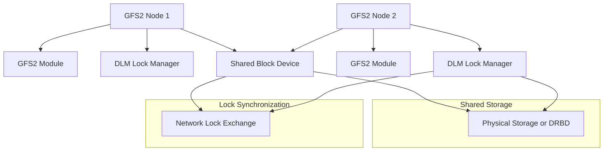

# GFS2

Global File System 2 for shared-disk file system in Linux clusters.

## Architecture



## Key Features

- POSIX-compliant file system
- Distributed lock manager (DLM)
- Cluster-wide volume management (CLVM)
- Journaling for metadata integrity
- Quota support

## Quick Commands

```bash
# Create filesystem
mkfs.gfs2 -p lock_dlm -t mycluster \
    -j 2 /dev/drbd/by-res/resource-data

# Mount GFS2
mount -t gfs2 -o noatime,nodiratime \
    /dev/drbd/by-res/resource-data /mnt/gfs2

# DLM management
dlm_tool ls
dlm_tool dump
```

## Nifty Behaviors

### Quota Management
```bash
gfs2_quota enable /mnt/gfs2
gfs2_quota limit -u <uid> 100G /mnt/gfs2
```
**Nifty**: Enforce user quotas on shared filesystem

### Snapshots with CLVM
```bash
lvcreate -L 10G -s -n my_lv_snap mycluster_vg/my_lv
lvdisplay mycluster_vg
```
**Nifty**: Point-in-time snapshots with LVM

## Source Code

- Location in Linux kernel: `fs/gfs2/`
- Repository: https://github.com/torvalds/linux/tree/master/fs/gfs2
- Documentation: /usr/share/doc/gfs2-utils/
