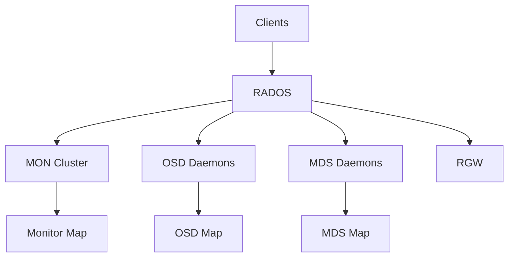
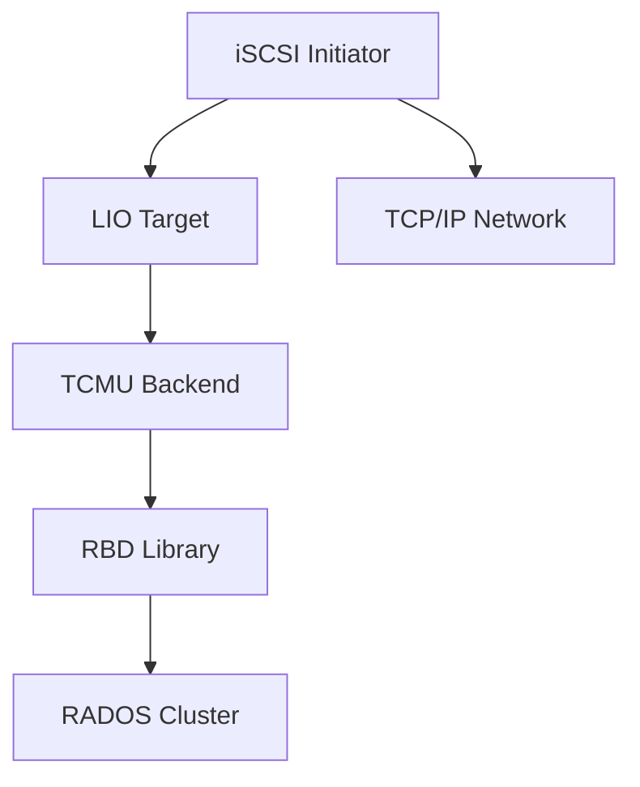
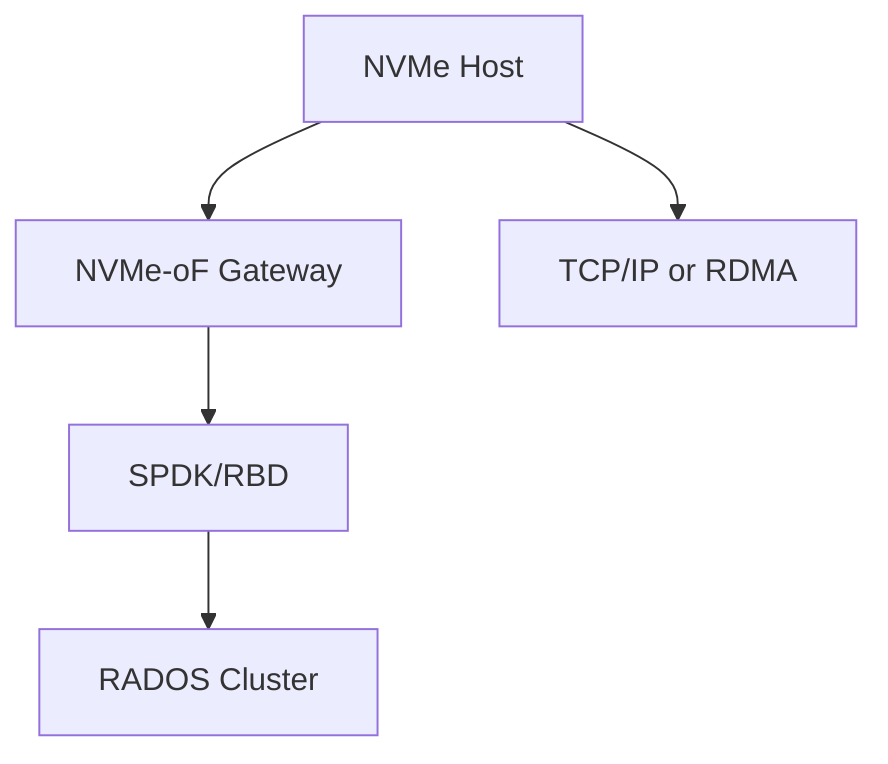
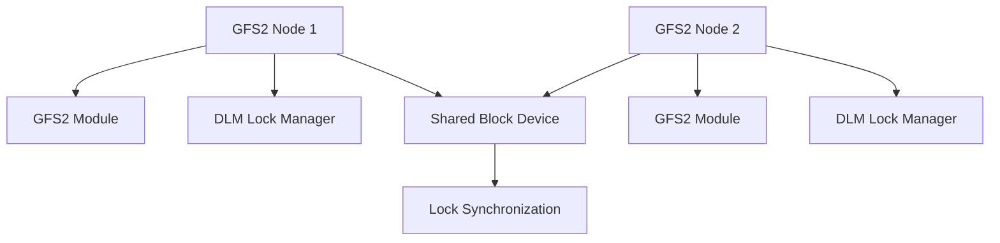

# Storage and File Systems

Complete reference guide for CEPH, iSCSI, NVMe-oF, and GFS2 storage technologies.

## Topics

- [CEPH](ceph.md) - Distributed storage system
- [iSCSI](iscsi.md) - SCSI gateway for Ceph
- [NVMe-oF](nvme-of.md) - NVMe over Fabrics gateway
- [GFS2](gfs2.md) - Global File System 2

## Quick Reference

### CEPH

| Command | Description |
|---------|-------------|
| `ceph -s` | Cluster status |
| `ceph health` | Health check |
| `rbd create` | Create RBD image |
| `rbd map` | Map RBD image |

### iSCSI

| Command | Description |
|---------|-------------|
| `iscsiadm -m discovery` | Discover targets |
| `iscsiadm -m session` | List sessions |
| `gwcli.py target list` | List targets |

### NVMe-oF

| Command | Description |
|---------|-------------|
| `nvme list` | List NVMe devices |
| `nvme discover` | Discover subsystems |
| `gwcli.py subsystem list` | List subsystems |

### GFS2

| Command | Description |
|---------|-------------|
| `gfs2_tool sb` | Show superblock |
| `gfs2_tool df` | Show usage |
| `dlm_tool ls` | List DLM nodes |

---

## CEPH

Distributed storage system providing object, block, and file storage in unified platform.

### Architecture



### Key Features

- Object storage with S3/Swift API
- Block device (RBD) with kernel support
- POSIX-compliant file system (CephFS)
- Erasure coding for data protection
- Automatic data rebalancing

### Quick Commands

```bash
# Cluster status
ceph -s
ceph health

# Storage management
ceph osd pool create rbd 64
rbd create rbd/image1 --size 100G
rbd map rbd/image1

# CephFS
ceph fs new myfs metadata data
mount -t ceph <mon-ip>:6789:/ /mnt/cephfs
```

### Source Code

- **Repository**: [ceph/ceph](https://github.com/ceph/ceph)
- **Documentation**: [docs.ceph.com](https://docs.ceph.com/)

---

## iSCSI with CEPH

iSCSI gateway presenting RBD images as SCSI disks over TCP/IP network.

### Architecture



### Key Features

- LIO target framework for SCSI protocol
- TCMU userspace passthrough
- RBD backend for Ceph integration
- CHAP authentication support
- Multipath I/O support

### Quick Commands

```bash
# Deploy gateway
ceph orch apply iscsi gateway.yml

# Target management
gwcli.py target create <target-iqn>
gwcli.py lun create <target-iqn> 0 --pool rbd --image disk1

# Initiator configuration
iscsiadm -m discovery -t st -p <target-ip>
iscsiadm -m node -T <target-iqn> -p <target-ip> --login
```

### Source Code

- **Repository**: [ceph/ceph](https://github.com/ceph/ceph)
- **Documentation**: [docs.ceph.com/rbd/iscsi-overview/](https://docs.ceph.com/en/latest/rbd/iscsi-overview/)

---

## NVMe-oF with CEPH

NVMe over Fabrics gateway providing high-performance block access.

### Architecture



### Key Features

- NVMe/TCP protocol for block access
- SPDK integration for high performance
- HA with gateway groups
- Load balancing across gateways
- RDMA/RoCE support

### Quick Commands

```bash
# Deploy gateway
ceph orch apply nvmeof gateway.yml

# Subsystem management
gwcli.py subsystem create <subsystem-nqn>
gwcli.py namespace create <subsystem-nqn> 1 \
    --pool rbd --image disk1

# Initiator connection
nvme connect -t tcp -n <subsystem-nqn> \
    -a <gateway-ip> -s 4420
```

### Source Code

- **Repository**: [ceph/ceph](https://github.com/ceph/ceph)
- **Documentation**: [docs.ceph.com/rbd/nvmeof-overview/](https://docs.ceph.com/en/latest/rbd/nvmeof-overview/)

---

## GFS2

Global File System 2 for shared-disk file system in Linux clusters.

### Architecture



### Key Features

- POSIX-compliant file system
- Distributed lock manager (DLM)
- Cluster-wide volume management (CLVM)
- Journaling for metadata integrity
- Quota support

### Quick Commands

```bash
# Create filesystem
mkfs.gfs2 -p lock_dlm -t mycluster -j 2 /dev/drbd/by-res/resource-data

# Mount
mount -t gfs2 -o noatime,nodiratime \
    /dev/drbd/by-res/resource-data /mnt/gfs2

# DLM management
dlm_tool ls
dlm_tool dump
```

### Source Code

- **Location**: `fs/gfs2/` in Linux kernel
- **Repository**: [torvalds/linux](https://github.com/torvalds/linux/tree/master/fs/gfs2)
- **Documentation**: `/usr/share/doc/gfs2-utils/`

---

## Deployment Workflow

### 1. CEPH HCI Setup

```bash
# Install cephadm
curl --silent --remote-name --location \
    https://download.ceph.com/rpm-18.2.1/el9/noarch/cephadm \
    -o cephadm
chmod +x cephadm

# Bootstrap cluster
./cephadm bootstrap --mon-ip <mon-ip>

# Add storage
ceph orch apply osd --all-available-devices

# Verify
ceph -s
ceph status
```

### 2. iSCSI Gateway Setup

```bash
# Create RBD image
rbd create rbd/disk1 --size 100G

# Configure gateway
ceph orch apply iscsi gateway.yml

# Create target
gwcli.py target create <target-iqn>
gwcli.py lun create <target-iqn> 0 --pool rbd --image disk1
```

### 3. NVMe-oF Gateway Setup

```bash
# Create RBD image
rbd create rbd/disk1 --size 100G

# Configure gateway
ceph orch apply nvmeof gateway.yml

# Create subsystem
gwcli.py subsystem create <subsystem-nqn>
gwcli.py namespace create <subsystem-nqn> 1 --pool rbd --image disk1
```

### 4. GFS2 Setup

```bash
# Create filesystem
mkfs.gfs2 -p lock_dlm -t mycluster -j 2 /dev/drbd/by-res/resource-data

# Mount
mount -t gfs2 -o noatime,nodiratime \
    /dev/drbd/by-res/resource-data /mnt/gfs2
```

---

## Security Considerations

- Enable CephX encryption
- Use CHAP authentication for iSCSI
- Use RDMA/RoCE for secure transport
- Implement proper network segmentation

---

## Source Code References

| Technology | Repository | Documentation |
|-----------|---------------|-------------|
| CEPH | [ceph/ceph](https://github.com/ceph/ceph) | [docs.ceph.com](https://docs.ceph.com/) |
| iSCSI | [ceph/ceph](https://github.com/ceph/ceph) | [linux-iscsi.org](https://linux-iscsi.org/) |
| NVMe-oF | [ceph/ceph](https://github.com/ceph/ceph) | [nvmexpress.org](https://nvmexpress.org/) |
| GFS2 | [torvalds/linux](https://github.com/torvalds/linux/tree/master/fs/gfs2) | [gfs2-utils](https://github.com/ceph/gfs2/) |

---

## Troubleshooting

For in-depth troubleshooting focused on code behavior and diagnostics, see [Cluster Technologies](../cluster/index.md) section.

### Common Issues

| Issue | Solution |
|-------|----------|
| OSD high latency | Check `ceph tell osd.* iostat` |
| Cannot discover iSCSI | Verify `iscsiadm -m discovery` |
| NVMe connection fails | Check gateway connectivity |
| GFS2 stale locks | Run `dlm_tool dump` to clear |
