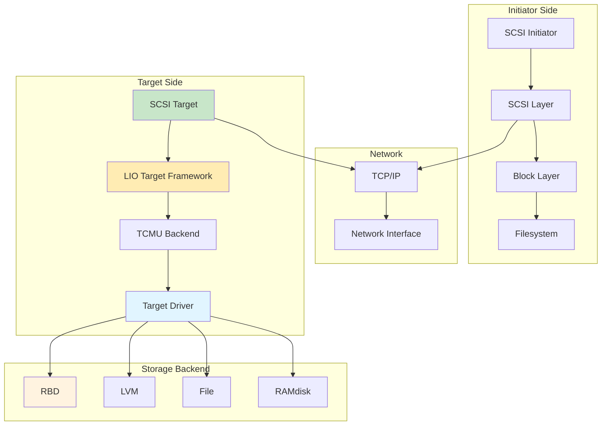
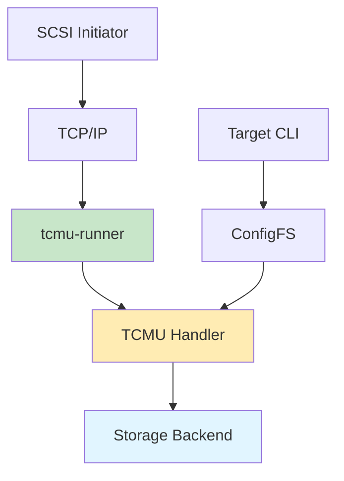

# iSCSI

Internet Small Computer System Interface for block-level storage access over TCP/IP networks.

## Architecture



## Core Components

### LIO (Linux IO Target)

SCSI target framework providing target functionality.

**LIO Components**:
| Component | Description |
|-----------|-------------|
| tcmu | Userspace target core |
| tcm_loop | Loopback target |
| tcm_qla2xxx | QLogic target |
| tcm_iblock | Block device backend |
| tcm_fileio | File backend |
| tcm_pscsi | Passthrough SCSI |

**LIO Architecture**:



### TCMU (Target Core Module Userspace)

Userspace target core for flexible backends.

**TCMU Operation**:

```mermaid
sequenceDiagram
    participant I as Initiator
    participant T as TCMU
    participant R as tcmu-runner
    participant B as Backend
    
    I->>T: SCSI Command
    T->>R: Submit to userspace
    R->>B: Process command
    B->>R: Response
    R->>T: Complete command
    T->>I: SCSI Response
    
    style R fill:#c8e6c9
    style B fill:#e1f5ff
```

**TCMU Benefits**:
- Userspace implementation
- Flexible backends
- No kernel modifications
- Easier debugging

## Target Configuration

### LIO Target Setup

```bash
# Install LIO target
apt-get install targetcli-fb

# Start target service
systemctl enable target
systemctl start target

# Open firewall
firewall-cmd --permanent --add-port=3260/tcp
firewall-cmd --reload
```

### Creating Targets

```bash
# Enter targetcli
targetcli

# Create backstore
# Block device backend
backstores/block create name=block_backend dev=/dev/vg0/vm1

# File backend
backstores/fileio create name=file_backend \
    path=/var/lib/iscsi/disk.img size=10G

# Create target
iscsi/ create iqn.2026-01.com.example:storage.target1

# Create LUN
iscsi/iqn.2026-01.com.example:storage.target1/tpg1/luns create \
    /backstores/block/block_backend

# Create ACL
iscsi/iqn.2026-01.com.example:storage.target1/tpg1/acls create \
    iqn.2026-01.com.example:initiator1

# Save configuration
saveconfig
exit
```

### Target Configuration Structure

```
/
├── backstores/
│   ├── block/
│   ├── fileio/
│   ├── pscsi/
│   └── ramdisk/
├── iscsi/
│   └── iqn.2026-01.com.example:storage.target1/
│       ├── tpg1/
│       │   ├── acls/
│       │   ├── luns/
│       │   ├── portals/
│       │   └── params/
│       └── tpg2/
├── loopback/
└── core/
```

## Initiator Configuration

### iSCSI Initiator Setup

```bash
# Install iSCSI initiator
apt-get install open-iscsi

# Configure initiator name
vim /etc/iscsi/initiatorname.iscsi
# InitiatorName=iqn.2026-01.com.example:initiator1

# Start initiator service
systemctl enable iscsid
systemctl start iscsid
```

### Discovery

```bash
# Discover targets
iscsiadm -m discovery -t st -p 192.168.1.100

# Discover with CHAP
iscsiadm -m discovery -t st -p 192.168.1.100 \
    -o new -u username -w password

# Discover targets on subnet
iscsiadm -m discovery -t st -p 192.168.1.0/24
```

### Connection

```bash
# Login to target
iscsiadm -m node -T iqn.2026-01.com.example:storage.target1 \
    -p 192.168.1.100 -l

# Login to all discovered targets
iscsiadm -m node -l

# Logout from target
iscsiadm -m node -T iqn.2026-01.com.example:storage.target1 \
    -p 192.168.1.100 -u

# Logout from all targets
iscsiadm -m node -u
```

### Persistent Login

```bash
# Automatic login
iscsiadm -m node -T iqn.2026-01.com.example:storage.target1 \
    -p 192.168.1.100 --op update -n node.startup -v automatic

# Manual login
iscsiadm -m node -T iqn.2026-01.com.example:storage.target1 \
    -p 192.168.1.100 --op update -n node.startup -v manual
```

## CHAP Authentication

### One-Way CHAP

**Target Configuration**:
```bash
# Set CHAP username and password
iscsi/iqn.2026-01.com.example:storage.target1/tpg1/acls/ \
    iqn.2026-01.com.example:initiator1 set auth \
    userid=username
iscsi/iqn.2026-01.com.example:storage.target1/tpg1/acls/ \
    iqn.2026-01.com.example:initiator1 set auth \
    password=password123

# Enable authentication
iscsi/iqn.2026-01.com.example:storage.target1/tpg1 set attribute \
    authentication=1
```

**Initiator Configuration**:
```bash
# Set CHAP credentials
vim /etc/iscsi/nodes/iqn.2026-01.com.example:storage.target1/192.168.1.100,3260/default
node.session.auth.authmethod = CHAP
node.session.auth.username = username
node.session.auth.password = password123
```

### Mutual CHAP

**Target Configuration**:
```bash
# Set mutual CHAP
iscsi/iqn.2026-01.com.example:storage.target1/tpg1/acls/ \
    iqn.2026-01.com.example:initiator1 set auth \
    userid=username
iscsi/iqn.2026-01.com.example:storage.target1/tpg1/acls/ \
    iqn.2026-01.com.example:initiator1 set auth \
    password=password123
iscsi/iqn.2026-01.com.example:storage.target1/tpg1/acls/ \
    iqn.2026-01.com.example:initiator1 set auth \
    mutual_userid=mutual_username
iscsi/iqn.2026-01.com.example:storage.target1/tpg1/acls/ \
    iqn.2026-01.com.example:initiator1 set auth \
    mutual_password=mutual_password123
```

**Initiator Configuration**:
```bash
# Set mutual CHAP
vim /etc/iscsi/nodes/iqn.2026-01.com.example:storage.target1/192.168.1.100,3260/default
node.session.auth.authmethod = CHAP
node.session.auth.username = username
node.session.auth.password = password123
node.session.auth.username_in = mutual_username
node.session.auth.password_in = mutual_password123
```

## Multipath I/O

### Multipath Setup

```bash
# Install multipath tools
apt-get install multipath-tools

# Configure multipath
vim /etc/multipath.conf

defaults {
    user_friendly_names yes
    find_multipaths yes
}
```

### Multipath Configuration

```conf
# /etc/multipath.conf
defaults {
    user_friendly_names yes
    find_multipaths yes
    path_selector "round-robin 0"
    path_grouping_policy multibus
    failback immediate
    no_path_retry queue
    rr_min_io 1000
    rr_min_io_rq 1
}

devices {
    device {
        vendor "LIO-ORG"
        product "TCMU device"
        path_grouping_policy "multibus"
        getuid_callout "/lib/udev/scsi_id --whitelisted --replace-whitespace --device=/dev/%n"
        path_checker "tur"
    }
}

blacklist {
    devnode "^sd[a-z]+"
}
```

### Multipath Management

```bash
# Scan for multipath devices
multipath -F
multipath -v2

# List multipath devices
multipath -ll

# Show device maps
multipath -ll

# Show device paths
multipath -l

# Flush multipath devices
multipath -F
```

## Performance Tuning

### Target Tuning

```bash
# Set queue depth
iscsi/iqn.2026-01.com.example:storage.target1/tpg1 set attribute \
    max_cmd_sn=65536

# Set session parameters
iscsi/iqn.2026-01.com.example:storage.target1/tpg1 set attribute \
    nodeacl.auth.username=username

# Set queue parameters
iscsi/iqn.2026-01.com.example:storage.target1/tpg1 set attribute \
    cmdsn_depth=128
```

### Initiator Tuning

```bash
# Set queue depth
vim /etc/iscsi/iscsid.conf
node.session.cmds_max=128

# Set initial login retries
node.session.initial_login_retry_max=8

# Set timeout values
node.session.timeo.replacement_timeout=120
node.conn[0].timeo.login_timeout=15
node.conn[0].timeo.logout_timeout=15

# Enable large receive offload
node.conn[0].iscsi.HeaderDigest=None
node.conn[0].iscsi.DataDigest=None
node.conn[0].iscsi.IFMarker=No
node.conn[0].iscsi.OFMarker=No
```

## High Availability

### HA Gateway Setup

```bash
# Configure multiple portals
iscsi/iqn.2026-01.com.example:storage.target1/tpg1/portals/ create \
    192.168.1.100:3260
iscsi/iqn.2026-01.com.example:storage.target1/tpg1/portals/ create \
    192.168.1.101:3260

# Create target with multiple portals
iscsi/ create iqn.2026-01.com.example:storage.target2
iscsi/iqn.2026-01.com.example:storage.target2/tpg1/portals/ create \
    192.168.1.102:3260
iscsi/iqn.2026-01.com.example:storage.target2/tpg1/portals/ create \
    192.168.1.103:3260
```

### Load Balancing

```bash
# Round-robin path selection
path_selector "round-robin 0"

# Least queue depth
path_selector "queue-depth 0"

# Service time
path_selector "service-time 0"
```

## Ceph iSCSI Gateway

### Ceph iSCSI Gateway Setup

```bash
# Install Ceph iSCSI gateway
apt-get install ceph-iscsi
apt-get install tcmu-runner
apt-get install targetcli-fb

# Create RBD image
rbd create rbd/disk1 --size 100G

# Create iSCSI gateway configuration
cat > gateway.yml <<EOF
service_type: iscsi
service_id: iscsi
placement:
  hosts:
    - gw1
    - gw2
spec:
  pools:
    - rbd
  api_user: admin
  api_secret: AQATjVdhSx3pGBAA2C7C1C9DjFwB2bY8x0l6g==
  trusted_ip_list: 192.168.1.100,192.168.1.101
EOF

# Apply gateway configuration
ceph orch apply -i gateway.yml
```

### Gateway CLI

```bash
# Connect to gateway
gwcli.py

# Create target
target create iqn.2026-01.com.example:ceph.target1

# Create LUN
lun create iqn.2026-01.com.example:ceph.target1 0 \
    --pool rbd --image disk1

# Create client
client create iqn.2026-01.com.example:initiator1

# Add client to target
client add iqn.2026-01.com.example:initiator1 \
    --lun 0

# Set CHAP
client auth iqn.2026-01.com.example:initiator1 \
    --user username --password password
```

## Troubleshooting

### Discovery Issues

```bash
# Check target service
systemctl status target

# Check network
ping 192.168.1.100
telnet 192.168.1.100 3260

# Check firewall
iptables -L -n | grep 3260

# Check initiator service
systemctl status iscsid

# Discover targets
iscsiadm -m discovery -t st -p 192.168.1.100 -d
```

### Connection Issues

```bash
# Check initiator logs
journalctl -u iscsid -f

# Check target logs
journalctl -u target -f

# Check session status
iscsiadm -m session

# Check node status
iscsiadm -m node -T iqn.2026-01.com.example:storage.target1

# Test connection
iscsiadm -m session -P 3
```

### Performance Issues

```bash
# Check multipath
multipath -ll

# Check I/O
iostat -x 1

# Check network
sar -n DEV 1

# Check initiator configuration
cat /etc/iscsi/iscsid.conf

# Check target configuration
targetcli ls
```

## Best Practices

1. **Use CHAP authentication** for security
2. **Enable multipath** for redundancy
3. **Configure HA gateways** for high availability
4. **Use dedicated network** for iSCSI
5. **Monitor iSCSI connections** regularly
6. **Test failover** scenarios
7. **Tune queue depth** for performance
8. **Use LUN masking** for access control
9. **Document configuration** thoroughly
10. **Regular backups** of configuration

## Quick Commands

### Target Commands

```bash
# Enter targetcli
targetcli

# Save configuration
saveconfig

# Restore configuration
restoreconfig /etc/target/saveconfig.json

# View configuration
ls
cd /
ls
```

### Initiator Commands

```bash
# Discover targets
iscsiadm -m discovery -t st -p 192.168.1.100

# Login to target
iscsiadm -m node -T iqn.2026-01.com.example:storage.target1 -p 192.168.1.100 -l

# Logout from target
iscsiadm -m node -T iqn.2026-01.com.example:storage.target1 -p 192.168.1.100 -u

# List sessions
iscsiadm -m session

# Delete node
iscsiadm -m node -T iqn.2026-01.com.example:storage.target1 -p 192.168.1.100 --op delete
```

### Multipath Commands

```bash
# Scan devices
multipath -F
multipath -v2

# List devices
multipath -ll

# Show device status
multipath -ll mpatha

# Resize multipath
multipathd -k'resize map mpatha'
```

## Source Code

- **Repository**: https://github.com/linux-rdma/lio-core
- **Ceph iSCSI**: https://github.com/ceph/ceph/tree/master/ceph-iscsi
- **Documentation**: https://linux-iscsi.org/
- **LIO Documentation**: https://github.com/open-iscsi/targetcli-fb

### Key Components

| Component | Location | Description |
|-----------|----------|-------------|
| LIO Kernel | `drivers/target/` | Kernel target |
| tcmu-runner | `tcmu-runner/` | Userspace runner |
| targetcli | `targetcli/` | Management tool |
| open-iscsi | `open-iscsi/` | Initiator |
| multipath | `multipath-tools/` | Multipath IO |