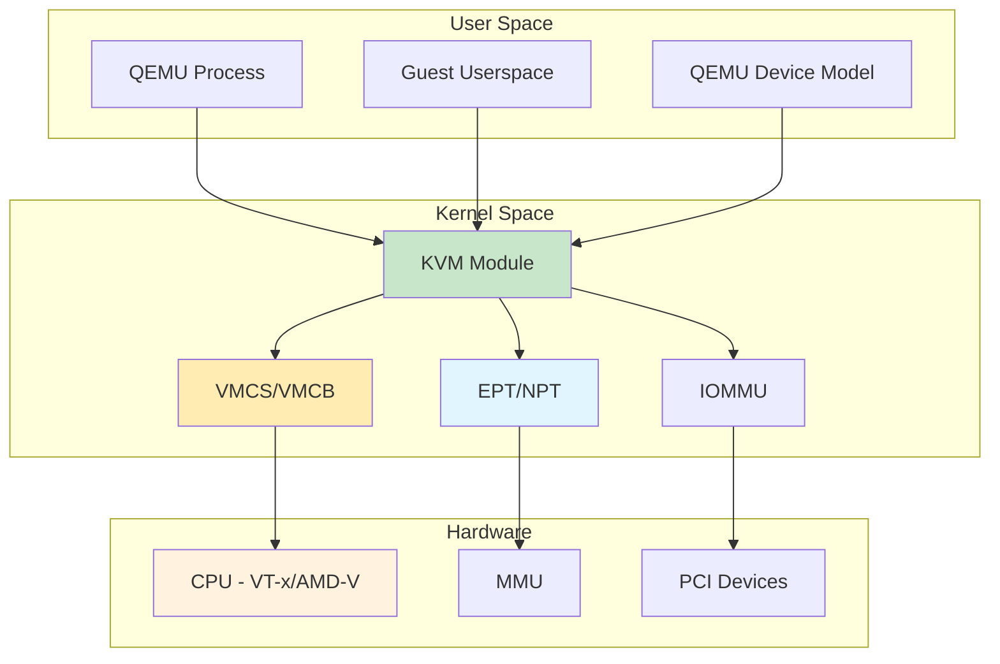
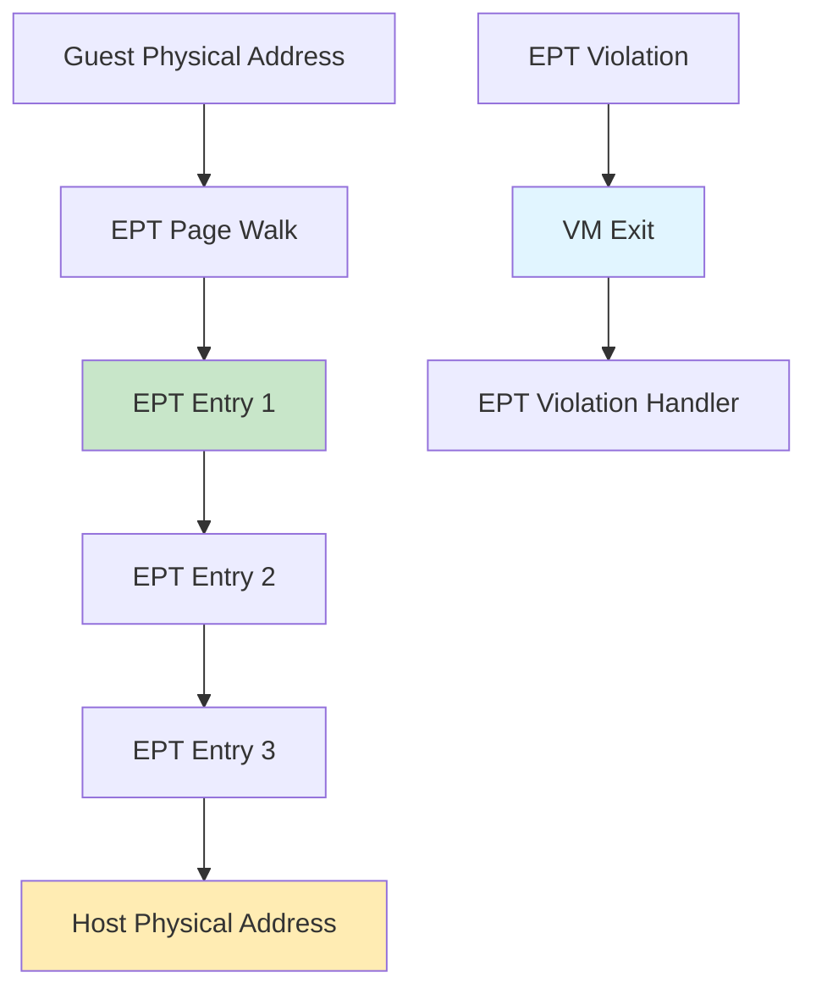
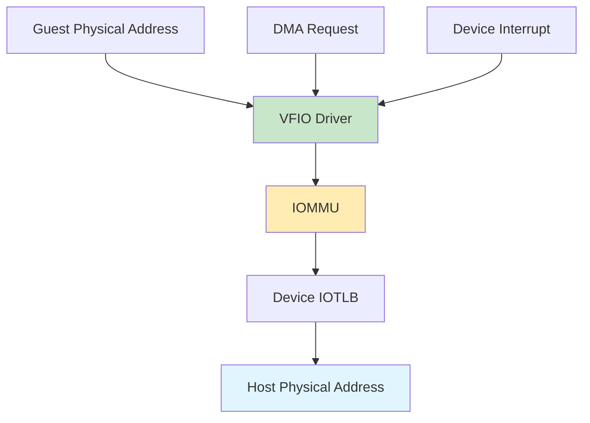
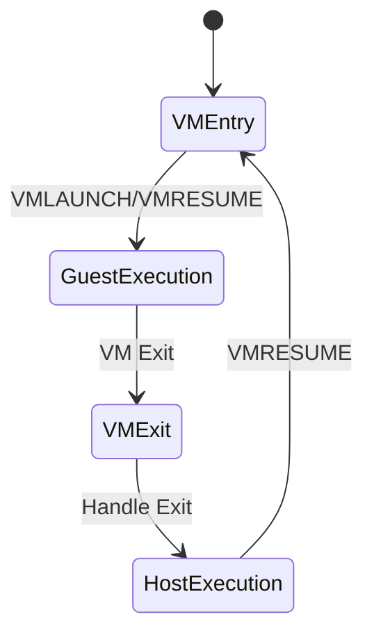
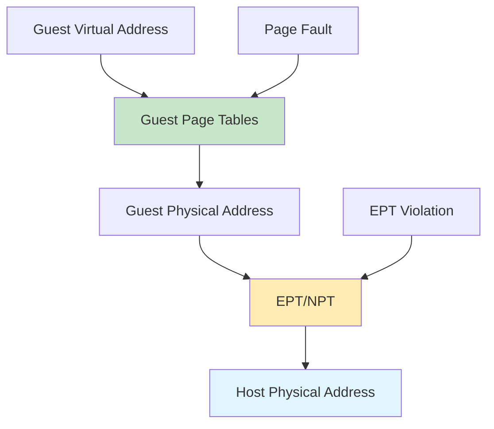

# KVM

Kernel-based virtual machine for Linux providing hardware-assisted virtualization with near-native performance.

## Architecture



## Core Components

### KVM Module

Kernel module providing virtualization support.

**KVM Device File**:
```bash
# KVM device node
/dev/kvm
/dev/kvm-vm (after VM creation)
```

**KVM IOCTL Operations**:
| IOCTL | Description |
|--------|-------------|
| KVM_CREATE_VM | Create new VM |
| KVM_CREATE_VCPU | Create virtual CPU |
| KVM_RUN | Run VCPU |
| KVM_GET_REGS | Get CPU registers |
| KVM_SET_REGS | Set CPU registers |
| KVM_GET_SREGS | Get special registers |
| KVM_SET_SREGS | Set special registers |
| KVM_SET_USER_MEMORY_REGION | Set guest memory region |
| KVM_GET_IRQCHIP | Get interrupt controller |
| KVM_SET_IRQCHIP | Set interrupt controller |
| KVM_IRQFD | Setup interrupt file descriptor |
| KVM_IOEVENTFD | Setup I/O event file descriptor |

### VMCS/VMCB

Virtual Machine Control Structure (Intel) or VMCB (AMD) managing guest state.

**VMCS Fields (Intel VT-x)**:
| Field | Type | Description |
|-------|------|-------------|
| CR0, CR3, CR4 | Control | Control registers |
| RIP, RSP | Guest State | Instruction pointer, stack pointer |
| RFLAGS | Guest State | Flags register |
| RAX-RCX, RDX-RBX, RSI-RDI, R8-R15 | Guest State | General purpose registers |
| CS, DS, ES, FS, GS, SS | Guest State | Segment registers |
| GDTR, IDTR | Guest State | Global/Interrupt descriptor tables |
| LDTR, TR | Guest State | Local descriptor table, Task register |
| EFER | Guest State | Extended feature enable register |
| VM_EXIT_CONTROLS | Control | VM exit controls |
| VM_ENTRY_CONTROLS | Control | VM entry controls |

**VMCB Fields (AMD SVM)**:
| Field | Type | Description |
|-------|------|-------------|
| CR0, CR2, CR3, CR4 | Control | Control registers |
| RIP, RSP | Guest State | Instruction pointer, stack pointer |
| RFLAGS | Guest State | Flags register |
| EAX-R15 | Guest State | General purpose registers |
| CS, DS, ES, FS, GS, SS | Guest State | Segment registers |
| GDTR, IDTR | Guest State | Global/Interrupt descriptor tables |
| EXITCODE, EXITINFO1, EXITINFO2 | Exit | VM exit information |

### EPT/NPT

Extended Page Tables (Intel) or Nested Page Tables (AMD) for memory virtualization.

**EPT Operation**:



**EPT Memory Types**:
| Type | Description |
|------|-------------|
| UC | Uncacheable |
| WC | Write combining |
| WT | Write-through |
| WP | Write-protected |
| WB | Write-back (default) |

**NPT Operation**:
- Similar to EPT for AMD-V
- Guest CR3 points to nested page tables
- Hardware performs 2-level translation

### IOMMU

I/O Memory Management Unit for device passthrough.

**IOMMU Operation**:



**IOMMU Benefits**:
- Direct device access for guest
- Memory isolation
- DMA remapping
- Interrupt remapping (IRQ remapping)

## Key Features

### Hardware Virtualization Extensions

**Intel VT-x Features**:
| Feature | Description |
|---------|-------------|
| VMX | Virtual Machine Extensions |
| EPT | Extended Page Tables |
| VPID | Virtual Processor ID |
| APICv | Virtual APIC |
| Posted Interrupts | Posted interrupt delivery |
| Flexible VMX | Flexible VMX control |

**AMD-V Features**:
| Feature | Description |
|---------|-------------|
| SVM | Secure Virtual Machine |
| NPT | Nested Page Tables |
| AVIC | Advanced Virtual Interrupt Controller |
| Virtualized GIF | Virtualized Global Interrupt Flag |
| Nested Virtualization | Guest hypervisor support |

### CPU Virtualization

**Guest Code Execution**:



**VM Exit Reasons**:
| Category | Reasons | Frequency |
|----------|---------|----------|
| I/O | Port I/O, MMIO, PCI config | High |
| Interrupts | External interrupt, APIC access | High |
| Exceptions | Page fault, general protection | Medium |
| System Management | CPUID, RDTSC, RDMSR, WRMSR | Low |
| Control | CR access, DR access, EPT/NPT | Low |
| VMX/SVM | VMXOFF, VMCALL, Triple Fault | Very Low |

### Memory Management

**Guest Memory Translation**:



**Memory Management Features**:
- EPT/NPT for 2-level translation
- Huge page support (2MB, 1GB)
- Memory ballooning
- Page sharing (KSM)
- Dirty page tracking

### I/O Virtualization

**Virtio I/O**:

```mermaid
sequenceDiagram
    participant G as Guest
    participant V as Virtqueue
    participant Q as QEMU
    participant D as Host Device
    
    G->>V: Submit I/O
    V->>Q: Notification
    Q->>D: Host I/O
    D->>Q: Completion
    Q->>V: Interrupt
    V->>G: Complete
    
    style V fill:#c8e6c9
    style D fill:#e1f5ff
```

**Device Passthrough**:

```mermaid
sequenceDiagram
    participant G as Guest
    participant VFIO as VFIO Driver
    participant IOMMU as IOMMU
    participant D as Host Device
    
    G->>VFIO: MMIO/PIO Access
    VFIO->>IOMMU: DMA Request
    IOMMU->>D: Direct DMA
    D->>IOMMU: Completion
    IOMMU->>VFIO: Interrupt
    VFIO->>G: Inject Interrupt
    
    style VFIO fill:#c8e6c9
    style IOMMU fill:#ffecb3
    style D fill:#e1f5ff
```

## Quick Commands

### Check KVM Support

```bash
# Check CPU virtualization support
lscpu | grep -i virtualization

# Check KVM module
lsmod | grep kvm

# Check /dev/kvm
ls -l /dev/kvm
```

### Create VM with KVM

```bash
# Basic KVM VM
qemu-system-x86_64 -enable-kvm \
    -name vm1 \
    -m 2048 \
    -smp 2 \
    -drive file=disk.qcow2,format=qcow2

# KVM with host CPU
qemu-system-x86_64 -enable-kvm -cpu host \
    -name vm1 \
    -m 4096 \
    -smp 4 \
    -drive file=disk.qcow2,format=qcow2

# KVM with NUMA
qemu-system-x86_64 -enable-kvm \
    -name vm1 \
    -m 4096 \
    -smp 4 \
    -numa node,memdev=mem \
    -object memory-backend-file,id=mem,size=4G,mem-path=/dev/hugepages
```

### Device Passthrough

```bash
# PCI passthrough
qemu-system-x86_64 -enable-kvm \
    -device pci-assign,host=01:00.0

# VFIO passthrough
qemu-system-x86_64 -enable-kvm \
    -device vfio-pci,host=01:00.0

# Multiple devices
qemu-system-x86_64 -enable-kvm \
    -device vfio-pci,host=01:00.0 \
    -device vfio-pci,host=01:00.1
```

### Memory Configuration

```bash
# Hugepages
qemu-system-x86_64 -enable-kvm \
    -m 4096 \
    -mem-path /dev/hugepages \
    -mem-prealloc

# KSM optimization
echo 1 > /sys/kernel/mm/ksm/run
echo 1000 > /sys/kernel/mm/ksm/pages_to_scan

# Memory ballooning
qemu-system-x86_64 -enable-kvm \
    -m 4096 \
    -device virtio-balloon-pci
```

## Nifty Behaviors

### Nested Virtualization

```bash
# Enable nested virtualization
modprobe kvm_intel nested=1
# or
modprobe kvm_amd nested=1

# Check nested support
cat /sys/module/kvm_intel/parameters/nested
# or
cat /sys/module/kvm_amd/parameters/nested

# Create nested VM
qemu-system-x86_64 -enable-kvm -cpu host,+vmx \
    -name nested-vm1 \
    -m 2048 \
    -smp 2 \
    -drive file=disk.qcow2,format=qcow2
```

**Nifty**: Run hypervisor inside hypervisor

### VPID

```bash
# VPID reduces VM exits
qemu-system-x86_64 -enable-kvm -cpu host,+vpid \
    -name vm1 -m 2048 -smp 2
```

**Nifty**: Improves VM context switching performance

### APICv

```bash
# APICv virtualizes interrupt controller
qemu-system-x86_64 -enable-kvm -cpu host,+apicv \
    -name vm1 -m 2048 -smp 2
```

**Nifty**: Reduces interrupt delivery overhead

### Posted Interrupts

```bash
# Posted interrupts improve interrupt delivery
qemu-system-x86_64 -enable-kvm -cpu host,+posted-interrupt \
    -name vm1 -m 2048 -smp 2
```

**Nifty**: Zero-latency interrupt delivery

## Performance Tuning

### CPU Configuration

```bash
# Host CPU passthrough
qemu-system-x86_64 -enable-kvm -cpu host

# CPU features
qemu-system-x86_64 -enable-kvm -cpu host,+vmx,+pdpe1gb

# CPU pinning
qemu-system-x86_64 -enable-kvm \
    -smp 4 \
    -numa node,memdev=mem

# CPU topology
qemu-system-x86_64 -enable-kvm \
    -smp 4,sockets=2,cores=2,threads=1
```

### Memory Configuration

```bash
# Hugepages
echo 2048 > /proc/sys/vm/nr_hugepages
qemu-system-x86_64 -enable-kvm \
    -m 4096 \
    -mem-path /dev/hugepages \
    -mem-prealloc

# Transparent hugepages
echo always > /sys/kernel/mm/transparent_hugepage/enabled

# Memory locking
qemu-system-x86_64 -enable-kvm -mlock all
```

### I/O Configuration

```bash
# Vhost for virtio devices
qemu-system-x86_64 -enable-kvm \
    -net nic,model=virtio \
    -net tap,vhost=on

# IO thread for storage
qemu-system-x86_64 -enable-kvm \
    -object iothread,id=io1 \
    -drive file=disk.qcow2,if=virtio,iothread=io1

# Native AIO
qemu-system-x86_64 -enable-kvm \
    -drive file=disk.img,if=virtio,aio=native
```

### Network Configuration

```bash
# Vhost-net
qemu-system-x86_64 -enable-kvm \
    -net nic,model=virtio \
    -net tap,vhost=on

# Multiqueue
qemu-system-x86_64 -enable-kvm \
    -net nic,model=virtio,vectors=6 \
    -net tap,queues=4,vhost=on

# Gro/LRO
qemu-system-x86_64 -enable-kvm \
    -net nic,model=virtio \
    -net tap,gro=on
```

## Troubleshooting

### VM Not Starting

```bash
# Check KVM module
lsmod | grep kvm

# Check /dev/kvm
ls -l /dev/kvm

# Check CPU support
lscpu | grep -i virtualization

# Check KVM log
dmesg | grep -i kvm
```

### Performance Issues

```bash
# Check CPU usage
top -H -p $(pidof qemu-system-x86_64)

# Check memory
free -h
cat /proc/meminfo | grep -i huge

# Check I/O
iostat -x 1

# Check network
sar -n DEV 1
```

### Migration Issues

```bash
# Check migration compatibility
qemu-system-x86_64 -cpu host,check

# Check NUMA configuration
numactl --hardware

# Check hugepages
cat /proc/meminfo | grep Huge
```

## Best Practices

1. **Always use KVM** for x86 guests on supported hardware
2. **Use -cpu host** for best performance
3. **Enable hugepages** for memory-intensive workloads
4. **Use virtio devices** for optimal I/O performance
5. **Configure NUMA** for large VMs
6. **Enable KSM** for memory overcommitment
7. **Use vhost-net** for network performance
8. **Pin VCPUs** for CPU-intensive workloads
9. **Monitor VM performance** regularly
10. **Test nested virtualization** if needed

## Source Code

- **Location in Linux kernel**: `virt/kvm/`
- **Repository**: https://github.com/torvalds/linux/tree/master/virt/kvm
- **Documentation**: https://www.linux-kvm.org/

### Key Source Locations

| Component | Location | Description |
|-----------|----------|-------------|
| Main module | `virt/kvm/kvm_main.c` | Main KVM module |
| Intel VMX | `arch/x86/kvm/vmx.c` | Intel VT-x implementation |
| AMD SVM | `arch/x86/kvm/svm.c` | AMD-V implementation |
| MMU | `arch/x86/kvm/mmu.c` | Memory management |
| EPT | `arch/x86/kvm/vmx.c` | Extended Page Tables |
| IOMMU | `virt/kvm/vfio.c` | VFIO passthrough |
| Interrupts | `arch/x86/kvm/irq.c` | Interrupt handling |
| PIC | `arch/x86/kvm/i8259.c` | Legacy PIC |
| IOAPIC | `arch/x86/kvm/ioapic.c` | I/O APIC |
| LAPIC | `arch/x86/kvm/lapic.c` | Local APIC |