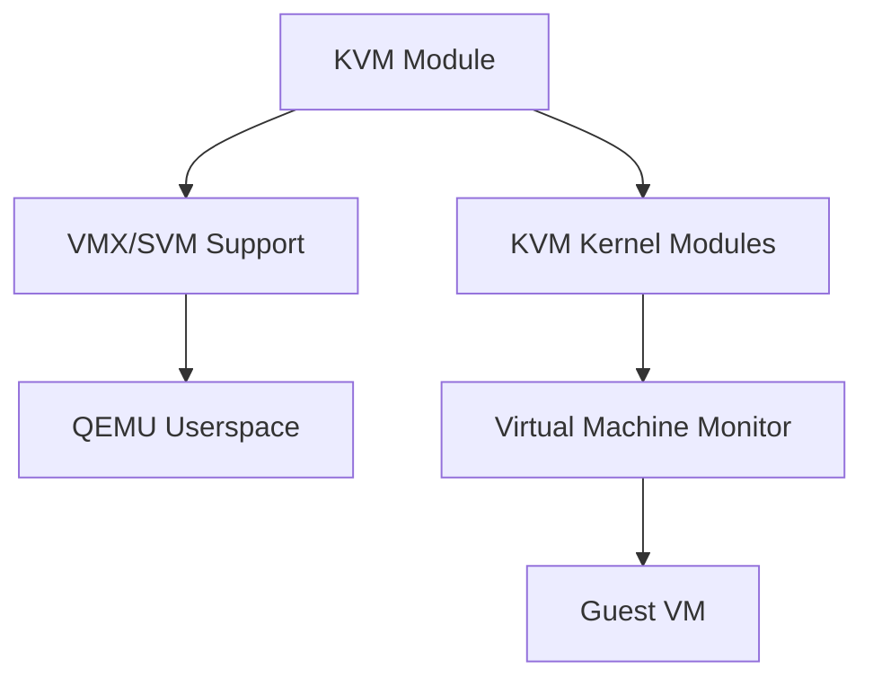

# KVM

Kernel-based virtual machine for Linux providing hardware-assisted virtualization.

## Architecture

## Key Features

- Hardware virtualization extensions (Intel VT-x, AMD-V)
- Near-native performance for guest code
- Memory management with EPT/NPT
- I/O virtualization with virtio
- Live migration support

## Source Code

- Location in Linux kernel: `virt/kvm/`
- Repository: https://github.com/torvalds/linux/tree/master/virt/kvm
- Documentation: https://www.linux-kvm.org/
