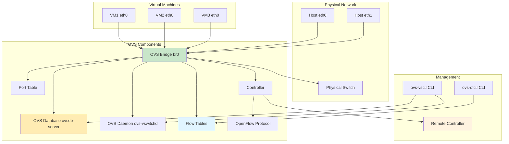
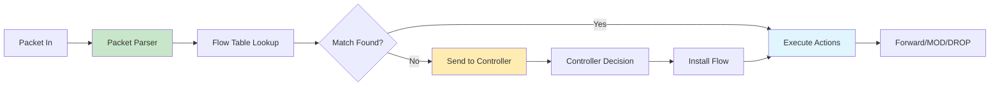
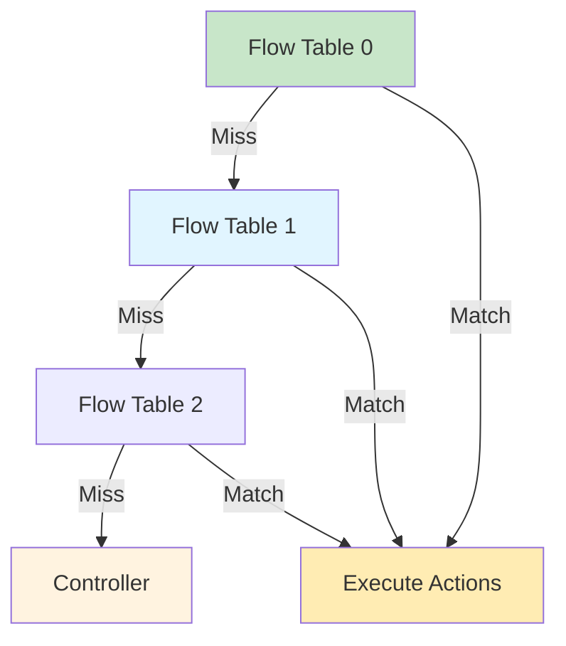
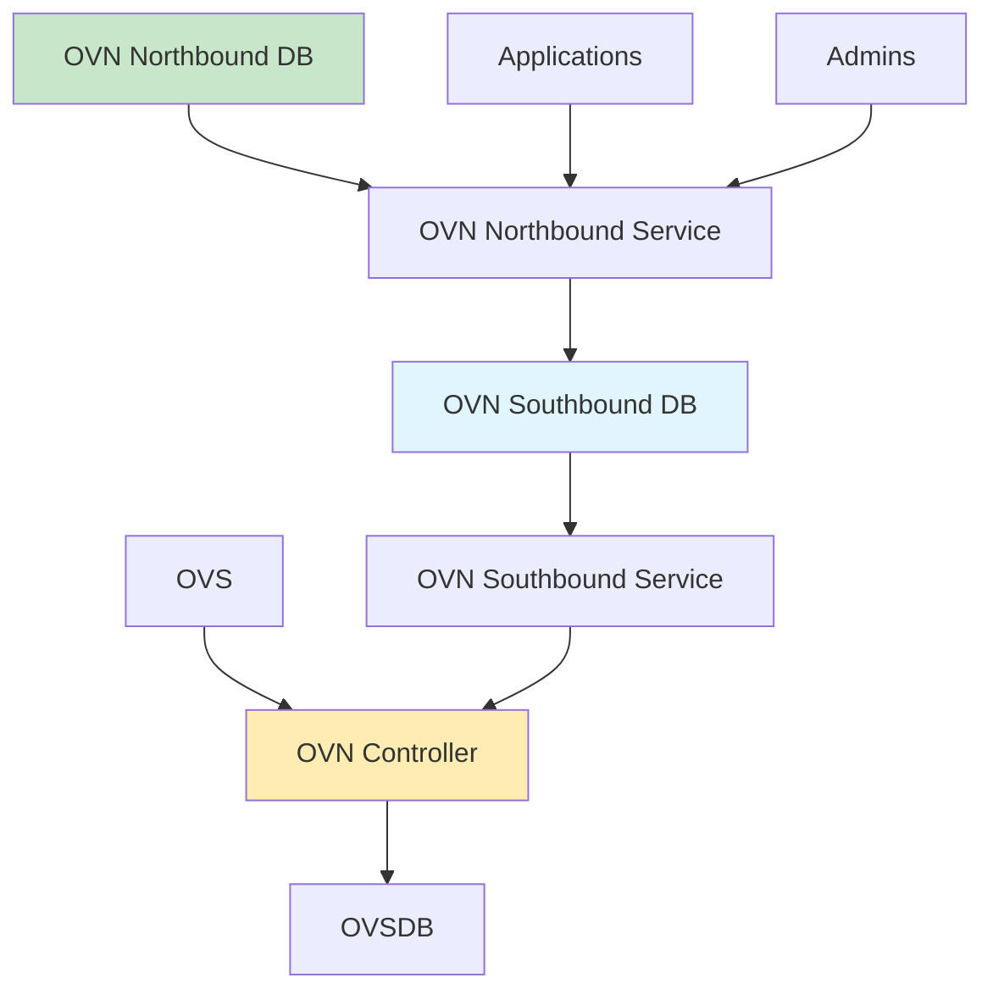

# Open vSwitch

Production-grade multilayer virtual switch for managing VM networking with OpenFlow support and advanced features.

## Architecture



## Core Components

### ovs-vswitchd

Main daemon implementing the switch datapath and OpenFlow protocol.

**Responsibilities**:
- Manage bridge datapath
- Process OpenFlow rules
- Forward packets between ports
- Collect statistics
- Communicate with controller

**Datapath Types**:
- **Netlink**: Linux kernel datapath (default)
- **DPDK**: Userspace datapath for high performance
- **AF_XDP**: High-performance Linux datapath

**Datapath Flow**:



### ovsdb-server

Configuration database daemon storing OVS state.

**Database Structure**:
- `Open_vSwitch`: Switch configuration
- `Bridge`: Bridge definitions
- `Port`: Port configurations
- `Interface`: Interface settings
- `Controller`: Controller connections
- `Flow_Table`: Flow table settings
- `QoS`: Quality of Service
- `Queue`: Queue configurations

**Database Operations**:
```bash
# Connect to database
ovsdb-client connect unix:/var/run/openvswitch/db.sock

# Monitor changes
ovsdb-client monitor Open_vSwitch Bridge Port Interface

# Dump database
ovsdb-client dump
```

### OpenFlow Protocol

Standard protocol for SDN controller communication.

**OpenFlow Versions**:
- OpenFlow 1.0: Basic features
- OpenFlow 1.3: Extended features
- OpenFlow 1.4: Group tables, meter tables
- OpenFlow 1.5: Packet-out bundles

**OpenFlow Messages**:
- **Controller-to-Switch**: Features, Config, Modify, Packet-Out, Stats
- **Asynchronous**: Packet-In, Flow-Removed, Port-Status
- **Symmetric**: Hello, Echo, Error, Vendor

## Key Features

### Standard Linux Bridge Compatibility

```bash
# Create OVS bridge (works like Linux bridge)
ovs-vsctl add-br br0

# Add ports
ovs-vsctl add-port br0 eth0
ovs-vsctl add-port br0 vnet0

# Configure IP
ip addr add 192.168.1.100/24 dev br0
ip link set br0 up
```

### Flow-Based Switching

```bash
# Add flow rule
ovs-ofctl add-flow br0 \
    "priority=100,ip,nw_dst=192.168.1.100,actions=output:2"

# View flows
ovs-ofctl dump-flows br0

# Delete flow
ovs-ofctl del-flows br0
```

### Network Isolation with VLANs

```bash
# Add VLAN tagged port
ovs-vsctl add-port br0 eth0 tag=10

# Add VLAN trunk port
ovs-vsctl add-port br0 eth1 vlan_mode=trunk \
    trunks=10,20,30

# Add native VLAN port
ovs-vsctl add-port br0 eth2 vlan_mode=native-tagged tag=100
```

### Bonding and Trunking

```bash
# Add LACP bond
ovs-vsctl add-bond bond0 eth0 eth1 \
    lacp=active \
    bond_mode=balance-tcp

# Add active-backup bond
ovs-vsctl add-bond bond0 eth0 eth1 \
    bond_mode=active-backup

# Add SLB bond
ovs-vsctl add-bond bond0 eth0 eth1 \
    bond_mode=balance-slb
```

### Remote Management

```bash
# Enable remote management
ovs-vsctl set-manager ptcp:6640

# Connect with SSL
ovs-vsctl set-protocol ssl
ovs-vsctl set-ssl \
    /etc/openvswitch/privkey.pem \
    /etc/openvswitch/cert.pem \
    /etc/openvswitch/cacert.pem

# Connect to controller
ovs-vsctl set-controller br0 tcp:192.168.1.200:6653
```

## Flow Tables

### Flow Table Structure



### Flow Rules

#### Basic Flow

```bash
# Simple flow: forward to output port
ovs-ofctl add-flow br0 \
    "priority=100,in_port=1,actions=output:2"
```

#### IP Flow

```bash
# Forward specific IP
ovs-ofctl add-flow br0 \
    "priority=100,ip,nw_src=192.168.1.100,actions=output:3"

# Forward specific destination IP
ovs-ofctl add-flow br0 \
    "priority=100,ip,nw_dst=192.168.1.200,actions=output:2"
```

#### TCP/UDP Flow

```bash
# Forward TCP traffic
ovs-ofctl add-flow br0 \
    "priority=100,tcp,tp_dst=80,actions=output:2"

# Forward UDP traffic
ovs-ofctl add-flow br0 \
    "priority=100,udp,tp_dst=53,actions=output:2"
```

#### VLAN Flow

```bash
# Forward VLAN 10
ovs-ofctl add-flow br0 \
    "priority=100,vlan_vid=10,actions=output:2"

# Strip VLAN and forward
ovs-ofctl add-flow br0 \
    "priority=100,vlan_vid=10,actions=strip_vlan,output:2"
```

#### Modifying Flows

```bash
# Modify source IP
ovs-ofctl add-flow br0 \
    "priority=100,ip,nw_src=10.0.0.0/8,actions=mod_nw_src:192.168.1.100,output:2"

# Modify VLAN
ovs-ofctl add-flow br0 \
    "priority=100,actions=mod_vlan_vid:20,output:2"
```

### Flow Actions

| Action | Description | Example |
|--------|-------------|---------|
| output | Send to port | `output:2` |
| normal | Forward normally | `normal` |
| flood | Flood to all ports | `flood` |
| all | Send to all ports | `all` |
| local | Send to local bridge | `local` |
| controller | Send to controller | `controller` |
| drop | Drop packet | `drop` |
| mod_vlan_vid | Modify VLAN | `mod_vlan_vid:10` |
| strip_vlan | Remove VLAN | `strip_vlan` |
| push_vlan | Add VLAN | `push_vlan:0x8100` |
| pop_vlan | Remove VLAN tag | `pop_vlan` |
| mod_nw_src | Modify source IP | `mod_nw_src:10.0.0.1` |
| mod_nw_dst | Modify dest IP | `mod_nw_dst:10.0.0.2` |
| mod_tp_src | Modify source port | `mod_tp_src:8080` |
| mod_tp_dst | Modify dest port | `mod_tp_dst:80` |
| resubmit | Resubmit to table | `resubmit:1` |
| goto_table | Jump to table | `goto_table:1` |
| meter | Apply meter | `meter:1` |
| group | Execute group | `group:1` |
| learn | Learn flow | `learn(table=1,...)` |
| exit | Stop processing | `exit` |

### Flow Matching Fields

| Field | Description | Format |
|-------|-------------|--------|
| in_port | Input port | `in_port=1` |
| dl_src | Source MAC | `dl_src=aa:bb:cc:dd:ee:ff` |
| dl_dst | Destination MAC | `dl_dst=00:11:22:33:44:55` |
| dl_type | Ethernet type | `dl_type=0x0800` |
| vlan_vid | VLAN ID | `vlan_vid=10` |
| vlan_pcp | VLAN priority | `vlan_pcp=3` |
| ip | IP protocol | `ip` |
| nw_src | Source IP | `nw_src=192.168.1.100` |
| nw_dst | Destination IP | `nw_dst=192.168.1.200` |
| nw_proto | IP protocol | `nw_proto=6` |
| nw_tos | IP ToS | `nw_tos=0` |
| tp_src | Source port | `tp_src=80` |
| tp_dst | Destination port | `tp_dst=8080` |
| icmp_type | ICMP type | `icmp_type=8` |
| icmp_code | ICMP code | `icmp_code=0` |

## Controllers

### Controller Configuration

```bash
# Set controller
ovs-vsctl set-controller br0 tcp:192.168.1.200:6653

# Set multiple controllers
ovs-vsctl set-controller br0 \
    tcp:192.168.1.200:6653 \
    tcp:192.168.1.201:6653

# Set controller inactivity probe
ovs-vsctl set controller br0 inactivity_probe=10

# Set controller fail mode
ovs-vsctl set-fail-mode br0 secure
```

### Controller Fail Modes

| Mode | Description |
|------|-------------|
| standalone | Switch forwards packets normally without controller |
| secure | Switch drops packets without controller |

### OpenFlow Controller

```bash
# Use OpenDaylight controller
ovs-vsctl set-controller br0 tcp:192.168.1.200:6633

# Use ONOS controller
ovs-vsctl set-controller br0 tcp:192.168.1.201:6653

# Use Open Virtual Network (OVN)
ovs-vsctl set-controller br0 tcp:192.168.1.202:6642
```

## Advanced Features

### Group Tables

```bash
# Create group
ovs-ofctl add-group br0 \
    "group_id=1,type=select,bucket=output:2,bucket=output:3"

# Use group in flow
ovs-ofctl add-flow br0 \
    "priority=100,actions=group:1"

# Group types: select, all, indirect, fast_failover
```

### Meter Tables

```bash
# Create meter
ovs-ofctl add-meter br0 \
    "meter=1,kbps,bands=type=drop,rate=1000"

# Use meter in flow
ovs-ofctl add-flow br0 \
    "priority=100,actions=meter:1,output:2"
```

### Quality of Service (QoS)

```bash
# Create QoS
ovs-vsctl set port eth0 qos=@newqos \
    -- --id=@newqos create qos type=linux-htb \
    other-config:max-rate=1000000000

# Create queue
ovs-vsctl set port eth0 qos=@newqos \
    -- --id=@newqos create qos type=linux-htb \
    queues:0=@q0 \
    -- --id=@q0 create queue other-config:max-rate=500000000
```

### Mirroring

```bash
# Create mirror
ovs-vsctl -- \
    --id=@m create mirror name=mymirror select-dst-port=eth0 \
    -- set bridge br0 mirrors=@m

# Add output port to mirror
ovs-vsctl set mirror mymirror output-port=eth1
```

### Tunneling

#### GRE Tunnel

```bash
# Create GRE tunnel
ovs-vsctl add-port br0 gre0 -- \
    set interface gre0 type=gre options:remote_ip=192.168.1.200

# Create GRE tunnel with key
ovs-vsctl add-port br0 gre0 -- \
    set interface gre0 type=gre \
    options:remote_ip=192.168.1.200 \
    options:key=100
```

#### VXLAN Tunnel

```bash
# Create VXLAN tunnel
ovs-vsctl add-port br0 vxlan0 -- \
    set interface vxlan0 type=vxlan \
    options:remote_ip=192.168.1.200 \
    options:key=flow

# Create VXLAN with multicast
ovs-vsctl add-port br0 vxlan0 -- \
    set interface vxlan0 type=vxlan \
    options:remote_ip=239.1.1.1 \
    options:key=100
```

#### Geneve Tunnel

```bash
# Create Geneve tunnel
ovs-vsctl add-port br0 geneve0 -- \
    set interface geneve0 type=geneve \
    options:remote_ip=192.168.1.200 \
    options:key=100
```

## Quick Commands

### Bridge Management

```bash
# Create bridge
ovs-vsctl add-br br0

# Delete bridge
ovs-vsctl del-br br0

# List bridges
ovs-vsctl list-br

# Show bridge
ovs-vsctl show br0
```

### Port Management

```bash
# Add port
ovs-vsctl add-port br0 eth0

# Delete port
ovs-vsctl del-port br0 eth0

# List ports
ovs-vsctl list-ports br0

# Show port
ovs-vsctl show
```

### Flow Management

```bash
# Add flow
ovs-ofctl add-flow br0 "priority=100,actions=output:2"

# Delete flow
ovs-ofctl del-flows br0

# Dump flows
ovs-ofctl dump-flows br0

# Monitor flows
ovs-ofctl monitor br0
```

### Configuration

```bash
# Show configuration
ovs-vsctl show

# Show OVSDB
ovs-vsctl list Open_vSwitch

# Show bridge
ovs-vsctl list Bridge

# Show port
ovs-vsctl list Port
```

## Nifty Behaviors

### Remote Management

```bash
# Enable remote management
ovs-vsctl set-manager ptcp:6640

# Connect with SSL
ovs-vsctl set-protocol ssl
```

**Nifty**: Secure remote OVS management

### Bond Configuration

```bash
# Create LACP bond
ovs-vsctl add-bond bond0 eth0 eth1 \
    lacp=active \
    bond_mode=balance-tcp
```

**Nifty**: Network redundancy and load balancing

### VXLAN Overlay

```bash
# Create VXLAN with key=flow
ovs-vsctl add-port br0 vxlan0 -- \
    set interface vxlan0 type=vxlan \
    options:remote_ip=192.168.1.200 \
    options:key=flow
```

**Nifty**: Network virtualization with per-flow keys

### Flow Learning

```bash
# Add learning flow
ovs-ofctl add-flow br0 \
    "priority=100,actions=learn(table=1,idle_timeout=300,hard_timeout=1800,eth_src=dl_src,output=in_port),output:1"
```

**Nifty**: Automatic flow table population

## DPDK Datapath

### DPDK Setup

```bash
# Create DPDK bridge
ovs-vsctl add-br br0 -- set bridge br0 datapath_type=netdev

# Add DPDK port
ovs-vsctl add-port br0 dpdk0 -- \
    set interface dpdk0 type=dpdk \
    options:dpdk-devargs=0000:01:00.0
```

### DPDK Benefits

- Userspace packet processing
- Zero-copy networking
- High performance (10M+ PPS)
- Low latency (<1ms)

### DPDK Configuration

```bash
# Set DPDK lcore
ovs-vsctl set Open_vSwitch . other_config:dpdk-lcore-mask=0x1

# Set DPDK memory
ovs-vsctl set Open_vSwitch . other_config:dpdk-socket-mem=1024

# Set DPDK PMD
ovs-vsctl set Open_vSwitch . other_config:pmd-cpu-mask=0x2
```

## OVN - Open Virtual Network

### OVN Architecture



### OVN Setup

```bash
# Install OVN
apt-get install ovn-central ovn-host ovn-controller

# Initialize OVN
ovn-nbctl init
ovn-sbctl init

# Connect OVN to OVS
ovs-vsctl set Open_vSwitch . \
    external_ids:ovn-remote=tcp:192.168.1.200:6642 \
    external_ids:ovn-encap-type=geneve \
    external_ids:ovn-encap-ip=192.168.1.10
```

## Performance Tuning

### Flow Table Optimization

```bash
# Set flow table size
ovs-vsctl set bridge br0 \
    other-config:n-flow-entries=100000

# Set flow limits
ovs-vsctl set bridge br0 \
    other-config:max-idle=300000 \
    other-config:n-backlog=1000
```

### Datapath Optimization

```bash
# Use hugepages
ovs-vsctl set Open_vSwitch . \
    other_config:dpdk-socket-mem=1024,1024

# Enable batch processing
ovs-vsctl set bridge br0 \
    other-config:hwaddr=02:00:00:00:00:01
```

### Memory Optimization

```bash
# Set memory limits
ovs-vsctl set Open_vSwitch . \
    other_config:dpdk-alloc-mem=1024

# Set buffer size
ovs-vsctl set bridge br0 \
    other-config:max-revalidator=4000
```

## Troubleshooting

### Flow Issues

```bash
# Check flows
ovs-ofctl dump-flows br0

# Monitor flow additions
ovs-ofctl monitor br0

# Check packet counters
ovs-ofctl dump-ports br0
```

### Connectivity Issues

```bash
# Check bridge status
ovs-vsctl show

# Check port status
ovs-vsctl list Port

# Check interface status
ovs-vsctl list Interface
```

### Controller Issues

```bash
# Check controller status
ovs-vsctl get controller br0 status

# Check fail mode
ovs-vsctl get fail-mode br0

# Test controller connectivity
curl http://192.168.1.200:8080
```

## Best Practices

1. **Use VLANs** for network isolation
2. **Enable bonding** for network redundancy
3. **Use flow tables** for traffic control
4. **Monitor OVS** for performance
5. **Secure OVSDB** with SSL
6. **Test failover** scenarios
7. **Document network topology**
8. **Use tunnels** for overlay networks

## Source Code

- **Repository**: https://github.com/openvswitch/ovs
- **Documentation**: https://docs.openvswitch.org/

### Key Source Locations

| Component | Location | Description |
|-----------|----------|-------------|
| ovs-vswitchd | `vswitchd/` | Main switch daemon |
| ovsdb-server | `ovsdb/` | Database server |
| lib/ofp | `lib/ofp*` | OpenFlow library |
| lib/dpif | `lib/dpif*` | Datapath interface |
| lib/netdev | `lib/netdev*` | Network device library |
| ofproto | `ofproto/` | OpenFlow protocol |