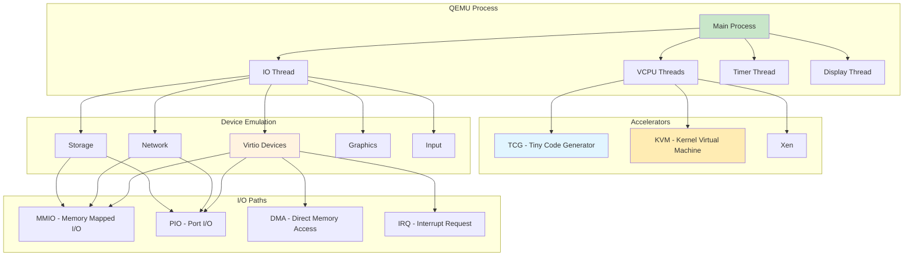
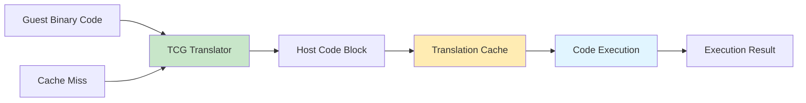
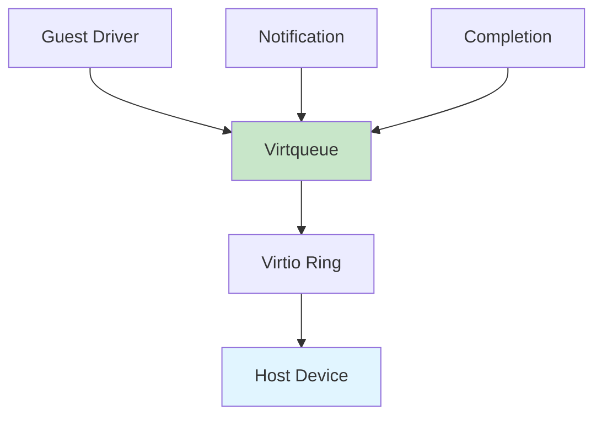
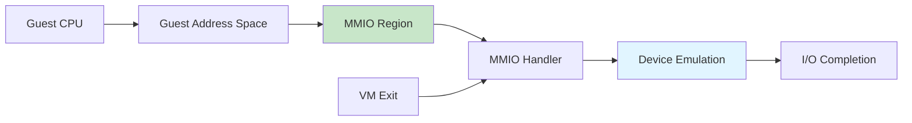
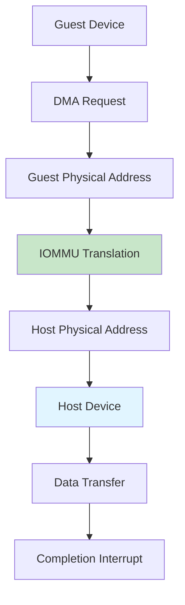

# QEMU

Generic and open source machine emulator and virtualizer providing full-system and user-mode emulation with hardware acceleration.

## Architecture



## Core Components

### VCPU (Virtual CPU)

Threads executing guest code in virtual CPU context.

**VCPU States**:
| State | Description |
|-------|-------------|
| Running | Currently executing guest code |
| Blocked | Waiting for I/O or sleep |
| Exited | VCPU exited |

**VCPU Configuration**:
```bash
# Set VCPU count
qemu-system-x86_64 -smp 4

# Set CPU topology
qemu-system-x86_64 -smp 4,sockets=2,cores=2,threads=1

# Pin VCPUs to physical CPUs
qemu-system-x86_64 -smp 4 -numa node,memdev=mem
```

### TCG (Tiny Code Generator)

Dynamic binary translation engine for software emulation.

**TCG Operation**:



**TCG Features**:
- Dynamic translation
- Block chaining
- Code cache management
- Cross-architectural emulation
- No hardware requirements

**TCG Performance**:
- Slower than KVM (~10-20% host speed)
- Cross-platform compatibility
- Good for non-virtualized hosts

### KVM Acceleration

Hardware virtualization using Intel VT-x or AMD-V.

**KVM Operation**:

```mermaid
sequenceDiagram
    participant Q as QEMU
    participant K as KVM Module
    participant G as Guest
    
    Q->>K: Create VM
    K->>K: Allocate resources
    
    Q->>G: Start VCPU
    G->>G: Execute guest code
    
    G->>K: VM Exit (I/O, interrupt)
    K->>Q: Handle exit
    Q->>K: Resume guest
    
    style K fill:#c8e6c9
    style G fill:#e1f5ff
```

**KVM Features**:
- Native CPU execution
- Near-native performance (~95-98% host speed)
- Virtualization extensions required
- Paravirtualized I/O support

**VM Exit Reasons**:
| Reason | Description | Frequency |
|--------|-------------|----------|
| I/O Port Access | Guest accesses PIO | High |
| MMIO Access | Guest accesses MMIO | Medium |
| Interrupt | Hardware interrupt | High |
| Interrupt Window | Interrupt delivery needed | Medium |
| HLT | CPU halted | Low |
| CR Access | Control register access | Low |

### IO Thread

Dedicated thread for I/O operations to improve performance.

**IO Thread Benefits**:
- Non-blocking I/O for VCPUs
- Improved I/O throughput
- Better concurrency

**IO Thread Configuration**:
```bash
# Enable IO thread
qemu-system-x86_64 -object iothread,id=io1 \
    -device virtio-blk-pci,iothread=io1

# Multiple IO threads
qemu-system-x86_64 \
    -object iothread,id=io1 \
    -object iothread,id=io2 \
    -device virtio-blk-pci,iothread=io1 \
    -device virtio-blk-pci,iothread=io2
```

## Device Emulation

### Virtio Devices

Paravirtualized devices for optimal performance.

**Virtio Architecture**:



**Virtio Device Types**:
| Device | Description | Performance |
|--------|-------------|------------|
| virtio-blk | Block device | Excellent |
| virtio-net | Network device | Excellent |
| virtio-scsi | SCSI controller | Very Good |
| virtio-serial | Serial port | Good |
| virtio-gpu | Graphics | Good |
| virtio-rng | Random number | Good |

**Virtio Features**:
- Zero-copy I/O
- Direct guest memory access
- Efficient notification mechanism
- Queue-based I/O

### Network Devices

#### Virtio Network

```bash
# Basic virtio network
qemu-system-x86_64 -net nic,model=virtio \
    -net user,hostfwd=tcp::2222-:22

# Multiqueue virtio
qemu-system-x86_64 -net nic,model=virtio,vectors=6 \
    -net tap,ifname=tap0,queues=4,vhost=on

# Bridge network
qemu-system-x86_64 -net nic,model=virtio \
    -net tap,script=/etc/qemu-ifup,downscript=/etc/qemu-ifdown
```

**Virtio Network Features**:
- Multiple queues (virtio multiqueue)
- Vhost support (kernel-space driver)
- Zero-copy transmission
- Large packet offload

**Vhost Configuration**:
```bash
# Enable vhost-net
qemu-system-x86_64 -net nic,model=virtio \
    -net tap,vhost=on,vhostforce=on

# Multiple vhost queues
qemu-system-x86_64 -net nic,model=virtio,vectors=6 \
    -net tap,queues=4,vhost=on
```

### Storage Devices

#### Virtio Block

```bash
# Virtio block device
qemu-system-x86_64 -drive file=disk.qcow2,if=virtio,format=qcow2

# Virtio block with cache
qemu-system-x86_64 \
    -drive file=disk.qcow2,if=virtio,format=qcow2,cache=writeback

# Virtio block with multiple queues
qemu-system-x86_64 \
    -object iothread,id=io1 \
    -drive file=disk.qcow2,if=virtio,format=qcow2,iothread=io1
```

**Virtio Block Features**:
- Direct I/O support
- Multiple queues with IO thread
- Write barriers
- Discard support
- Write-zeroes support

#### Virtio SCSI

```bash
# Virtio SCSI
qemu-system-x86_64 \
    -device virtio-scsi-pci \
    -drive file=disk1.qcow2,if=none,id=drive1 \
    -device scsi-hd,drive=drive1

# Multiple SCSI devices
qemu-system-x86_64 \
    -device virtio-scsi-pci \
    -drive file=disk1.qcow2,if=none,id=drive1 \
    -device scsi-hd,drive=drive1 \
    -drive file=disk2.qcow2,if=none,id=drive2 \
    -device scsi-hd,drive=drive2
```

**Virtio SCSI Features**:
- Multiple devices per controller
- SCSI command support
- Persistent reservations
- Better than virtio-blk for many disks

## I/O Paths

### MMIO (Memory Mapped I/O)

Device registers mapped to guest memory space.

**MMIO Access Flow**:



**MMIO Characteristics**:
- Memory-mapped registers
- Triggers VM exit on access
- Used for device configuration
- Slower than DMA

### PIO (Port I/O)

Legacy x86 I/O port access.

**PIO Characteristics**:
- Legacy x86 I/O ports
- Triggers VM exit on IN/OUT
- Used for legacy device access
- Slower than MMIO
- Limited to 64K ports

**PIO Example**:
```bash
# Legacy IDE device
qemu-system-x86_64 \
    -drive file=disk.img,if=ide

# Legacy network (e1000)
qemu-system-x86_64 \
    -net nic,model=e1000
```

### DMA (Direct Memory Access)

Direct guest memory access for I/O operations.

**DMA Operation**:



**DMA Features**:
- Direct guest memory access
- High performance
- IOMMU support for isolation
- Used by virtio devices

### IRQ (Interrupt Request)

Hardware interrupt delivery to guest.

**IRQ Flow**:

```mermaid
sequenceDiagram
    participant G as Guest
    participant Q as QEMU
    participant K as KVM
    
    G->>Q: Complete I/O
    Q->>K: Inject IRQ
    K->>G: Deliver interrupt
    G->>G: Handle interrupt
    
    style K fill:#c8e6c9
    style G fill:#e1f5ff
```

**IRQ Types**:
- **PIC**: Legacy 8259 PIC
- **IOAPIC**: Advanced programmable interrupt controller
- **MSI**: Message signaled interrupts
- **MSI-X**: Enhanced MSI

**MSI Configuration**:
```bash
# Enable MSI-X
qemu-system-x86_64 \
    -device virtio-net-pci,msix=on

# Multiple MSI-X vectors
qemu-system-x86_64 \
    -device virtio-net-pci,msix=on,vectors=6
```

## Quick Commands

### Basic VM Creation

```bash
# Simple VM
qemu-system-x86_64 \
    -name vm1 \
    -m 2048 \
    -smp 2 \
    -drive file=disk.qcow2,format=qcow2 \
    -netdev user,id=net0,hostfwd=tcp::2222-:22

# VM with graphics
qemu-system-x86_64 \
    -name vm1 \
    -m 2048 \
    -smp 2 \
    -drive file=disk.qcow2,format=qcow2 \
    -vnc :1

# VM with KVM
qemu-system-x86_64 -enable-kvm \
    -name vm1 \
    -m 4096 \
    -smp 4 \
    -drive file=disk.qcow2,format=qcow2
```

### Advanced Configuration

```bash
# CPU configuration
qemu-system-x86_64 \
    -cpu host \
    -smp 4,sockets=2,cores=2,threads=1

# Memory configuration
qemu-system-x86_64 \
    -m 4096 \
    -mem-path /dev/hugepages \
    -mem-prealloc

# NUMA topology
qemu-system-x86_64 \
    -m 4096 \
    -numa node,memdev=mem \
    -object memory-backend-file,id=mem,size=4G,mem-path=/dev/hugepages,share=on
```

### Network Configuration

```bash
# User networking
qemu-system-x86_64 \
    -netdev user,id=net0,hostfwd=tcp::2222-:22

# TAP networking
qemu-system-x86_64 \
    -netdev tap,id=net0,ifname=tap0,script=no,downscript=no

# Bridge networking
qemu-system-x86_64 \
    -netdev bridge,id=net0,br=br0

# Virtio multiqueue
qemu-system-x86_64 \
    -net nic,model=virtio,vectors=6 \
    -net tap,queues=4,vhost=on
```

### Storage Configuration

```bash
# Qcow2 image
qemu-system-x86_64 \
    -drive file=disk.qcow2,format=qcow2,if=virtio

# Raw image
qemu-system-x86_64 \
    -drive file=disk.img,format=raw,if=virtio

# Multiple disks
qemu-system-x86_64 \
    -drive file=disk1.qcow2,if=virtio \
    -drive file=disk2.qcow2,if=virtio

# CD-ROM
qemu-system-x86_64 \
    -drive file=ubuntu.iso,media=cdrom
```

## Nifty Behaviors

### QMP Programmatic Control

```bash
# Start QEMU with QMP socket
qemu-system-x86_64 -qmp tcp:localhost:4444,server,nowait

# Connect to QMP
echo '{"execute":"qmp_capabilities"}' | \
    socat TCP:localhost:4444 -

# Query status
echo '{"execute":"query-status"}' | \
    socat TCP:localhost:4444 -

# Start VM
echo '{"execute":"cont"}' | \
    socat TCP:localhost:4444 -
```

**Nifty**: Programmatic control of running VMs

### Virtio Multiqueue

```bash
# Create VM with multiqueue
qemu-system-x86_64 \
    -net nic,model=virtio,vectors=6 \
    -net tap,queues=4,vhost=on

# Libvirt XML
<interface type='network'>
    <model type='virtio'/>
    <driver name='vhost' queues='4'/>
</interface>
```

**Nifty**: Multi-queue network, better throughput

### Memory Ballooning

```bash
# Attach balloon device
qemu-system-x86_64 \
    -device virtio-balloon-pci

# Adjust memory via QMP
echo '{"execute":"balloon","arguments":{"size":1073741824}}' | \
    socat TCP:localhost:4444 -

# Libvirt balloon
virsh setmem vm1 2G
virsh setmem vm1 4G
```

**Nifty**: Dynamically adjust VM memory

### Live Migration

```bash
# Source VM
qemu-system-x86_64 \
    -name vm1 \
    -m 4096 \
    -smp 4 \
    -drive file=disk.qcow2,if=virtio \
    -incoming tcp:0:4444

# Destination VM
qemu-system-x86_64 \
    -name vm1 \
    -m 4096 \
    -smp 4 \
    -drive file=disk.qcow2,if=virtio \
    -monitor stdio

# Trigger migration (in destination monitor)
migrate -tcp:source:4444
```

**Nifty**: Zero-downtime VM migration

## Performance Optimization

### CPU Optimization

```bash
# Host CPU passthrough
qemu-system-x86_64 -cpu host

# CPU features
qemu-system-x86_64 -cpu host,+vmx,+pdpe1gb

# CPU pinning
qemu-system-x86_64 -smp 4 -numa node,memdev=mem
```

### Memory Optimization

```bash
# Hugepages
qemu-system-x86_64 \
    -m 4096 \
    -mem-path /dev/hugepages \
    -mem-prealloc

# KSM (Kernel Same-page Merging)
echo 1 > /sys/kernel/mm/ksm/run
echo 1000 > /sys/kernel/mm/ksm/pages_to_scan

# Memory balloon
qemu-system-x86_64 -device virtio-balloon-pci
```

### I/O Optimization

```bash
# IO thread
qemu-system-x86_64 \
    -object iothread,id=io1 \
    -drive file=disk.qcow2,if=virtio,iothread=io1

# Multiple IO threads
qemu-system-x86_64 \
    -object iothread,id=io1 \
    -object iothread,id=io2 \
    -drive file=disk1.qcow2,if=virtio,iothread=io1 \
    -drive file=disk2.qcow2,if=virtio,iothread=io2

# Cache options
qemu-system-x86_64 \
    -drive file=disk.qcow2,if=virtio,cache=writeback,async=on

# Native AIO
qemu-system-x86_64 \
    -drive file=disk.img,if=virtio,aio=native
```

### Network Optimization

```bash
# Vhost-net
qemu-system-x86_64 \
    -net nic,model=virtio \
    -net tap,vhost=on

# Multiple queues
qemu-system-x86_64 \
    -net nic,model=virtio,vectors=6 \
    -net tap,queues=4,vhost=on

# Large receive offload
qemu-system-x86_64 \
    -net nic,model=virtio \
    -net tap,gro=on
```

## Troubleshooting

### Performance Issues

```bash
# Check if KVM is enabled
qemu-system-x86_64 -accel kvm -version

# Check VCPU load
top -H -p $(pidof qemu-system-x86_64)

# Check I/O
iostat -x 1

# Check network
sar -n DEV 1
```

### Migration Issues

```bash
# Check migration status
echo '{"execute":"query-migrate"}' | \
    socat TCP:localhost:4444 -

# Cancel migration
echo '{"execute":"migrate_cancel"}' | \
    socat TCP:localhost:4444 -

# Check compatibility
echo '{"execute":"query-migrate-capabilities"}' | \
    socat TCP:localhost:4444 -
```

## Best Practices

1. **Always use KVM** for x86 guests on supported hardware
2. **Use virtio devices** for optimal performance
3. **Enable IO threads** for storage-intensive workloads
4. **Use hugepages** for memory-intensive workloads
5. **Enable vhost-net** for network performance
6. **Configure NUMA** for large VMs
7. **Use cache=writeback** for better disk performance
8. **Test migration** in production environment
9. **Monitor VM performance** regularly
10. **Use snapshots** for backup/rollback

## Source Code

- **Repository**: https://gitlab.com/qemu-project/qemu
- **Documentation**: https://www.qemu.org/documentation/

### Key Source Locations

| Component | Location | Description |
|-----------|----------|-------------|
| Main loop | `cpus.c` | CPU execution loop |
| TCG | `tcg/` | Tiny Code Generator |
| KVM | `accel/kvm/` | KVM acceleration |
| Memory | `exec.c` | Memory management |
| I/O | `ioport.c` | Port I/O |
| MMIO | `memory.c` | Memory Mapped I/O |
| Virtio | `hw/virtio/` | Virtio devices |
| Block | `block/` | Block devices |
| Network | `net/` | Network devices |