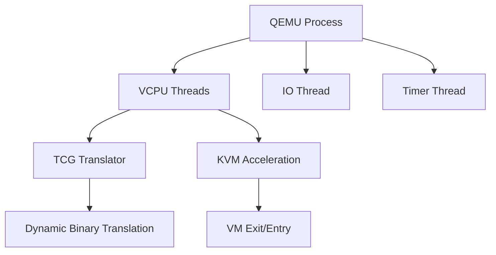

# QEMU

Generic and open source machine emulator and virtualizer providing full-system and user-mode emulation.

## Architecture



## Key Features

- Full-system emulation of various architectures
- User-mode emulation for cross-platform binaries
- TCG dynamic translation for performance
- KVM integration for hardware acceleration
- Device emulation (network, storage, graphics)

## Quick Commands

```bash
# Create VM
qemu-system-x86_64 -name vm1 -m 2048 -smp 2 \
    -drive file=disk.qcow2,format=qcow2 \
    -netdev user,id=net0,hostfwd=tcp::2222-:22

# Enable KVM
qemu-system-x86_64 -enable-kvm -name vm1 -m 4096 -smp 4
```

## Nifty Behaviors

### QMP Programmatic Control
```bash
echo '{"execute":"query-status"}' | \
    socat UNIX-CONNECT:/var/run/libvirt/qemu/vm1.monitor
```
**Nifty**: Programmatic control of running VMs

### Virtio Multiqueue
```xml
<interface type='network'>
    <model type='virtio'/>
    <driver name='vhost' queues='4'/>
</interface>
```
**Nifty**: Multi-queue network, better throughput

### Memory Ballooning
```bash
# Attach balloon device
virsh attach-device vm1 balloon.xml

# Adjust memory
virsh setmem vm1 2G
```
**Nifty**: Dynamically adjust VM memory

## Source Code

- Repository: https://gitlab.com/qemu-project/qemu
- Documentation: https://www.qemu.org/documentation/
